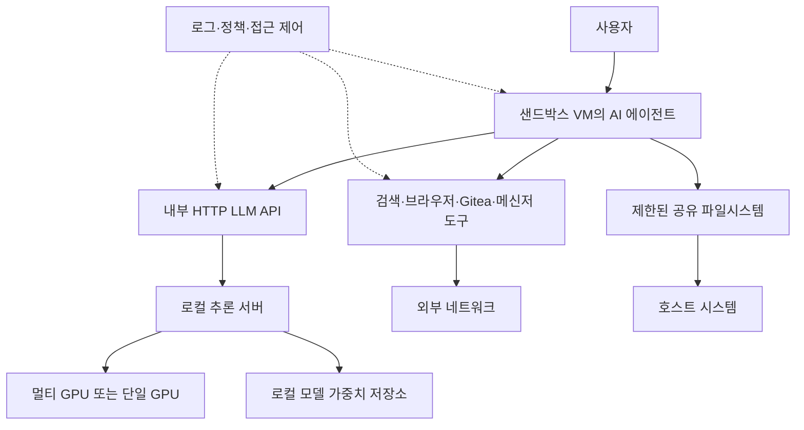

> 한 줄 요약: 로컬 LLM과 에이전트 인프라는 클라우드 비용보다 데이터 경계, GPU 토폴로지, 장애 격리, 모델 교체 비용을 먼저 봐야 한다. 내 장비에서 돈다는 사실보다, 실패했을 때 어디까지 영향을 주는지가 설계의 핵심이다.

## 왜 지금 이슈인가

로컬 LLM을 직접 돌리려는 움직임이 다시 커진 이유는 GPU 성능만으로 설명하기 어렵다. hosted API가 편하다는 점은 그대로다. 다만 에이전트가 코드, 문서, 검색, 메신저, 사내 저장소까지 다루기 시작하면서 데이터 경계가 전보다 훨씬 애매해졌다.

Jamesob의 로컬 LLM 가이드는 이 긴장을 꽤 직접적으로 보여준다. 약 2천 달러 구성에서는 RTX 3090 두 장과 48GB VRAM으로 Qwen 계열 모델과 Whisper 기반 음성 인식(STT)을 돌린다. 약 4만 달러급 구성에서는 RTX PRO 6000 네 장, 총 384GB VRAM으로 더 큰 모델을 서빙한다. 정작 눈에 띄는 것은 모델 이름보다 주변 구성이다. PCIe 스위치, NCCL, ACS, IOMMU, 전력 제한, Docker, 내부 DNS, 샌드박스 VM, Gitea, 검색 도구가 함께 나온다.

이 정도면 취미용 워크스테이션 조립기라기보다 로컬 에이전트 플랫폼의 작은 버전에 가깝다.

Google의 Gemma 4 12B와 DiffusionGemma 개발자 가이드는 다른 방향에서 같은 질문을 던진다. Gemma 4 12B는 16GB VRAM 또는 통합 메모리 환경에서 로컬 멀티모달 실행을 겨냥한다. DiffusionGemma는 토큰을 한 개씩 생성하는 방식 대신 256토큰 블록을 병렬로 만들고 반복적으로 정제하는 접근을 제시한다.

둘을 함께 보면 쟁점이 선명해진다.

- 더 큰 GPU 박스를 사서 클라우드급 모델에 가까워질 것인가
- 더 작은 모델과 새 추론 구조를 받아들여 로컬 실행 범위를 넓힐 것인가
- 에이전트에게 도구를 붙일수록 로컬 실행이 정말 더 안전해지는가

GitHub와 Hacker News에서 논쟁이 붙는 지점도 여기에 있다. 로컬 LLM은 독립적인 선택처럼 보이지만, 운영 관점에서는 작은 클라우드를 사무실이나 집 안으로 들이는 일에 가깝다.

## 커뮤니티에서 갈리는 지점

로컬 LLM을 선호하는 쪽의 주장은 분명하다. 민감한 코드, 회의 음성, 내부 문서를 외부 API로 보내지 않아도 된다. 네트워크 장애나 API 정책 변경에도 덜 흔들린다. 특히 음성 인식처럼 입력 자체가 민감한 작업은 로컬 처리의 장점이 체감되기 쉽다.

Jamesob의 구성에서도 이 관점이 잘 드러난다. Whisper large-v3를 로컬 STT로 돌리고, 모델 가중치는 ZFS 파일시스템에 저장한다. 각 모델은 Docker Compose로 격리한다. 에이전트는 별도 VM에서 동작하고, 호스트와의 통신은 공유 파일시스템으로 제한한다.

반대쪽 우려도 작지 않다. 로컬이라고 해서 자동으로 안전해지는 것은 아니다. 오히려 클라우드 사업자가 맡아주던 하드웨어 교체, 보안 패치, 장애 대응, 접근 제어, 감사 로그, 용량 계획을 직접 떠안게 된다. ACS 설정 하나 때문에 GPU 간 P2P 트래픽이 CPU 루트 포트로 돌아가고, IOMMU 설정 때문에 NCCL이 멈출 수 있다면 운영 난이도는 이미 일반 애플리케이션 서버를 넘어선다.

Gemma 4 12B는 이 논쟁에 다른 가능성을 더한다. 거대한 멀티 GPU 서버 없이도 16GB급 로컬 장비에서 멀티모달 모델을 돌릴 수 있도록 설계됐기 때문이다. 별도 비전·오디오 인코더를 거치지 않고 데이터를 LLM 백본으로 직접 넣는 구조는 지연 시간과 메모리 사용량을 줄이는 쪽에 초점을 둔다.

DiffusionGemma는 병목을 더 근본적으로 건드린다. 일반적인 자기회귀(Autoregressive) LLM은 다음 토큰을 순서대로 생성하므로 메모리 대역폭의 영향을 크게 받는다. DiffusionGemma는 256토큰 캔버스를 병렬로 만들고 반복적으로 정제해 GPU의 병렬 계산 자원을 더 적극적으로 쓰려 한다. 문서에 따르면 RTX 5090에서 초당 700토큰 이상, 단일 H100에서 초당 1000토큰 이상을 목표로 하는 실험적 구조다.

그래서 커뮤니티의 갈림길은 모델 품질과 비용만의 문제가 아니다.

| 선택지 | 얻는 것 | 잃는 것 |
| --- | --- | --- |
| 대형 멀티 GPU 로컬 서버 | 큰 모델, 긴 컨텍스트, 데이터 통제감 | 높은 초기 비용, 전력·열·토폴로지 운영 부담 |
| 중형 로컬 모델 | 낮은 진입 비용, 개인 장비 배포 가능 | 모델 품질과 작업 범위 제한 |
| hosted API | 빠른 도입, 관리 부담 감소 | 데이터 반출, 비용 예측, 벤더 의존 |
| 하이브리드 | 민감 작업과 범용 작업 분리 | 라우팅 정책, 감사, 장애 처리 복잡도 증가 |

현업에서 비슷한 고민을 해보면 어느 한쪽이 항상 맞지는 않다. 로컬 LLM은 보안팀을 설득하기 쉬운 선택처럼 보일 수 있다. 하지만 접근 제어와 로그가 허술하면 hosted API보다 더 위험할 수 있다. 반대로 hosted API는 운영이 편하지만, 에이전트가 읽는 데이터 범위가 넓어질수록 정책 문서만으로는 불안을 줄이기 어렵다.

## 아키텍처 관점에서 볼 점

로컬 LLM 아키텍처는 모델 서버 하나로 끝나지 않는다. 최소한 네 개의 경계를 봐야 한다.

- 모델 가중치와 추론 서버
- 에이전트 실행 환경
- 도구와 외부 네트워크
- 사용자 데이터와 감사 로그

Jamesob의 가이드가 유용한 이유는 이 경계를 실제 구성으로 보여주기 때문이다. 모델은 별도 inference machine에서 HTTP API로 서빙한다. opencode 기반 에이전트는 다른 VM에서 돌아간다. 에이전트는 검색, 브라우징, Telegram 알림, Gitea 같은 도구를 사용하지만 샌드박스 VM 안에 묶인다.

이 구조에서 먼저 볼 것은 GPU 성능이 아니라 실패가 퍼지는 경로다.

에이전트가 잘못된 명령을 실행하면 어디까지 접근할 수 있는가. 모델 서버가 외부에 노출되면 인증은 어떻게 할 것인가. 내부 DNS로만 접근하게 하면 충분한가. Gitea 이슈를 읽고 PR을 만드는 에이전트가 토큰을 유출하거나 의도치 않은 파일을 커밋하면 누가 감지하는가.

GPU 토폴로지도 애플리케이션 아키텍처의 일부가 된다. Jamesob의 4GPU 구성은 PCIe Gen4 스위치를 써서 all-reduce 단계의 GPU 간 통신이 CPU 루트 컴플렉스로 돌아가지 않게 한다. ACS가 켜져 있으면 P2P 트래픽이 우회되어 스위치 투자 효과가 사라진다. IOMMU 설정이 맞지 않으면 NCCL이 멈춘다.

이런 문제는 단순 튜닝으로 보기 어렵다. 모델 병렬화(Tensor Parallelism)를 전제로 한 serving 구조에서는 GPU 간 링크 품질이 곧 장애 지점이다. GPU 한 장이 죽는 문제와 네 장이 서로 충분히 빠르게 통신하지 못하는 문제는 운영상 전혀 다른 사건이다.

Gemma 4 12B와 DiffusionGemma가 의미 있는 이유도 여기에 있다. 모델 아키텍처가 바뀌면 인프라 요구조건도 달라진다.

Gemma 4 12B처럼 멀티모달 입력을 별도 인코더 체인 없이 처리하려는 구조는 로컬 앱에서 지연 시간과 메모리 관리를 단순화할 수 있다. DiffusionGemma처럼 병렬 생성으로 GPU 계산 자원을 더 잘 쓰려는 방식은 대역폭 병목을 다른 방식으로 피하려 한다. 둘 다 더 큰 GPU를 사는 것만으로는 문제가 해결되지 않는다는 신호다.

## 실무에서 볼 점

로컬 LLM 도입 여부를 판단할 때 첫 질문은 “이 모델이 충분히 똑똑한가”가 아니다. 이 워크로드를 로컬로 가져왔을 때 책임 경계가 더 명확해지는지를 먼저 봐야 한다.

다음 조건에 해당하면 로컬 실행을 검토할 만하다.

- 입력 데이터가 코드, 음성, 내부 문서처럼 외부 전송에 민감하다
- 호출량이 많아 hosted API 비용 변동성이 크다
- 지연 시간보다 데이터 통제가 더 큰 요구사항이다
- 모델 품질 저하를 업무 흐름에서 보완할 수 있다
- GPU 장애, 패치, 로그, 접근 제어를 운영할 사람이 있다

반대로 아래 상황이면 조심해야 한다.

- 모델 서버를 누가 관리하는지 불명확하다
- 에이전트가 접근 가능한 파일과 네트워크 범위가 넓다
- 감사 로그 없이 자동 PR, 배포, 메신저 전송을 허용한다
- 작은 모델의 실패를 사람이 매번 검수할 여유가 없다
- 전력, 소음, 냉각, 부품 교체를 비용 계산에서 빼고 있다

특히 로컬이라는 단어가 보안 검토를 우회하는 명분이 되면 위험하다. 로컬 모델 서버도 API 서버다. 인증, 네트워크 분리, 요청 로그, 프롬프트와 출력 보존 정책, 모델 가중치 출처 검증이 필요하다.

에이전트까지 붙이면 위험은 한 단계 올라간다. 단순 챗봇은 틀린 답을 내는 데서 끝날 수 있지만, 도구를 가진 에이전트는 틀린 행동을 한다. 검색 도구, 브라우저, Git 저장소, 메신저, 파일시스템이 붙는 순간 프롬프트 인젝션(Prompt Injection)과 권한 오남용을 운영 리스크로 봐야 한다.

실제로 이런 상황에서는 모델 품질보다 권한 설계가 병목이 되는 경우가 많다. 좋은 모델을 붙여도 읽을 수 있는 저장소가 과하게 넓으면 위험하다. 반대로 권한을 너무 줄이면 에이전트가 쓸모 있는 일을 못 한다. 그래서 처음부터 전사 도입을 목표로 삼기보다, 반복 작업 하나와 제한된 저장소 하나를 정해 작은 폐쇄 루프로 시작하는 편이 현실적이다.

하드웨어 선택도 목적에 맞춰야 한다.

약 2천 달러급 구성은 개인 개발 환경, 로컬 STT, 코드 보조, 작은 에이전트 실험에 맞다. 4만 달러급 멀티 GPU 구성은 큰 모델과 긴 컨텍스트를 원할 때 매력적이다. 다만 그 순간부터 장비를 쓰는 일이 아니라 플랫폼을 운영하는 일이 된다. PCIe 스위치, BIOS, 커널 파라미터, 컨테이너, 모델 캐시, 모니터링을 함께 설계해야 한다.

대안은 하이브리드다. 예를 들어 음성 인식과 민감 문서 요약은 로컬에서 처리하고, 공개 자료 기반 리서치나 저위험 생성 작업은 hosted API로 보낼 수 있다. 작은 로컬 모델은 라우터, 필터, 초안 생성에 쓰고, 고난도 추론은 외부 모델에 맡기는 방식도 가능하다.

이때 필요한 것은 모델 선택표가 아니라 정책이다.

- 어떤 데이터는 절대 외부로 나가지 않는가
- 어떤 작업은 사람 승인 없이 실행 가능한가
- 어떤 도구 호출은 로그를 남겨야 하는가
- 모델 실패 시 사용자는 어떻게 복구하는가
- 새 모델로 교체할 때 기존 평가셋을 통과해야 하는가

이 질문에 답하지 못한 상태에서 GPU만 사면 로컬 LLM은 생산성 도구가 아니라 관리되지 않는 내부 클러스터가 된다.

## 정리

로컬 LLM의 핵심은 소유가 아니라 경계다. GPU를 직접 갖고 있으면 데이터 이동을 줄일 수 있지만, 그만큼 운영 책임도 가까워진다. Jamesob의 하드웨어 구성, Gemma 4 12B의 중형 로컬 멀티모달 방향, DiffusionGemma의 병렬 생성 실험은 같은 문제를 다른 쪽에서 보여준다. 앞으로의 AI 인프라는 클라우드냐 로컬이냐보다 어떤 작업을 어떤 경계 안에서 실행할지가 더 큰 설계 문제가 된다.

당장 확인할 것은 하나다. 지금 쓰는 AI 도구가 읽을 수 있는 데이터와 실행할 수 있는 행동을 표로 적어보자. 그 표가 비어 있다면 로컬 도입 이전에 권한 모델부터 다시 잡아야 한다.

## 참고 자료

- [선정 글감] [Jamesob's guide to running SOTA LLMs locally](https://github.com/jamesob/local-llm) — Hacker News Best
- [관련] [Gemma 4 12B: The Developer Guide](https://developers.googleblog.com/gemma-4-12b-the-developer-guide/) — Google Developers
- [관련] [DiffusionGemma: The Developer Guide](https://developers.googleblog.com/diffusiongemma-the-developer-guide/) — Google Developers