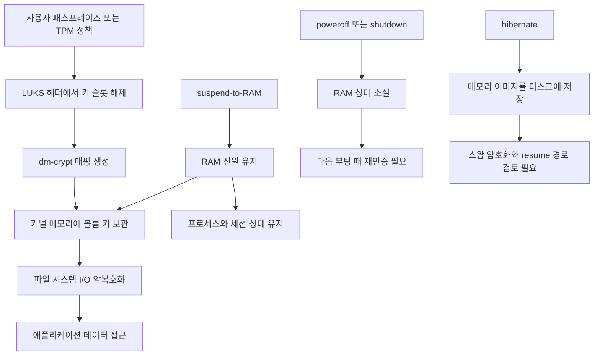

> 한 줄 요약: LUKS 전체 디스크 암호화는 노트북 전원이 꺼졌을 때 저장장치를 보호하는 장치다. suspend 상태에서 메모리까지 자동으로 안전해지는 것은 아니다. Linux 6.9 이후 LUKS 키가 suspend 동안 메모리에 남아 있었다는 제보도 결국 암호화 알고리즘보다 전원 상태와 운영 정책을 먼저 봐야 한다는 쪽에 가깝다.

## 왜 지금 이슈인가

Linux LUKS, suspend, 디스크 암호화, 커널 메모리 보안은 각각 놓고 보면 익숙한 주제다. 그런데 노트북을 덮은 뒤에도 LUKS 키가 메모리에 남아 있을 수 있다는 이야기가 나오면 논점이 조금 달라진다.

전체 디스크 암호화(Full Disk Encryption)는 보통 분실·도난 상황에서 저장장치를 보호하려고 켠다. 사용자는 전원이 꺼진 장비에서 디스크를 빼 가도 데이터를 읽을 수 없다고 기대한다. 문제는 suspend-to-RAM 상태다. 이때 장비는 꺼진 것이 아니라, 실행 중이던 시스템을 메모리에 유지한 상태에 가깝다.

이번 글감은 한 개발자가 Linux 6.9 이후 LUKS 암호화 키가 suspend를 지나도 메모리에 남아 있었다고 지적한 게시물에서 출발한다. 원문은 짧고, 공식 보안 권고문이나 CVE처럼 정리된 문서는 아니다. 그래서 이 글도 특정 버그라고 단정하기보다, LUKS와 suspend를 함께 쓰는 시스템에서 어떤 보안 경계가 약해질 수 있는지를 본다.

커뮤니티에서 말이 붙는 이유는 단순하다. 많은 사람이 전체 디스크 암호화를 켜면 노트북을 덮어도 비슷한 수준으로 안전하다고 생각한다. 하지만 운영체제 입장에서는 암호화된 볼륨을 이미 열어 둔 상태라면 디스크 키가 어딘가에 있어야 한다. 그렇지 않으면 깨어난 뒤 파일 시스템을 계속 읽고 쓸 수 없다.

## 커뮤니티에서 갈리는 지점

논쟁을 LUKS가 안전한가 아닌가로 보면 흐려진다. 더 정확한 질문은 이렇다.

- suspend 상태를 꺼진 상태와 같은 보안 수준으로 볼 수 있는가
- 커널은 암호화 키를 언제, 어디서, 어떤 조건으로 버려야 하는가
- 사용성 손실을 감수하고 resume 때마다 재인증을 요구할 것인가
- 공격자가 장비에 물리적으로 접근할 수 있다는 전제를 어디까지 받아들일 것인가

현실론에 가까운 쪽은 suspend-to-RAM의 특성을 강조한다. 시스템이 빠르게 깨어나려면 메모리 상태를 유지해야 한다. LUKS 위에 올라간 루트 파일 시스템, 스왑, 사용자 세션, 브라우저 프로세스가 그대로 이어져야 한다면 암호화 계층도 중단 전 상태를 다시 사용할 수 있어야 한다.

반대쪽은 사용자의 보안 기대를 문제 삼는다. 노트북을 덮고 가방에 넣는 행위는 많은 사람에게 사실상 잠금 또는 휴대 중 보호로 인식된다. 이때 공격자가 물리 접근, DMA, 콜드 부트(Cold Boot), 취약한 펌웨어 경로를 이용할 수 있다면, 암호화 키가 메모리에 남아 있다는 사실은 방어선의 의미를 크게 줄인다.

여기서 자주 섞이는 개념이 화면 잠금과 디스크 암호화다. 화면 잠금은 로그인 세션 접근을 막는 장치다. 디스크 암호화는 저장 매체가 오프라인으로 탈취됐을 때의 보호 장치다. suspend 상태의 메모리 공격은 이 둘 사이의 틈을 노린다.

실무에서 더 곤란한 지점은 정책 문구다. 보안 문서에는 노트북에 전체 디스크 암호화를 적용한다고 적혀 있지만, suspend, hibernate, 전원 종료, 잠금 화면을 구분하지 않는 경우가 많다. 감사에서는 암호화 적용 여부만 체크되고, 실제 분실 시점의 전원 상태는 빠지기 쉽다.

## 아키텍처 관점에서 볼 점

LUKS는 보통 dm-crypt 계층을 통해 블록 디바이스를 암호화한다. 부팅 시 사용자가 패스프레이즈를 입력하거나 TPM, 키 파일, initramfs 훅을 통해 마스터 키를 풀고, 이후 커널은 열린 매핑을 통해 파일 시스템 I/O를 처리한다.

단순화하면 데이터 흐름은 아래와 같다.

이 구조에서 핵심은 D다. 암호화된 디스크를 실시간으로 읽고 쓰려면 키가 필요하다. 키가 메모리에 없으면 매번 사용자에게 물어보거나, 별도의 안전한 하드웨어 경로에서 가져와야 한다. 일반적인 데스크톱 Linux 구성은 그런 모델을 기본값으로 두지 않는다.

suspend-to-RAM은 RAM에 전력을 공급해 상태를 유지한다. 그래서 빠르게 깨어난다. 대신 메모리에 있던 민감 정보도 그대로 남을 수 있다. LUKS 키만의 문제가 아니다. 브라우저 세션, SSH 에이전트 키, 쿠버네티스 kubeconfig 토큰, 클라우드 CLI 자격 증명, 편집 중인 비밀값도 같은 범주에 들어간다.

hibernate는 다른 리스크를 만든다. 메모리 이미지를 디스크에 기록하기 때문이다. 스왑이 암호화되어 있지 않거나 resume 경로의 인증 모델이 약하면 suspend보다 더 직접적인 유출 표면이 생긴다. 반대로 잘 구성된 hibernate는 전원을 완전히 끄는 흐름에 가까운 운영 정책을 만들 수 있지만, 부팅·resume 구성이 더 복잡해진다.

운영 리스크는 세 가지로 나뉜다.

| 구분 | 위험 | 확인할 지점 |
| --- | --- | --- |
| suspend-to-RAM | RAM에 키와 세션 정보가 유지됨 | 노트북 분실 시 전원 상태, 메모리 공격 가능성 |
| hibernate | 메모리 이미지가 저장장치에 기록됨 | 암호화된 스왑, resume 인증, initramfs 구성 |
| shutdown | 키가 사라지지만 사용성이 떨어짐 | 재부팅 비용, 업무 흐름, 원격 관리 정책 |

Secure Boot, TPM, IOMMU 같은 장치는 도움이 될 수 있지만 이 문제를 한 번에 해결해 주지는 않는다. Secure Boot는 부팅 체인의 무결성을 다루고, TPM은 키 해제 조건을 묶을 수 있으며, IOMMU는 일부 DMA 공격면을 줄인다. 하지만 이미 깨어 있는 시스템의 메모리에 어떤 비밀이 남아 있는지는 별도의 문제다.

## 실무에서 볼 점

먼저 조직의 위협 모델을 분리해야 한다. 카페에 잠깐 둔 노트북을 동료가 보는 수준인지, 장비가 분실되어 공격자의 손에 들어가는 수준인지, 법무·재무·소스코드·고객정보가 들어 있는 고위험 단말인지에 따라 답이 달라진다.

도입 전에 확인할 조건은 꽤 구체적이다.

- 노트북 덮개 동작이 suspend인지, hibernate인지, shutdown인지
- 루트 볼륨과 스왑이 모두 암호화되어 있는지
- resume 때 화면 잠금만 요구하는지, 디스크 키 재해제를 요구하는지
- TPM 기반 자동 해제가 편의성 때문에 과하게 열려 있지는 않은지
- 외부 포트, Thunderbolt, DMA 보호, 펌웨어 설정이 관리되는지
- 분실 대응에서 원격 잠금보다 전원 상태 확인이 먼저 가능한지

현업에서는 전체 디스크 암호화를 켰다는 체크박스가 너무 많은 것을 대신하는 경우가 있다. 개발자 노트북에는 SSH 키, 패키지 레지스트리 토큰, 클라우드 계정, 내부 관리자 페이지 세션이 함께 있다. 디스크가 암호화되어 있어도 시스템이 열린 채 잠들어 있다면 보호해야 할 대상은 디스크 블록만이 아니다.

대안은 한 가지가 아니다.

| 선택지 | 장점 | 비용 |
| --- | --- | --- |
| suspend 유지 | 사용성이 가장 좋고 배터리·복귀 경험이 좋음 | 물리 접근 시 메모리 잔존 리스크 |
| 일정 시간 후 hibernate | 이동 중 리스크를 줄일 수 있음 | resume 구성과 스왑 암호화 검증 필요 |
| 덮개 닫을 때 shutdown | 보안 경계가 명확함 | 개발 환경 복구 비용 큼 |
| 고위험 단말만 강한 정책 | 생산성과 보안 균형 | 자산 분류가 부정확하면 빈틈 발생 |
| TPM·Secure Boot·IOMMU 조합 | 자동화와 무결성 강화 | 구성 복잡도와 오해 가능성 |

개인 개발자라면 먼저 현재 전원 정책을 확인하는 것이 좋다. 노트북을 닫았을 때 실제로 suspend되는지, hibernate되는지, 잠금 화면만 뜨는지 알아야 한다. 그다음 스왑 암호화 여부와 디스크 해제 경로를 확인한다.

팀 단위라면 문서 문구부터 바꿔야 한다. 전체 디스크 암호화 적용이라고만 쓰는 대신, 휴대 중 단말 상태 정책을 명시해야 한다. 예를 들면 일반 단말은 15분 뒤 hibernate, 고위험 단말은 덮개 닫기 시 hibernate 또는 전원 종료, 예외 단말은 별도 승인처럼 실제로 운영할 수 있는 문장으로 내려와야 한다.

커널 버전 이슈도 따로 관리해야 한다. 이번 글감처럼 Linux 6.9 이후 동작 변화가 의심되는 상황이라면 배포판 커널, cryptsetup, systemd, initramfs, 전원 관리 설정을 한 묶음으로 봐야 한다. LUKS 자체의 설계 문제인지, 커널 회귀인지, 배포판 훅의 변화인지, 사용자의 전원 정책 착시인지 분리하지 않으면 처방도 틀어질 수 있다.

검증 방법은 거창할 필요가 없다. 테스트 장비에서 다음 시나리오를 문서화하면 된다.

- 암호화된 루트 볼륨으로 부팅한다.
- 화면 잠금, suspend, resume 흐름을 각각 실행한다.
- resume 시 디스크 재인증이 필요한지 확인한다.
- hibernate를 켠 경우 스왑 암호화와 resume 성공 여부를 확인한다.
- 커널 업데이트 전후로 같은 시나리오를 반복한다.

운영팀이 봐야 할 지표도 있다. 노트북 보안은 서버 관측성처럼 대시보드만으로 풀리지는 않지만, 최소한 MDM이나 구성 관리 도구에서 전원 정책, 디스크 암호화 상태, Secure Boot 상태, 커널 버전, 스왑 암호화 상태를 수집할 수 있어야 한다. 보안 사고가 난 뒤에야 사용자가 노트북을 잠재웠는지 껐는지 묻는 구조는 늦다.

## 정리

LUKS 키가 suspend 동안 메모리에 남아 있었다는 이야기는 암호화가 쓸모없다는 뜻이 아니다. 암호화가 어느 상태를 보호하는지 정확히 알아야 한다는 신호에 가깝다.

전체 디스크 암호화는 꺼진 디스크를 지키는 데 강하다. suspend 상태의 노트북은 꺼진 디스크가 아니라, 메모리와 세션을 유지한 실행 중 시스템이다. 이 차이를 정책, 문서, 테스트 시나리오에 반영하지 않으면 보안 통제는 실제 위험보다 낙관적인 그림을 그리게 된다.

당장 확인할 것은 하나다. 내가 쓰는 Linux 노트북에서 덮개를 닫았을 때 실제 상태가 suspend인지, hibernate인지, shutdown인지 확인하자. 그 결과가 보안 기대와 다르다면 LUKS 설정만 만질 일이 아니라 전원 정책부터 다시 잡아야 한다.

## 참고 자료

- [선정 글감] Since Linux 6.9 (May 2024), the LUKS encryption key remained resident in memory across suspend — Lobsters / Mathstodon: https://mathstodon.xyz/@iblech/116769502749142438