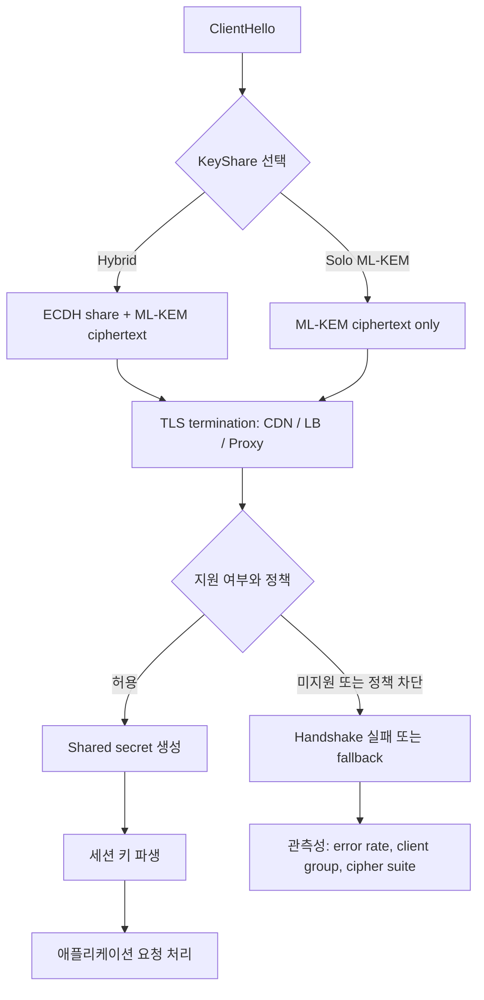

> 한 줄 요약: TLS 1.3에 ML-KEM을 넣는 논쟁은 포스트 양자 암호 전체의 문제가 아니라 더 좁은 운영 판단에 가깝다. RFC가 됐다는 사실을 보안성 검증으로 볼 것인지, 운영자가 따로 검증해야 할 선택지가 늘었다고 볼 것인지가 갈림길이다.

## 왜 지금 이슈인가

TLS, ML-KEM, IETF라는 단어가 한 문장에 붙으면 흐름은 대체로 정해져 보인다. 양자 컴퓨터에 대비해야 하고, 표준화가 필요하며, 구현 생태계도 따라와야 한다는 이야기다.

하지만 이번 논쟁의 불편한 지점은 포스트 양자 암호(Post-Quantum Cryptography)를 도입할지 말지가 아니다. TLS 1.3에서 ML-KEM을 어떤 형태로 넣을 것인지, 특히 기존 타원곡선 키 교환(ECDH)과 ML-KEM을 함께 쓰는 하이브리드 방식이 아니라 solo ML-KEM을 허용하는 RFC를 낼 것인지가 쟁점이다.

선정 글감은 IETF가 자신을 인터넷 표준화 기구처럼 소개하면서도, RFC가 만들어내는 운영상의 책임에서는 용어를 나눠 빠져나간다고 비판한다. 글은 2026년 7월 7일까지 진행 중인 TLS 워킹그룹 투표를 언급하며, 아직 승인되지 않은 draft가 RFC가 되는 순간 다른 표준화 기구와 운영 가이드가 이를 인용하기 쉬워진다고 본다.

여기서 실무자가 봐야 할 질문은 조금 다르다.

- RFC가 됐다는 이유만으로 보안 기본값을 바꿔도 되는가
- 하이브리드 TLS와 solo ML-KEM은 장애와 공격 모델이 어떻게 다른가
- 암호 알고리즘의 표준화가 운영 조직의 변경 승인, 감사, 장애 대응까지 대신해주는가

커뮤니티에서 말이 붙는 이유도 여기에 있다. 암호 표준은 논문 안에만 머무르지 않는다. 브라우저, CDN, 로드밸런서, 서비스 메시, 프록시, 모바일 SDK, 인증서 운영 정책까지 들어온다. 한 번 기본값이 바뀌면 되돌리는 비용도 작지 않다.

## 커뮤니티에서 갈리는 지점

이번 논쟁은 찬반이 단순하지 않다. 한쪽은 solo ML-KEM을 RFC로 내야 다른 표준과 운영 지침이 안정적으로 참조할 수 있다고 본다. draft 상태의 문서를 실제 운영 시스템에서 normative reference로 삼기 어렵다는 주장이다.

반대쪽은 RFC라는 형식이 사실상 시장 신호가 된다는 점을 문제 삼는다. 이름이 Proposed Standard든 Informational이든, 구매 담당자와 보안 감사자는 RFC라는 이름을 보고 안전한 선택지라고 받아들일 수 있다. 선정 글감이 집요하게 물고 늘어지는 부분도 이 간극이다.

핵심 쟁점은 세 가지로 나뉜다.

| 쟁점 | solo ML-KEM 쪽 기대 | 우려하는 쪽의 질문 |
|---|---|---|
| 표준 참조성 | RFC가 있어야 다른 SDO와 운영 가이드가 인용하기 쉽다 | 인용 가능성이 보안성 보증으로 오해되지 않는가 |
| 단순성 | 하이브리드보다 handshake 구성이 단순해질 수 있다 | 단일 알고리즘 실패에 대한 방어층이 줄어드는가 |
| 배포 속도 | 포스트 양자 전환을 빠르게 밀 수 있다 | 빠른 배포가 되돌리기 어려운 기본값으로 굳는가 |

반대로 확인해야 할 것도 있다. 하이브리드가 항상 더 낫다고 말하는 것도 성급하다. 하이브리드는 두 알고리즘을 묶기 때문에 패킷 크기, 구현 복잡도, 호환성, 장애 분석 난도가 늘어난다. TLS termination이 여러 계층에 흩어진 조직에서는 클라이언트, 엣지, 내부 프록시, 서비스 메시가 서로 다른 지원 상태를 보일 수 있다.

다만 보안 설계에서 복잡도를 줄이는 것과 방어층을 줄이는 것은 다른 말이다. solo ML-KEM은 단순한 선택처럼 보이지만, 운영자가 감수해야 할 실패 모드가 더 선명하다. ML-KEM 구현, 파라미터 선택, 라이브러리 업데이트, 사이드채널 대응, 인증된 배포 경로 중 하나가 흔들렸을 때 기존 ECDH가 완충재로 남아 있지 않다.

선정 글감은 IETF의 책임 회피라는 강한 표현을 쓴다. 그 주장에 전부 기대기보다, 실무 관점에서는 이렇게 좁혀 읽는 편이 낫다. RFC 발행은 프로토콜 생태계에 채택 압력을 만든다. 그래서 RFC 여부와 운영 기본값 변경 여부를 같은 결정으로 처리하면 안 된다.

## 아키텍처 관점에서 볼 점

TLS 1.3의 키 교환은 애플리케이션 코드보다 아래에 있지만, 장애는 애플리케이션 장애처럼 올라온다. 접속 실패, handshake 지연, 특정 클라이언트군 장애, 인증서 로테이션 실패, 프록시 간 호환성 문제가 모두 사용자 요청 실패로 보인다.

하이브리드 TLS와 solo ML-KEM의 차이는 단순히 알고리즘 하나를 더 쓰느냐가 아니다. 신뢰를 어디에 분산할 것인가의 문제다.

아키텍처에서 확인할 지점은 네 가지다.

첫째, 장애 격리다. TLS 설정은 보통 중앙에서 바뀌지만 영향은 모든 서비스로 퍼진다. 엣지 프록시에서만 끝나는 구성이면 롤백 범위가 비교적 작다. 반대로 서비스 메시, 내부 mTLS, SDK 내장 TLS까지 이어지면 어떤 계층이 실패했는지 찾기 어려워진다.

둘째, 협상 실패의 가시성이다. 포스트 양자 키 교환을 켰을 때 실패 로그가 단순한 `handshake_failure`로만 남으면 운영팀은 원인을 찾기 어렵다. 최소한 클라이언트 버전, 협상된 group, 실패한 group, 재시도 여부, 네트워크 구간은 함께 봐야 한다.

셋째, 성능 예산이다. ML-KEM은 기존 ECDH와 키 자료 크기, 계산 특성이 다르다. 하이브리드는 더 많은 바이트와 계산을 요구할 수 있다. solo 방식은 이 부담을 줄일 수 있지만, 그 대가로 기존 고전 암호 기반 방어층을 제거한다. 성능 최적화인지 보안 모델 변경인지 분리해서 기록해야 한다.

넷째, 암호 민첩성(Cryptographic Agility)이다. 새 알고리즘을 넣는 것보다 어려운 일은 빼는 일이다. 특정 group을 빠르게 비활성화하고, 영향 범위를 확인하고, 일부 클라이언트에만 다른 정책을 적용할 수 있어야 한다. 이 능력이 없으면 표준 채택은 기술 결정이 아니라 운영 리스크가 된다.

## 실무에서 볼 점

실제로 이런 상황에서는 RFC 채택 여부보다 먼저 배포 경로를 그려보는 편이 낫다. 어느 구간에서 TLS가 종료되는지, 어떤 라이브러리가 키 교환을 처리하는지, 설정 변경이 어떤 단위로 롤아웃되는지 모르면 알고리즘 논쟁을 운영으로 옮길 수 없다.

도입 전 체크리스트는 이 정도로 잡을 수 있다.

- 외부 TLS와 내부 mTLS를 분리해서 정책을 세웠는가
- 하이브리드와 solo ML-KEM을 각각 켜고 끌 수 있는 feature flag가 있는가
- 특정 클라이언트군에서 handshake 실패율이 오를 때 자동 롤백할 수 있는가
- TLS 라이브러리와 프록시 버전이 같은 group 이름과 codepoint를 해석하는가
- 보안 감사 문서에 RFC 채택과 내부 승인 기준을 구분해 적었는가
- 성능 테스트가 평균 latency가 아니라 p95, p99 handshake 비용을 보는가
- 장애 로그가 cipher suite 수준이 아니라 key exchange group 수준까지 남는가

이 논쟁에서 가장 위험한 도입 방식은 표준 문서가 나왔으니 켠다는 식의 변경이다. 표준은 선택지를 정리해줄 수 있지만, 조직의 트래픽 모양과 장애 허용치를 알지 못한다.

반대로 지나치게 보수적으로 아무것도 하지 않는 것도 답은 아니다. 저장 후 복호화(Harvest Now, Decrypt Later) 위협을 받는 데이터라면 포스트 양자 전환을 미루는 비용이 있다. 장기 기밀성이 필요한 의료, 금융, 정부, 핵심 연구 데이터는 지금 캡처된 암호문이 나중에 문제가 될 수 있다.

그래서 판단 기준은 이렇게 나눠야 한다.

| 상황 | 더 현실적인 선택 |
|---|---|
| 공개 웹 트래픽, 다양한 구형 클라이언트 | 제한된 비율의 실험, 하이브리드 우선 검토 |
| 내부 서비스 간 mTLS, 클라이언트 통제 가능 | staging에서 group별 실패율과 성능 측정 후 단계 적용 |
| 장기 기밀 데이터 전송 | 포스트 양자 전환 우선순위 상향, 감사 로그 강화 |
| 관측성 부족, 롤백 느림 | 알고리즘 변경보다 TLS 계층 가시성부터 보강 |
| 규제 문서가 RFC를 요구 | RFC 참조와 내부 risk acceptance를 별도 문서화 |

현업에서 비슷한 고민을 하다 보면 보안 변경은 대개 알고리즘보다 배포 단위에서 흔들린다. 테스트 환경에서는 모든 클라이언트가 최신이고, 운영에서는 오래된 모바일 앱과 사내 프록시가 끝까지 남아 있다. 이 차이를 무시하면 암호 전환은 보안 개선이 아니라 장애 유발 이벤트가 된다.

이번 선정 글감의 강한 비판을 그대로 받아들이지 않더라도, 하나는 남는다. 표준화 과정의 언어는 운영 현장에서 다르게 번역된다. draft, proposed standard, RFC, Internet Standard의 구분을 알고 있는 사람은 많지 않다. 의사결정 문서에는 이 차이를 사람이 읽는 문장으로 풀어야 한다.

예를 들면 이런 식이다.

> 이 설정은 IETF RFC 발행 여부와 별개로 내부 기본값이 아니다. 현재는 제한된 클라이언트군에서 handshake 실패율, p99 지연, 롤백 시간을 검증하는 실험 플래그로만 사용한다.

이 한 문장이 없으면 RFC 링크 하나가 변경 승인 전체를 대신할 수 있다.

## 정리

TLS 1.3의 ML-KEM 논쟁을 포스트 양자 암호를 믿을지 말지의 싸움으로만 읽으면 핵심을 놓치기 쉽다. 더 실무적인 문제는 표준 문서가 운영 기본값으로 번역되는 과정에 있다.

solo ML-KEM은 배포를 단순하게 만들 수 있지만, 단일 포스트 양자 알고리즘에 더 많은 신뢰를 싣는다. 하이브리드는 방어층을 남기지만 성능, 호환성, 장애 분석 비용을 키운다. 어느 쪽이든 RFC가 됐다는 사실만으로는 충분하지 않다.

당장 확인할 것은 하나다. 우리 시스템에서 TLS key exchange group별 성공률과 실패율을 볼 수 있는가. 이 질문에 답하지 못하면 ML-KEM을 켜기 전에 관측성부터 고쳐야 한다.

## 참고 자료

- [선정 글감] [A [non-hybrid tls-mlkem] standard by any other name: How IETF evades responsibility for its actions](https://blog.cr.yp.to/20260702-standard.html) — Lobsters