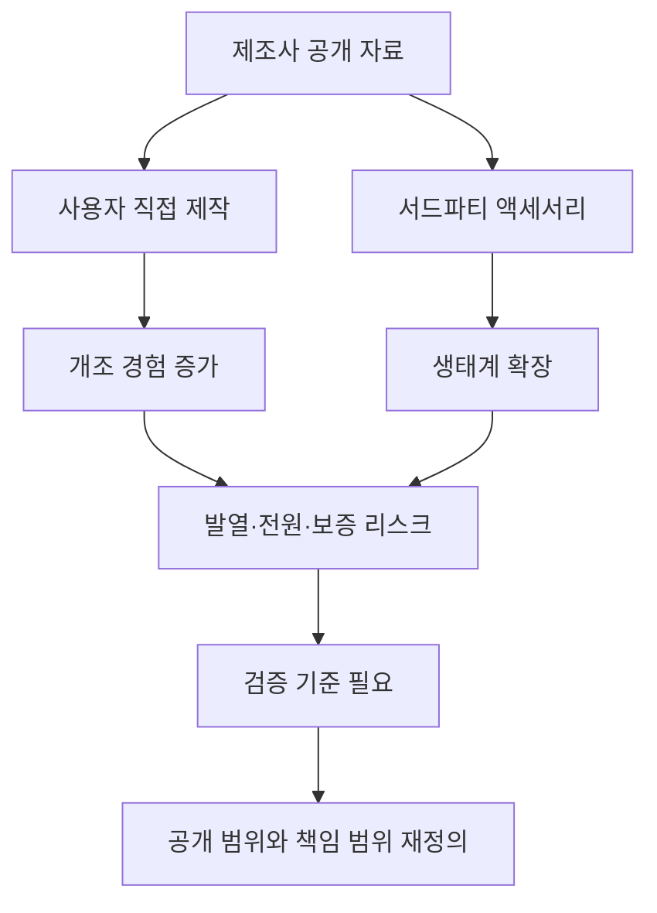

> 한 줄 요약: Steam Machine용 e-ink 전면 패널 자료 공개는 작은 액세서리 소식처럼 보이지만, 실제로는 오픈 하드웨어가 소비자 기대, 보증, 발열, 서드파티 생태계의 책임 범위를 어디까지 흔드는지 보여준다.

## 무슨 일이 있었나

2026년 7월 3일, GamingOnLinux는 Valve가 Steam Machine용 e-ink 전면 패널 제작 자료를 공개했다고 전했다. Valve가 완제품을 직접 판매하는 방식은 아니다. GitLab에 MIT 라이선스로 자료를 올려, 사용자가 부품을 사서 조립하거나 서드파티 업체가 호환 액세서리를 만들 수 있게 한 쪽에 가깝다.

공개된 구성은 꽤 구체적이다. Adafruit ESP32 Feather, eInk Breakout Friend, 5.83인치 흑백 e-ink 패널, M2.5 나사, 작은 자석 같은 부품이 언급됐다. Valve는 이 전면 패널을 Inkterface라고 부르고, 조립 영상도 함께 제공한 것으로 전해졌다.

확인된 사실은 여기까지다. Steam Machine 본체에 e-ink 화면이 기본으로 들어간다는 뜻은 아니다. 기사 댓글에서도 한 사용자는 Steam Machine에 e-ink 디스플레이가 달린 줄 몰랐다고 반응했고, 다른 사용자는 이것이 표준 사양이 아니라 전면 플레이트를 바꿀 수 있음을 보여주는 예시라고 설명했다.

아직 추정에 가까운 부분도 있다. JSAUX가 2025년 11월에 관련 버전을 예고했고, 2026년 7월 현재도 Ink & Pixel 버전을 계획한다고 언급했기 때문에 액세서리 업체들이 따라올 가능성은 있다. 다만 실제 출시 여부, 가격, 발열 검증, 보증 처리 방식은 따로 확인해야 할 문제다.

이 소식이 DIY 장식품 이야기로만 끝나지 않는 이유는, 같은 시기에 Oomwoo 같은 오픈소스 로봇청소기 프로젝트도 커뮤니티에서 반응을 얻고 있기 때문이다. Oomwoo는 하드웨어, 펌웨어, 소프트웨어를 열고, 클라우드 없이 로컬에서 동작하며 Home Assistant와 연동하는 점을 앞세웠다. Steam Machine의 Inkterface와 Oomwoo는 제품군은 다르지만, 둘 다 사용자가 기기를 이해하고 고칠 수 있어야 한다는 기대를 건드린다.

## 왜 사람들이 반응했나

첫 번째 반응은 소유권에 대한 기대다. 요즘 소비자 기기는 내가 샀지만 내가 통제하지 못하는 물건이 되는 경우가 많다. 계정 로그인, 클라우드 연결, 앱 업데이트, 지역 제한, 부품 잠금이 제품 사용 경험을 좌우한다.

그런 맥락에서 Valve가 전면 패널 자료를 MIT 라이선스로 공개한 일은 작아 보여도 의미가 있다. 완제품을 팔지 않겠다는 결정이 실망으로만 읽히지 않고, 누군가 직접 만들 수 있는 여지를 준 일로 받아들여진 이유다.

두 번째는 책임 경계의 불편함이다. 댓글에는 발열을 걱정하는 반응도 있었다. 전면 플레이트를 e-ink 패널로 바꾸면 공기 흐름, 내부 온도, 성능 유지, 소음에 영향을 줄 수 있다. 보기 좋은 개조가 실제 게임 성능이나 수명에 악영향을 주면, 그 책임은 Valve, 액세서리 업체, 조립한 사용자 중 누구에게 있는가.

이 지점이 오픈 하드웨어의 까다로운 부분이다. 파일을 공개하는 것과 제품 수준의 품질을 보장하는 것은 다르다. 공개 자료는 가능성을 열지만, 양산품은 검증과 책임을 요구한다.

세 번째는 서드파티 생태계에 대한 기대다. Steam Deck 이후 Valve는 기기 자체만이 아니라 주변 생태계를 키우는 방식에도 익숙한 모습을 보여왔다. 수리 부품, CAD 파일, 액세서리 업체, 커뮤니티 튜닝이 붙으면 하드웨어의 수명은 길어진다.

하지만 생태계가 커질수록 품질 편차도 커진다. 어떤 업체는 발열 테스트를 하고, 어떤 업체는 외형만 맞춘 제품을 낼 수 있다. 사용자는 공식과 호환, 검증과 실험, 장식과 기능 사이를 직접 구분해야 한다.

네 번째는 오픈소스라는 말이 주는 오해다. 소스가 공개됐다는 말은 누구나 쉽게 만들 수 있다는 뜻이 아니다. Inkterface는 부품 구매, 조립, 케이스 장착, 펌웨어 구성, 전원 연결 같은 작업이 따라붙는다. Oomwoo도 마찬가지다. 2D LiDAR, ROS 2, Nav2, 3D 프린팅, 부품 수급을 이해해야 제대로 접근할 수 있다.

그래서 커뮤니티 반응은 단순한 환호가 아니라 기대와 부담이 섞여 있다. 만들 수 있다는 자유는 고칠 책임과 검증할 비용을 함께 가져온다.

## 내가 보는 핵심

이번 이슈의 핵심은 e-ink 화면 자체가 아니다. 제품 회사가 어디까지 열어주고, 어디부터 사용자와 시장에 맡길 것인가다.

닫힌 기기에서는 책임이 단순하다. 제조사가 기능을 정하고, 사용자는 정해진 범위 안에서 쓴다. 불편하지만 보증, 업데이트, 고객지원의 경계는 비교적 분명하다.

열린 기기에서는 선택지가 늘어난다. 사용자는 전면 패널을 바꾸고, 서드파티는 액세서리를 만들고, 커뮤니티는 예상하지 못한 용도를 찾아낸다. 대신 문제가 생겼을 때 원인을 나누는 일이 어려워진다.

Steam Machine의 Inkterface는 이 구조를 작게 보여준다. 전면 패널 하나를 바꾸는 일처럼 보이지만, 실제로는 본체 설계, 전원 공급, 열 배출, 장착 안정성, 펌웨어 업데이트, 사용자 지원까지 이어진다.

Oomwoo 사례를 함께 보면 이 흐름이 더 선명하다. 로봇청소기는 집 안 지도를 만들고, 바닥을 돌아다니며, 생활 공간 데이터를 다룬다. 클라우드 없이 로컬에서 동작한다는 약속은 개인정보와 운영 독립성 측면에서 매력적이다. 동시에 사용자는 부품 수급, 지도 품질, 장애 대응, 청소 성능을 직접 판단해야 한다.

현업에서 비슷한 고민을 하다 보면, 열려 있다는 말만으로 의사결정을 끝내기 어렵다. 오픈소스 라이선스, 회로도, CAD, 펌웨어, 문서, 테스트 절차, 업데이트 정책이 서로 다른 층위에 있기 때문이다. 어느 하나만 열려 있어도 홍보 문구로는 오픈이라고 말할 수 있지만, 실제 운영 가능성은 더 구체적인 자료에서 결정된다.

Valve의 선택이 괜찮게 보이는 지점은 완제품 판매를 무리하게 약속하지 않았다는 데 있다. 직접 만들 사람에게 자료를 주고, 시장이 원하면 서드파티가 들어올 수 있게 둔다. 반대로 아쉬운 점은 사용자가 안전하게 판단할 기준이 아직 충분히 보이지 않는다는 것이다. 예를 들어 발열 테스트 조건, 권장 장착 범위, 보증 제외 조건, 실패했을 때 복구 방법 같은 정보가 같이 정리되어야 실제 사용자가 덜 흔들린다.

## 앞으로 볼 기준

비슷한 뉴스를 볼 때는 먼저 공개 범위를 확인해야 한다. 소스코드만 공개됐는지, 하드웨어 설계 파일까지 있는지, 펌웨어와 조립 문서가 있는지, 라이선스가 상업적 재사용을 허용하는지 봐야 한다. MIT 라이선스처럼 재사용 장벽이 낮은 선택은 서드파티 생태계에 유리하지만, 품질 보증까지 따라오는 것은 아니다.

두 번째는 기본 기능과 개조 기능을 분리해서 봐야 한다. Steam Machine이 게임기로서 잘 작동하는 문제와 Inkterface가 괜찮은 전면 패널인지의 문제는 다르다. 개조 파트가 실패해도 본체 사용성이 유지되는 구조라면 리스크는 낮다. 반대로 개조가 냉각, 전원, 네트워크, 저장장치 같은 핵심 경로에 닿으면 판단 기준이 훨씬 엄격해져야 한다.

세 번째는 데이터 흐름이다. e-ink 전면 패널은 상대적으로 개인정보 이슈가 작을 수 있다. 하지만 Oomwoo처럼 집 안 지도를 만들고 자동으로 움직이는 기기는 이야기가 달라진다. 로컬 우선 구조인지, 클라우드 기능이 선택 사항인지, 원격 업데이트가 꺼져도 기본 기능이 유지되는지 확인해야 한다.

네 번째는 커뮤니티 반응의 성격이다. 댓글에서 누군가는 서버나 스트리밍 PC 용도를 떠올렸고, 누군가는 Doom을 돌릴 것이라고 농담했다. 이런 반응은 장난처럼 보여도 제품이 해킹 가능한 대상으로 받아들여졌다는 신호다. 반대로 발열을 묻는 댓글은 실제 사용자가 먼저 부딪힐 물리적 제약을 짚는다.

다섯 번째는 서드파티 제품의 검증이다. JSAUX 같은 업체가 관련 제품을 내놓는다면 가격보다 먼저 봐야 할 것은 테스트 공개 여부다. 어떤 Steam Machine 모델에서 검증했는지, 장시간 부하에서 온도 변화가 어떤지, 장착 실패 시 본체에 손상을 주지 않는지, 펌웨어 업데이트가 끊겨도 기본 표시가 가능한지 확인해야 한다.

이 사건은 대단한 신기능 발표가 아니다. 오히려 작아서 더 현실적이다. 전면 패널 하나를 열어주는 선택만으로도 사람들은 소유권, 개조권, 보증, 발열, 서드파티 시장을 이야기하기 시작했다.

앞으로 더 많은 기기가 이런 방식으로 일부를 열어둘 수 있다. 그때마다 질문은 비슷할 것이다. 만들 수 있는가보다 먼저, 고장 났을 때 누가 이해하고 고칠 수 있는가. 그리고 그 자유가 사용자에게 즐거움으로 남을지, 숨은 운영 비용으로 돌아올지 말이다.

## 참고 자료

- [선정 글감] [Valve open-source the Steam Machine e-ink screen so you can make your own](https://www.gamingonlinux.com/2026/07/valve-open-source-the-steam-machine-e-ink-screen-so-you-can-make-your-own/) — GamingOnLinux
- [관련] [Hacker News discussion: Valve open-source the Steam Machine e-ink screen](https://news.ycombinator.com/item?id=48774518) — Hacker News
- [관련] [Oomwoo, an open-source robot vacuum you build yourself](https://makerspet.com/blog/building-an-open-source-robot-vacuum-meet-oomwoo/) — Maker’s Pet
- [관련] [Hacker News discussion: Oomwoo, an open-source robot vacuum](https://news.ycombinator.com/item?id=48755005) — Hacker News