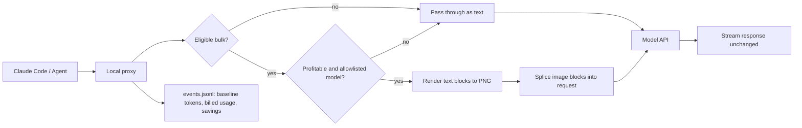

AI 에이전트의 LLM 비용 문제는 더 싼 모델을 고르는 일로 끝나지 않는다. 길어진 시스템 프롬프트, 도구 문서, 로그, 과거 대화가 매 요청마다 컨텍스트로 붙으면 비용은 모델 선택보다 컨텍스트를 어떻게 운반하느냐에 더 크게 흔들린다.

> pxpipe가 던진 질문은 단순하다. 텍스트를 꼭 텍스트 토큰으로 보내야 하는가.

## LLM 비용 최적화는 압축률보다 손실 경계가 먼저다

pxpipe는 Claude Code류 작업에서 부피가 큰 입력을 PNG 이미지로 렌더링해 모델이 OCR처럼 읽게 만든다. 처음 보면 꼼수처럼 들린다. 텍스트 토큰은 글자 수와 강하게 묶이지만, 이미지 토큰 비용은 픽셀 크기에 묶인다. 코드, JSON, 툴 출력처럼 빽빽한 텍스트는 이미지 한 장에 많이 들어간다.

프로젝트 README의 측정치는 꽤 공격적이다. 실제 Claude Code 트래픽에서 텍스트는 약 1 text-token당 1자에 가까웠고, 이미지 변환 후에는 image-token당 약 3.1자를 담았다고 설명한다. 1928×1928 이미지는 약 4,761 vision token으로 계산되고, 한 페이지에 약 92,000자를 담는 구조다. 이 조건에서는 48,000자 규모의 시스템 프롬프트와 도구 문서가 약 25,000 text token에서 약 2,700 image token 수준으로 줄어든다.

핵심은 60% 비용 절감이라는 숫자보다 pxpipe가 스스로 손실을 인정한다는 점이다. 정확한 12자 hex 문자열은 Fable 5에서 15개 중 13개를 맞혔고, Opus 4.8에서는 15개 중 0개를 맞혔다. 실패가 에러로 드러나는 것도 아니다. 그럴듯한 오답으로 나온다.

운영 판단은 여기서 갈린다. 비용을 낮추는 압축은 많다. 프로덕션에 넣을 수 있는 압축은 byte-exact 값과 gist 값을 구분해야 한다.

## AI 에이전트 컨텍스트에는 두 종류의 정보가 섞여 있다

코딩 에이전트의 입력은 한 덩어리처럼 보이지만 성격이 다르다. 시스템 프롬프트, 도구 설명, 오래된 로그, 빌드 출력, JSON 덤프는 대체로 의미 보존이 중요하다. 반대로 파일 경로, 해시, 토큰, 사용자 이름, ID, 마이그레이션 버전, 정확한 숫자는 글자 단위 보존이 필요하다.

pxpipe의 설계는 이 차이를 인정한다. 최근 턴은 텍스트로 유지하고, 오래된 bulk history와 큰 tool_result, 정적 시스템 프롬프트와 도구 문서만 이미지화한다. 작은 입력과 성긴 prose는 그대로 둔다. 모델 allowlist 밖 요청도 통과시킨다. README 기준 기본 대상은 claude-fable-5와 gpt-5.6이고, Opus 4.7/4.8과 GPT 5.5는 읽기 성능 저하 때문에 opt-in이다.

이 구분이 없으면 비용 최적화가 장애 주입기가 된다. 로그 요약은 틀려도 다시 확인할 수 있다. SHA 하나가 틀리면 다른 커밋을 고친다. 사람 이름 하나가 틀리면 대화 맥락이 깨진다. pxpipe가 기록한 실제 실패도 같은 축에 놓인다. 이미지화된 채팅 히스토리에서 사람 이름을 잘못 회상했고, 모델은 자신 있게 틀렸다.

이 접근은 일반 챗봇보다 코딩 에이전트에 더 맞는다. 코딩 에이전트는 편집 직전에 파일을 다시 읽을 수 있다. 순수 대화형 어시스턴트는 그 재검증 루프가 약하다.

## Fable 같은 강한 에이전트에는 규칙보다 라우팅이 필요하다

DEV Community 글은 Fable과 Opus 같은 강한 코딩 에이전트를 두고 반대편 논점을 잡는다. 강한 모델일수록 세세한 지시가 오히려 방해가 될 수 있다는 주장이다. 작은 변경은 테스트를 생략하고, 큰 변경은 테스트를 돌리고, 디자인 변경은 예외로 두라는 식의 규칙보다, 적절한 곳에 테스트를 작성하고 실행하라는 지시가 낫다는 관점이다.

pxpipe는 이 논의를 비용 쪽으로 가져온다. 사람이 매번 이 요청은 고급 모델, 저 요청은 저가 모델이라고 나누기 시작하면 규칙은 금방 낡는다. 모델 가격이 바뀌고, 컨텍스트 모양이 바뀌고, 특정 모델의 vision 성능이 바뀐다. 수동 운전이 정교해 보이는 순간에도 운영 표면은 늘어난다.

Vercel AI Gateway의 routing rules는 같은 문제를 인프라 레이어에서 푼다. 애플리케이션 코드 안에서 모델 이름을 바꾸는 대신, 게이트웨이에서 rewrite와 deny 규칙을 둔다. 특정 모델이 내려가거나 retired되면 코드 배포 없이 다른 모델로 우회한다. 승인하지 않은 모델은 403으로 차단한다. 비용 절감을 위해 비싼 모델 요청을 더 싼 모델로 rewrite하는 사용례도 명시되어 있다.

pxpipe와 AI Gateway routing rules는 서로 다른 레이어의 답이다. pxpipe는 같은 모델로 가는 요청의 컨텍스트 표현을 바꾼다. Gateway rules는 요청이 도착할 모델 자체를 바꾼다. 둘을 섞으면 원칙이 더 분명해진다.

모델 선택은 애플리케이션 코드에서 빼고, 손실 있는 컨텍스트 변환은 byte-safe 경계 안에 가둬야 한다.

## 프록시 아키텍처: 비용 절감 장치는 요청 경로에 들어간다

pxpipe는 로컬 프록시로 동작한다. Claude Code가 직접 Anthropic API를 호출하지 않고, 127.0.0.1의 프록시를 바라본다. 프록시는 `/v1/messages` 요청을 가로채 eligible block을 이미지로 바꾸고, 나머지는 byte-identical하게 통과시킨다. 응답 스트리밍은 건드리지 않는다.

```bash
npx pxpipe-proxy
ANTHROPIC_BASE_URL=http://127.0.0.1:47821 claude
```

이 구조의 장점은 애플리케이션 수정이 작다는 점이다. 호출자는 여전히 같은 모델과 같은 API를 쓴다. 대시보드는 token saved, 변환 전후 비교, kill switch, 모델 칩을 보여준다. 이벤트는 `~/.pxpipe/events.jsonl`에 남고, 각 요청마다 원본 uncompressed body에 대한 `count_tokens` counterfactual과 실제 billed usage를 같은 row에 기록한다.

운영자가 봐야 할 데이터 흐름은 이렇다.



위 설계는 비용 장치를 코드 밖으로 뺀다. 대신 새 장애 지점을 만든다. 프록시가 죽으면 에이전트가 멈춘다. PNG 인코딩은 큰 요청 앞단에 지연을 추가한다. 이미지 렌더링 품질, API의 resample cap, 모델별 vision 성능도 정확도에 영향을 준다. 관측성 없이는 절감률만 보고 품질 하락을 놓친다.

kill switch는 편의 기능이 아니라 운영 조건이다. `PXPIPE_MODELS=off` 같은 완전 비활성화 경로가 있어야 하고, 모델별 allowlist는 기본적으로 좁아야 한다.

## 도입 조건: 로그는 이미지로 보내도 되고, 식별자는 안 된다

이 방식은 모든 LLM 비용 문제의 답이 아니다. pxpipe README도 sparse prose에서는 손해가 날 수 있다고 말한다. 텍스트가 이미 token당 3.5자 수준으로 성기면 이미지 변환 이득이 줄어든다. 반대로 Claude Code 트래픽처럼 token-dense content가 많은 워크로드에서는 수지가 맞는다. 프로젝트는 N=391 production rows로 보정한 profitability gate를 둔다.

실무 도입 조건은 네 가지다.

- 입력의 대부분이 코드, JSON, 로그, 툴 출력처럼 빽빽한 텍스트여야 한다.
- byte-exact 값은 텍스트로 고정하는 정책이 있어야 한다.
- 모델별 OCR 성능을 자체 평가하고 allowlist를 좁게 시작해야 한다.
- 비용 절감률과 작업 성공률을 같은 이벤트 단위로 남겨야 한다.

SWE-bench 결과도 과하게 읽으면 안 된다. README는 SWE-bench Lite pilot에서 양쪽 10/10, SWE-bench Pro에서 이미지화 ON 14/19, OFF 15/19, verdict agreement 18/19를 제시한다. 표본이 작고 run-to-run variance를 인정한다. 이 숫자는 가능성의 근거이지, 모든 레포에서 60% 절감과 동일 품질을 보장하는 계약이 아니다.

현실적인 판단은 이렇다. 반복적으로 큰 로그와 파일 덤프를 읽는 에이전트 워크플로에는 시험해볼 가치가 있다. 규제 데이터, 고객 식별자, secret, exact ID가 컨텍스트에 섞이는 워크플로에는 먼저 마스킹과 sharp pinning이 필요하다. 순수 문서 작성이나 긴 대화 기억 보존에는 이득보다 오류 비용이 크다.

Vercel의 routing rules 같은 게이트웨이 정책은 여기서 보완재가 된다. 모델 장애, 모델 retirement, 비승인 모델 차단은 gateway에서 처리한다. 컨텍스트 압축은 프록시나 SDK에서 처리한다. 비용 상한은 billing alert로 잡고, 품질 하한은 eval로 잡는다. 한 레이어에 전부 넣으면 편해 보이지만, 장애가 났을 때 끌 수 있는 스위치가 사라진다.

## 싸게 읽히는 컨텍스트와 정확히 읽혀야 하는 컨텍스트를 나눠라

pxpipe가 보여준 실용적 교훈은 이미지 토큰이 텍스트 토큰보다 싸다는 사실이 아니다. AI 에이전트 인프라에서 컨텍스트는 저장 포맷이 아니라 운반 정책이라는 점이다.

같은 10만 자라도 오래된 로그는 싸게 읽혀도 된다. 같은 12자라도 hex 값은 정확히 읽혀야 한다. 이 차이를 아키텍처에 반영하면 비용 절감은 기능이 된다. 반영하지 않으면 비용 절감은 조용한 데이터 변조가 된다.

강한 코딩 에이전트에는 더 많은 손잡이가 필요하지 않다. 더 좋은 경계가 필요하다. 모델은 판단하게 두고, 게이트웨이는 모델 사용을 통제하고, 프록시는 컨텍스트 표현을 바꾸되 손실 가능한 영역에서만 움직여야 한다. 그 선을 긋지 못한 팀에게 60% 절감은 할인이 아니라 부채다.

## 참고 자료

- [선정 글감] [60% Fable cost cut by converting code to images and having the model OCR it](https://github.com/teamchong/pxpipe) — Hacker News Best
- [관련] [Fable May Not Be the Best Choice for Some Engineers](https://dev.to/sennalang/fable-may-not-be-the-best-choice-for-some-engineers-20p7) — DEV Community
- [관련] [Routing rules now available on AI Gateway](https://vercel.com/changelog/ai-gateway-routing-rules) — Vercel Blog