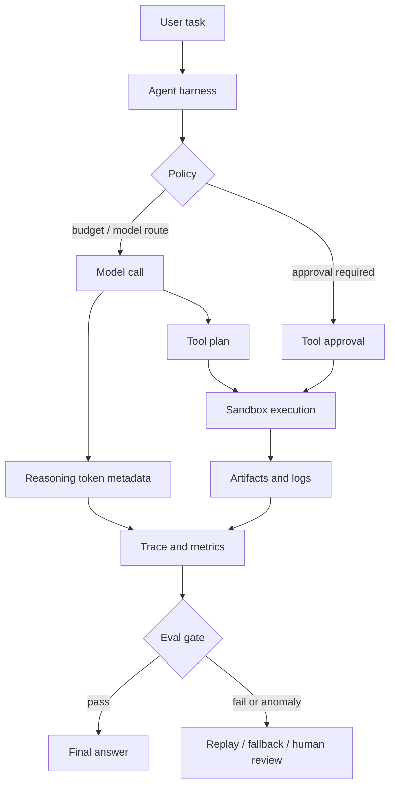

> 에이전트가 실패하는 순간은 모델이 답을 틀릴 때만이 아니다. 코딩 하네스와 관측성 시스템이 그 실패를 정상 실행처럼 기록할 때 문제가 커진다.

Codex 이슈 #30364에서 볼 대목은 516이라는 숫자 자체가 아니다. reasoning token, 모델 품질, 비용 제어, 하네스 실행 환경이 한 지점에서 부딪혔다는 점이다. 에이전트가 긴 작업을 맡으면 모델 선택은 API 호출 옵션을 넘어 운영 정책이 된다.

## Codex reasoning token 516 이슈가 말하는 문제

해당 이슈의 주장은 조심스럽다. 작성자는 비공개 Chain-of-Thought가 잘렸다고 단정하지 않는다. 대신 Codex의 token_count 메타데이터에서 GPT-5.5 응답이 reasoning_output_tokens 516에 비정상적으로 몰린다고 말한다.

수치는 구체적이다. 분석 대상은 응답 레벨 토큰 기록 390,195건, 세션 865개다. GPT-5.5는 전체 응답의 19.3%인데, exact 516 이벤트의 82.0%를 차지했다. GPT-5.5에서 reasoning_output_tokens가 516 이상인 응답 중 exact 516 비율은 44.0%였고, non-GPT-5.5 기준은 1.3%였다. 월별로도 2026년 2월 0.11%였던 exact 516 / >=516 비율이 5월 53.30%, 6월 35.84%까지 올랐다.

이 패턴이 자연스러운 분포처럼 보이지 않는 이유는 하나 더 있다. 같은 기간 평균 reasoning token과 P90은 오히려 내려갔다. 2월 평균 268.1, P90 772였던 값이 5월 평균 106.9, P90 344로 줄었다. 더 많이 생각해서 516에 몰린 게 아니라, 덜 쓰는 방향으로 가는 와중에 특정 경계값에 걸린 모양이다.

실무에서는 에이전트 하네스의 토큰 사용량을 과금 지표로만 보면 안 된다. 품질 저하를 설명하는 운영 신호일 수 있다.

## AI 에이전트 하네스는 왜 테스트 자동화 문제가 되었나

AI SDK 7의 방향은 이 변화를 분명히 보여준다. Vercel은 AI SDK를 단순한 모델 호출 라이브러리가 아니라 프로덕션 에이전트 플랫폼으로 확장했다고 설명한다. reasoning control, tool context, runtime context, MCP Apps, durable WorkflowAgent execution, tool approvals, sandbox, timeouts, telemetry, OpenTelemetry 연동, lifecycle callbacks, step performance statistics가 한 묶음으로 들어간다.

이 목록은 기능 홍보라기보다 장애 지점 목록에 가깝다. 에이전트가 실패할 수 있는 지점이 그만큼 늘었다.

모델이 도구를 잘못 고를 수 있다. 샌드박스가 오래 걸릴 수 있다. 승인 흐름이 막힐 수 있다. 런타임 컨텍스트가 누락될 수 있다. 스트리밍이 끊길 수 있다. 비용 제한 때문에 reasoning budget이 조정될 수 있다. 장기 실행 작업에서는 이 중 하나만 흔들려도 최종 답변의 품질이 달라진다.

The Pragmatic Engineer가 OpenAI, Anthropic, Cursor 방문기에서 짚은 흐름도 같은 방향이다. 클라우드에서 도는 에이전트가 주류가 되고, 코딩 하네스가 개발자 바깥으로 퍼진다. OpenAI에서는 비개발자 다수가 ChatGPT가 아니라 Codex를 쓴다는 관찰까지 나온다. 하네스가 IDE 보조도구에서 업무 실행 환경으로 이동하고 있다는 뜻이다.

업무 실행 환경에는 재현성이 필요하다. 같은 입력을 넣었을 때 같은 품질 범위 안에 있어야 하고, 다르면 왜 다른지 추적할 수 있어야 한다. 그래서 Codex의 516 이슈는 모델 논쟁인 동시에 테스트 자동화 논쟁이다.

## 관측성 없는 에이전트는 비용 최적화도 못 한다

Wafer의 AMD 추론 글은 다른 각도에서 같은 압박을 보여준다. 글은 AMD MI355X가 NVIDIA B300 대비 GPU당 평균 약 2.75배 저렴하고, 특정 20k input / 1k output, 60% cache hit workload에서 2626 tok/s/node, 2.4 rps, TTFT 5초 이하 knee를 기록했다고 말한다. B200 대비 성능의 80% 수준이지만 비용은 2배 이상 낮다는 주장이다.

핵심은 AMD가 좋다거나 NVIDIA가 비싸다는 단순 비교가 아니다. 에이전트 운영자는 모델 품질뿐 아니라 spend-per-token을 최적화한다. The Pragmatic Engineer 글에서도 AI 지출이 커지면서 플랫폼 팀이 token당 비용을 줄이는 일이 엔지니어링 과제가 된다고 설명한다.

비용 최적화는 품질을 건드릴 수 있다. reasoning budget, 라우팅, 캐시, fallback, 하드웨어 스택 최적화는 모두 결과 품질에 영향을 준다. 관측성이 없으면 비용을 줄였는지, 정답률을 깎았는지 구분하지 못한다.

그래서 최소 관측 단위는 최종 응답 시간이 아니다. 에이전트 실행은 step 단위로 봐야 한다. 모델 호출, reasoning token, tool call, sandbox 실행, 승인 대기, 재시도, fallback 모델, cache hit, 최종 평가 결과가 하나의 trace 안에 들어가야 한다.

이 다이어그램에서 빠지면 안 되는 노드는 K다. 에이전트 하네스는 실행기만이 아니라 판정기여야 한다. 실행 로그를 모으는 데서 끝나면 516 같은 이상값은 나중에 커뮤니티 이슈로 발견된다. 운영 시스템 안에서 먼저 잡으려면 eval gate가 필요하다.

## Codex, Claude Code, OpenCode를 붙이기 전에 정해야 할 것

AI SDK 7은 Codex, Claude Code, Deep Agents, OpenCode, Pi 같은 agent harness 통합을 언급한다. 이 흐름은 타당하다. 한 모델이나 한 하네스에 묶이지 않는 쪽이 운영 리스크를 줄인다. 다만 추상화 계층부터 세우면 실패한다. 공통 인터페이스보다 먼저 필요한 것은 공통 측정값이다.

도입 전에 팀이 정해야 할 값은 많지 않다.

- task_id, model, provider, harness version
- reasoning token, input token, output token
- tool call 이름과 인자 해시
- sandbox 실행 시간과 종료 코드
- timeout, retry, fallback 발생 여부
- cache hit 여부
- 사람이 승인한 단계와 거절한 단계
- 최종 산출물에 대한 자동 평가 또는 샘플링 리뷰 결과

이 정도면 충분하다. 처음부터 복잡한 에이전트 플랫폼을 만들 필요는 없다. 하지만 이 값들이 없으면 어떤 하네스가 좋은지 판단할 근거도 없다.

reasoning token 같은 내부 지표에 너무 의존하면 모델 제공자의 구현 세부사항에 운영이 묶인다는 반론은 맞다. exact 516이 실제 truncation인지, scheduler behavior인지, degraded tier인지 외부에서는 확정하기 어렵다. 그래서 지표 하나로 차단 정책을 만들면 안 된다.

필요한 것은 단일 지표 차단이 아니라 상관관계 감시다. exact boundary spike가 생겼을 때 task 난이도, 실패율, 재시도율, fallback 비율, 사람 리뷰 결과가 같이 움직이는지 본다. 같이 움직이면 운영 사건이다. 움직이지 않으면 비용 또는 라우팅 정책의 흔적일 수 있다.

## 장기 실행 AI 에이전트의 도입 조건

OpenAI의 Codex long-running work 글은 에이전트가 한 프롬프트를 넘어 컨텍스트를 보존하고 복잡한 프로젝트를 이어가는 방향을 보여준다. 장기 실행은 매력적이다. 사람이 잊은 맥락을 에이전트가 붙잡고, 작업을 나눠 진행하며, 중간 산출물을 남긴다.

그만큼 장애는 조용해진다.

짧은 채팅의 실패는 눈에 보인다. 긴 작업의 실패는 중간 결정에 숨어 있다. 잘못된 파일을 읽고도 그럴듯한 계획을 세울 수 있고, 도구 실행 실패를 설명으로 덮을 수 있고, 비용 제한에 걸린 짧은 reasoning을 정상 답변처럼 제출할 수 있다.

도입 조건은 세 가지다.

첫째, 장기 작업에는 재생 가능한 입력 묶음이 있어야 한다. 프롬프트, 파일 상태, 하네스 설정, 모델, 승인 정책을 남기지 않으면 실패를 재현할 수 없다.

둘째, 모델 교체 실험이 쉬워야 한다. Codex 이슈의 제안처럼 같은 복잡 작업을 GPT-5.2와 GPT-5.5, exact-516 응답과 longer-reasoning 응답으로 나눠 replay할 수 있어야 한다. 모델 품질 논쟁은 감상이 아니라 paired eval로 끝내야 한다.

셋째, 비용 정책은 품질 정책과 같은 화면에 있어야 한다. GPU 단가, token 가격, cache hit, TTFT만 보면 싸게 보이는 구성이 있다. 하지만 실패한 에이전트 작업을 사람이 되돌리는 비용까지 넣으면 싼 구성이 비싸진다.

AI 에이전트 운영의 기준선은 모델이 얼마나 똑똑한가가 아니다. 실패를 얼마나 빨리, 얼마나 작게, 얼마나 설명 가능하게 격리하는가다.

Codex의 516 이슈도 같은 지점을 가리킨다. 특정 숫자가 버그라는 결론을 서두를 필요는 없다. 다만 에이전트 하네스가 프로덕션 실행 환경이 된 이상, 이상한 숫자는 지나가는 잡음이 아니다. 그 숫자가 품질, 비용, 라우팅, 테스트 결과와 연결되는 순간 운영 신호가 된다.

## 참고 자료

- [선정 글감] [GPT-5.5 Codex reasoning-token clustering may be leading to degraded performance](https://github.com/openai/codex/issues/30364) - GitHub
- [관련] [AI SDK 7 is now available](https://vercel.com/changelog/ai-sdk-7) - Vercel Blog
- [관련] [Performance per dollar is getting faster and cheaper](https://www.wafer.ai/blog/glm52-amd) - Wafer
- [관련] [Impressions from visiting OpenAI, Anthropic, & Cursor](https://newsletter.pragmaticengineer.com/p/impressions-from-visiting-openai) - The Pragmatic Engineer
- [관련] [Codex-maxxing for long-running work](https://openai.com/index/codex-maxxing-long-running-work) - OpenAI Blog