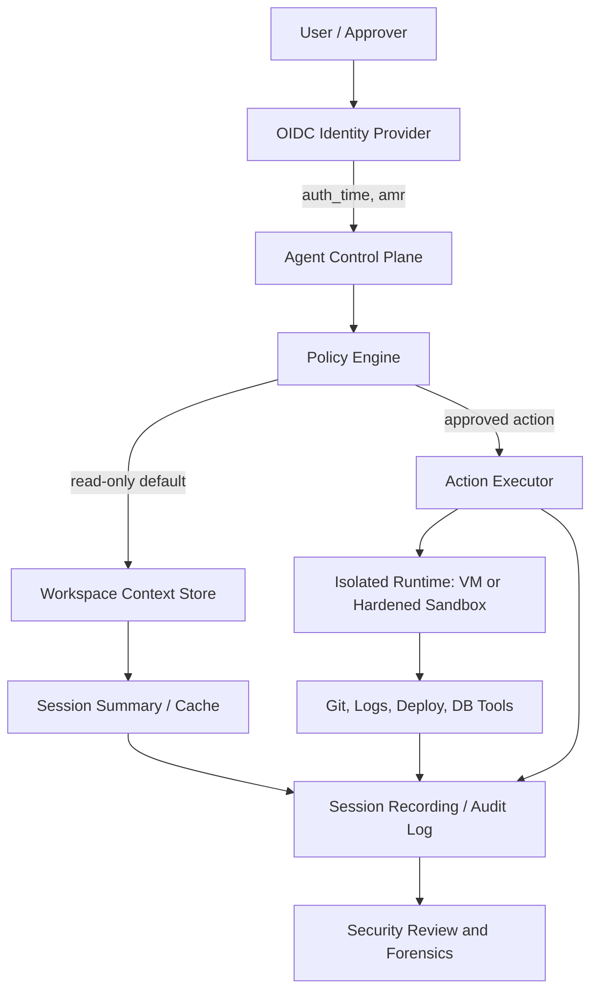

> AI 에이전트 보안의 핵심은 모델이 얼마나 똑똑한지가 아니다. 세션 격리, 캐시 누수, 권한 경계가 깨졌을 때 오염이 어디까지 퍼지는지다.

Claude Code의 한 GitHub 이슈는 그 불안을 정확히 찔렀다. macOS에서 Enterprise ZDR 워크스페이스로 인증한 사용자가 전혀 관련 없는 Minecraft 사원 이야기를 에이전트 응답에서 봤다고 보고했다. 이 이슈는 Hacker News에서 246포인트, 댓글 118개를 모았다. 확정된 보안 사고라기보다 잠재적 세션 또는 캐시 오염 제보에 가깝다. 그래도 개발자들이 반응한 이유는 분명하다. 에이전트가 이제 로그를 읽고 배포를 조사하며, PR을 열고 설정을 바꾸는 쪽으로 이동하고 있기 때문이다.

문제는 프롬프트 하나가 이상하게 섞였다는 데서 끝나지 않는다. 운영 환경을 다루는 에이전트에서 컨텍스트가 섞이면, 그것은 오답이 아니라 권한 오염이 된다.

## AI 에이전트 세션 격리는 프롬프트 문제가 아니라 멀티테넌시 문제다

해당 이슈의 핵심은 특이한 작업 방식에 있다. 제보자는 에이전트를 실제 작업 디렉터리와 다른 디렉터리에서 시작했고, `.claude` 컨텍스트가 있는 위치와 작업 대상이 갈라져 있었다고 설명했다. 이전에도 압축된 대화가 엉뚱한 디렉터리로 돌아간 적이 있었고, 그 부분은 자신의 설정 탓으로 이해했다. 하지만 Minecraft 관련 맥락은 설명되지 않는다고 봤다.

실무자가 봐야 할 지점은 하나다. 에이전트 시스템의 세션은 UI 탭 하나가 아니다. 로컬 작업 디렉터리, 워크스페이스 식별자, 인증 계정, 캐시 키, 요약 메모리, 도구 실행 로그, 모델 컨텍스트가 함께 묶인 실행 단위다. 이 중 하나라도 느슨하게 결합되면 “다른 사용자의 문장이 보였다” 같은 증상이 나온다.

이 이슈만으로 실제 계정 간 누수를 단정할 수는 없다. 로컬 컨텍스트 파일, 대화 압축, 작업 디렉터리 혼선, 클라이언트 캐시 버그가 모두 후보가 된다. 그래서 이 사건을 “특정 제품이 새었다”로만 읽으면 부족하다.

더 정확한 독해는 이것이다. AI 에이전트는 기존 SaaS보다 더 많은 상태를 붙잡고, 그 상태를 자연어로 재조립한다. 작은 캐시 키 충돌도 사용자에게는 데이터 경계 붕괴처럼 보인다.

## 왜 로그인 신호만으로는 부족한가: auth_time과 amr이 말하는 것

Google은 Sign in with Google에 `auth_time`과 `amr` 같은 OIDC(OpenID Connect) 표준 클레임을 추가한다고 설명했다. `auth_time`은 사용자가 언제 인증했는지, `amr`은 어떤 인증 방법을 썼는지 알려준다. MFA(Multi-Factor Authentication)나 하드웨어 키 같은 인증 강도를 백엔드가 판단할 수 있게 하는 신호다.

이 신호는 에이전트 권한 제어에도 필요하다. 예를 들어 에이전트가 “설정 변경”, “롤백”, “프로덕션 로그 조회”, “비밀값 접근”을 요청한다면 단순히 사용자가 로그인되어 있다는 사실만으로는 부족하다. 최근에 강한 인증을 거쳤는지 확인해야 한다.

하지만 인증 신호는 세션 격리를 대신하지 못한다. `auth_time`과 `amr`은 “이 사용자가 방금 강하게 인증했다”를 말해준다. “이 에이전트의 캐시가 다른 워크스페이스와 섞이지 않았다”는 말은 해주지 않는다.

로그인은 입구를 지킨다. 격리는 방 안의 칸막이를 지킨다.

AI 에이전트 보안 설계에서 이 둘을 혼동하면 사고가 난다. 강한 로그인 뒤에 약한 캐시가 붙어 있으면, 권한은 정상인데 컨텍스트가 틀린 상태가 된다. 이 상태의 에이전트는 승인된 사용자 앞에서 승인되지 않은 문맥으로 행동한다.

## 샌드박스는 왜 다시 VM으로 돌아가나

AWS Lambda MicroVMs 발표는 같은 문제를 다른 층위에서 다룬다. AWS는 사용자나 AI가 만든 코드를 실행하는 애플리케이션을 위해 Firecracker 기반 MicroVM을 제공한다고 설명한다. 핵심 문장은 단순하다. 컨테이너는 빠르지만 공유 커널 때문에 신뢰할 수 없는 코드를 안전하게 가두려면 강한 하드닝이 필요하고, VM은 격리가 강하지만 시작이 느리다. MicroVM은 이 간극을 줄이려는 선택이다.

AI 코딩 에이전트, 대화형 코드 환경, 데이터 분석 플랫폼, 취약점 스캐너는 모두 같은 모양을 가진다. 사용자가 제공한 코드나 에이전트가 생성한 코드를 실행해야 한다. 실행 환경은 빠르게 떠야 하고, 상태를 잠시 유지해야 하며, 다른 사용자와 섞이면 안 된다. AWS는 Lambda MicroVMs에서 VM 수준 격리, 빠른 시작과 재개, 상태 보존을 내세운다.

이 흐름은 세션 캐시 논쟁과 맞닿아 있다. 프롬프트와 파일 컨텍스트는 눈에 보이는 상태다. 프로세스, 파일시스템, 네트워크, 토큰 캐시, 도구 실행 결과는 눈에 덜 보이는 상태다. 격리 모델이 컨테이너 네임스페이스 수준인지, 워크스페이스 디렉터리 수준인지, 계정별 MicroVM 수준인지에 따라 사고 반경이 달라진다.

이 구조에서 위험한 지점은 `CTX`와 `CACHE`다. 많은 팀이 실행 샌드박스에는 관심을 두지만, 요약 메모리와 캐시 키 설계는 뒤로 미룬다. 에이전트는 코드를 실행하기 전에 이미 많은 결정을 내린다. 그 결정의 입력이 오염되면 샌드박스는 늦게 등장한다.

## 읽기 전용 에이전트와 승인된 액션 사이의 회색지대

Vercel Agent의 공개 베타 설명은 플랫폼 에이전트가 어디로 가는지 보여준다. 대시보드 안에서 프로젝트 질문에 답하고, 실패한 배포나 런타임 오류, 비용 급증을 조사하고, 승인 후 PR 생성·롤백·설정 변경을 수행한다. Vercel은 에이전트가 자체 identity로 실행되고, 요청자 권한에 묶이며, 기본은 read-only이고, 변경에는 승인된 scoped plan이 필요하다고 설명한다. 생성 코드는 Vercel Sandbox에서 검증된 뒤 프로덕션에 닿는다.

이 설계는 중요한 선을 긋는다. 에이전트가 사람 계정 뒤에 숨어서 행동하지 않고, 누가 요청했고 누가 승인했으며 어떤 agent identity가 실행했는지 남긴다. 그래야 사고가 났을 때 “누가 버튼을 눌렀나”가 아니라 “어떤 컨텍스트와 승인 계획으로 변경이 실행됐나”를 추적할 수 있다.

다만 read-only는 만능 안전장치가 아니다. 로그, 메트릭, 배포 설정, 저장소 연결 정보는 읽기만 해도 민감하다. 에이전트가 잘못된 워크스페이스의 로그를 읽고 올바른 사용자에게 답하면, 시스템은 아무것도 변경하지 않았지만 이미 유출은 일어났다.

HashiCorp Boundary 1.0의 RDP 세션 기록도 같은 방향의 보완책이다. Boundary는 RDP 세션에서 사용자의 상호작용을 캡처하고 재생할 수 있다고 설명한다. 향후 Kubernetes, 데이터베이스, HTTP/HTTPS 같은 프로토콜로 세션 기록을 확장하려는 방향도 언급한다. 사람의 특권 접근 관리(PAM)에서 쓰던 원칙이 에이전트 접근에도 필요해진다. 접근은 짧게 열고, 세션은 기록하고, 나중에 재생 가능해야 한다.

AI 에이전트에 필요한 것은 “대화 기록”만이 아니다. 도구 호출, 입력 컨텍스트, 권한 상승 요청, 승인자, 실행 환경, 산출물 해시가 함께 묶인 감사 로그다.

## 도입 전에 확인할 것은 모델 성능이 아니라 경계 조건이다

AI 에이전트를 운영 도구에 붙일 때 첫 질문을 “어떤 모델이 더 잘 고치나”로 잡으면 순서가 틀린다. 먼저 경계 조건을 확인해야 한다.

- 워크스페이스 ID, 계정 ID, 조직 ID, 런타임 ID가 캐시 키에 모두 포함되는가
- 대화 요약과 세션 캐시가 계정 전환, 디렉터리 전환, 워크스페이스 전환에서 폐기되는가
- read-only 권한으로도 민감한 로그와 설정이 노출되지 않도록 필드 단위 제한이 있는가
- 승인된 액션은 요청자 권한이 아니라 별도 agent identity와 scoped plan으로 실행되는가
- 샌드박스는 컨테이너 격리인지 VM 격리인지, 신뢰할 수 없는 코드 실행에 충분한가
- 세션 기록은 텍스트 대화만이 아니라 도구 호출과 외부 시스템 접근까지 남기는가

도입 조건도 명확하다. 개인 개발 보조처럼 로컬 파일 수정이 중심인 경우에는 작업 디렉터리와 인증 계정의 분리만으로도 위험을 크게 줄일 수 있다. 프로덕션 로그, 배포, 데이터베이스, 고객 데이터에 닿는 에이전트라면 다르다. 이 경우에는 OIDC 세션 신호, 정책 엔진, 격리 런타임, 승인 흐름, 세션 기록이 한 묶음으로 필요하다.

모든 팀이 곧바로 MicroVM을 도입해야 하는 것은 아니다. 코드 실행이 없고 내부 문서 검색만 하는 에이전트라면 VM 격리는 과하다. 대신 인덱스 권한 분리, 문서 ACL 동기화, 응답 출처 표시가 더 직접적인 통제다. 실행 격리는 코드와 셸이 열릴 때 필요하고, 접근 감사는 운영 시스템에 닿을 때 필요하다. 문제의 층위가 다르면 통제도 달라야 한다.

Claude Code 이슈가 남긴 질문은 여기에 있다. Minecraft 문장이 실제 누수였는지, 로컬 상태 오염이었는지는 공개 자료만으로 확정할 수 없다. 하지만 좋은 시스템은 이런 제보가 올라왔을 때 “그럴 리 없다”가 아니라 “어느 경계가 깨져도 계정 간 데이터로 번지지 않는다”고 말할 수 있어야 한다.

AI 에이전트는 사람보다 빨리 움직인다. 그러니 사람보다 좁은 권한, 더 짧은 세션, 더 강한 격리, 더 자세한 기록을 가져야 한다. 그 조건을 만족하지 못하면 에이전트는 자동화가 아니라 작은 캐시 실수를 큰 운영 리스크로 키우는 증폭기가 된다.

## 참고 자료

- [선정 글감] [Potential session/cache leakage between workspace instances or consumer accounts](https://github.com/anthropics/claude-code/issues/74066) — Hacker News Best
- [관련] [Enhance Security and Trust: New Session Metadata in Sign in with Google](https://developers.googleblog.com/enhance-security-and-trust-new-session-metadata-in-sign-in-with-google/) — Google Developers
- [관련] [Run isolated sandboxes with full lifecycle control: AWS Lambda introduces MicroVMs](https://aws.amazon.com/blogs/aws/run-isolated-sandboxes-with-full-lifecycle-control-aws-lambda-introduces-microvms/) — AWS Blog
- [관련] [Boundary 1.0 releases RDP session recording and improved management](https://www.hashicorp.com/blog/boundary-1-releases-with-rdp-session-recording-and-improved-management) — HashiCorp Blog
- [관련] [An expanded Vercel Agent: chat, investigations, and approved actions, now in public beta](https://vercel.com/changelog/an-expanded-vercel-agent-chat-investigations-and-approved-actions-now-in-public-beta) — Vercel Blog