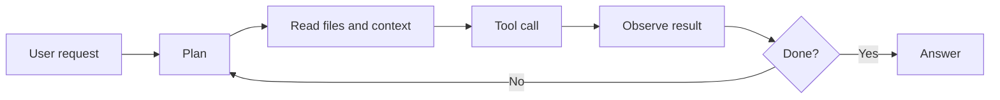

AI 토큰 비용은 이제 모델 가격표만의 문제가 아니다. 사용자는 짧은 질문을 던졌지만, 에이전트형 AI는 파일을 읽고, 명령을 고르고, 결과를 다시 해석하며 보이지 않는 토큰을 쓴다. 많이 썼다는 감각은 없는데, 많이 쓴 비용만 도착할 때 불만이 생긴다.

## AI 코딩 에이전트 요금은 왜 체감보다 빨리 오른다

Computerphile 영상의 출발점은 단순하다. LLM 기반 코드 어시스턴트의 가격 구조가 바뀐 뒤, 겉으로는 작은 작업이 에이전트에게 맡겨졌을 때 얼마나 많은 토큰을 소비하는지 따져본다. 여기서 말하는 범위는 2026년 7월 기준 공개된 영상 설명과 관련 논의에 한정된다. 특정 업체의 내부 원가나 실제 마진은 영상만으로 확인할 수 없다.

확인된 사실은 분명하다. 사용자가 보는 프롬프트와 답변은 전체 비용의 일부다. 에이전트는 작업을 처리하기 위해 컨텍스트를 붙이고, 이전 대화를 유지하고, 도구 호출 결과를 다시 모델에 넣고, 실패하면 재시도한다. 토큰은 대화창의 글자 수가 아니라 모델이 읽고 쓰는 전체 단위다.

여기서 추정이 시작된다. 많은 사용자가 불편해하는 지점은 절대 가격보다 계량 방식이다. 코드 몇 줄 고치는 일처럼 보였는데, 내부에서는 검색, 요약, 계획, 실행, 재검토가 이어진다. 버튼 하나가 작은 외주 작업처럼 동작한다. 청구 화면은 채팅 앱에 가깝지만, 비용 구조는 분산 시스템에 가깝다.

이 간극이 커뮤니티 반응의 핵심이다.

## Caveman이 웃긴 이유는 농담이 아니라 청구서다

GitHub Trending에 오른 JuliusBrussee의 caveman 프로젝트는 이 분위기를 정확히 찔렀다. 프로젝트 설명은 “why use many token when few token do trick”이다. Claude Code, Codex, Gemini, Cursor, Windsurf, Cline, Copilot 등 여러 코딩 에이전트에 설치해 답변을 짧게 만들고, 출력 토큰을 65% 줄인다고 주장한다. 제공된 트렌딩 정보 기준 별은 83,903개, 하루 증가분은 1,089개다.

이 숫자는 개발자가 원시인 말투를 좋아한다는 뜻이 아니다. 개발자는 에이전트가 말이 많다고 느꼈고, 말이 많으면 곧 비용이 된다는 점을 몸으로 이해했다. caveman은 그 불만을 밈으로 포장했지만, 밈의 대상은 문체가 아니라 과금 단위다.

다만 이 프로젝트가 해결하는 문제는 제한적이다. 발췌에 따르면 caveman은 출력 토큰 절감에 초점을 둔다. 입력 토큰 절감은 0%로 표시된다. 에이전트가 읽는 파일, 붙이는 컨텍스트, 도구 실행 결과, 숨은 추론 단계가 비용의 큰 부분이라면 짧은 답변만으로 청구서를 근본적으로 줄일 수 없다.

그래도 반응이 붙은 이유는 분명하다. 사용자는 장황한 설명을 비용으로 보기 시작했다. 예전에는 친절한 답변이 제품 품질처럼 보였다. 이제는 불필요한 출력이 운영비로 보인다.

## 에이전트형 AI는 말보다 행동에서 토큰을 쓴다

MIT News가 2026년 6월 30일 공개한 Phillip Isola 인터뷰는 이 논쟁을 더 넓은 범위로 옮긴다. 그는 에이전트형 AI(agentic AI)를 “세상에서 행동을 취하는 AI”로 설명한다. 물리적 행동일 수도 있고, 항공권 예약 같은 디지털 행동일 수도 있다. 같은 글은 2025년 11월 MIT Sloan School of Management와 BCG 보고서를 인용해, 조사 대상 기업의 35%가 이미 AI 에이전트를 배포했고 44%가 곧 도입할 계획이라고 전한다.

비용 논쟁은 여기서 더 날카로워진다. 챗봇은 답을 만든다. 에이전트는 상태를 바꾼다. 상태를 바꾸려면 확인이 필요하고, 확인에는 로그와 권한과 롤백 계획이 붙는다. 비용은 출력 문장 수보다 작업 루프의 길이에 더 가깝다.

이 구조에서 한 번의 “수정해줘”는 여러 번의 “읽기, 판단, 실행, 검증”으로 쪼개진다. 모델 가격표만 보고 월 비용을 예측하면 틀린다. 실제 변수는 작업당 루프 횟수, 컨텍스트 크기, 실패율, 도구 결과의 길이, 사람이 중간에 멈출 수 있는 승인 경계다.

커뮤니티가 갈리는 지점도 여기다. 한쪽은 에이전트가 반복 작업을 줄인다고 보고, 다른 쪽은 같은 일을 더 많은 토큰과 클라우드 자원으로 우회한다고 본다. 어느 쪽이든 작업의 성격을 빼고는 판단하기 어렵다. 테스트 실패 원인을 찾고 패치를 만드는 일처럼 탐색 비용이 큰 작업은 에이전트가 값을 낸다. 이미 답이 정해진 단순 변환을 장황한 루프로 처리하면 낭비다.

## AI 비용 논쟁은 전기와 물로 번진다

TechCrunch는 2026년 7월 2일 Google과 Amazon의 지속가능성 보고서를 근거로 AI의 실제 비용을 다뤘다. 기사에 따르면 Google의 총 탄소 배출량은 전년 대비 25%, Amazon은 16% 증가했다. 두 회사가 이를 AI 때문이라고 직접 단정한 것은 아니다. 확인된 사실은 양사가 AI 사용 증가와 함께 에너지 사용 증가를 인정했고, 넷제로 목표 달성이 더 어려워졌다는 점이다.

해석에는 주의가 필요하다. 데이터센터 증설, 공급망, 물류, 제품 믹스, 회계 기준이 모두 배출량에 영향을 준다. AI만 범인이라고 말하면 얇은 주장이다. 그렇다고 AI가 비용 논쟁의 중심으로 들어온 흐름을 무시하기도 어렵다. 대규모 모델 학습과 추론, 에이전트 실행, 데이터센터 전력 수요가 함께 커지고 있다.

그래서 “토큰이 비싸다”는 불만은 개인 지갑에서 끝나지 않는다. 회사에는 클라우드 비용이 되고, 플랫폼에는 용량 계획이 되고, 사회에는 전력망과 물 사용과 탄소 회계 문제가 된다. 사용자는 한 줄의 답변을 샀다고 느낀다. 시스템은 연산과 냉각과 전력을 판다.

이 차이를 숨기는 제품은 오래 버티기 어렵다. 가격이 낮아 보이는 구독제라도 사용량 제한, 속도 제한, 모델 다운그레이드, 기능별 크레딧으로 돌아오게 된다. 비용은 사라지지 않는다. 어디에 표시할지만 바뀐다.

## 실무자는 모델보다 미터기를 먼저 봐야 한다

이번 이슈에서 얻을 원칙은 단순하다. 에이전트형 AI를 도입할 때는 성능 평가표 옆에 미터기를 붙여야 한다. 답변 품질만 보면 반쪽이다. 작업당 입력 토큰, 출력 토큰, 도구 호출 횟수, 평균 루프 수, 실패 후 재시도율을 함께 봐야 한다.

실무적으로는 네 가지를 먼저 정해야 한다.

- 에이전트가 자동으로 읽을 수 있는 파일 범위
- 사람 승인 없이 실행할 수 있는 명령 범위
- 작업당 최대 토큰 또는 최대 루프 수
- 긴 설명이 필요한 상황과 짧은 답만 필요한 상황의 구분

caveman 같은 출력 압축 도구는 여기서 한 칸을 맡는다. 답변이 길어지는 습관을 줄이고, 사람이 읽는 시간을 줄인다. 하지만 입력 컨텍스트와 도구 루프를 통제하지 않으면 비용의 핵심은 그대로 남는다. 짧게 말하는 에이전트가 싸지는 않는다. 짧게 읽고, 덜 반복하고, 필요한 순간에 멈추는 에이전트가 싸진다.

비용을 너무 강하게 누르면 에이전트는 필요한 검증을 생략한다. 보안 패치, 데이터 마이그레이션, 결제 로직, 배포 자동화처럼 실패 비용이 큰 작업에서는 토큰을 아끼는 것보다 확인을 더 하는 편이 맞다. 문제는 많이 쓰는 것이 아니다. 사용자가 모르는 방식으로 많이 쓰는 것이다.

처음의 질문으로 돌아가면 답은 분명하다. AI 토큰 비용이 사람들을 불편하게 만든 이유는 숫자가 커서만이 아니다. 사용자는 대화를 했고, 플랫폼은 작업 그래프를 실행했다. 둘 사이의 단위가 다르다. 좋은 AI 제품은 더 똑똑한 모델만 내놓는 것으로 부족하다. 어디서 비용이 생겼는지, 어떤 행동이 값을 만들었는지, 언제 멈춰야 하는지 보여줘야 한다.

그 투명성이 없으면 실제 가격이 내려가도 토큰은 계속 비싸게 느껴진다.

## 참고 자료

- [선정 글감] [Why AI Tokens are so Expensive - Computerphile](https://www.youtube.com/watch?v=-0HRzXk8vlk) - YouTube Computerphile
- [관련] [#2 JuliusBrussee/caveman](https://github.com/JuliusBrussee/caveman) - GitHub Trending
- [관련] [A warning sign about AI’s real cost, courtesy of Google and Amazon](https://techcrunch.com/2026/07/02/a-warning-sign-about-ais-real-cost-courtesy-of-google-and-amazon/) - TechCrunch
- [관련] [Q&A: What is agentic AI today, and what do we want it to be?](https://news.mit.edu/2026/agentic-ai-and-what-do-we-want-it-be-0630) - MIT News AI