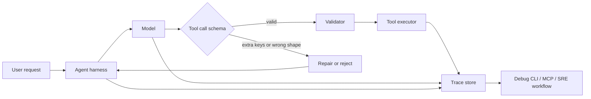

> AI 에이전트의 병목은 모델 성능이 아니라 도구 호출(tool calling) 계약이다.  
> 모델이 더 똑똑해질수록, 다른 하네스(harness)에서는 더 고집스럽게 틀릴 수 있다.

AI 에이전트, 코딩 에이전트, MCP, 하네스 자동화가 만나는 지점에서 위험한 착각이 하나 있다. 성능 좋은 모델을 붙이면 운영 품질도 같이 오른다는 믿음이다. 실제 장애는 반대쪽에서 난다. 모델은 정답에 가까운 편집 내용을 만들고도, 스키마에 없는 필드를 끼워 넣어 도구 호출을 실패시킨다.

Armin Ronacher가 공개한 사례는 이 문제를 정확히 보여준다. Pi의 편집 도구는 `edits[]` 안에 `oldText`, `newText`를 받는 중첩 스키마를 쓴다. 그런데 Opus 4.8과 Sonnet 5는 같은 배열 안에 `requireUnique`, `oldText2`, `matchCase`, `in_file`, `forceMatchCount` 같은 존재하지 않는 키를 붙였다. 더 불편한 점은 편집 본문 자체는 바이트 단위로 맞았다는 것이다. 지능은 맞았고, 계약은 틀렸다.

## AI 에이전트 도구 호출은 API가 아니라 학습된 습관이다

도구 호출은 함수 호출처럼 보이지만, 내부적으로는 텍스트 생성에 가깝다. 모델은 시스템 프롬프트, 대화 기록, 도구 목록을 보고 특수 마커와 JSON 비슷한 구조를 출력한다. 하네스는 그 출력을 파싱하고 검증한 뒤 실제 파일 편집, 셸 실행, 브라우저 조작을 수행한다.

이 계층의 품질은 두 곳에서 갈린다. 모델이 어떤 형태를 배웠는지, 하네스가 그 출력을 얼마나 엄격하게 받는지다.

선정 글감의 핵심 가설은 단순하다. 최신 모델이 특정 회사의 자사 코딩 하네스에 강하게 맞춰져 있으면, 같은 의미의 다른 도구 스키마를 오히려 더 못 받을 수 있다. Claude Code의 편집 도구가 `file_path`, `old_string`, `new_string`, `replace_all`처럼 비교적 평평한 구조라면, Pi의 `edits[]` 배열은 같은 편집 작업이어도 다른 언어다. 모델은 편집을 이해했지만, 자신에게 익숙한 하네스의 문법을 섞었다.

이것은 모델의 일반 지능 문제가 아니다. 배포 환경의 호환성 문제다.

## 왜 커뮤니티가 도구 스키마에 예민해졌나

Lobsters에 올라온 논점이 흥미로운 이유는 특정 모델 비난에서 끝나지 않고 생태계 질문으로 이어지기 때문이다. 개발자는 이제 Claude Code, Codex, OpenCode, LangChain 계열 에이전트, MCP 도구, 사내 자동화 하네스를 섞어 쓴다. 모델 하나를 바꾸는 일이 런타임 전체의 동작 계약을 바꾸는 일이 된다.

Anthropic은 Sonnet 5를 브라우저와 터미널 같은 도구를 쓰고, 더 낮은 비용으로 Opus 4.8에 가까운 에이전트 성능을 내는 모델로 소개했다. 가격도 2026년 8월 31일까지 입력 100만 토큰당 2달러, 출력 100만 토큰당 10달러로 제시했다. 메시지는 명확하다. 에이전트형 작업을 더 싸고 넓게 쓰라는 것이다.

넓게 쓰려면 모델이 자사 하네스 밖에서도 안정적으로 움직여야 한다. Better Models: Worse Tools 사례에서는 특정 세션을 이어갈 때 Opus 4.8이 약 20% 비율로 실패했고, thinking block을 제거하면 실패율이 절반으로 줄었으며, strict tool invocation을 켜면 해당 실험에서는 사라졌다. 이 수치는 문제의 성격을 보여준다. 단순 랜덤 오류가 아니라 대화 기록, 추론 흔적, 스키마 엄격도에 민감한 운영 버그다.

Stack Overflow Blog의 Traversal 인터뷰도 같은 방향을 가리킨다. 프로덕션 장애는 코드 한 줄보다 시스템 간 상호작용에서 더 자주 드러난다. AI 코딩 에이전트가 코드를 더 빨리 쓰게 만들면, 운영팀의 문제는 코드 작성 속도가 아니라 변경의 원인 추적, 도구 호출 경로, 관측성 공백으로 이동한다.

팀은 코드 작성 속도를 샀지만, 운영팀은 불확실성을 떠안았다.

## strict mode는 만능이 아니고, 느슨한 하네스는 빚이다

이 문제의 직관적 해법은 strict mode다. JSON 스키마에 맞지 않는 키를 샘플링 단계에서 막으면 된다. 문법 인식 디코딩(constrained decoding)은 모델이 `edits[]` 객체 안에서 `oldText`, `newText` 외의 키를 내지 못하게 할 수 있다. 사후 검증보다 앞단에서 막는 편이 안정적이다.

실무 해법은 그렇게 깨끗하지 않다. 선정 글감은 Anthropic의 strict mode가 도구 정의 복잡도 제한에 걸릴 수 있다고 지적한다. Claude Code 자체도 strict mode를 쓰지 않고, 알려진 별칭을 받아들이고, 타입을 보정하고, Unicode escape를 고치고, 알 수 없는 키를 걸러내는 식으로 느슨하게 처리하는 것으로 분석됐다. 하네스가 실수를 흡수하면 사용자 경험은 좋아진다. 동시에 모델은 실수가 보상에서 사라지는 환경을 학습한다.

이 선택은 제품적으로 합리적이고 플랫폼적으로 위험하다. 자사 하네스 안에서는 관대함이 성공률을 올린다. 외부 하네스에서는 그 관대함이 보이지 않는 의존성이 된다.

OpenAI의 harmony 형식이 언급되는 이유도 여기에 있다. 함수 호출 본문에 JSON 제약 경계를 표시할 수 있으면, 추론 스택이 해당 구간에서 JSON 제약 샘플링으로 전환할 여지가 생긴다. 공개 문서와 공개 하네스가 있으면 적어도 어떤 계약을 맞춰야 하는지 추적할 수 있다. 닫힌 모델과 닫힌 하네스가 함께 움직이면, 외부 도구 개발자는 실패를 보고 역으로 규칙을 추정해야 한다.

## 에이전트 하네스 아키텍처는 관측성을 먼저 설계해야 한다

AI 에이전트 하네스의 기본 설계는 모델 호출보다 도구 호출 계약을 중심에 둬야 한다. 에이전트가 파일을 읽고, 계획을 세우고, 편집을 만들고, 실행 결과를 다시 읽는 구조에서는 각 단계의 입력과 출력이 장애 분석의 원본 데이터다.

이 다이어그램에서 핵심은 `Repair or reject`와 `Trace store`다. 검증 실패를 조용히 보정하면 성공률은 오른다. 대신 어떤 모델 버전이 어떤 필드를 얼마나 자주 틀렸는지 잃는다. 전부 거절하면 계약은 깨끗하지만, 사용자는 멀쩡한 편집이 실패하는 경험을 한다.

Vercel의 Agent Runs가 흥미로운 사례인 이유가 여기에 있다. Agent Runs는 에이전트 실행의 reasoning, tool calls, token usage, lifecycle events, subagent data를 MCP와 CLI에서 조회하게 한다. CLI는 `--json`을 지원하고 trace를 markdown으로 렌더링할 수 있다. 이 기능의 가치는 예쁜 대시보드가 아니다. 에이전트가 자기 실행을 디버그할 수 있는 원장을 남기는 데 있다.

AI SDK Harness가 Claude Code, Codex, Deep Agents, OpenCode 같은 런타임을 하나의 인터페이스로 감싸려는 흐름도 같은 문제를 겨냥한다. Deep Agents와 OpenCode 어댑터는 Vercel Sandbox 안에서 파일·셸 도구, 세션 attach/resume, tool approval을 다룬다. 런타임 교체성을 얻으려면 도구 호출, 승인, 추적, 재개가 애플리케이션 코드 바깥의 공통 계층으로 올라와야 한다.

## AI 에이전트 도입 전 확인할 운영 조건

운영 환경에 코딩 에이전트를 넣는 팀은 모델 벤치마크보다 먼저 도구 계약을 테스트해야 한다. 최소 기준은 명확하다.

- 도구 스키마에 `additionalProperties: false`에 해당하는 검증 정책이 있는가
- 검증 실패 시 원본 tool call, 보정 결과, 재시도 프롬프트가 저장되는가
- 모델 버전별로 같은 transcript를 재실행하는 회귀 테스트가 있는가
- 파일 편집 도구가 단일 편집과 다중 편집을 별도 경로로 검증하는가
- 승인 정책이 내장 도구와 호스트 도구를 구분하는가
- trace를 MCP나 CLI로 기계 판독 가능한 형태로 꺼낼 수 있는가

strict mode를 켤 수 있으면 먼저 켜야 한다. 켤 수 없다면 보정 계층을 두되, 보정은 성공 처리와 별도로 계측해야 한다. 알 수 없는 키를 삭제했다면 삭제했다는 이벤트가 남아야 한다. 별칭을 받아들였다면 어떤 별칭이 들어왔는지 남아야 한다. 이 로그가 없으면 다음 모델 업그레이드는 실험이 아니라 도박이다.

대안도 있다. 도구 스키마를 모델이 익숙한 평평한 형태로 바꾸는 방법이다. Pi의 `edits[]`처럼 표현력이 높은 구조를 버리고 단일 편집 도구를 여러 번 호출하게 만들면 실패면은 줄어든다. 대신 원자적 다중 편집, 중복 탐지, 성능에서 손해를 본다. 하네스별 어댑터를 두는 방법도 있다. 이 방식은 호환성을 높이지만, 각 어댑터가 모델의 나쁜 습관을 영구화할 수 있다.

가장 나쁜 선택은 실패를 사용자 프롬프트 탓으로 돌리는 것이다. 같은 transcript에서 최신 모델만 실패하고, strict invocation에서 사라지는 문제는 프롬프트 문제가 아니다. 하네스와 모델 사이의 계약 문제다.

첫 문장의 긴장은 여기서 회수된다. 좋은 모델이 나쁜 도구 사용자가 된 것이 아니다. 좋은 모델이 특정 도구 생태계에 너무 잘 적응했고, 그 생태계의 관대함이 외부에서는 결함으로 보인 것이다.

AI 에이전트를 프로덕션에 넣는 기준은 이제 답변 품질이 아니다. 틀린 도구 호출을 어떻게 막고, 어떻게 기록하고, 어떻게 재현하는지가 기준이다. 모델은 계속 좋아진다. 그래서 하네스는 더 엄격하고 더 관측 가능해야 한다.

## 참고 자료

- [선정 글감] [Better Models: Worse Tools](https://lucumr.pocoo.org/2026/7/4/better-models-worse-tools/) - Lobsters
- [관련] [Introducing Claude Sonnet 5](https://www.anthropic.com/news/claude-sonnet-5) - Anthropic News
- [관련] [Code isn’t the only thing causing your production failures](https://stackoverflow.blog/2026/06/25/code-isnt-causing-your-production-failures/) - Stack Overflow Blog
- [관련] [Agent Runs now available in the Vercel MCP and CLI](https://vercel.com/changelog/agent-runs-vercel-mcp-cli) - Vercel Blog
- [관련] [Deep Agents and OpenCode are now available in the AI SDK Harness](https://vercel.com/changelog/deepagents-and-opencode-harness-adapters) - Vercel Blog