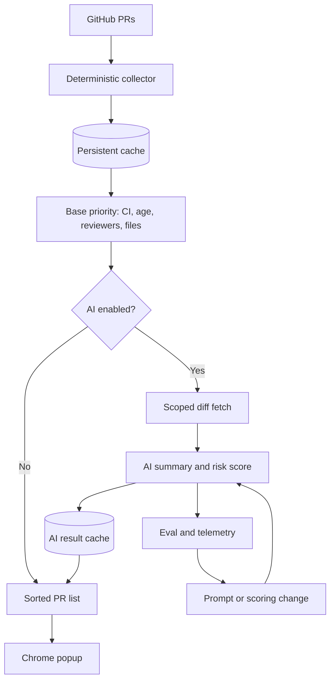

>AI 에이전트가 PR 리뷰를 대신 읽는 순간, 문제는 모델 정확도에서 끝나지 않는다. Chrome Extension MV3의 수명, GitHub 토큰 권한, 스트리밍 경계, 평가 자동화, 장애 격리까지 운영 문제로 이어진다.

모델을 붙이면 기능은 늘어나지만 실패면도 같이 넓어진다. 작은 PR triage 확장 프로그램도 이 사실을 피하지 못했다. 메모리에 둔 상태는 MV3 서비스 워커가 내려가며 사라졌고, 사용자 설정 엔드포인트를 받기 위해 넣은 `<all_urls>` 권한은 GitHub 토큰을 다루는 확장 프로그램에서 곧바로 보안 쟁점이 됐다.

이 사례는 AI Chrome Extension 회고를 넘어, AI 에이전트 기능을 제품에 넣을 때 어디까지 시스템으로 봐야 하는지 보여준다.

## AI PR 리뷰 도구에서 먼저 깨지는 것은 모델이 아니라 상태다

브라우저 확장 프로그램의 배경 작업은 서버 프로세스가 아니다. Manifest V3(MV3) 서비스 워커는 유휴 상태가 되면 종료될 수 있다. 선정 글감의 구현자는 약 30초 비활성 뒤 종료되는 동작 때문에 모듈 레벨 변수에 둔 `cachedPRs`와 `lastRefresh`가 비어 버리는 문제를 겪었다. 개발 중에는 DevTools가 열려 있어 서비스 워커가 살아 있었고, 운영에서는 팝업이 빈 화면을 보여줬다.

이 실패는 AI와 무관해 보이지만, AI 기능일수록 더 크게 드러난다. AI 요약, PR 위험도, 스트리밍 토큰, 사용량 제한, 라이선스 상태는 모두 중간 상태를 만든다. 이 상태를 메모리에 두면 사용자는 가끔만 재현되는 오류를 본다. 운영자는 로그로 설명하기 어려운 빈 화면과 끊긴 응답을 받는다.

해법은 거창하지 않다. 유지해야 하는 상태는 `chrome.storage.local`이나 IndexedDB에 둔다. 시작 시 자동 refresh를 넣는다면 throttle도 같이 넣는다. 선정 글감에서는 서비스 워커 시작마다 `refreshAllData()`를 호출하면 MV3 재시작 빈도 때문에 시간당 수십 번의 의도치 않은 GitHub API 호출이 생길 수 있다고 짚었다. 이것도 같은 문제다. 수명이 불안정한 실행 환경을 안정적인 서버처럼 취급한 대가다.

AI 기능의 첫 설계 질문은 어떤 모델을 쓸지가 아니다.

이 상태는 워커가 죽어도 남아야 하는가다.

## 큰 컨텍스트보다 작은 작업 단위가 AI 에이전트 아키텍처에 맞다

AI 코딩 도구를 오래 붙잡고 있으면 대화가 커진다. 보조 레퍼런스의 개발자는 이 문제를 더 큰 컨텍스트 윈도우로 해결하려 하지 않고, 작업마다 독립된 단위로 나누는 구조로 바꿨다. 긴 대화는 비싸지고 느려지고 관리하기 어려워진다. 모델이 이전 결정을 잊는 문제만 있는 것도 아니다. 이전에 고친 코드를 다시 쓰고, 이미 합의한 구현을 뒤집고, 프로젝트 설명을 다시 요구한다.

PR 리뷰 AI도 같은 함정에 빠진다. 모든 PR, 모든 diff, 모든 코멘트, 모든 저장소 규칙을 한 번에 모델에 넣는 구조는 처음에는 편하다. 운영에서는 비용과 품질을 동시에 갉아먹는다. PR triage라면 먼저 deterministic signal을 분리해야 한다. CI 실패, pending 상태, PR age, 변경 파일 경로, 리뷰어 수 같은 값은 모델 없이 계산된다. 선정 글감에서도 CI 상태와 나이만으로 대부분 사용자의 문제 중 80%를 해결했다고 적었다. AI risk score는 인증 코드처럼 deterministic signal이 놓치기 쉬운 변경을 보강하는 층에 가깝다.

이 순서가 실무적으로 더 안전하다. 기본 정렬은 모델 장애와 무관하게 동작한다. API key가 없거나 Pro 라이선스가 아니어도 PR 목록은 정렬된다. AI 요약이 늦거나 실패해도 사용자는 빈 화면이 아니라 덜 풍부한 화면을 본다.

아키텍처는 이렇게 갈라야 한다.

이 구조에서 AI는 중심 엔진이 아니라 보강 경로다. 실패하면 빠질 수 있어야 한다. 빠졌을 때도 제품의 핵심 가치는 남아야 한다.

## 스트리밍, 라이선스, 권한은 작은 구현 디테일이 아니다

선정 글감에서 가장 실무적인 대목은 SSE(Server-Sent Events) 스트리밍 버그다. `decoder.decode(value)`로 받은 chunk는 이벤트 라인 경계와 맞지 않을 수 있다. `chunk.split('\n')`로 바로 처리하면 중간에 끊긴 라인의 꼬리가 버려지고, 다음 read는 이어붙일 문맥을 잃는다. 사용자는 모델이 가끔 문장을 끊는 것처럼 본다.

버퍼 하나면 고친다. incomplete line을 다음 read까지 들고 가면 된다. 코드 양은 작지만 효과는 크다. AI 스트리밍 오류는 네트워크, 모델, 브라우저 런타임, UI 메시징이 얽혀 보여서 원인 추적이 느리다. 경계 처리를 빼먹으면 간헐적 실패가 된다.

MV3에서는 스트리밍 자체도 설계 대상이다. 댓글에서 제안된 offscreen document는 서비스 워커의 30초 제한을 피하며 fetch를 유지할 수 있다. 단, 한 번에 하나의 offscreen document만 쓸 수 있으므로 concurrent stream에는 작은 queue가 필요하다. 여기서 queue는 미래 확장을 위한 추상화가 아니다. 동시에 두 PR을 요약할 수 있는 UI라면 필요한 장애 격리 장치다.

라이선스 검증도 비슷하다. 로컬 boolean flag는 구현이 쉽지만, 유료 기능에서는 실패 모드가 맞지 않는다. Gumroad API가 내려가거나 회사망에서 outbound가 막힌 사용자를 바로 차단하면 결제한 사용자가 제품을 잃는다. 선정 글감의 구현은 첫 검증 뒤 24시간 캐시하고, 네트워크 실패 시 기존 valid 상태를 인정한다. revoked key와 offline user를 같은 방식으로 처리하지 않으려는 최소한의 설계다.

권한 문제는 더 직접적이다. 사용자 설정 AI endpoint를 받으면 Azure OpenAI, self-hosted LLM, OpenAI-compatible endpoint를 모두 허용해야 한다. 그래서 `<all_urls>`가 편하다. 하지만 GitHub 토큰을 다루는 확장 프로그램에서 `<all_urls>`는 합리적인 의심을 만든다. 편의는 개발자가 얻고, 위험은 사용자가 떠안는다.

도입 조건은 분명하다. 사용자 지정 endpoint가 정말 핵심 기능이면 권한 요청 화면, 토큰 저장 방식, 네트워크 요청 대상 로깅, 최소 권한 fallback을 같이 설계해야 한다. endpoint 선택지가 제품 핵심이 아니라면 allowlist가 더 낫다.

## AI 에이전트 품질은 프롬프트 감상이 아니라 회귀 테스트다

Google Developers의 agent quality flywheel은 이 문제를 잘 짚는다. 프롬프트를 고쳐 세 가지 예제에서 좋아졌다고 해서 제품 품질이 오른 것은 아니다. 사용자가 불평한 한 케이스를 고치며 다른 열 가지를 망가뜨렸는지 확인해야 한다.

Google이 제시한 흐름은 다섯 단계다. 평가 데이터를 준비하고, 추론을 실행하고, adaptive AutoRaters로 채점하고, 실패 클러스터를 분석하고, 목표한 최적화를 적용한다. 이 루프는 synthetic scenario뿐 아니라 production trace에도 걸 수 있다. 핵심은 모델이 그럴듯한 답을 냈는지가 아니라, 사용자 목표를 실제로 맞혔는지를 계속 세는 데 있다.

PR 리뷰 AI에 적용하면 평가 단위가 꽤 구체적이다.

- 인증, 결제, 권한, 마이그레이션 파일 변경을 위험하게 분류했는가
- CI가 초록색이어도 보안 민감 경로 변경을 놓치지 않았는가
- diff가 긴 PR에서 요약이 변경 의도를 왜곡하지 않았는가
- 사용자의 UI 언어와 AI 응답 언어가 일치하는가
- API key가 없을 때 deterministic sorting으로 정상 degrade되는가

선정 글감의 bilingual prompt 문제도 품질 평가에 포함되어야 한다. UI가 스페인어인데 AI 응답이 영어라면 모델 성능 문제가 아니라 제품 품질 문제다. 프롬프트는 화면에 보이지 않아서 빠지기 쉽다. 그래서 더 테스트해야 한다.

Stack Overflow Blog의 논지도 여기서 이어진다. AI coding agent는 코드를 더 쉽게 쓰게 만들지만, production에서 안전하게 굴리는 일은 더 어렵게 만든다. 장애는 코드 한 줄이 아니라 시스템 간 상호작용에서 난다. PR 리뷰 확장 프로그램만 봐도 브라우저 수명 주기, GitHub API, LLM endpoint, 결제 검증, 저장소 권한, 사용자 언어 설정이 한 기능 안에서 만난다. 전통적인 로그 몇 줄만으로는 충분하지 않다.

## 사람 승인 93%는 안전장치가 아니라 피로 신호다

AI 에이전트에 권한을 줄 때 흔한 답은 human-in-the-loop다. 사람이 매번 승인하면 안전하다는 주장이다. Anthropic의 containment 글은 이 낙관을 약하게 만든다. Claude Code에서 사용자가 permission prompt의 약 93%를 승인했다는 telemetry가 있었다. 승인 창이 많아질수록 사람은 덜 읽는다.

이 수치는 PR 리뷰 도구에도 그대로 적용된다. 모든 AI 요청, 모든 endpoint 접근, 모든 토큰 사용을 사용자가 승인하게 만들면 겉보기에는 안전하다. 실제로는 사용자가 승인 기계가 된다. 안전은 클릭 수가 아니라 blast radius 제한에서 온다.

Anthropic은 agent deployment risk를 실패 가능성과 피해 규모로 나눠 본다. 모델 훈련과 safeguard가 실패 가능성을 낮춰도, agent가 더 많은 권한을 얻으면 이론적 피해 규모는 커진다. 그래서 engineering question은 agent를 쓸지 말지가 아니라 피해 반경을 어디서 자를지다.

브라우저 확장 프로그램에서는 containment가 더 구체적이어야 한다.

권한은 endpoint 단위로 좁힌다. 토큰은 필요한 scope만 받는다. AI enrichment는 optional path로 둔다. 캐시는 TTL을 둔다. streaming worker는 queue로 제한한다. 라이선스 검증은 offline grace를 주되, 영구 bypass가 되지 않게 revalidation window를 둔다. telemetry는 prompt 품질이 아니라 실패 유형을 보기 위해 남긴다.

작은 개인 도구나 초기 확장 프로그램에 이 모든 장치를 넣으면 출시가 늦어진다는 반론도 가능하다. 맞는 말이다. 그래서 순서가 중요하다. AI부터 붙이지 말고 deterministic core를 먼저 낸다. 유료 기능을 붙이는 날 license failure mode를 설계한다. 사용자 지정 endpoint를 받는 날 권한과 토큰 저장을 다시 본다. 스트리밍을 넣는 날 chunk boundary 테스트를 넣는다. 필요한 순간에 필요한 안전장치를 넣으면 과한 플랫폼이 되지 않는다.

## 도입 판단: AI를 넣을수록 제품은 더 작게 쪼개야 한다

AI PR 리뷰, AI Chrome Extension, coding agent 도입의 기준은 모델이 멋진 답을 주는지가 아니다. 모델이 실패해도 사용자의 작업 흐름이 남는지가 기준이다.

선정 글감의 교훈은 의외로 보수적이다. AI risk score보다 CI와 age 정렬이 먼저였다. 메모리 캐시보다 persistent storage가 먼저였다. 영어 prompt보다 UI 언어와 맞는 응답이 먼저였다. 사용자 지정 endpoint보다 권한 설명과 격리가 먼저였다.

AI 에이전트 기능은 제품의 중심에 둘수록 위험하다. 작고 격리된 경로에 둘수록 쓸모가 커진다. deterministic system이 바닥을 만들고, AI가 빈틈을 메우고, eval이 회귀를 잡고, containment가 피해 반경을 자른다.

처음의 질문으로 돌아가면 답은 간단하다. AI가 PR 리뷰를 대신 읽어도 되는가. 된다. 단, AI가 멈췄을 때도 PR 목록은 정렬되어야 하고, 서비스 워커가 죽어도 상태는 남아야 하며, 사용자가 93%의 승인 버튼을 누르지 않아도 피해 반경은 이미 제한되어 있어야 한다.

그 조건을 만족하지 못한 AI 기능은 아직 기능이 아니다. 데모다.

## 참고 자료

- [선정 글감] [5 mistakes I made building an AI Chrome extension — and the readers who caught them](https://dev.to/projekta2/i-built-a-chrome-extension-used-daily-for-pr-review-5-decisions-id-make-differently-4o64) — DEV Community
- [관련] [I stopped fighting AI context windows and changed the architecture instead.](https://dev.to/dhamodaran_vk_a5a7f2781f/i-stopped-fighting-ai-context-windows-and-changed-the-architecture-instead-2a4k) — DEV Community
- [관련] [Code isn’t the only thing causing your production failures](https://stackoverflow.blog/2026/06/25/code-isnt-causing-your-production-failures/) — Stack Overflow Blog
- [관련] [Driving the Agent Quality Flywheel from Your Coding Agent](https://developers.googleblog.com/driving-the-agent-quality-flywheel-from-your-coding-agent/) — Google Developers
- [관련] [How we contain Claude across products](https://www.anthropic.com/engineering/how-we-contain-claude) — Anthropic Engineering