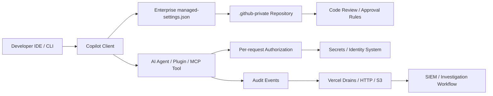

> GitHub Copilot enterprise managed-settings.json의 GA는 AI 코딩 도구 기능 추가 소식이 아니다. 개발자 노트북 안에서 돌아가던 에이전트 보안을 조직 정책의 영역으로 끌어올렸다는 신호다.

AI 코딩 도구 논쟁은 생산성에서 통제로 옮겨갔다. 누가 어떤 모델을 쓰는지, 어떤 플러그인을 붙이는지, 권한 우회 모드를 켤 수 있는지, 그 결정이 개인 설정 파일에 남아도 되는지가 쟁점이다.

## GitHub Copilot 정책 파일은 왜 개발자 경험 문제가 됐나

GitHub Copilot의 enterprise managed-settings.json은 GitHub Enterprise Cloud 관리자가 VS Code와 Copilot CLI 동작을 JSON 파일 하나로 강제하는 장치다. 적용 대상은 해당 엔터프라이즈나 조직에서 발급한 Copilot Business, Copilot Enterprise 좌석이다. 사용자가 로컬에 둔 파일 기반 설정보다 서버 측 관리 설정이 우선한다.

GA 시점에 문서화된 키는 다섯 개다. 추가 플러그인 마켓플레이스의 신뢰 범위, 활성 플러그인 목록, 알려진 마켓플레이스 목록의 엄격 적용, Copilot CLI와 VS Code 확장의 권한 우회 모드 차단, 사용 가능한 모델 제어다.

개발자에게는 편의 설정이 줄어드는 변화다. 플랫폼 팀에는 방치된 실행면이 줄어드는 변화다. 같은 조치가 한쪽에는 마찰이고, 다른 한쪽에는 통제면 축소다.

이 변화가 논쟁이 되는 이유도 여기에 있다. AI 코딩 도구는 IDE 확장으로 설치되지만, 실제로는 코드 읽기, 명령 실행, 플러그인 호출, 모델 선택, 외부 도구 연결을 묶는 실행 환경이 됐다. 조직은 이제 에디터 설정을 개인 취향으로만 볼 수 없다.

## 개인 설정과 엔터프라이즈 AI 거버넌스의 경계

managed-settings.json은 `copilot/managed-settings.json` 경로로 지정된 조직의 `.github-private` 저장소 안에 둔다. 기존 사용자를 위한 호환 경로로 `.github/copilot/settings.json`도 언급된다. 클라이언트는 인증할 때 서버에서 파일을 가져오고, 메모리에 보관한 뒤 시간마다 새로고침한다.

이 구조의 장점은 분명하다. AI 정책이 관리 콘솔 안쪽의 클릭 기록으로만 남지 않는다. 저장소에 남고, 리뷰를 받고, 승인 규칙을 타고, 변경 이력을 남길 수 있다. 정책을 코드처럼 다루는 팀에는 익숙한 운영 모델이다.

문제도 같은 자리에서 나온다. `.github-private` 저장소에 넓은 우회 권한이 있으면 Copilot 정책에도 넓은 우회 권한이 생긴다. 조직 설정을 코드로 옮겼다고 자동으로 안전해지지는 않는다. 리뷰, 승인, 감사 로그, 배포 절차가 그 저장소에 제대로 걸렸을 때만 안전해진다.

Samsung Electronics가 ChatGPT Enterprise와 Codex를 한국 임직원 및 전 세계 DX 부문 임직원에게 배포한다고 밝힌 사례는 규모의 방향을 보여준다. AI 도구는 일부 개발자 실험이 아니라 R&D, 제조, 마케팅, 사무 기능까지 들어가는 사내 플랫폼이 되고 있다. 이 규모에서는 개인별 선의보다 중앙 정책, 접근 제어, 감사 가능성이 먼저다.

## AI 에이전트 보안은 모델 선택보다 권한 범위가 먼저다

기업이 AI 코딩 도구를 통제할 때는 모델 이름부터 보는 경우가 많다. 어떤 모델이 더 정확한지, 어떤 모델이 더 싸게 도는지, 어떤 모델을 막을지부터 정한다. 그러나 운영 리스크는 모델 선택보다 권한 범위에서 먼저 터진다.

HashiCorp Vault의 AI agent security 공개 프리뷰는 이 문제를 다른 각도에서 다룬다. Vault는 에이전트에 넓고 오래가는 권한을 주는 대신, 요청마다 필요한 권한을 구조화해 평가하는 흐름을 강조한다. OAuth 2.0 Rich Authorization Requests, RFC 9396의 `authorization_details` claim을 기본 요구 사항으로 삼는 방향이다.

Copilot managed-settings.json이 클라이언트 정책의 울타리라면, Vault의 접근 방식은 런타임 권한의 울타리다. 하나는 어떤 도구와 모델을 쓸 수 있는지 제한한다. 다른 하나는 에이전트가 실제 요청에서 무엇을 할 수 있는지 제한한다.

둘 중 하나만으로는 부족하다.

이 다이어그램에서 핵심 경계는 세 곳이다. 첫째는 IDE와 CLI의 정책 경계다. 둘째는 에이전트가 비밀과 내부 시스템에 접근하는 권한 경계다. 셋째는 나중에 사고를 재구성할 수 있는 감사 경계다.

GitHub의 파일은 첫 번째 경계를 다룬다. HashiCorp Vault는 두 번째 경계를 다룬다. Vercel의 Audit Log Drains는 세 번째 경계를 보강한다.

## 감사 로그가 없으면 AI 정책은 선언으로 끝난다

Vercel은 Audit Logs가 400개 이상의 팀 활동 이벤트를 포착하고, Vercel Drains를 통해 HTTP 엔드포인트나 Amazon S3로 내보낼 수 있다고 밝혔다. Enterprise 팀 대상이며 표준 Drains 과금은 GB당 0.50달러로 제시됐다. 기존 Custom SIEM Log Streaming을 Drains 기반 흐름으로 대체하는 구조다.

이 사례가 Copilot 정책과 연결되는 지점은 제품명이 아니다. 필요한 운영 형태가 같다. 정책 변경, 팀 활동, 배포 설정, 접근 제어 이벤트가 중앙 로그로 흘러가야 보안 리뷰와 조사 워크플로가 성립한다.

AI 에이전트 도입에서 감사 로그는 사후 장식이 아니다. 권한을 줄였는지, 누가 우회했는지, 어느 시점에 정책이 바뀌었는지, 사고 당시 클라이언트가 새 정책을 받았는지를 확인하는 증거다.

managed-settings.json에는 시간 단위 새로고침이라는 현실적 지연이 있다. 관리자가 09:00에 권한 우회 모드를 막아도, 긴 VS Code 세션 안의 사용자가 10:00 전까지 새 정책을 받지 못할 수 있다. 인증 이벤트가 새 설정을 당겨오지만 모든 개발자가 즉시 재로그인한다고 볼 수는 없다.

그래서 사고 대응용 통제와 기본 위생 통제를 분리해야 한다. managed-settings.json은 기본 위생 통제에 강하다. 즉시 차단이 필요한 사고 대응에는 세션 무효화, 네트워크 차단, 비밀 회전, 도구 토큰 폐기 같은 별도 절차가 필요하다.

## Copilot managed-settings.json 도입 전에 봐야 할 조건

첫 조건은 라이선스 경계다. 이 설정은 해당 엔터프라이즈나 조직에서 발급한 Copilot 좌석에 적용된다. 같은 노트북에서 개인 Copilot 좌석을 쓰거나, 다른 코딩 에이전트와 MCP 서버를 별도로 설치했다면 그 영역은 이 파일 밖에 있다.

둘째 조건은 저장소 거버넌스다. `.github-private` 저장소가 일반 애플리케이션 저장소보다 느슨하게 관리되면 정책 파일은 약한 고리가 된다. 최소한 브랜치 보호, 리뷰 필수화, 관리자 우회 제한, 변경 알림, 감사 로그 수집이 같은 방향으로 맞아야 한다.

셋째 조건은 개발자 예외 처리다. 플러그인 마켓플레이스를 엄격히 제한하면 공급망 리스크는 줄지만, 필요한 도구가 막히는 순간 우회 욕구가 커진다. 예외 요청 경로가 없으면 통제는 문서 밖에서 깨진다. 허용 목록은 짧아야 하고, 추가 절차는 빨라야 한다.

넷째 조건은 권한 시스템과의 연결이다. 모델과 플러그인을 제한해도 에이전트가 장기 토큰, 넓은 클라우드 권한, 공유 비밀을 물고 있으면 공격면은 그대로 남는다. Vault가 말하는 요청 단위 권한 부여 방식은 이 지점에서 현실적인 보완책이다.

다섯째 조건은 로그의 보존 위치다. Vercel Drains처럼 이벤트를 HTTP 엔드포인트나 S3로 흘려보내는 구조는 조사 가능성을 높인다. 다만 로그를 모으는 순간 개인정보, 코드 경로, 팀 활동 메타데이터를 다루게 된다. 보존 기간, 접근 권한, 검색 권한, 삭제 정책을 먼저 정해야 한다.

## AI 코딩 도구의 승부는 허용이 아니라 운영에서 갈린다

이 변화는 Copilot을 켤지 말지의 문제가 아니다. 기업은 이미 AI 도구를 켜고 있다. Samsung 사례처럼 대규모 배포가 시작되면 질문은 허용 여부에서 운영 방식으로 바뀐다.

느슨한 조직은 도구를 허용하고 사고를 개인 탓으로 돌린다. 단단한 조직은 도구를 허용하되 정책 저장소, 요청 단위 권한, 감사 로그 배출 경로를 같이 만든다.

managed-settings.json은 그중 작은 파일 하나다. 하지만 위치가 중요하다. IDE와 CLI, 모델과 플러그인, 개인 설정과 엔터프라이즈 정책이 만나는 지점에 있다. 이 파일을 단순 설정으로 보면 도입 효과는 작다. 정책 저장소, 권한 시스템, 감사 파이프라인의 첫 관문으로 보면 의미가 커진다.

첫 문단의 긴장은 여기서 회수된다. AI 코딩 도구는 개발자 노트북 안의 생산성 앱에 머물지 않는다. 조직의 권한 체계와 감사 체계에 붙는 실행면이다. managed-settings.json을 도입할 팀은 다섯 개 키보다 먼저 책임선을 정해야 한다. 이 파일을 바꾸는 사람, 검토하는 사람, 늦게 반영됐을 때 대응하는 사람이 필요하다.

그 세 책임선이 정해져 있다면 켜도 된다. 정해져 있지 않다면 설정 파일보다 운영 절차가 먼저다.

## 참고 자료

- [선정 글감] [GitHub Copilot's enterprise managed-settings.json is now GA](https://dev.to/leobaniak/github-copilots-enterprise-managed-settingsjson-is-now-ga-f84) — DEV Community
- [관련] [Expanded Audit Log coverage, now delivered through Vercel Drains](https://vercel.com/changelog/expanded-audit-log-coverage-now-delivered-through-vercel-drains) — Vercel Blog
- [관련] [Samsung Electronics brings ChatGPT and Codex to employees](https://openai.com/index/samsung-electronics-chatgpt-codex-deployment) — OpenAI Blog
- [관련] [Advancing AI agent security in Vault](https://www.hashicorp.com/blog/advancing-ai-agent-security-in-vault) — HashiCorp Blog