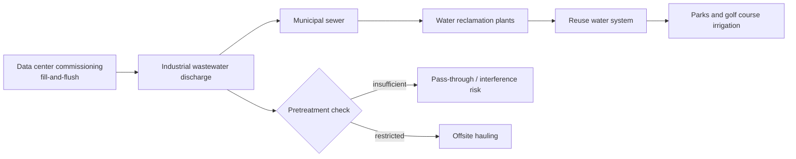

닫힌 냉각 루프(Closed-loop cooling)는 Meta 데이터센터 폐수 논쟁에서 방패처럼 쓰였다. 물을 계속 증발시키는 대신 한 번 채운 뒤 순환시킨다는 설명은 그럴듯하다. 그런데 와이오밍주 샤이엔(Cheyenne)에서는 바로 그 한 번 채우고 씻어내는 과정이 도시 재생수 시스템을 멈춰 세웠다.

## Meta 데이터센터 폐수 사건의 핵심은 물 사용량이 아니다

확인된 사실부터 좁혀보자. 2026년 7월 2일, 샤이엔 공공유틸리티위원회(BOPU)는 데이터센터의 fill-and-flush와 폐쇄형 냉각 시스템 관련 산업폐수를 더 받지 않겠다고 밝혔다. Tom’s Hardware가 2026년 7월 4일 보도한 내용에 따르면, 오염원은 Meta 샤이엔 캠퍼스 공사에 참여한 법인 Goat Systems LLC로 추적됐다.

문제가 된 물질은 금속 저항성 박테리아인 Cupriavidus gilardii다. BOPU는 이 박테리아가 도시의 두 재생수 처리 시설 운영에 간섭했고, 재사용수 시스템을 수개월 동안 청소와 조사 상태로 만들었다고 설명했다. Goat Systems의 해당 배출 권한은 2026년 3월 24일 취소됐다. 이후 조치는 Meta 한 곳을 넘어, 도시 서비스에 연결된 데이터센터 전반의 관련 배출 중단으로 확대됐다.

이 사건을 공공 식수 오염으로 단정하면 틀린다. Meta 측은 도시가 발견한 물질이 공공 식수가 아니라 폐수 시스템에서 나왔고, 일반 시공사 Fortis가 즉시 산업폐수 배출을 멈춘 뒤 외부 반출을 시작했다고 밝혔다. 독립 환경 전문가의 자체 수질 검사에서는 해당 물질이 발견되지 않았다는 설명도 덧붙였다.

그 해명만으로 논쟁이 끝나지는 않는다. 샤이엔의 재생수는 공원, 골프장, 녹지 관개에 쓰인다. BOPU는 박테리아 자체뿐 아니라 글리콜(glycol)과 다른 화학물질이 시 처리장이 처리하도록 설계되지 않은 형태로 들어올 수 있다는 점을 문제 삼았다. 이번 쟁점은 마실 물 공포가 아니라, 데이터센터 시운전 폐수가 도시 인프라의 어느 경계까지 들어올 수 있는가에 가깝다.

## 왜 closed-loop cooling 논쟁으로 번졌나

폐쇄형 냉각은 계속 물을 버리는 방식보다 낫다. 이 점을 흐리면 논쟁이 엉뚱해진다. Microsoft와 Nvidia 같은 회사들이 폐쇄형 액체 냉각을 물 사용 절감 수단으로 설명하는 이유도 여기에 있다. 한 번 채운 냉각수를 순환시키면 증발식 냉각보다 상시 물 소비를 줄일 수 있다.

샤이엔 사건이 드러낸 문제는 그 다음 단계다. 닫힌 루프는 운영 중에는 닫혀 있을 수 있다. 하지만 건설과 시운전 단계에서는 열려 있다.

fill-and-flush는 냉각 배관에 물을 채우고, 이물질을 씻어내고, 실제 운전에 들어가기 전 배출하는 과정이다. 이 배출수는 아직 닫힌 루프 안에 갇힌 냉각수가 아니다. 도시 하수나 산업폐수 경로로 나가는 순간, 문제는 데이터센터 내부 설계를 넘어 지역 공공 인프라로 옮겨간다.

커뮤니티 반응이 갈린 이유도 이 지점에 있다. Hacker News 토론은 단순한 Meta 비난으로만 흐르지 않았다. 한쪽은 데이터센터에도 광산업 수준의 엄격한 물 관리가 필요하며, 비용이 늘더라도 사업자가 감수해야 한다고 봤다. 다른 쪽은 박테리아가 발견됐고 대응이 이뤄졌다는 점에서 즉각적인 재난으로 부풀릴 사안은 아니라고 봤다.

두 주장 중 정책 판단에 더 중요한 쪽은 배출 경로다. 사고가 감지됐다는 사실은 시스템이 일부 작동했다는 뜻이지, 배출 경로 설계가 충분했다는 뜻은 아니다.

## 지역사회가 불편해한 것은 박테리아 이름이 아니다

Cupriavidus gilardii라는 이름이 낯설어서 사람들이 반응한 게 아니다. 불편함의 중심에는 권한과 이익의 비대칭이 있다. 데이터센터는 대규모 전력과 물 인프라를 지역에 요구한다. 지역은 세수와 일자리, 개발 기대를 받는다. 그런데 문제가 생기면 먼저 영향을 받는 쪽은 도시 처리장, 공원 관개 시스템, 지방정부 신뢰다.

Cowboy State Daily 보도에서 샤이엔 시의원 Pete Laybourn은 Meta 데이터센터가 오염원으로 확인된 사실을 매우 불쾌한 surprise로 표현했다. 샤이엔 시장 Patrick Collins도 실망스럽다고 말했다. 이 반응은 기술 설명만으로 지워지지 않는다. 주민과 지방정부 입장에서는 대규모 민간 프로젝트가 공공 시스템에 남긴 리스크가 뒤늦게 공개된 셈이다.

그렇다고 데이터센터를 모두 같은 방식으로 몰아붙이는 것도 게으른 판단이다. 폐쇄형 냉각은 상시 물 소비를 줄이는 실질적 개선일 수 있다. 시운전 단계의 폐수 문제를 이유로 폐쇄형 냉각 자체를 실패로 몰면, 더 나쁜 냉각 방식으로 돌아가는 결론이 나온다.

이번 사건의 교훈은 데이터센터 반대가 아니다. 공공 시스템과 만나는 모든 시운전 배출을 제품 설명서 밖의 운영 리스크로 다뤄야 한다는 것이다.

## 데이터센터 허가에서 확인해야 할 질문이 바뀐다

지방정부와 사업자가 봐야 할 질문은 물 사용량 총량 하나로 끝나지 않는다. 몇 갤런을 쓰느냐보다 어떤 단계에서, 어떤 성분으로, 어느 처리 경로에, 누가 책임지고 내보내느냐가 더 날카로운 질문이다.

실무적으로는 네 가지 확인이 필요하다.

- 시운전 fill-and-flush 폐수가 일반 하수로 들어가는지, 산업폐수 별도 경로로 반출되는지
- 글리콜, 부식방지제, 살균제, 금속 저항성 미생물에 대한 사전 검사 항목이 있는지
- 배출 권한 취소나 중단 시 공사 일정과 비용을 누가 부담하는지
- 재생수 사용처가 관개, 공원, 골프장처럼 에어로졸 노출 가능성이 있는 곳인지

이 질문들은 반기업 정서가 아니다. 데이터센터가 공공 인프라에 기대어 작동한다면, 공공 인프라가 이해할 수 있는 단위로 위험을 설명해야 한다. 클라우드 사업자는 물을 덜 쓴다고 말했고, 도시는 처리장이 감당할 수 있는 물인지 물었다. 이번에는 두 질문이 서로 다른 답을 향하고 있었다.

샤이엔 사건은 AI 데이터센터 시대의 물 논쟁을 한 단계 좁혔다. 이제 쟁점은 데이터센터가 물을 많이 쓰는지에 머물지 않는다. 물을 적게 쓰는 설계라고 해도, 한 번 밖으로 나가는 폐수는 지역사회가 검증할 수 있어야 한다. 닫힌 루프가 신뢰까지 닫아주지는 않는다.

## 참고 자료

- [선정 글감] [Meta data center water discharges suspended for contaminating water supply](https://www.tomshardware.com/tech-industry/data-centers/cheyenne-suspends-data-center-fill-and-flush-and-closed-loop-discharges-after-meta-contractor-contaminated-its-reuse-water-system) - Tom’s Hardware
- [관련] [Cheyenne Won’t Take Data Center Wastewater After Meta Contractor Contaminated System](https://cowboystatedaily.com/2026/07/02/cheyenne-wont-take-data-center-wastewater-after-meta-company-contaminated-system/) - Cowboy State Daily
- [관련] [Meta data center water discharges suspended for contaminating water supply](https://news.ycombinator.com/item?id=48786782) - Hacker News