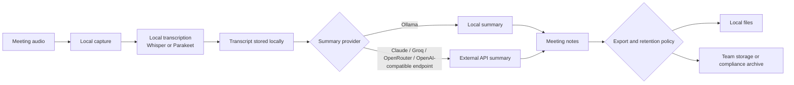

회의 AI의 문제는 녹음 버튼이 아니라 저장 위치다. Meetily는 GitHub Trending에서 15,544개 스타와 하루 718개 스타를 기록한 Rust 기반 오픈소스 회의 노트 도구다. 사람들이 반응한 이유는 기능이 새로워서가 아니다. 회의 음성, 발언자, 요약문이 클라우드 벤더의 서버로 넘어가지 않는다는 점이 현재 회의록 도구 시장의 불편한 지점을 건드렸기 때문이다.

## 회의록은 편의 기능이 아니라 데이터 반출 경로다

Meetily가 내건 핵심 문장은 단순하다. 회의를 캡처하고, 실시간으로 전사하고, 요약까지 만들지만 데이터는 로컬 머신이나 사용자가 통제하는 인프라 안에 남긴다는 것이다. 대상 플랫폼은 macOS, Windows, Linux이며, 앱은 Tauri 기반의 단일 데스크톱 애플리케이션 구조를 쓴다. Rust 백엔드가 오디오 캡처와 전사 같은 핵심 처리를 맡고, Next.js 프런트엔드가 화면을 담당한다.

확인된 범위는 여기까지다. 오픈소스 Community Edition은 로컬 전사, AI 요약, 핵심 기능을 제공한다고 설명되어 있다. 전사 모델은 Whisper 또는 Parakeet을 사용하고, 요약은 Ollama 같은 로컬 모델을 권장한다. Claude, Groq, OpenRouter, OpenAI 호환 엔드포인트도 선택할 수 있다. 이 선택지가 곧 위험의 경계다. 전사는 로컬이어도 요약 제공자를 외부 API로 고르면 회의 텍스트가 다시 밖으로 나간다.

Meetily README는 IBM 2024 기준 평균 데이터 침해 비용 440만 달러, 2025년까지 GDPR 벌금 58억8000만 유로, 올해 캘리포니아 불법 녹음 사건 400건 이상이라는 수치를 제시한다. 이 글에서는 이 수치를 프로젝트가 제시한 위험 프레이밍으로만 다룬다. 숫자의 독립 검증보다 더 확실한 사실은 따로 있다. 회의록 도구는 음성, 화자, 조직 내부 의사결정, 고객 정보, 법무 리스크를 한꺼번에 모은다.

회의록 자동화는 노트 앱이 아니다. 조직의 기억을 수집하는 파이프라인이다.

## 왜 GitHub 커뮤니티는 로컬 AI 회의록에 반응했나

Meetily가 받은 관심은 오픈소스와 프라이버시라는 두 단어만으로 설명되지 않는다. 개발자 커뮤니티가 민감하게 보는 지점은 권한의 방향이다. 클라우드 회의록 도구에서는 사용자가 회의에 봇을 초대하거나 녹음 권한을 넘기고, 서비스는 전사와 요약을 돌려준다. 사용자는 결과를 얻고, 서비스는 원천 데이터를 만진다.

로컬 퍼스트(Local-first) 방식은 그 방향을 뒤집는다. 모델과 파일이 사용자 장비 또는 내부 인프라에 있고, 외부 API는 선택 사항이 된다. 비용 구조도 달라진다. 매 회의마다 클라우드 전사 API와 요약 API를 호출하는 대신, 로컬 GPU나 CPU 비용을 감수한다. Meetily는 Apple Silicon의 Metal/CoreML, Windows와 Linux의 NVIDIA CUDA, AMD/Intel Vulkan 가속을 언급한다. 성능 문제를 장비 쪽으로 당겨오는 설계다.

불편한 반응도 여기서 나온다. 로컬 처리는 프라이버시를 주지만 운영 부담을 남긴다. 모델 다운로드, GPU 가속, 오디오 장치 권한, 마이크와 시스템 오디오 동시 캡처, 회의 플랫폼별 호환성은 사용자의 책임이 된다. 팀 단위 배포라면 더 복잡하다. 설치 파일 배포, 버전 고정, 로그 위치, 녹음 파일 보존 정책, 삭제 정책까지 정해야 한다.

기대와 부담은 분명하다. 민감한 회의가 외부 서버에 저장되지 않는 대신, 편의성 일부를 운영 책임으로 치른다.

## Community Edition과 PRO 사이에 숨어 있는 판단 비용

Meetily의 논쟁 지점은 프라이버시만이 아니다. 오픈소스 제품이 커뮤니티 관심을 받은 뒤 유료 PRO를 어떻게 배치하느냐도 커뮤니티가 보는 지점이다. README는 Community Edition이 무료 오픈소스로 유지된다고 밝히면서, PRO에는 향상된 정확도, 고급 내보내기, 커스텀 요약 워크플로, 자동 회의 감지, 팀용 기능이 들어간다고 설명한다. 발화자 분리(Speaker diarization)는 PRO에 mid-June 예정이라고 적혀 있다.

여기서 실무 판단이 갈린다. 개인 사용자는 로컬 전사와 기본 요약만으로 충분할 수 있다. 조직은 다르다. 회의록 품질, 발화자 식별, PDF/DOCX/Markdown 내보내기, 캘린더 연동, 감사 추적, 팀 배포는 실제 운영에서 빠르게 필수 기능이 된다. 이런 기능이 유료판에 묶이면, 오픈소스 도입은 비용 회피가 아니라 구매 전 검증 단계가 된다.

이 구조 자체가 문제라는 뜻은 아니다. 오픈소스 프로젝트가 지속되려면 수익 모델이 필요하다. 다만 프라이버시를 이유로 도입하려는 팀은 PRO나 Enterprise의 닫힌 코드, 별도 코드베이스, 지원 정책까지 함께 검토해야 한다. README는 PRO가 Community Edition과 다른 코드베이스에 기반한다고 설명한다. 그러면 보안 검토 범위도 달라진다. Community Edition을 빌드해 확인한 결과가 PRO의 동작을 보증하지 않는다.

프라이버시 도구를 고를 때는 라이선스보다 데이터 흐름을 먼저 봐야 한다. 오픈소스라는 단어가 모든 배포판의 투명성을 자동으로 보장하지 않는다.

이 다이어그램에서 가장 위험한 지점은 전사 모델 이름이 아니다. 요약 제공자 선택과 내보내기 이후의 보관 위치다. 로컬 앱도 외부 API를 붙이는 순간 데이터 반출 경로가 생긴다. 팀 저장소로 내보내면 접근권한과 보존기간 문제가 따라온다.

## 로컬이면 안전하다는 말은 반만 맞다

Meetily 같은 도구는 클라우드 회의록 서비스의 가장 큰 약점을 줄인다. 회의 데이터가 기본값으로 외부 서비스에 쌓이지 않기 때문이다. 다만 로컬 처리는 보안 리스크를 없애지 않는다. 리스크의 소유자를 바꾼다.

첫째, 장비 보안이 회의 보안이 된다. 노트북 디스크 암호화, OS 계정 권한, 백업 경로, 로컬 로그 위치가 그대로 통제 지점이 된다. 둘째, 모델과 의존성의 출처를 봐야 한다. Meetily는 Whisper.cpp, Screenpipe, transcribe-rs에서 일부 코드를 빌려왔다고 밝히고, NVIDIA Parakeet 모델과 ONNX 변환도 언급한다. 이 의존성 체인은 정상적인 오픈소스 생태계의 일부지만, 기업 도입에서는 공급망 검토 대상이다.

셋째, 녹음 동의와 보존 정책은 앱이 대신 해결하지 않는다. 회의 참가자에게 녹음 사실을 알리는 방식, 고객 정보가 섞인 회의의 저장 기간, 삭제 요청 처리, 법무 보존 의무는 제품 선택 밖의 문제다. 로컬 앱을 쓰면 클라우드 벤더의 약관 리스크는 줄어든다. 대신 조직 내부 정책의 빈틈이 더 선명해진다.

도입 전 확인할 항목은 많지 않다. 적어도 아래 네 가지는 빼면 안 된다.

- 전사와 요약이 모두 로컬인지, 요약 단계에서 외부 API가 호출되는지 확인한다.
- 녹음 파일, 전사문, 요약문, 로그의 저장 위치와 삭제 방식을 문서화한다.
- Community Edition과 PRO, Enterprise의 코드베이스와 배포 방식 차이를 분리해 검토한다.
- 발화자 분리, 자동 회의 참여, 캘린더 연동처럼 권한이 커지는 기능은 별도 승인 대상으로 둔다.

이 정도만 해도 로컬 회의록 도구 도입의 절반은 걸러진다. 기능 비교표보다 데이터 흐름표가 먼저다.

## 회의 AI의 다음 경쟁력은 정확도가 아니라 통제 가능성이다

Meetily가 화제가 된 이유는 회의록 시장에 새 기능을 추가해서가 아니다. 전사, 요약, 발화자 분리, 캘린더 연동은 이미 낯선 기능이 아니다. 반응의 핵심은 사용자가 묻기 시작한 질문이다. 내 회의 데이터가 어디에 남는가.

클라우드 도구는 편의성을 제공하고, 사용자는 통제권을 내준다. 로컬 도구는 통제권을 돌려주는 대신 운영 책임을 요구한다. 이 교환을 이해하지 못하면 로컬 퍼스트 방식도 또 다른 블랙박스가 된다.

Meetily는 모든 팀의 답이 아니다. 하지만 회의록 도구를 고르는 기준을 바꿔 놓는 사례로는 충분하다. 이제 회의록 도구를 볼 때 첫 질문은 정확도가 아니다. 데이터가 회의실을 떠나는 순간이 어디인지부터 봐야 한다. 그 선을 그릴 수 없는 도구라면, 아무리 똑똑해도 조직의 기억을 맡기기 어렵다.

## 참고 자료

- [선정 글감] [#6 Zackriya-Solutions/meetily](https://github.com/Zackriya-Solutions/meetily) — GitHub Trending