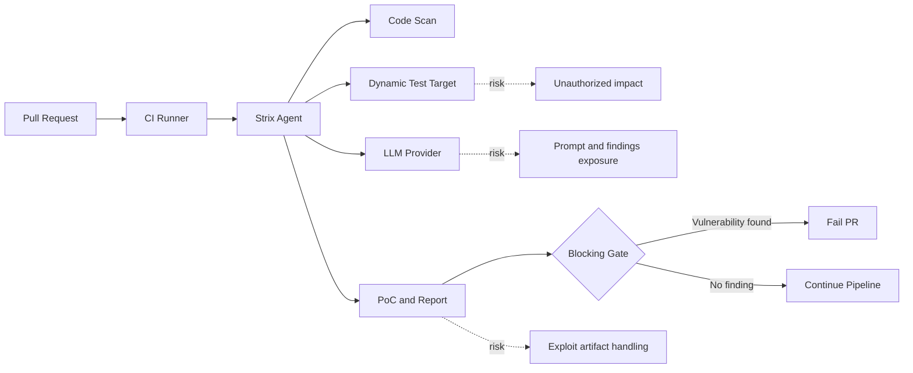

Strix는 스스로를 오픈소스 AI 침투 테스트 도구라고 소개하는 데서 그치지 않는다. 에이전트가 정찰하고, 익스플로잇을 만들고, 실제 PoC로 취약점을 검증하며, GitHub Actions에서 풀 리퀘스트를 막는 흐름까지 제시한다. 2026년 7월 5일 기준 제공 자료에서 확인되는 지표는 GitHub Trending 4위, 35,849 stars, 당일 1,910 stars다. 관심이 붙은 이유는 분명하다. 보안 검토의 병목을 줄이려는 기대와, 공격 도구를 CI에 넣는 불편함이 같은 문장 안에 들어 있다.

## AI 침투 테스트 도구가 CI 게이트가 될 때 생기는 긴장

Strix가 내세우는 범위는 단순한 정적 분석(Static Analysis)이 아니다. README 기준으로 Strix는 자율형 AI 침투 테스트 에이전트가 실제 해커처럼 동작한다고 설명한다. 정찰, 익스플로잇, 검증을 포함한 풀 펜테스트 도구 모음, 여러 에이전트의 협업, 동적 코드 실행, 작동하는 PoC, 자동 수정, 보고서 생성을 한 흐름으로 묶는다.

확인된 사실은 여기까지다. Strix는 Python 기반 오픈소스 프로젝트이고, Docker가 필요하며, OpenAI·Anthropic·Google 등 지원 제공자의 LLM API 키를 받는다. 로컬 코드베이스, GitHub 저장소, 배포된 웹 애플리케이션을 대상으로 실행할 수 있고, `strix -n` 비대화형 모드에서는 취약점이 발견되면 0이 아닌 종료 코드로 끝난다고 설명한다. GitHub Actions 예시는 풀 리퀘스트마다 설치 스크립트를 실행하고, 빠른 스캔을 돌려 보안 문제가 있으면 병합 전 단계에서 막는 방식이다.

추정은 따로 봐야 한다. 35,849 stars와 하루 1,910 stars는 관심의 크기를 보여주는 지표이지, 검증 품질을 보증하지 않는다. README의 “false positives를 줄인다”, “pentest를 몇 주가 아니라 몇 시간으로 줄인다”, “one-click autofix” 같은 문장은 제품 주장이다. 실제 조직의 코드베이스, 인증 흐름, 비즈니스 로직, 사내 보안 정책에서 같은 성능이 나온다는 근거로 읽으면 안 된다.

이 차이가 이번 이슈의 핵심이다. Strix가 흥미로운 이유는 AI가 보안 도구에 들어갔기 때문만은 아니다. 공격 행위를 흉내 내는 도구가 개발자의 기본 파이프라인으로 들어오려 하기 때문이다.

## 개발자는 속도를 샀고, 보안팀은 권한 문제를 받았다

Strix가 개발자에게 제시하는 가치는 세 가지다. 취약점 후보가 아니라 재현 가능한 PoC를 준다는 것, 수정 가이드를 넘어 패치와 PR까지 만든다는 것, CI/CD에 붙여 배포 전에 차단한다는 것이다. 이 셋이 맞물리면 기존 보안 업무의 위치가 바뀐다.

기존 SAST는 코드 패턴을 보고 경고를 낸다. DAST는 실행 중인 애플리케이션을 때려 본다. 침투 테스트는 사람이 범위와 규칙을 정하고, 실제 공격 흐름을 조합한다. Strix는 이 경계를 흐린다. 정적·동적 분석, 브라우저 자동화, HTTP 프록시, 셸 실행, 커스텀 Python 익스플로잇 런타임, OSINT, OWASP Top 10 분류를 한 도구 안에 넣는다.

여기서 기대와 불편함이 동시에 생긴다.

개발자 입장에서는 PR 단위로 빠르게 돌고, 바뀐 파일 범위로 스코프를 좁히며, 실패 시 병합을 막는 구조가 매력적이다. 특히 README의 GitHub Actions 예시는 `fetch-depth: 0`으로 전체 히스토리를 체크아웃하고, quick scan에서 변경 파일 중심으로 보는 방식을 제시한다. 운영팀 입장에서는 더 까다롭다. 도구가 애플리케이션을 실행하고, 웹 요청을 조작하고, 셸을 쓰고, PoC를 생성한다면 권한 범위가 곧 리스크 범위다.

커뮤니티가 갈릴 지점도 여기다. 한쪽은 보안 테스트를 개발 주기에 붙이는 게 맞다고 본다. 다른 쪽은 공격 자동화 도구를 기본 CI 권한으로 돌려도 되는지부터 묻는다. 둘 다 필요한 질문이지만 우선순위는 분명하다. 이 도구를 평가할 때 첫 질문은 모델 성능이 아니라 실행 권한이어야 한다.

## Strix를 어디에 붙이면 위험해지는가

Strix README에는 “소유하거나 허가받은 앱만 테스트하라”는 경고가 있다. 이 경고는 법적 면책 문구로만 읽으면 부족하다. 실제 운영에서는 세 가지 경계가 필요하다.

첫째, 대상 범위다. 로컬 저장소, 외부 웹 애플리케이션, GitHub 저장소 URL, 여러 타깃을 모두 받을 수 있다는 점은 유연성이지만 동시에 오남용 가능성이다. CI에서 실행한다면 대상은 PR의 코드와 허가된 테스트 환경으로 좁혀야 한다. 운영 도메인에 직접 블랙박스 테스트를 거는 방식은 별도 승인과 속도 제한, 계정 격리가 있어야 한다.

둘째, 비밀 정보다. README 기준 Strix는 LLM API 키, 선택적으로 검색용 API 키, 로컬 모델 엔드포인트, provider 설정을 사용한다. 설정은 `~/.strix/cli-config.json`에 저장된다고 설명한다. 개발자 노트북에서는 편하지만, CI 러너에서는 저장 위치와 로그 노출을 확인해야 한다. 취약점 재현 단계에서 요청·응답·토큰·테스트 계정 정보가 모델 제공자나 외부 검색 경로로 흘러갈 수 있는지도 따져야 한다.

셋째, 자동 수정이다. one-click autofix와 ready-to-merge PR은 매력적인 문구다. 그러나 보안 패치는 기능 변경을 동반한다. 인증 우회 취약점을 막다가 정상 사용자 흐름을 막을 수 있고, rate limiting을 넣다가 내부 배치 작업을 깨뜨릴 수 있다. 자동 패치는 최종 산출물이 아니라 리뷰 입력물이어야 한다. 병합 권한까지 자동화하는 순간, 보안 도구가 배포 권한을 갖는다.

이 구조를 단순화하면 아래와 같다.

이 다이어그램에서 위험한 곳은 에이전트 하나가 아니다. 경계는 세 곳이다. CI 러너가 가진 권한, 테스트 대상의 범위, 외부 모델 제공자에게 전달되는 정보다. Strix 같은 도구는 이 셋을 한 번에 건드린다.

## 별점 급등은 채택 신호가 아니라 평가 요청이다

GitHub Trending 4위와 하루 1,910 stars는 무시할 수 없는 신호다. 하지만 stars는 “도입했다”가 아니라 “보고 싶다”에 가깝다. 특히 보안 도구에서 관심 지표와 운영 적합성은 거의 다른 문제다.

실무에서 먼저 확인할 것은 짧다.

- PoC가 정말 재현 가능한지, 아니면 모델이 그럴듯한 설명을 붙이는지
- 실패 기준이 CI에서 감당 가능한지, false positive와 false negative를 어떻게 기록하는지
- 테스트 계정, 테스트 데이터, 테스트 도메인이 운영과 분리되는지
- LLM API로 나가는 코드·로그·요청 정보의 범위가 문서화되는지
- 자동 패치가 권한, 인증, 결제, 워크플로 같은 비즈니스 로직을 바꾸는지
- 생성된 익스플로잇과 보고서가 누가 볼 수 있는 위치에 저장되는지

AI 침투 테스트 도구를 무조건 위험하다고 밀어내면 개발팀은 다시 늦은 보안 리뷰와 취약점 backlog로 돌아간다. Strix가 주장하는 “작동하는 PoC”, “PR 차단”, “diff-scope quick scan”은 실제로 필요한 방향이다. 취약점 검출을 릴리스 뒤가 아니라 변경 직후로 당기는 것은 맞다.

문제는 위치다. 첫 도입 지점은 운영 도메인을 때리는 상시 펜테스트가 아니다. 격리된 테스트 앱, 샘플 서비스, 내부 보안팀이 만든 intentionally vulnerable 앱, 또는 민감 정보가 제거된 PR 검증 환경이 먼저다. 빠른 실패를 얻되, 실패가 조직 밖으로 새지 않는 곳에서 시작해야 한다.

## 이 도구가 던지는 질문은 보안을 자동화할 수 있느냐가 아니다

Strix는 보안 자동화의 방향을 잘 짚었다. 취약점은 문서로만 관리되면 늦고, 경고만 쌓이면 버려진다. 실행 가능한 재현 절차와 수정 PR까지 이어지는 흐름은 개발팀이 실제로 반응할 수 있는 형태다. 이 프로젝트가 GitHub Trending에서 크게 튄 것도 이상한 일은 아니다.

하지만 이 도구의 진짜 질문은 “AI가 해커처럼 일할 수 있느냐”가 아니다. 더 운영적인 질문이다. 해커처럼 행동하는 자동화에게 어떤 권한을 줄 것인가.

답은 보수적으로 잡아야 한다. Strix 같은 도구는 차단 게이트로 쓸 수 있다. 대신 제한된 대상, 분리된 비밀, 기록 가능한 실행, 사람이 리뷰하는 패치라는 네 조건이 붙어야 한다. 이 네 가지 없이 CI에 넣는 것은 보안 강화가 아니라 새로운 공격면을 파이프라인에 추가하는 일이다.

첫 문장의 긴장은 여기서 회수된다. Strix는 보안팀을 대체하는 도구가 아니라, 보안팀이 개발 파이프라인에 권한 경계를 다시 그리게 만드는 도구다. 별을 많이 받은 이유도 거기에 있다. 빠르게 막고 싶지만, 동시에 무엇을 열어 주는지 확인해야 한다.

## 참고 자료

- [선정 글감] [#4 usestrix/strix](https://github.com/usestrix/strix): GitHub Trending