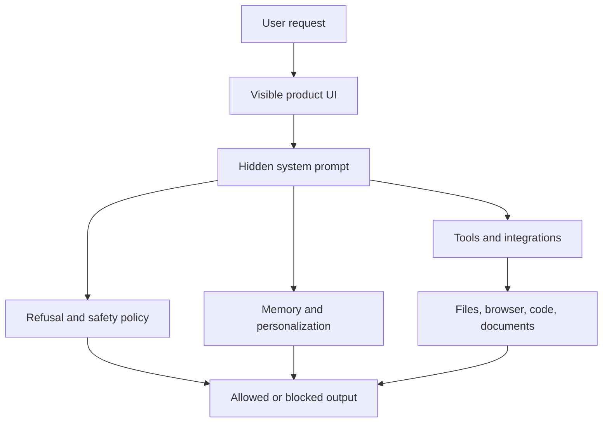

AI 시스템 프롬프트 유출 저장소가 GitHub Trending에 오른 건 단순한 호기심 때문이 아니다. 2026년 7월 기준 `asgeirtj/system_prompts_leaks`는 Claude, ChatGPT, Gemini, Grok, Copilot, Cursor, Perplexity 같은 제품의 숨은 지시문을 모아 공개하고, 모델별 변경분까지 비교한다. 별 48,703개, 하루 432개 증가라는 숫자는 개발자들이 이제 AI 제품을 프롬프트 묶음이 아니라 운영 정책으로 읽기 시작했다는 뜻에 가깝다.

문제는 여기서 갈린다. 사용자는 더 많은 투명성을 원한다. 플랫폼은 더 많은 통제를 공개하지 않으려 한다. 요구는 서로 다르지만, 책임의 무게는 같지 않다.

## 시스템 프롬프트는 이제 설정 파일이 아니라 제품 약관이다

확인된 사실부터 분리해야 한다. `system_prompts_leaks` 저장소는 Anthropic, OpenAI, Google, xAI, Microsoft, Cursor, Perplexity 등 여러 AI 제품의 시스템 프롬프트를 문서화한다고 설명한다. 최근 업데이트 목록에는 Claude Sonnet 5가 2026년 7월 1일, Claude Design이 2026년 6월 26일, GitHub Copilot macOS 앱과 GPT-5.5 Codex가 2026년 6월 18일로 올라와 있다. Claude Fable 5와 Claude Opus 4.8의 차이를 비교하는 링크도 제공한다.

확인되지 않은 부분도 있다. 이 저장소에 올라온 각 프롬프트가 어떤 경로로 추출됐는지, 모든 항목이 현재 제품 상태와 완전히 일치하는지, 공급사가 공식적으로 인정했는지는 항목마다 다르다. 저장소의 존재와 인기는 사실이다. 각 프롬프트의 법적 지위와 완전성은 따로 검증해야 한다.

개발자들이 여기에 반응하는 이유는 분명하다. 시스템 프롬프트는 모델 성능 팁이 아니다. 어떤 파일을 읽을 수 있는지, 어떤 도구를 호출할 수 있는지, 어떤 요청을 거절해야 하는지, 사용자를 어느 방향으로 유도해야 하는지가 들어간 운영 규칙이다. AI가 코드 편집기, 브라우저, 문서 도구, 업무용 앱 안으로 들어간 뒤에는 이 규칙이 곧 제품의 권한 경계가 된다.

예전의 프롬프트 유출은 장난에 가까웠다. 지금의 시스템 프롬프트 유출은 감사를 요구하는 문서에 가깝다.

이 그림에서 사용자가 볼 수 있는 것은 UI와 결과뿐이다. 보이지 않는 시스템 프롬프트가 도구 권한, 안전 정책, 메모리 사용, 출력 태도를 묶는다. 개발자 커뮤니티가 프롬프트를 읽고 싶어 하는 이유도 여기에 있다. 모델의 속내를 훔쳐보려는 게 아니라, 제품의 실제 계약 조건을 확인하려는 것이다.

## 커뮤니티가 불편해한 건 유출이 아니라 비대칭이다

GitHub에서 이런 저장소가 커지는 이유는 소프트웨어 개발자의 습관과 맞닿아 있다. 블랙박스가 배포되면 사람들은 로그를 찾고, 설정을 찾고, 디프를 찾는다. 이 저장소는 바로 그 욕구를 건드린다. Claude Fable 5와 Opus 4.8의 프롬프트 차이를 보는 행위는 릴리스 노트를 읽는 일과 닮았다.

반응은 크게 셋으로 갈린다.

첫째, 투명성 요구다. AI 도구가 코드를 고치고, 로컬 파일을 읽고, 브라우저를 조작하고, 업무 문서를 요약한다면 숨은 지시문은 개인 취향 설정이 아니다. 사용자는 어떤 요청이 왜 거절되는지, 어떤 데이터가 어떤 조건에서 도구 호출로 이어지는지 알아야 한다. 특히 Codex, Copilot, Cursor, Claude Code처럼 개발 환경 안에서 움직이는 도구는 결과물만 보는 방식으로 검증이 끝나지 않는다.

둘째, 보안 우려다. 시스템 프롬프트가 공개되면 공격자는 정책 회피 문구, 도구 호출 조건, 내부 우선순위를 더 쉽게 연구할 수 있다. 공급사 입장에서는 프롬프트가 제품 노하우이자 안전장치다. 공개가 무조건 선이라는 주장도 약하다. 안전 정책의 세부 문구가 그대로 노출되면 우회 실험 비용이 낮아진다.

셋째, 권한 불균형에 대한 반감이다. 사용자는 AI 제품에 문서, 코드, 검색 기록, 업무 맥락을 맡긴다. 플랫폼은 그 데이터를 어떤 시스템 지시에 따라 처리하는지 완전히 공개하지 않는다. 이 비대칭이 커질수록 커뮤니티는 비공식 저장소를 감사 장치처럼 소비한다. 공급사가 설명하지 않은 부분을 누군가가 캡처하고, 비교하고, 공개한다.

핵심은 유출 저장소가 완벽해서 신뢰받는 게 아니라는 점이다. 공식 채널이 충분히 설명하지 않기 때문에 비공식 채널이 신뢰를 가져간다.

## 여권 유출 사건이 AI 프롬프트 논쟁과 닮은 이유

Schneier on Security가 다룬 여권 데이터 유출 사례는 이 논쟁을 다른 각도에서 비춘다. 거의 100만 건에 가까운 여권 데이터베이스가 온라인에 노출됐고, Schneier는 고가치 자격 증명인 여권이 대마초 판매점 신원 확인이라는 부수적이고 낮은 가치의 인증 시스템에 쓰였다는 점을 지적했다. 낮은 가치 시스템이 뚫리면서 높은 가치 자격 증명이 위험해진 것이다.

AI 시스템 프롬프트도 비슷한 구조를 가진다. 프롬프트 자체는 텍스트다. 하지만 그 텍스트가 연결된 권한은 작지 않다. 파일 접근, 코드 변경, 외부 API 호출, 브라우저 자동화, 문서 요약, 메모리 저장 같은 기능이 붙는 순간 프롬프트는 단순한 문장이 아니라 권한 라우터가 된다.

여권 유출 사례의 교훈은 데이터 수집의 명분과 보관 책임이 다르다는 것이다. 신원 확인을 위해 여권을 받았다고 해서 그 여권 이미지를 허술한 공개 서버에 둘 권한까지 생기지는 않는다. AI 제품도 마찬가지다. 더 나은 답변을 위해 시스템 지시와 도구 권한을 복잡하게 설계했다고 해서 사용자가 그 경계를 모른 채 감수해야 하는 건 아니다.

차이는 있다. 여권은 유출되면 되돌릴 수 없는 개인 식별정보다. 시스템 프롬프트는 제품 규칙이며, 공개 자체가 곧 개인정보 침해는 아니다. 다만 두 사건은 같은 질문으로 이어진다. 낮은 마찰의 제품 경험을 만들기 위해 높은 가치의 권한을 한곳에 너무 쉽게 모으고 있다는 문제다.

## 기업은 프롬프트를 숨길 수 있어도 권한 모델은 숨기면 안 된다

공급사가 모든 시스템 프롬프트를 원문 그대로 공개해야 한다는 주장은 현실성이 낮다. 프롬프트에는 안전 정책, 악용 방지 지침, 내부 라우팅 방식, 제품 차별화 요소가 섞인다. 원문 공개가 공격 표면을 넓힐 수 있다는 반론은 유효하다.

하지만 권한 모델까지 숨기는 건 다른 문제다. 사용자가 알아야 할 것은 문장 하나하나가 아니라 경계다. 어떤 데이터가 입력되는지, 어떤 도구가 자동으로 호출될 수 있는지, 언제 외부 네트워크로 나가는지, 메모리에 무엇이 저장되는지, 조직 관리자가 어떤 정책을 걸 수 있는지가 공개되어야 한다.

실무에서는 이 쟁점을 프롬프트 공개 찬반으로 좁히면 놓치는 게 많다. 봐야 할 것은 네 가지다.

- 모델 지시문과 도구 권한이 분리되어 있는가
- 사용자가 도구 호출 전후의 로그를 볼 수 있는가
- 조직 단위로 금지할 수 있는 데이터 범위가 있는가
- 프롬프트 변경이 제품 릴리스 노트나 감사 로그에 남는가

이 네 가지가 없으면 시스템 프롬프트는 신뢰의 근거가 아니라 추정의 대상이 된다. 커뮤니티는 계속 비공식 디프를 찾을 수밖에 없다. 숨은 규칙이 실제 동작을 결정하는데 공식 설명이 빈약하면, 사람들은 공식 문서보다 유출 저장소를 먼저 연다.

AI 제품의 투명성은 원문 프롬프트 공개만으로 해결되지 않는다. 프롬프트를 영업비밀이라고 부르는 말만으로도 해결되지 않는다. 필요한 것은 공개 가능한 추상화다. 사용자가 이해할 수 있는 권한표, 변경 이력, 도구 호출 로그, 데이터 보존 정책이다.

## 이 논쟁의 답은 프롬프트가 아니라 감사 가능성이다

처음의 긴장으로 돌아가면, 사람들이 남의 시스템 프롬프트 저장소에 별을 누르는 이유는 숨은 명령어가 궁금해서만은 아니다. AI 제품이 점점 더 많은 일을 대신하면서, 사용자는 그 제품이 어떤 규칙으로 자신을 대신하는지 확인하고 싶어 한다.

`system_prompts_leaks`의 인기는 공급사에 불리한 사건처럼 보이지만, 실제로는 시장의 요구를 드러낸다. 개발자와 조직은 더 강한 모델만 원하는 게 아니다. 바뀐 규칙을 비교할 수 있는 모델을 원한다. 도구 권한을 끌 수 있는 모델을 원한다. 거절과 실행의 이유를 기록으로 남기는 모델을 원한다.

비공식 유출 저장소가 제품 신뢰의 참고 자료가 되는 시장은 건강하지 않다. 그렇다고 그 저장소를 단순한 위험물로 치우는 것도 부족하다. 커뮤니티가 찾는 것은 프롬프트 원문 그 자체가 아니라 권한의 지도다.

AI 플랫폼이 다음에 해야 할 일은 명확하다. 숨길 문장은 숨기되, 사용자가 감수하는 권한은 숨기지 말아야 한다. 프롬프트는 제품의 내부 구현일 수 있다. 권한과 데이터 흐름은 사용자의 판단 대상이다.

## 참고 자료

- [선정 글감] [#7 asgeirtj/system_prompts_leaks](https://github.com/asgeirtj/system_prompts_leaks), GitHub Trending
- [관련] [One Million Passports Leaked Online](https://www.schneier.com/blog/archives/2026/06/one-million-passports-leaked-online.html), Schneier on Security