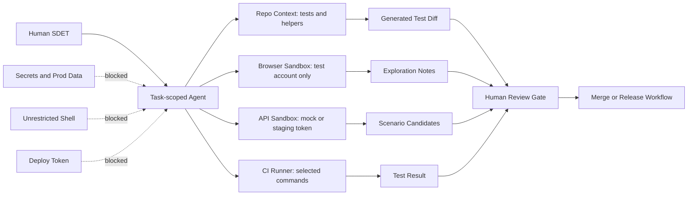

AI 에이전트를 SDET 테스트 자동화에 붙이는 순간, 테스트 도구 하나를 더 산 게 아니다. 저장소, 브라우저, API 토큰, CI 로그를 동시에 만지는 새 실행 주체를 들인 것이다.

> 테스트 자동화의 병목은 이제 코드 생성 속도가 아니다.  
> 누가 어떤 권한으로 무엇을 검증하게 둘 것인가가 병목이다.

## AI 테스트 자동화는 SDET 역할을 줄이지 않고 권한 면적을 키운다

DEV Community의 SDET 도구 글은 방향을 잘 짚는다. GitHub Copilot, Playwright MCP, Codex 같은 도구를 Selenium 테스트를 대신 써주는 자동완성으로만 보면 낮은 단계에 머문다. 더 큰 변화는 SDET가 테스트를 한 줄씩 작성하는 사람에서, 에이전트가 탐색하고 작성하고 고치는 테스트 시스템을 설계·검토하는 사람으로 이동한다는 점이다.

이 이동은 생산성 이야기로 끝나지 않는다. Playwright 브라우저 에이전트는 로그인, 비밀번호 재설정, 잠긴 계정, 세션 동작을 실제 화면에서 따라갈 수 있다. Codex류 소프트웨어 엔지니어링 에이전트는 500개 UI 테스트, 300개 API 테스트, 헬퍼 파일, 중복 인증 로직, 재시도 정책을 한꺼번에 훑을 수 있다. Postbot 같은 API 보조 도구는 응답 스키마에서 상태 코드, 응답 시간, 트랜잭션 ID, 통화 값 검증을 뽑아낼 수 있다.

이 모든 동작은 접근 권한 위에서 돌아간다. 테스트 저장소 읽기 권한, 브라우저 세션, API 문서, 샘플 페이로드, CI 환경 변수, 때로는 개인 셸까지 붙는다. 사람 신규 입사자에게 며칠에 걸쳐 나눠 주던 권한을 에이전트에는 한 번에 열어주는 구조가 된다.

그래서 AI 테스트 자동화의 첫 설계 질문은 어떤 도구가 좋은지가 아니다. 이 에이전트가 실패했을 때 어디까지 망가뜨릴 수 있는지다.

## Playwright MCP와 Codex를 붙일 때 보안 경계는 프롬프트가 아니다

AI 에이전트 보안 글이 지적한 핵심은 단순하다. 에이전트는 텍스트에서 지시를 받는다. 사용자가 쓴 프롬프트뿐 아니라 읽은 웹 페이지, 클론한 저장소의 README, 이슈 댓글, 도구 설명까지 입력 채널이 된다. 프롬프트 인젝션(Prompt Injection)은 모든 입력 채널을 잠재적 명령 채널로 바꾼다.

테스트 자동화에서는 이 위험이 자연스럽게 숨어든다. 브라우저 에이전트는 의도적으로 페이지를 읽고 클릭한다. API 테스트 에이전트는 명세와 응답을 읽는다. 저장소 에이전트는 테스트 유틸과 설정 파일을 읽는다. 공격자가 남긴 텍스트와 운영자가 준 지시가 같은 모델 컨텍스트 안으로 들어간다.

보안 경계는 더 똑똑한 프롬프트가 아니다. 최소 권한(Least Privilege)이다.

checkout API 테스트를 생성하는 작업에 필요한 권한은 제한적이다. 해당 테스트 디렉터리 읽기, 관련 스키마 읽기, 새 테스트 파일 쓰기, 지정된 테스트 명령 실행이면 충분하다. 전체 홈 디렉터리, `.ssh`, 모든 환경 변수, 외부 네트워크, 배포 토큰은 필요 없다.

브라우저 에이전트도 마찬가지다. 계정 복구 플로우를 탐색하려면 테스트용 계정과 테스트용 메일박스가 있으면 된다. 실제 고객 계정, 운영 관리자 권한, 결제 승인 권한이 붙으면 테스트 자동화가 아니라 권한 집중 장치가 된다.

이 구조에서 에이전트는 작업 단위로 태어난다. checkout API 테스트를 만들 때의 에이전트와 시각 회귀 테스트 기준선을 갱신하는 에이전트는 같은 권한을 갖지 않는다. 권한은 에이전트 이름이 아니라 작업에 묶어야 한다.

## 코드베이스를 모르는 에이전트는 테스트를 많이 쓰고, 잘못 고친다

AI가 테스트를 빠르게 만든다는 말은 반만 맞다. 구조를 모르는 에이전트는 검색 결과를 테스트 설계로 착각한다.

36,000개 이상 파일이 인덱싱된 Rails 대형 앱을 에이전트가 감사한 사례가 이 지점을 잘 보여준다. 대상 저장소는 GitLab의 특정 커밋이었고, 추적 파일 68,289개, Ruby 파일 29,784개, 인덱싱 파일 36,829개, 심볼 177,929개, 그래프 엣지 1,121,147개 규모였다. 작업은 MergeRequest 계약이 바뀔 때 의존 지점을 감사하는 것이었다. 손으로 만든 정답 세트는 16개 의존 지점이었다.

구조 정보 없이 첫 실행한 에이전트의 첫 움직임은 grep이었다. `merge_request` 검색 결과가 41,800건을 넘었다. 이것은 의존성 목록이 아니다. 두 번째 코드베이스다.

SDET 업무에서도 같은 일이 벌어진다. 인증 헤더 `X-Client-Version`이 추가됐을 때, AI가 모든 API 테스트를 뒤져 변경 후보를 찾는 장면은 그럴듯하다. 하지만 저장소 구조를 모르면 공통 요청 유틸, 테스트 전용 클라이언트, 레거시 헬퍼, 문서용 샘플을 구분하지 못한다. 결과는 넓은 수정, 약해진 assertion, 숨겨진 retry, 병렬 실행에서만 터지는 공유 상태가 된다.

AI 테스트 자동화에 필요한 것은 더 긴 프롬프트가 아니라 코드베이스 지도다. 테스트 디렉터리 구조, fixture 생성 방식, API 클라이언트 계층, selector 정책, 병렬 worker별 데이터 격리 규칙, flaky 테스트 분류 기준이 컨텍스트로 들어가야 한다. 이 정보가 없으면 에이전트는 빠르게 움직이지만, 방향은 grep이 정한다.

## 휴먼 인 더 루프는 승인 버튼이 아니라 병목 위치 선정이다

Hugging Face의 `huggingface_hub` 릴리스 자동화 사례는 AI 자동화의 좋은 기준선을 준다. 이 라이브러리는 `transformers`, `datasets`, `diffusers`, `sentence-transformers` 등 생태계의 여러 라이브러리가 의존하는 Python 클라이언트다. 예전에는 4~6주마다 릴리스했고, 이제는 단일 GitHub Actions workflow로 매주 릴리스한다.

핵심은 전부 자동화하지 않았다는 점이다. 버전 bump, 브랜치와 태그, 다운스트림 테스트 브랜치, 릴리스 노트 초안, 사후 PR 같은 반복 작업은 자동화했다. 판단이 필요한 곳에는 사람을 남겼다. 특히 릴리스 노트는 단순 git log 덤프가 아니라, 병합된 PR을 주제별로 묶고 맥락을 붙여야 한다.

테스트 자동화도 같은 원칙을 따라야 한다. AI가 잘하는 일은 후보를 넓게 만드는 일이다. 누락된 negative scenario를 제안하고, 반복 인증 로직을 찾고, 병렬 실패에서 공유 계정 사용을 의심하고, Playwright selector를 새 구조에 맞춰 갱신하는 일은 에이전트에게 맡길 수 있다.

사람이 남아야 하는 위치는 따로 있다.

금융 API에서 `amount = -1`을 테스트하는 것은 쉬운 후보 생성이다. 실제 위험은 `2147483647`, `2147483648`, 큰 정수, 부동소수점 정밀도, 중복 요청, 동시 요청, 멱등성(Idempotency) 동작에 있다. AI가 경계값을 늘어놓을 수는 있지만, 어떤 경계가 비즈니스 손실로 이어지는지는 시스템 맥락을 가진 사람이 판단해야 한다.

시각 테스트도 비슷하다. Applitools류 Visual AI는 픽셀 차이보다 의미 있는 레이아웃 차이를 찾는 데 유용하다. 결제 버튼이 보이지만 주문 합계와 겹치는 상황은 기능 assertion만으로 놓칠 수 있다. 그렇다고 스크린샷이 기능 검증을 대체하지는 않는다. 시각 검증은 checkout, 권한 관리, 대시보드, 다국어 UI처럼 레이아웃 실패가 실제 사용자 행동을 막는 영역에 얹는 계층이다.

## AI SDET 도입 전 확인할 것: 샌드박스, 데이터, 실패 모드

AI 테스트 자동화는 다음 조건이 갖춰졌을 때 이득이 난다. 그렇지 않으면 테스트가 늘어나는 속도보다 불확실성이 늘어나는 속도가 빠르다.

- 에이전트가 읽고 쓸 수 있는 경로가 작업 단위로 제한돼 있다.
- 테스트용 계정, 테스트용 데이터, 스테이징 토큰이 운영 자원과 분리돼 있다.
- CI에서 에이전트가 실행할 수 있는 명령이 allowlist로 묶여 있다.
- 생성된 테스트 diff는 사람 리뷰와 기존 테스트 실행을 통과해야 병합된다.
- flaky 테스트 원인 분석에서 retry 추가와 assertion 완화가 별도 검토 항목으로 표시된다.
- API 테스트에는 스키마 검증뿐 아니라 인증, 권한, 멱등성, 동시성, 경계값 기준이 포함된다.
- 브라우저 에이전트는 관리자 기능과 결제 기능을 탐색할 때 read-only 또는 mock 권한을 쓴다.
- 에이전트 로그에는 사용한 파일, 실행한 명령, 참조한 URL, 생성한 변경이 남는다.

OpenAI의 Daybreak 발표는 보안 자동화가 어디까지 가고 있는지도 보여준다. 취약점 발견에서 패치 자동화까지 속도를 높이는 방향이며, GPT-5.5-Cyber는 CyberGym에서 85.6%를 기록했다고 공개됐다. Patch the Planet에는 cURL, Go, Python, Sigstore, pyca/cryptography 등 30개가 넘는 오픈소스 프로젝트가 초기 참여자로 언급됐다.

이 흐름은 테스트 자동화에도 압력을 준다. 보안 패치가 기계 속도로 제안되면 회귀 테스트와 검증 파이프라인도 같은 속도를 견뎌야 한다. 다만 속도만 맞추면 되는 문제는 아니다. 패치 자동화가 빨라질수록 잘못된 테스트, 과도한 권한, 부실한 샌드박스의 피해도 빨라진다.

가장 위험한 구성은 에이전트에게 전체 저장소, 전체 셸, 전체 네트워크를 주고 테스트 실패를 고치라고 시키는 방식이다. 이 구성은 편하다. 그리고 편한 만큼 감사하기 어렵다.

## 테스트 자동화의 다음 경쟁력은 더 많은 AI 도구가 아니라 더 좁은 실행권한이다

SDET가 2026년에 배워야 할 것은 Copilot, Playwright MCP, Codex, Postbot, Visual AI 같은 이름 목록만이 아니다. 그 도구들이 어디까지 들어오게 할지 정하는 운영 설계다.

AI 에이전트는 테스트 생성 속도를 올린다. 브라우저를 탐색하고, API 경계값을 제안하고, 중복 헬퍼를 찾고, 릴리스 노트 초안을 만든다. 그 자체로 충분히 쓸모 있다. 하지만 테스트 자동화의 품질은 생성량으로 결정되지 않는다. 실패가 격리되는지, 데이터가 보호되는지, assertion이 약해지지 않는지, 사람이 판단해야 할 지점이 자동화 뒤로 숨지 않는지로 결정된다.

처음의 질문으로 돌아가면 답은 분명하다. AI 테스트 자동화의 병목은 코드 작성 속도가 아니다. 권한과 검증의 설계다. 에이전트를 들일 팀은 도구 목록보다 먼저 실행 경계를 그려야 한다. 작게 열고, 기록하고, 사람이 판단할 지점을 남기는 팀이 자동화의 속도를 더 오래 유지한다.

## 참고 자료

- [선정 글감] [7 AI Tools Every SDET Should Learn in 2026 — With Real Testing Use Cases](https://dev.to/vishal_kumar_32aca0795138/7-ai-tools-every-sdet-should-learn-in-2026-with-real-testing-use-cases-j71) — DEV Community
- [관련] [Your AI agent is the most over-privileged account you own](https://dev.to/kielltampubolon/your-ai-agent-is-the-most-over-privileged-account-you-own-2cle) — DEV Community
- [관련] [Shipping huggingface_hub every week with AI, open tools, and a human in the loop](https://huggingface.co/blog/huggingface-hub-release-ci) — Hugging Face Blog
- [관련] [I recorded my agent auditing a 36k-file Rails app: the play-by-play](https://dev.to/luuuc/i-recorded-my-agent-auditing-a-36k-file-rails-app-the-play-by-play-10h3) — DEV Community
- [관련] [Daybreak: Tools for securing every organization in the world](https://openai.com/index/daybreak-securing-the-world) — OpenAI Blog