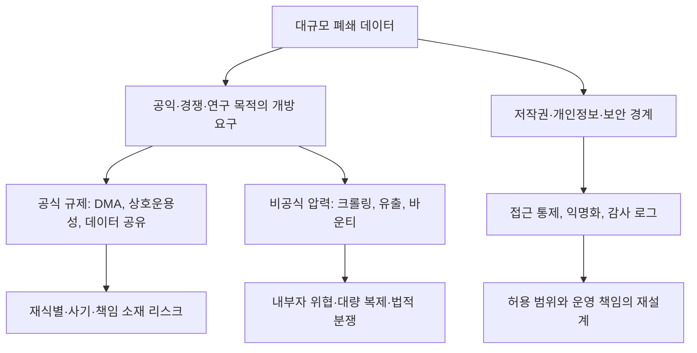

구글북스 스캔 데이터에 20만 달러 바운티가 걸렸다는 말은 디지털 보존 이야기처럼 들리기 쉽다. 하지만 이 사건의 핵심은 책을 누가 더 사랑하느냐가 아니다. 검색창 뒤에 있는 대규모 문화 데이터가 누구의 통제 아래 있어야 하는지, 그 통제를 깨려는 시도를 보존으로 볼지 침해로 볼지의 문제다.

Anna’s Archive 쪽 이슈는 Google Books 또는 비슷한 규모의 전체 도서 스캔 컬렉션을 확보하는 방법에 200,000달러 보상금을 제시한다. 설명은 노골적이다. Google Books에는 많은 스캔 도서가 있지만 검색 결과 주변의 작은 스니펫으로만 노출된다고 적었다. 확장 가능한 방법을 찾으면 일찍 연락하라고 했고, Google 내부 접근권한이 있는 사람에게는 데이터를 빼내면 전설적인 아키비스트로 불릴 것이라는 문장까지 붙었다.

이 문장 때문에 커뮤니티 반응이 갈렸다. 한쪽은 닫힌 지식 저장고를 여는 행동으로 읽는다. 다른 쪽은 내부자 유출과 저작권 침해를 포상하는 구조로 본다. 운영 관점에서 더 위험한 지점은 여기다.

닫힌 데이터가 클수록 개방 요구도 커지고, 탈취 유인도 커진다.

## 20만 달러 바운티가 건드린 것은 책이 아니라 접근권이다

확인된 사실부터 분리해야 한다. 공개된 Anna’s Archive 작업 항목은 Google Books 전체 스캔본 또는 AI 회사가 수집한 비슷한 규모의 희귀 도서 컬렉션을 대상으로 한다. 보상금은 200,000달러다. Hacker News에 올라온 관련 글은 제공된 수치 기준 351점과 댓글 189개를 기록했다. 이 주제는 파일 공유 커뮤니티 내부의 이야기를 넘어 개발자 커뮤니티에서도 논쟁이 붙은 사건이다.

아직 확인되지 않은 것은 실제로 누군가가 Google Books 전체 스캔 데이터를 대규모로 추출했는지, 내부자가 참여했는지다. 공개 문구는 실행 결과라기보다 방법을 찾는 사람을 모집하는 제안에 가깝다. 문제가 된 것은 유출 자체가 아니라 인센티브 설계다.

이 차이는 크다. 데이터 유출 사건은 사고 대응의 문제다. 데이터 유출을 포상하는 공개 바운티는 플랫폼 거버넌스의 문제다. 전자는 이미 난 구멍을 막는다. 후자는 어떤 구멍을 내도 된다는 사회적 신호를 만든다.

Google Books는 원래부터 애매한 위치에 있었다. 독자는 검색으로 일부 문맥을 볼 수 있지만 전체 데이터에는 접근할 수 없다. 저작권자는 원본 권리를 갖지만 검색 인덱스와 스캔 인프라는 플랫폼 안에 있다. 연구자는 말뭉치와 장기 보존 가치를 말하지만 실제 접근은 제한된다.

불만은 단순하다. 공공 지식처럼 보이는 자료가 사기업 UI 안에 갇혀 있다. 방어 논리도 단순하다. 책은 저작권과 계약이 얽힌 저작물이고, 전체 스캔본은 검색 스니펫과 전혀 다른 위험 단위다.

## 커뮤니티가 갈린 이유: 보존 윤리와 내부자 유출의 충돌

Hacker News 같은 개발자 커뮤니티에서 이런 주제가 커지는 이유는 기술적으로 흥미롭기 때문만은 아니다. 개발자는 대규모 크롤링, 검색 노출, 접근 제어, 내부 권한, 데이터 이동 비용이 어떻게 연결되는지 안다. 그래서 20만 달러라는 숫자는 보상금이면서 위협 모델(Threat Model)의 일부로 읽힌다.

불편함은 세 갈래로 나뉜다.

첫째, 내부자 접근을 낭만화한다. 공개 문구는 Google 직원이 이 데이터에 접근할 수 있다면 빼내라는 식의 메시지를 담고 있다. 취약점 제보와는 다르다. 취약점 제보는 보통 시스템 소유자에게 문제를 알리고 수정 경로를 만든다. 이 바운티는 데이터 사본을 외부로 옮기는 결과를 요구한다.

둘째, 저작권 문제를 보존이라는 단어 하나로 덮기 어렵다. 희귀 도서 보존은 설득력이 있다. 절판 자료, 사라지는 문헌, 검색되지 않는 문화 자산은 실제로 보존 가치가 있다. 하지만 전체 스캔본 확보는 보존과 배포의 경계를 흐린다. 접근권이 없는 자료를 대량 복제하면 의도가 공익이어도 권리자와 플랫폼은 침해로 본다.

셋째, 플랫폼 불신이 이 바운티에 연료를 준다. 많은 사용자는 대형 플랫폼이 데이터를 독점하고, 검색 UI를 통해서만 가치를 조금씩 흘린다고 느낀다. 책을 스캔한 기반 시설은 거대하고, 결과물은 검색 사업과 AI 학습 데이터의 맥락에서 더 비싸졌다. 데이터가 비싸질수록 공공성 주장은 커지고, 보안 경계는 더 단단해진다.

플랫폼 쪽 논리에도 약한 지점은 있다. 보안과 저작권을 이유로 모든 접근을 막는다면, 연구자와 도서관이 쓸 수 있는 합법적 경로가 충분한지 답해야 한다. 닫힌 저장고가 영원히 닫혀 있으면 비공식 경로는 계속 등장한다. 불법이라서 사라지는 것이 아니라, 수요가 있어서 반복된다.

## EU 검색 데이터 논쟁이 같은 질문을 다른 방향에서 던진다

WIRED가 보도한 EU 디지털시장법(Digital Markets Act) 관련 논쟁은 이 사건을 다른 각도에서 비춘다. 유럽 규제 당국은 대형 플랫폼의 지배력을 낮추기 위해 Google Search 데이터와 Android 상호운용성 개방을 검토해 왔다. 보도에 따르면 Google의 보안 책임자들은 검색 데이터 공유와 Android 개방이 개인정보 침해, 검색 질의 재식별, 사기 증가로 이어질 수 있다고 경고했다.

여기서 당사자는 다르다. Anna’s Archive 바운티는 비공식 개방 압력이다. EU 규제는 공식 개방 압력이다. 하나는 플랫폼 밖에서 데이터를 가져오려 하고, 하나는 법과 제도로 플랫폼이 데이터를 나누게 만들려 한다.

하지만 구조는 같다.

Google은 EU안이 현재 설명대로 시행되면 Android에서 사기가 늘 수 있고, 검색 데이터가 악의적 행위자에게 재식별될 수 있다고 주장한다. 이 주장에는 회사의 이해관계가 섞여 있다. 경쟁 규제가 강해지면 Google은 불리해진다. 그렇다고 보안 우려가 자동으로 핑계가 되는 것은 아니다. 검색 질의는 익명화해도 민감하다. 희귀한 질의, 위치, 시간, 반복 패턴은 사람을 다시 가리킬 수 있다.

이 지점이 Google Books 바운티와 이어진다. 도서 스캔 데이터는 검색 질의보다 개인정보 밀도가 낮아 보일 수 있다. 그러나 책 전체 스캔본은 저작권, 계약, 희귀 자료, 학습 데이터 가치가 얽힌 자산이다. 검색 데이터가 재식별 위험을 낳는다면, 도서 스캔 데이터는 권리와 시장 구조를 흔든다. 둘 다 단순한 파일 묶음이 아니다. 접근 정책 그 자체가 제품의 일부다.

플랫폼 개방 논쟁은 선악 구도로 풀리지 않는다. 닫아두면 독점이 된다. 열어두면 공격면이 된다. 제대로 된 질문은 얼마나 열 것인가가 아니라, 어떤 단위로 열고 누가 책임질 것인가다.

## 실무자는 바운티 금액보다 데이터 경계를 봐야 한다

이 사건을 실무적으로 읽으면 점검 항목은 꽤 구체적이다. 대규모 콘텐츠나 검색 데이터를 가진 조직은 외부 크롤러만 막는다고 끝나지 않는다. 내부 접근권한, 감사 로그, 대량 반출 탐지, 파생 데이터 정책까지 한 묶음으로 봐야 한다.

먼저 내부자 위협을 예외 상황으로 두면 안 된다. Anna’s Archive 문구가 보여준 것은 내부 권한이 곧 시장 가치가 될 수 있다는 사실이다. 권한이 있는 직원이 데이터를 한 번에 내려받을 수 있다면, 그 권한은 운영 편의가 아니라 반출 경로다. 최소권한(Least Privilege), 대량 다운로드 알림, 비정상 쿼리 탐지는 보안 체크리스트가 아니라 사업 자산 보호 장치다.

익명화를 과신하는 것도 위험하다. WIRED 보도에서 Google이 검색 데이터 재식별을 경고한 이유는 데이터가 익명이라는 설명만으로 충분하지 않기 때문이다. 검색 질의, 책 스니펫, OCR 텍스트, 메타데이터는 서로 결합될 때 가치가 커진다. 가치가 커지는 조합은 공격자에게도 쓸모가 있다.

운영팀이 확인해야 할 질문은 단순하다.

- 전체 원본 데이터에 접근할 수 있는 계정은 몇 개인가
- 검색용 스니펫, OCR 텍스트, 원본 이미지의 권한 경계가 분리돼 있는가
- 대량 조회와 정상 운영 조회를 구분하는 기준이 있는가
- 규제나 파트너 요구로 데이터를 열 때 재식별 테스트를 누가 수행하는가
- 외부 연구자에게 줄 수 있는 안전한 샌드박스나 집계 API가 있는가

마지막 항목이 핵심이다. 합법적이고 안전한 접근 경로가 없으면 비공식 접근 경로가 명분을 얻는다. 플랫폼이 모든 문을 닫으면 바운티가 문고리를 찾는다. 플랫폼이 아무 문이나 열면 공격자가 들어온다.

## 닫힌 보관소는 오래 버티지만, 명분을 잃으면 새어 나간다

이번 이슈에서 가장 쉬운 결론은 Anna’s Archive를 비난하거나 응원하는 것이다. 하지만 그 결론은 실무에 별 도움이 되지 않는다. 20만 달러 바운티는 원인이라기보다 증상이다. 대규모 지식 데이터가 사기업 안에 축적되고, 공개 접근은 검색 UI로 제한되고, AI와 규제 경쟁으로 데이터 가치가 올라간 결과다.

그렇다고 바운티 방식이 정당해지는 것은 아니다. 내부자 유출을 영웅담으로 포장하면 보존 운동은 신뢰를 잃는다. 신뢰를 잃은 보존은 더 강한 폐쇄를 부른다. 더 강한 폐쇄는 다시 비공식 탈출 시도를 낳는다.

플랫폼 쪽도 책임을 피할 수 없다. 보안과 저작권을 말하려면 대안적 접근 경로를 설계해야 한다. 연구 목적 접근, 집계 데이터, 안전한 뷰어, 감사 가능한 API, 권리자 동의 기반 프로그램 같은 선택지를 만들지 않고 닫힌 문만 보여주면, 커뮤니티는 그 문 뒤의 데이터가 사라질까 봐 불안해한다.

첫 문장의 질문으로 돌아가면 답은 분명하다. 이 사건은 책을 누가 더 사랑하느냐의 싸움이 아니다. 접근권을 독점한 플랫폼과 접근권을 탈취하려는 커뮤니티 사이에서, 안전한 공개 경로가 비어 있다는 신호다.

그 빈자리를 방치하면 누군가는 규제로 열고, 누군가는 바운티로 뜯는다. 책임 있는 쪽이 해야 할 일은 그보다 먼저 좁고 감사 가능한 문을 만드는 것이다.

## 참고 자료

- [선정 글감] [Google Books (or similar) all book scans – $200k bounty (2025)](https://software.annas-archive.gl/AnnaArchivist/annas-archive/-/work_items/234) — Hacker News Best
- [관련] [Top Google Security Staff Warn Search Data Could Be Hacked if EU Rules Change](https://www.wired.com/story/top-google-security-staff-warn-search-data-could-be-hacked-thanks-to-eu-plans/) — WIRED Security