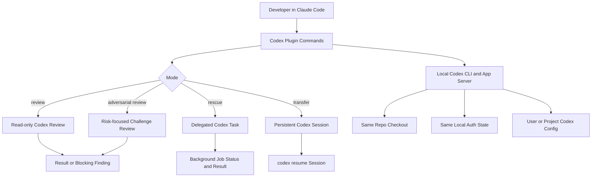

Codex plugin for Claude Code가 GitHub Trending 1위에 오른 일은 도구 출시 소식으로만 보기 어렵다. 한 코딩 에이전트 안에서 다른 코딩 에이전트를 호출하고, 리뷰를 맡기고, 작업을 넘기고, 세션까지 이전하는 흐름이 개발자 워크플로에 들어오기 시작했다.

핵심은 권한 경계다. 개발자는 더 이상 AI 도구 하나를 신뢰할지만 결정하지 않는다. AI가 AI를 부르고, 그 호출이 같은 저장소와 같은 인증 상태와 같은 로컬 환경 위에서 실행될 때 어디까지를 작업 경계로 볼지 다시 정해야 한다.

## Claude Code 안에서 Codex를 부르는 순간, 권한 모델이 달라진다

선정된 저장소 `openai/codex-plugin-cc`는 Claude Code 사용자가 Claude Code 안에서 Codex를 호출할 수 있게 하는 플러그인이다. GitHub Trending 기준 별 24,578개, 당일 718개 증가로 소개됐다. 설명은 짧다. Claude Code에서 Codex를 사용해 코드 리뷰를 하거나 작업을 위임한다.

기능은 리뷰에 그치지 않는다. `/codex:review`는 현재 변경사항이나 기준 브랜치 대비 변경을 읽기 전용으로 리뷰한다. `/codex:adversarial-review`는 구현 방향, 트레이드오프, 숨은 가정, 인증·데이터 손실·롤백·경합 조건 같은 위험 영역을 압박하는 리뷰를 수행한다. `/codex:rescue`는 버그 조사나 수정 시도를 Codex에 맡긴다. `/codex:transfer`는 Claude Code 세션을 Codex에서 이어갈 수 있는 영속 스레드로 넘긴다.

확인된 범위도 분명하다. 이 플러그인은 별도 런타임을 만들지 않는다. 로컬에 설치된 Codex CLI와 Codex app server를 감싸며, 같은 Codex 설치, 같은 로컬 인증 상태, 같은 저장소 체크아웃, 같은 머신 환경을 쓴다고 설명한다. 요구사항은 Node.js 18.18 이상, ChatGPT 구독 또는 OpenAI API 키다. 사용량은 Codex 사용 한도에 반영된다.

해석이 필요한 부분은 따로 봐야 한다. 이 저장소가 Trending에 올랐다고 해서 모든 개발팀이 Claude Code와 Codex를 동시에 표준화했다는 뜻은 아니다. 다만 커뮤니티가 반응한 이유는 설명된다. 개발자들이 단일 모델의 품질만이 아니라 에이전트 간 역할 분담, 검증, 비용, 권한 전파를 실제 운영 문제로 보기 시작했다는 뜻이다.

## 왜 개발자들은 이 플러그인에 바로 반응했나

먼저 편의성이다. 이미 Claude Code를 쓰는 사용자는 별도 터미널로 이동하지 않고 Codex 리뷰를 실행할 수 있다. `/plugin marketplace add openai/codex-plugin-cc`, `/plugin install codex@openai-codex`, `/reload-plugins`, `/codex:setup` 흐름으로 붙고, 첫 실행 예시는 `/codex:review --background`, `/codex:status`, `/codex:result`다. 오래 걸리는 리뷰나 조사 작업을 백그라운드로 넘기고 결과만 회수하는 방식은 실제 작업 리듬과 맞다.

비용과 한도도 바로 따라온다. 플러그인은 ChatGPT 구독이나 API 키를 요구하고, 사용량이 Codex 한도에 반영된다고 적는다. The Pragmatic Engineer의 OpenAI·Anthropic·Cursor 방문기에서도 클라우드에서 도는 에이전트와 코딩 하네스 확산이 큰 흐름으로 언급됐다. 특히 AI 사용 비용이 커지면서 플랫폼 팀이 토큰당 비용을 줄이는 방향으로 움직인다는 관찰이 붙었다. 플러그인이 편해질수록 호출은 늘고, 호출이 늘수록 비용 통제는 제품 기능이 아니라 운영 기능이 된다.

신뢰 문제도 크다. 같은 주제의 보조 레퍼런스인 `system_prompts_leaks` 저장소는 Claude, ChatGPT, Gemini, Grok, Cursor, Copilot, VS Code, Perplexity 등의 시스템 프롬프트를 모아 비교한다. 해당 저장소는 별 48,999개, 당일 471개 증가로 소개됐고, 2026년 6월 18일 GPT-5.5 Codex full prompt, 6월 18일 GitHub Copilot for macOS app system prompt, 7월 1일 Claude Sonnet 5 system prompt 같은 항목을 갱신 목록에 올렸다. 이 관심은 단순한 호기심으로만 보기 어렵다. 개발자들이 AI 도구의 겉 UI보다 숨은 지시문, 도구 권한, 제한 규칙을 검증 대상으로 보기 시작했다는 뜻이다.

에이전트 통합은 편해질수록 불투명해진다.

Claude Code가 Codex를 부르고, Codex가 로컬 인증과 설정을 그대로 쓰며, 세션이 다른 도구로 이전된다면 사용자는 두 가지를 동시에 얻는다. 작업 연속성은 좋아지고, 책임 경계는 흐려진다.

## 리뷰 게이트는 안전장치이면서 자동 루프의 시작점이다

플러그인 문서에서 가장 조심스럽게 읽어야 할 기능은 리뷰 게이트다. `/codex:setup --enable-review-gate`로 켤 수 있고, Stop hook을 사용해 Claude의 응답을 바탕으로 Codex 리뷰를 실행한다. Codex 리뷰가 문제를 찾으면 stop이 차단되어 Claude가 먼저 고치도록 만든다.

이 기능은 매력적이다. AI가 만든 변경을 다른 AI가 막아 세운다. 사람 리뷰 전에 최소한의 반대편 검토를 자동으로 거는 셈이다. 특히 `/codex:adversarial-review`가 설계 선택, 실패 모드, 대안, 인증, 데이터 손실, 롤백, 경합 조건을 압박하도록 설계된 점은 일반 lint나 테스트가 잡지 못하는 영역을 건드린다.

문서에는 경고도 있다. 리뷰 게이트는 오래 도는 Claude/Codex 루프를 만들 수 있고 사용량 한도를 빠르게 소모할 수 있으므로, 적극적으로 모니터링할 때만 켜라고 적는다. 이 경고가 핵심이다. 자동 검증은 공짜 안전망이 아니다. 검증 자체도 작업이며, 작업에는 비용, 지연, 실패 모드가 있다.

아키텍처 관점에서 보면 이 플러그인은 다음 흐름을 만든다.

이 구조에서 봐야 할 리스크는 모델 품질 하나가 아니다. 같은 저장소를 읽는가, 어떤 브랜치를 기준으로 리뷰하는가, 백그라운드 작업의 결과를 누가 확인하는가, 세션 이전 후에도 원래 제약이 보존되는가, 프로젝트별 `.codex/config.toml`이 신뢰된 디렉터리에서만 로드되는가를 봐야 한다. 플러그인은 이런 조건 일부를 문서에 명시한다. 팀은 그 문서를 설치 안내가 아니라 권한 명세로 읽어야 한다.

## 오픈소스 보안 도구가 늘수록 유지보수자는 더 바빠진다

WIRED가 다룬 OpenAI의 보안 발표와 Patch the Planet 흐름은 이 이슈의 반대편을 보여준다. OpenAI는 GPT-5.5-Cyber 개선, 정부와 기관에 대한 trusted access 확대, Codex Security scanner 앱 플러그인 공개, Patch the Planet 이니셔티브를 밝혔다. Patch the Planet은 Trail of Bits와 함께 시작했고 HackerOne, Calif와 협력해 오픈소스 유지보수자에게 무료 보안 컨설팅을 제공한다고 설명됐다. OpenAI 공식 글도 AI와 전문가 리뷰로 취약점을 찾고 검증하고 수정하도록 돕는 Daybreak 이니셔티브라고 소개한다.

겉으로는 좋은 일이다. 오픈소스 유지보수자는 리소스가 부족하고, AI 버그 탐지 도구는 더 많은 취약점 후보를 쏟아낼 수 있다. Trail of Bits의 Dan Guido는 Patch the Planet을 AI 버그 헌팅 도구보다 앞서가기 위한 인터넷 규모의 노력으로 설명하며, 오픈소스 커뮤니티가 AI 코딩 도구의 단점뿐 아니라 장점도 보게 하려는 시도라고 말했다.

여기에도 같은 긴장이 있다. AI 도구는 취약점을 더 많이 찾게 해준다. 동시에 유지보수자가 처리해야 할 보고서, 검증 요청, 패치 검토, 회귀 확인도 늘린다. Claude Code 안에서 Codex를 호출하는 플러그인과 Patch the Planet은 서로 다른 제품처럼 보이지만, 같은 방향을 가리킨다. AI는 코드를 쓰는 자리에서만 늘어나는 것이 아니라 리뷰, 보안, 위임, 유지보수의 입구마다 붙고 있다.

반대편의 이점도 분명하다. AI 간 교차 리뷰는 실제 결함을 줄일 수 있다. 사람 혼자 놓친 경합 조건이나 롤백 실패를 다른 모델이 지적할 수 있고, 오픈소스 유지보수자는 전문가 지원과 자동화 도구의 도움을 받을 수 있다. 이 장점을 무시하면 실무 판단이 흐려진다.

문제는 도입 자체가 아니다. 도입 후에도 사람이 최종 책임자라는 사실을 잊는 것이 문제다. 에이전트가 늘어날수록 유지보수자는 덜 바빠지는 것이 아니라 다른 방식으로 바빠진다. 실행보다 승인, 생성보다 검증, 프롬프트보다 정책이 더 큰 일이 된다.

## 팀이 지금 정해야 하는 것은 어떤 AI를 쓸지가 아니다

이 이슈에서 실무자가 바로 확인할 항목은 단순하다. 플러그인을 쓸지 말지는 그다음 문제다.

먼저 로컬 권한 경계를 확인해야 한다. 이 플러그인은 같은 로컬 Codex 인증 상태와 같은 저장소 환경을 쓴다. 회사 장비에서 Claude Code와 Codex를 함께 쓴다면 API 키, ChatGPT 로그인, 프로젝트별 Codex 설정, 신뢰된 디렉터리 정책이 서로 어떻게 연결되는지 문서화해야 한다.

다음은 실행 모드다. `/codex:review`와 `/codex:adversarial-review`는 읽기 전용이라고 명시되어 있다. 반면 `/codex:rescue`는 버그 조사나 수정 시도를 맡기는 흐름이다. 백그라운드 작업은 편하지만, 결과 확인 없이 이어지는 후속 프롬프트는 위험하다. 최소한 작업 ID, 세션 ID, 기준 브랜치, 적용 여부를 남겨야 한다.

리뷰 게이트는 기본으로 켤 기능이 아니다. 문서가 말하듯 적극적으로 감시할 때만 맞다. CI의 필수 체크처럼 쓰고 싶다면 먼저 비용 한도, 최대 실행 시간, 취소 절차, 실패 시 사람이 보는 로그 위치를 정해야 한다. 자동 루프를 안전장치라고 부르는 순간 운영 리스크가 숨는다.

마지막으로 프롬프트와 정책의 가시성을 관리해야 한다. `system_prompts_leaks` 저장소가 인기를 얻는 이유는 개발자들이 AI 도구의 보이지 않는 지시문을 신뢰 문제로 받아들이기 때문이다. 기업 환경에서는 외부 유출 프롬프트를 소비하는 데서 멈추면 안 된다. 내부 에이전트가 어떤 시스템 지시, 어떤 도구 권한, 어떤 저장소 접근 범위로 도는지 추적 가능해야 한다.

이번 Trending 1위가 말하는 변화는 선명하다. AI 코딩 도구의 경쟁은 모델 대 모델에서 워크플로 대 워크플로로 옮겨갔다. Claude Code 안의 Codex 호출은 편의 기능이지만, 그 편의가 권한과 비용과 책임을 한 줄로 이어 붙인다.

처음의 질문으로 돌아가면 답은 이렇다. AI가 AI를 부르는 구조는 막을 흐름이 아니다. 다만 팀은 그 호출을 사람의 명령처럼 기록하고, 외부 서비스 호출처럼 비용을 재고, 배포 전 검증처럼 실패 경로를 설계해야 한다. 그렇지 않으면 가장 편한 플러그인이 가장 조용한 운영 리스크가 된다.

## 참고 자료

- [선정 글감] [#1 openai/codex-plugin-cc](https://github.com/openai/codex-plugin-cc) — GitHub Trending
- [관련] [#7 asgeirtj/system_prompts_leaks](https://github.com/asgeirtj/system_prompts_leaks) — GitHub Trending
- [관련] [OpenAI Launches Full-Scale Effort to Patch Open-Source Bugs as It Takes on Anthropic’s Mythos](https://www.wired.com/story/openai-launches-full-scale-effort-to-patch-open-source-bugs-as-it-takes-on-anthropics-mythos/) — WIRED Security
- [관련] [Impressions from visiting OpenAI, Anthropic, & Cursor](https://newsletter.pragmaticengineer.com/p/impressions-from-visiting-openai) — The Pragmatic Engineer
- [관련] [Patch the Planet: a Daybreak initiative to support open source maintainers](https://openai.com/index/patch-the-planet) — OpenAI Blog