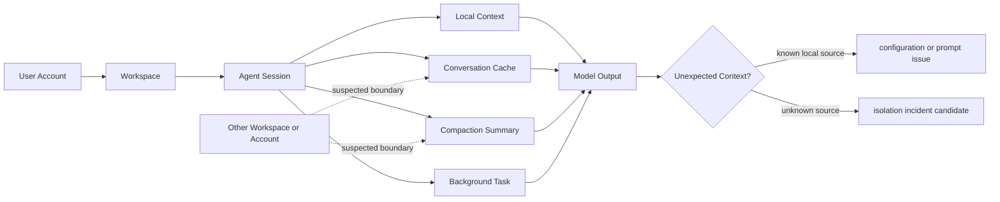

첫 단서는 이상하게도 Minecraft였다. Enterprise ZDR workspace에 로그인한 Claude Code 세션이 갑자기 Minecraft 사원에 쓸 벽돌을 묻고, recap에서 자신이 Minecraft temple을 만들고 있다고 말한 것이다. 2026년 7월 4일 GitHub에 열린 이 이슈는 아직 확정된 침해 사고가 아니다. 다만 개발자들이 민감하게 반응한 이유는 분명하다. AI 코딩 에이전트에서 세션 경계가 흔들리면, 농담처럼 보이는 문맥 오염도 보안 사건의 신호가 될 수 있다.

## Minecraft가 문제가 아니라 경계가 문제다

확인된 사실부터 좁혀야 한다. 이슈 작성자는 Anthropic의 `claude-code` 저장소에 `[Bug] Potential session/cache leakage between workspace instances or consumer accounts`라는 제목으로 버그를 올렸다. 라벨은 `area:core`, `area:security`, `bug`, `platform:macos`가 붙었다. 환경은 macOS, Apple Terminal, Claude Code 버전 2.1.199다. 이슈는 열린 상태이며, 본문 기준으로 원인 확정이나 공식 수정 공지는 확인되지 않는다.

작성자는 Enterprise ZDR workspace에 인증된 상태였다고 적었다. 여기서 ZDR은 보통 민감한 대화가 모델 학습이나 장기 보관에 쓰이지 않는다는 기대와 연결된다. 그래서 Minecraft 문맥이 더 크게 보였다. 단순한 헛소리라면 품질 문제다. 다른 사용자나 다른 workspace의 문맥이 섞인 것이라면 격리 문제다.

작성자는 자기 설정도 분리해서 밝혔다. 세션을 작업과 무관한 디렉터리에서 시작했고, 그곳의 `.claude` 컨텍스트를 필요로 했으며, 실제 작업은 다른 디렉터리에서 했다고 했다. 이전에는 대화 압축(compaction) 이후 에이전트가 처음 실행한 디렉터리 프로젝트로 돌아가는 일이 있었고, 그것은 자신의 특이한 실행 방식 때문일 수 있다고 구분했다.

Minecraft 관련 프롬프트는 다르다고 봤다. 그 문맥은 본인이 제공한 컨텍스트가 아니며, 동료의 세션이나 consumer plan 쪽 캐시가 섞인 것일 가능성을 제기했다. 여기까지가 확인된 사실과 신고자의 해석이다. 실제로 cross-account leakage가 일어났는지는 아직 증명되지 않았다.

이 구분이 이 글의 핵심이다. 확정된 것은 이상 행동이고, 아직 확정되지 않은 것은 누출 경로다.

## 개발자들이 불편해한 건 환각이 아니라 소유권이다

LLM이 엉뚱한 말을 하는 일은 새롭지 않다. 커뮤니티가 이 사례에 반응한 이유는 답변 품질이 아니라 문맥의 소유권 때문이다. Hacker News에서 이 이슈는 255 points와 119 comments를 모았다. “모델이 이상한 말을 했다”가 아니라 “내 세션에 있으면 안 되는 말이 들어왔다”는 신호였기 때문이다.

AI 코딩 도구는 일반 챗봇보다 경계가 많다. 로컬 파일 시스템, Git 상태, 터미널 출력, API 키가 들어간 환경, 회사 저장소 규칙, 개인 계정 인증, 조직 계정 인증이 한 세션 안에 들어온다. 사용자는 모델에게 코드를 보여주는 데서 그치지 않고 작업장을 열어준다.

그 작업장에서 가장 위험한 버그는 틀린 코드 생성만이 아니다. 작은 문맥 오염이 더 큰 신뢰 붕괴를 만든다. 내가 요청하지 않은 Minecraft가 들어왔다면, 내 비공개 리팩터링 계획도 어딘가에 섞일 수 있는지 묻게 된다.

이 사건은 아직 session/cache leakage로 판명되지 않았다. 대화 압축, 잘못된 작업 디렉터리, 로컬 `.claude` 컨텍스트, 이전 명령의 잔여 상태, 모델의 confabulation이 모두 후보가 될 수 있다. 특히 작성자 본인이 “weird setup”이라고 부른 실행 방식은 조사에서 반드시 분리해야 할 변수다.

그렇다고 이슈를 가볍게 볼 수는 없다. 에이전트 제품에서 경계는 기능 설명만으로 보장되지 않는다. workspace, account, cache, memory, compaction, background job이 실제로 어디에서 끊기는지 증명되어야 한다.

## Codex를 Claude Code 안에서 부르는 시대의 새 표면

보조 사례로 OpenAI의 `codex-plugin-cc`가 있다. 이 저장소는 Claude Code 안에서 Codex를 코드 리뷰나 작업 위임에 쓰게 해주는 플러그인이다. GitHub Trending 자료 기준 별 24,328개, 하루 716개 증가로 소개됐다. 기능도 단순 실행을 넘는다. `/codex:review`, `/codex:adversarial-review`, `/codex:rescue`, `/codex:transfer`, `/codex:status`, `/codex:result`, `/codex:cancel` 같은 명령으로 리뷰, 도전적 검토, 세션 구조, 작업 이전, 백그라운드 작업 관리를 제공한다.

이 흐름은 편하다. 개발자는 이미 쓰는 Claude Code workflow에서 Codex를 부를 수 있다. ChatGPT subscription이나 OpenAI API key를 요구하고, 사용량은 Codex limit에 반영된다. Node.js 18.18 이상과 플러그인 설치만 맞으면 한 도구 안에서 다른 에이전트를 호출한다.

바로 그래서 이번 이슈의 의미가 커진다. 에이전트가 하나일 때도 세션 경계는 어렵다. 에이전트를 플러그인으로 엮고, background review를 돌리고, rescue나 transfer로 작업을 넘기면 경계는 더 잘게 쪼개진다. 어디까지가 Claude Code의 컨텍스트이고 어디부터가 Codex의 컨텍스트인지, 어떤 인증이 어떤 프로세스에 전달되는지, background job이 종료된 터미널 세션과 어떤 관계를 갖는지 확인해야 한다.

실무에서 확인해야 할 지점은 추상적인 AI 윤리가 아니다. 다음 네 가지다.

- account boundary: 개인 계정과 조직 계정의 캐시, 로그, 사용량, 오류 리포트가 분리되는가
- workspace boundary: 시작 디렉터리와 실제 작업 디렉터리가 다를 때 컨텍스트 선택 규칙이 명시되는가
- session boundary: compaction summary와 background task가 원래 세션 밖으로 재사용되지 않는가
- incident boundary: 이상 출력이 나왔을 때 사용자가 어떤 증거를 남기고 어디에 신고할 수 있는가

이 네 가지가 문서와 구현에서 맞아야 한다. 하나라도 흐리면 사용자는 기능을 쓰면서도 민감한 저장소에서는 끄게 된다. 생산성 도구는 빨라서 채택되고, 경계가 불분명해서 차단된다.

## AI 사고 신고는 버그 트래커만으로 부족하다

WIRED가 소개한 FLARE-AI도 같은 방향의 신호다. AI 연구자들이 만든 Flaw Reporting for AI는 챗봇이 악성코드나 폭탄 제조법을 생성하거나, 개인정보를 누출하거나, 사용자에게 해로운 심리적 영향을 줄 때 신고하고 추적하기 위한 crowdsourced 웹사이트다. 개발에는 32개 조직의 AI 전문가 49명이 협력했다고 소개됐다. 보고된 문제를 검증하고 모델 제작자나 MITRE 같은 조직으로 라우팅하는 구조를 지향한다.

기사 속 Hugging Face의 Avijit Ghosh는 현재 AI 시스템 결함을 신고할 중앙화되고 책임 있는 방식이 없다고 지적했다. 이 말은 Claude Code 이슈에도 그대로 걸린다. GitHub issue는 빠르지만, 모든 AI 결함 신고를 감당하는 제도는 아니다. 저장소 이슈는 제품팀이 보기 좋지만, 사용자는 공개해도 되는 정보와 공개하면 안 되는 정보를 직접 판단해야 한다.

세션 누출 의심은 특히 어렵다. 재현 절차가 불완전할 수밖에 없다. 민감한 원문을 공개할 수 없고, 캐시는 사용자 눈에 보이지 않으며, 서버 측 라우팅은 벤더만 확인할 수 있다. 그래서 이런 사건은 “재현 안 됨”으로 닫히기 쉽다. 하지만 AI 에이전트에서는 단발성 신고도 운영 신호다. 누출이 아니더라도 사용자가 그렇게 느끼게 만든 출력은 경계 설명 실패를 드러낸다.

벤더가 해야 할 최소한은 명확하다. 이상 문맥이 나왔을 때 사용자가 보낼 수 있는 진단 번들을 제공해야 한다. 어떤 계정, 어떤 workspace, 어떤 session id, 어떤 cache key 계열, 어떤 compaction 단계, 어떤 플러그인 호출이 있었는지 민감한 본문 없이 확인 가능해야 한다. 그래야 사용자는 비밀을 노출하지 않고도 문제를 신고할 수 있다.

## 이 사건을 과장하지 않되 작게 만들지도 말아야 한다

이 이슈를 “Enterprise ZDR이 뚫렸다”고 쓰면 과장이다. 현재 공개된 자료만으로는 그렇게 말할 수 없다. 반대로 “그냥 모델이 헛소리했다”고 닫으면 더 위험한 축소다. AI 코딩 에이전트에서 엉뚱한 출력은 품질 문제가 될 수도 있고, 격리 실패의 표면일 수도 있다. 둘은 조사 전까지 같은 모양으로 나타난다.

실무 판단은 이 선에서 내려야 한다. 민감한 저장소에서 에이전트를 쓰는 팀은 workspace와 account를 섞지 않는 실행 규칙을 먼저 정해야 한다. 개인 계정과 회사 계정은 분리하고, 작업 디렉터리 밖의 컨텍스트를 끌어오는 관행은 줄여야 한다. 플러그인으로 다른 에이전트를 호출한다면 background job과 handoff 명령이 어떤 컨텍스트를 물고 가는지 확인해야 한다.

도구 제작자는 기능을 더 늘리기 전에 경계를 더 잘 보이게 만들어야 한다. 사용자는 빠른 리뷰보다 먼저 “지금 이 에이전트가 무엇을 읽고 있는가”를 알아야 한다. 조직 관리자는 ZDR 같은 정책 문구보다 “세션 오염 신고가 들어왔을 때 무엇을 확인할 수 있는가”를 물어야 한다.

처음의 Minecraft 질문으로 돌아가면 답은 단순하다. 벽돌 종류가 문제가 아니었다. 내 세션에 들어온 말이 내 것이 맞는지 확인할 방법이 없었다는 점이 문제였다. AI 코딩 도구가 개발자의 작업장 안으로 더 깊게 들어올수록, 신뢰는 모델 성능보다 경계 증명에서 먼저 깨진다.

## 참고 자료

- [선정 글감] [Potential session/cache leakage between workspace instances or consumer accounts](https://github.com/anthropics/claude-code/issues/74066) — Hacker News Best
- [관련] [#1 openai/codex-plugin-cc](https://github.com/openai/codex-plugin-cc) — GitHub Trending
- [관련] [You Can Now Sound the Alarm on AI Behaving Badly](https://www.wired.com/story/flare-website-ai-flaw-reporting-safety/) — WIRED AI