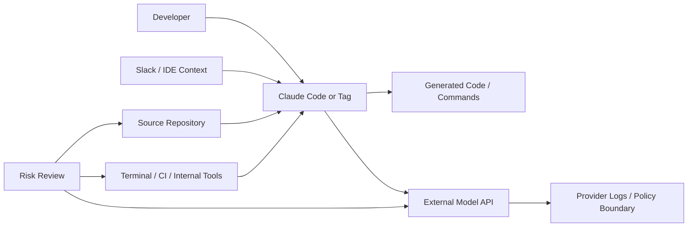

사내 개발자가 쓰던 Claude Code가 갑자기 금지 대상이 되면, 문제는 모델 성능에 그치지 않는다. 회사 코드를 읽고, 터미널을 열고, 외부 API와 대화하는 AI 코딩 에이전트를 조직이 어디까지 직원의 도구로 볼지 정해야 한다.

Reuters가 2026년 7월 3일 보도한 쟁점은 Alibaba가 Claude Code를 업무 환경에서 금지하려 한다는 내용이다. 이유로 제시된 표현은 alleged backdoor risks, 즉 백도어 위험 의혹이다. 확인된 사실은 여기까지다. Reuters는 출처를 인용해 보도했고, Hacker News에서는 해당 기사에 329점과 278개 댓글이 붙었다. Alibaba의 공식 상세 정책 문서, 차단 범위, 적용 조직, 탐지 방식은 공개 자료만으로 확인되지 않았다.

이 사건을 한 회사의 보안 민감성으로만 읽으면 쟁점이 좁아진다. 핵심은 AI 코딩 에이전트가 IDE 플러그인을 넘어 사내 권한을 가진 주체처럼 움직이기 시작했다는 점이다.

## Claude Code 금지는 모델 불신이 아니라 권한 불신이다

Claude Code 같은 도구는 단순한 챗봇이 아니다. 코드를 읽고, 변경안을 만들고, 명령어 실행을 제안하거나 수행하고, 레포지토리 맥락을 넓게 흡수한다. Anthropic은 2026년 6월 30일 Claude Sonnet 5를 소개하며 브라우저와 터미널 같은 도구를 쓰고, 계획을 세우며, 더 자율적으로 작업할 수 있는 모델이라고 설명했다. 가격도 2026년 8월 31일까지 입력 100만 토큰당 2달러, 출력 100만 토큰당 10달러로 시작한다고 밝혔다.

개발자에게는 반가운 변화다. 더 싼 모델이 더 많은 코딩 작업을 처리하면, 팀은 코드 리뷰, 마이그레이션, 테스트 보강, 문서 정리를 더 자주 맡길 수 있다.

보안팀은 같은 문장을 다르게 듣는다.

더 자율적이라는 말은 더 많은 도구 호출을 뜻한다. 도구 호출이 늘면 권한 표면도 넓어진다. 가격이 낮아지면 호출량이 늘고, 호출량이 늘면 데이터 유출, 프롬프트 인젝션(prompt injection), 공급망 오염, 권한 오남용을 발견하기 전까지 지나가는 작업 수도 늘어난다.

Alibaba가 실제로 Claude Code를 금지한다면, 그 판단의 핵심은 Claude가 나쁜 모델이라는 주장이 아니다. 외부 AI 코딩 에이전트가 사내 코드와 빌드 환경을 읽는 구조를 통제할 준비가 되었는지에 대한 판단이다. 여기서 백도어 위험 의혹은 기술적으로 입증된 특정 취약점일 수도 있고, 외부 도구에 사내 개발 맥락이 흘러가는 구조적 위험을 가리키는 내부 표현일 수도 있다. 공개된 자료만으로 둘 중 하나를 단정할 수 없다.

분명한 것은 하나다. AI 코딩 도구의 보안 검토는 이제 모델 이름이 아니라 권한 모델을 기준으로 해야 한다.

## 왜 개발자 커뮤니티는 반응했나

Hacker News에서 댓글이 붙은 이유는 단순한 미중 기술 갈등 때문만은 아니다. 개발자들은 이 문제를 매일 쓰는 도구의 통제 문제로 읽는다. Claude Code를 막는다는 말은 생산성 도구를 막는다는 뜻이고, 동시에 사내 소스코드 반출 경로 하나를 닫는다는 뜻이다.

불편함은 세 갈래로 갈린다.

첫째는 생산성 손실이다. 코딩 에이전트는 이미 많은 개발자의 작업 흐름에 들어왔다. OpenAI의 codex-plugin-cc 저장소가 GitHub Trending에서 23,823개 스타와 하루 716개 스타를 기록했다는 점은 이 흐름을 보여준다. 이 플러그인은 Claude Code 안에서 Codex를 호출해 리뷰를 맡기거나 작업을 위임하는 구조다. 경쟁 제품을 대체하기보다 서로 연결한다는 점이 중요하다. 개발자는 하나의 모델을 고르는 대신 여러 에이전트를 조합하려 한다.

둘째는 통제 불가능성이다. 한 도구 안에서 다른 도구를 부르고, 그 도구가 다시 코드를 읽고 리뷰를 수행하면 경계가 흐려진다. 사내 정책이 Claude Code 사용은 허용하지만 Codex 호출은 막는 구조라면, 플러그인과 서브에이전트는 정책 집행을 어렵게 만든다. 금지가 투박해 보이는 이유도 여기에 있다. 섬세한 권한 제어가 없으면 조직은 허용 또는 차단이라는 거친 선택지만 갖는다.

셋째는 신뢰 기준의 차이다. 개발자는 산출물 품질과 속도를 본다. 보안팀은 데이터 이동과 감사 로그를 본다. 플랫폼팀은 네트워크 경로, 토큰 저장 위치, 실행 권한, 플러그인 설치 경로를 본다. 같은 Claude Code를 두고 한쪽은 페어 프로그래머를 보고, 다른 쪽은 사내 권한을 가진 외부 자동화 계정을 본다.

이 충돌은 개발자의 무지나 보안팀의 보수성으로 설명되지 않는다. 양쪽의 우려가 모두 현실에 닿아 있다. 문제는 조직이 이 도구를 사람의 보조 도구로 취급하면서도, 실제로는 자동화된 권한 주체처럼 굴러가게 둔 데 있다.

## Slack에 들어온 Claude는 보안 경계를 더 흐리게 만든다

Anthropic이 2026년 6월 23일 공개한 Claude Tag는 이 논쟁을 더 선명하게 만든다. Claude를 Slack 채널에 초대하고, 선택한 채널과 도구, 데이터, 코드베이스에 접근권을 줄 수 있다. 사용자는 @Claude를 태그해 작업을 맡기고, Claude는 채널 맥락을 기억하며 나중에 수행할 작업을 계획할 수 있다. Anthropic은 내부 버전의 Claude Tag가 제품팀 코드의 65%를 생성한다고 밝혔다.

이 수치는 단순한 홍보 문구로만 보기 어렵다. AI 에이전트가 개인 IDE를 넘어 팀 협업 공간으로 들어왔다는 신호다.

Slack 채널은 원래 사람이 읽는 공간이었다. 여기에 에이전트가 들어오면 채널은 권한 입력창이 된다. 누군가가 고객 이슈, 장애 로그, 내부 설계, 임시 토큰, 배포 절차를 한 스레드에 남긴다. Claude는 그 맥락을 바탕으로 작업을 계획한다. 연결된 도구가 많을수록 결과물은 좋아진다. 동시에 실수 한 번의 반경도 커진다.

이 그림에서 가장 위험한 선은 하나로 좁혀지지 않는다. Slack 맥락이 모델로 가는 선, 레포지토리가 모델로 가는 선, 터미널 권한이 에이전트로 가는 선, 외부 API 경계로 나가는 선이 함께 위험을 만든다.

Alibaba식 금지는 이 선들을 한 번에 끊는 방법이다. 거칠지만 이해할 수는 있다. 다만 대부분의 조직이 계속 그렇게 살 수는 없다. 코딩 에이전트를 전면 차단하면 경쟁력 있는 개발 워크플로도 함께 막힌다. 전면 허용하면 데이터와 권한의 이동을 설명하지 못한다.

앞으로 필요한 것은 모델 허용 목록이 아니라 작업별 권한 등급이다.

예를 들어 읽기 전용 코드 리뷰는 허용할 수 있다. 비공개 레포 전체 인덱싱은 별도 승인이 필요하다. 터미널 실행은 샌드박스 안에서만 허용한다. 배포 키, 고객 데이터, 보안 취약점 리포트가 포함된 채널은 에이전트 접근을 차단한다. 외부 모델 호출 로그와 프롬프트 보존 정책은 구매 전에 확인한다.

이 정도 규칙도 없다면 금지가 가장 정직한 정책이다.

## 백도어라는 단어가 가리는 실제 위험

이번 보도에서 가장 강한 단어는 백도어다. 하지만 공개 정보만 놓고 보면 특정 코드 백도어가 발견됐다고 단정할 근거는 부족하다. alleged라는 표현은 의혹 단계임을 뜻한다. 따라서 이 글에서 백도어 위험은 확인된 취약점이 아니라, 외부 에이전트가 사내 권한과 데이터를 다루는 구조적 위험까지 포함한 표현으로 다뤄야 한다.

실제 사례는 이미 있다. WIRED는 2026년 보안 연구자 Ian Carroll이 Claude Opus 4.7의 도움을 받아 Front Gate Tickets 웹사이트에서 취약점을 찾았다고 보도했다. Front Gate는 Lollapalooza, Bonnaroo, South by Southwest, Austin City Limits 같은 미국 주요 음악 페스티벌 티켓팅에 쓰이는 시스템이다. 보도에 따르면 연구자는 이 취약점으로 수백만 건의 고객 또는 직원 기록에 접근하고, 어떤 이벤트의 어떤 티켓이든 발급할 수 있는 수준의 권한을 얻을 수 있었다. 그는 이를 악용하지 않고 신고했고, 회사는 패치했다고 밝혔다.

이 사례를 AI가 해커가 됐다는 공포담으로 소비하면 핵심을 놓친다. 더 정확한 교훈은 AI가 탐색 속도를 바꿨다는 것이다. 취약점은 기존 웹 애플리케이션에 있었다. Claude는 탐색과 추론을 가속했다. 방어팀에도 같은 도구가 필요하지만, 공격자도 같은 속도를 얻는다.

Anthropic도 이 위험을 알고 있다. 2026년 7월 2일 Fable 5 관련 발표에서 사이버 보안 분류기와 jailbreak severity framework 초안을 공개했다. 위험한 사이버 보안 사용을 탐지하고 차단하는 분류기를 설명했고, jailbreak가 얼마나 심각한지 산업과 정부가 공통 언어로 말할 필요가 있다고 했다. HackerOne 프로그램도 열었다.

이런 안전장치는 필요하지만 사내 보안 정책을 대신하지는 못한다. 모델 제공자의 분류기는 모델 출력의 위험을 줄인다. 기업의 접근 제어는 어떤 데이터가 모델에 들어가는지, 어떤 명령이 실행되는지, 어떤 로그가 남는지를 정한다. 둘은 다른 계층이다.

모델 회사가 안전하다고 말해도, 기업은 자기 코드와 고객 데이터의 이동 경로를 직접 증명해야 한다.

## 실무자가 확인해야 할 것은 금지 여부가 아니다

이 사건에서 조직이 배워야 할 질문은 Claude Code를 막을 것인가가 아니다. 어떤 조건이면 AI 코딩 에이전트를 업무 시스템에 넣을 수 있는가다.

먼저 데이터 경계를 확인해야 한다. 프롬프트, 파일 내용, 코드 조각, 터미널 출력, 오류 로그가 외부 제공자에게 전송되는지 확인해야 한다. 전송된다면 보존 기간, 학습 사용 여부, 지역, 삭제 요청 절차가 계약과 설정에 박혀 있어야 한다. 민감 레포와 일반 레포를 같은 정책으로 묶으면 안 된다.

다음은 실행 권한이다. 코딩 에이전트가 명령어를 실행할 수 있다면 기본값은 읽기 전용이어야 한다. 쓰기 작업, 패키지 설치, 네트워크 호출, 배포 관련 명령은 승인 단계를 분리해야 한다. 에이전트가 만든 코드보다 에이전트가 실행한 명령이 더 위험한 경우가 많다.

플러그인 체인도 봐야 한다. Claude Code 안에서 Codex를 부르는 구조처럼, 개발 도구는 서로를 연결하기 시작했다. 기업 정책이 특정 도구만 검토하고 플러그인을 놓치면 우회로가 생긴다. 허용 목록은 앱 이름이 아니라 호출 경로와 데이터 흐름 기준으로 작성해야 한다.

마지막은 감사 가능성이다. 누가 어떤 프롬프트로 어떤 파일을 읽었고, 어떤 명령이 실행됐으며, 어떤 결과가 외부로 나갔는지 남아야 한다. 로그가 없으면 사고 대응은 추정이 된다. 추정으로는 규제기관, 고객, 내부 보안 심사를 설득할 수 없다.

Alibaba의 선택이 과한지 아닌지는 아직 판단하기 이르다. 공개된 정보가 적고, Reuters 보도도 source says 수준이다. 다만 금지라는 반응이 나온 배경은 충분히 이해된다. AI 코딩 에이전트는 생산성 도구인 동시에 데이터 이동 장치이고, 협업 도구인 동시에 권한 실행 장치다.

처음 질문으로 돌아오면 답은 명확하다. Claude Code를 직원의 도구로만 보면 정책은 실패한다. 사내 권한을 가진 자동화 주체로 다뤄야 한다. 그 기준을 세운 조직은 AI 코딩 도구를 쓸 수 있고, 기준이 없는 조직은 막는 편이 낫다. 불편하지만 그게 더 정직한 선택이다.

## 참고 자료

- [선정 글감] [Alibaba to ban Claude Code in workplace over alleged backdoor risks, source says](https://www.reuters.com/world/china/alibaba-ban-claude-code-workplace-over-alleged-backdoor-risks-source-says-2026-07-03/) - Reuters
- [관련] [Introducing Claude Sonnet 5](https://www.anthropic.com/news/claude-sonnet-5) - Anthropic News
- [관련] [Introducing Claude Tag](https://www.anthropic.com/news/introducing-claude-tag) - Anthropic News
- [관련] [openai/codex-plugin-cc](https://github.com/openai/codex-plugin-cc) - GitHub
- [관련] [Claude Helped a Hacker Find a Way to Issue Tickets to Almost Every US Music Festival](https://www.wired.com/story/claude-helped-a-hacker-find-a-way-to-issue-tickets-to-almost-every-us-music-festival/) - WIRED
- [관련] [More details on Fable 5’s cyber safeguards and our jailbreak framework](https://www.anthropic.com/news/fable-safeguards-jailbreak-framework) - Anthropic News