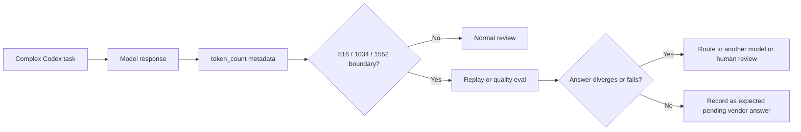

Codex GPT-5.5 reasoning tokens 논란의 핵심은 한 번의 오답이 아니다. 사용자가 볼 수 없는 예산 경계가 516, 1034, 1552 같은 숫자로 드러난 것처럼 보였고, 그 경계가 복잡한 Codex 작업의 성능 저하와 겹쳤다는 점이다.

모델이 틀릴 수 있다는 사실은 모두 안다. 더 불편한 문제는 왜 틀렸는지 추적할 수 없는 상태에서, 에이전트가 조용히 덜 판단한 것처럼 보이는 순간이다.

## Codex GPT-5.5 516 토큰 논란은 성능보다 신뢰 문제다

2026년 6월 27일, GitHub의 `openai/codex` 공개 저장소에 이슈 #30364가 올라왔다. 작성자는 2026년 2월 1일부터 6월 27일까지의 Codex `token_count` 메타데이터를 분석했고, GPT-5.5 응답이 `reasoning_output_tokens = 516`에 비정상적으로 몰린다고 주장했다.

제시된 표본은 응답 단위 토큰 기록 390,195건, 세션 865개다. 그중 정확히 516 reasoning tokens로 끝난 이벤트는 3,363건이었다. 작성자 주장에 따르면 GPT-5.5는 전체 응답의 19.3%였지만, 정확히 516으로 끝난 이벤트의 82.0%를 차지했다. `reasoning_output_tokens >= 516`인 응답 중 정확히 516에 멈춘 비율은 GPT-5.5가 44.0%, 비 GPT-5.5 기준선은 1.3%였다.

월별 변화도 작지 않다. 정확히 516에 걸리는 비율은 2026년 2월 0.11%, 3월 2.45%, 4월 4.25%였고, 5월에는 53.30%, 6월에는 35.84%로 튀었다. 같은 기간 평균 reasoning tokens는 2월 268.1에서 5월 106.9로 내려갔고, P90도 772에서 344로 낮아졌다.

이 숫자가 사실이라면 논점은 단순한 비용 절감 의혹이 아니다. 복잡한 작업에서 판단 예산이 갑자기 납작해졌는데, 사용자에게 그 이유가 설명되지 않는 구조다.

확인된 사실은 제한적이다. 공개 이슈에는 `bug`, `model-behavior`, `rate-limits` 라벨이 붙어 있고, 작성자가 집계한 수치가 올라와 있다. Hacker News에서도 이 링크가 225포인트와 78개 댓글을 모으며 논의됐다. 다만 OpenAI가 해당 분포의 원인을 공식 확인하거나, hidden chain-of-thought truncation을 인정한 것은 아니다.

추정은 따로 봐야 한다. 작성자도 숨은 추론 체인이 잘렸다고 단정하지 않았다. 더 좁은 주장은 GPT-5.5에 특정된 고정 토큰 클러스터링이 있고, 이 패턴이 reasoning budget, routing, truncation, fallback, scheduler 같은 내부 동작과 맞물렸을 가능성이 있다는 것이다.

## 왜 개발자들은 고정 토큰 경계를 싫어하나

코딩 에이전트에서 가장 위험한 실패는 크게 틀리는 답이 아니다. 충분히 그럴듯해서 리뷰를 통과하는 답이다.

고정 경계가 의심받는 이유는 여기에 있다. 작업 난이도에 따라 reasoning tokens가 자연스럽게 흩어지는 대신 특정 숫자에 몰리면, 사용자는 내부 스케줄러가 작업을 끊었는지, 예산을 줄였는지, 낮은 티어로 라우팅했는지 알 수 없다. 같은 프롬프트를 다시 실행했을 때 답이 달라지는 현상보다 더 까다롭다. 원인을 재현하기 어렵고, 실패를 로그로 설명하기도 어렵다.

OpenAI가 2026년 6월 22일 공개한 Codex 장기 작업 가이드는 조직이 단일 프롬프트를 넘어 지속되는 작업에 Codex를 쓰는 흐름을 전제로 한다. 큰 목표를 검증 가능한 단계로 나누고, 여러 작업 흐름의 연속성을 유지하며, 언제 Codex에 실행을 맡기고 언제 사람이 감독해야 하는지 구분하라는 내용이다.

이 관점에서 516 토큰 논란은 더 날카로워진다. 장기 작업일수록 에이전트는 단순 답변자가 아니라 작업 상태를 이어받는 실행자다. 실행자가 어느 순간 내부 예산 경계에 걸려 짧게 판단했는데, 사용자는 최종 답만 받는다면 감독 지점이 사라진다.

Reddit LocalLLaMA의 긴 컨텍스트 벤치마크 글도 같은 불편함을 다른 각도에서 보여준다. 작성자는 65K-128K 컨텍스트에서 13개 모델을 비교하며, 에이전트형 작업에서는 토큰 생성 속도보다 prefill, KV cache, 컨텍스트가 찼을 때의 동작이 더 크게 작용한다고 설명했다. 커뮤니티가 모델 이름보다 실행 특성에 집착하는 이유가 여기에 있다. 긴 컨텍스트와 도구 사용에서는 표면 성능보다 내부 병목이 실패를 만든다.

한쪽은 폐쇄형 Codex의 reasoning token 분포를 보고 불안해한다. 다른 한쪽은 로컬 모델의 긴 컨텍스트 병목을 직접 재며 의심한다. 방향은 다르지만 질문은 같다.

에이전트가 실제로 어디서 멈추는가.

## 확인해야 할 것은 516 자체가 아니라 516 이후의 품질 차이다

516이라는 숫자만으로 버그를 증명할 수는 없다. 내부 시스템은 버킷 단위로 토큰을 집계할 수 있고, 특정 라우팅 정책이 정상 동작으로 고정값을 만들 수도 있다. 모델별 reporting 방식이 달라서 같은 현상이 한 모델에서만 더 선명하게 보였을 가능성도 있다.

그래도 이 이슈를 그냥 노이즈로 넘기면 안 된다. 작성자가 제시한 데이터는 자연 분포라기보다 임계값처럼 보인다. 특히 GPT-5.5가 전체 응답의 19.3%인데 정확히 516 이벤트의 82.0%를 차지한다는 비율은 설명이 필요하다. GPT-5.2의 exact-516 / >=516 비율이 0.34%, Codex-specific variant들이 0.0%로 제시된 점도 모델별 차이를 강하게 만든다.

실무에서 봐야 할 지표는 단순하다.

- 모델별 `reasoning_output_tokens = 516` 비율
- `>= 516` 응답 중 정확히 516에 멈춘 비율
- 정확히 516인 응답과 더 긴 reasoning 응답의 품질 차이
- 복잡한 작업, 고위험 작업, 대규모 diff 작업에서의 재실행 결과 차이
- 같은 입력을 GPT-5.2, GPT-5.4, GPT-5.5, Codex-specific 모델로 replay했을 때의 정답률

토큰 수는 품질의 대리 지표가 아니다. 하지만 갑자기 생긴 고정 경계는 운영 경보로 쓸 수 있다. 품질 평가와 묶었을 때만 의미가 생긴다.

이 흐름은 거창한 모니터링 플랫폼을 요구하지 않는다. 이미 남는 메타데이터가 있다면 경계값과 실패율을 같이 보라는 뜻이다. 실패율 없이 경계값만 보면 음모론이 되고, 경계값 없이 실패율만 보면 원인을 놓친다.

## Codex 성능 저하 논란의 실무 판단 기준

이 이슈에서 가장 나쁜 대응은 두 가지다. 하나는 516이라는 숫자만 보고 GPT-5.5를 불신하는 것. 다른 하나는 공식 확인이 없다는 이유로 운영 리스크를 접어두는 것.

현재 기준에서 합리적인 판단은 중간이 아니라 조건부다. 복잡한 코드 변경, 보안 민감 작업, 데이터 삭제 가능성이 있는 자동화, 대규모 리팩터링에는 exact-boundary 응답을 별도 검토 대상으로 둔다. 단순 문서 수정이나 작은 코드 변경에는 과한 절차를 붙이지 않는다.

Codex를 비대화형 작업자로 쓰는 환경에서는 더 엄격해야 한다. 사람이 중간에 질문을 받지 않는 구조라면, 에이전트가 내부 한계에 걸렸을 때도 계속 전진한다. 이때 필요한 것은 더 긴 프롬프트가 아니라 작은 중단 조건이다. 특정 reasoning token 경계, 비정상적으로 짧은 reasoning, 반복 실패, 큰 diff 같은 신호가 겹치면 자동 발행이나 자동 머지를 멈춰야 한다.

반대 관점도 분명하다. reasoning tokens는 모델 내부 품질을 그대로 보여주는 계기판이 아니다. 공급자는 안전, 비용, 지연 시간, 라우팅, 캐시 전략을 조합해 서비스를 운영한다. 특정 숫자에 몰린다고 해서 사용자에게 손해가 발생했다고 말할 수는 없다. 작성자 데이터도 단일 사용자의 메타데이터 집계일 가능성이 있고, 전체 Codex 트래픽을 대표한다고 보기 어렵다.

그 한계에도 이 이슈가 커뮤니티에서 반응을 얻은 이유는 충분하다. 개발자는 모델의 생각을 읽고 싶은 것이 아니다. 실패했을 때 어느 층에서 실패했는지 알고 싶다. 모델 품질 문제인지, 예산 문제인지, 라우팅 문제인지, 사용자의 프롬프트 문제인지 구분할 수 있어야 운영 판단을 내린다.

첫 문단의 질문으로 돌아오면 답은 단순하다. 516 토큰은 그 자체로 유죄가 아니다. 그러나 설명되지 않는 고정 경계가 복잡한 Codex 작업의 실패와 겹친다면, 그 경계는 운영 리스크다.

코딩 에이전트는 더 많은 일을 대신할수록 더 많은 해명을 요구받는다. 사용자는 완벽한 모델을 요구하지 않는다. 멈춘 위치를 숨기지 않는 시스템을 요구한다.

## 참고 자료

- [선정 글감] [GPT-5.5 Codex reasoning-token clustering may be leading to degraded performance](https://github.com/openai/codex/issues/30364) — Hacker News Best
- [관련] [Codex-maxxing for long-running work](https://openai.com/index/codex-maxxing-long-running-work) — OpenAI Blog
- [관련] [I benchmarked 13 models at 65K-128K context to find out what actually matters for agentic workloads](https://www.reddit.com/r/LocalLLaMA/comments/1unrse9/i_benchmarked_13_models_at_65k128k_context_to/) — Reddit LocalLLaMA