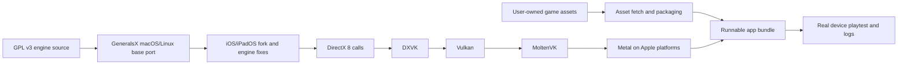

첫 줄부터 긴장감이 있다. 2003년에 나온 Command & Conquer Generals: Zero Hour가 Apple Silicon Mac, iPhone, iPad에서 네이티브로 돈다는 소식은 단순한 복고 게임 포팅으로 끝나지 않는다. 더 날카로운 쟁점은 작업 방식이다. 이 포트의 README는 엔진 포팅과 수정 작업이 Claude Code의 Fable 모델, 인간 디렉션, 실제 기기 플레이테스트를 거쳐 만들어졌다고 밝힌다.

사람들은 게임보다 먼저 작업 방식에 반응했다. GPL로 공개된 옛 엔진, 별도 보유가 필요한 상용 게임 에셋, DirectX 8에서 Metal까지 이어지는 그래픽 변환층, 코딩 에이전트가 남긴 대형 포팅 로그가 한 화면에 같이 놓였다. Hacker News에서 이 글감이 482포인트와 192개 댓글을 모은 이유도 여기에 있다. “AI가 게임을 포팅했다”는 식의 요약보다, 오래된 코드베이스의 운영 리스크를 어디까지 자동화에 맡길 수 있는지가 핵심에 가깝다.

## AI 포팅은 성공담보다 책임 경계가 먼저 보인다

확인된 사실부터 분리해야 한다. 이 프로젝트는 Command & Conquer Generals: Zero Hour를 macOS, iOS, iPadOS에서 네이티브로 실행하는 포트다. README는 에뮬레이션이 아니라고 못 박고, 2003년 엔진을 ARM64로 컴파일했다고 설명한다. 렌더링 경로는 DirectX 8 → DXVK → Vulkan → MoltenVK → Metal이다.

코드 기반은 EA의 GPL v3 소스 공개와 fbraz3/GeneralsX의 macOS/Linux 포트 위에 있다. 이번 fork는 iOS/iPadOS 포트와 엔진 수정들을 더했다. 게임 에셋은 포함하지 않는다. 사용자는 Steam 등에서 자신이 보유한 사본을 가져와야 하며, README는 약 5달러 세일 가격을 예로 든다.

이 범위는 중요하다. 엔진 코드는 GPL v3로 다룰 수 있지만, 게임 데이터는 별개의 저작권 자산이다. 그래서 프로젝트는 “실행 가능한 포트”와 “상용 에셋 배포” 사이에 선을 긋는다. 개발자 커뮤니티가 이런 프로젝트에 민감하게 반응하는 지점도 이 선이다. 누가 코드를 만들었는지보다, 결과물이 어떤 라이선스와 배포 경계 안에 서 있는지가 먼저 검증되어야 한다.

추정과 해석도 나눠야 한다. README가 말하는 것은 “Fable 모델과 Claude Code가 엔지니어링을 수행했고, 인간이 지시하고 실제 기기에서 플레이테스트했다”는 프로젝트 기록이다. 이것만으로 모델이 독립적으로 포팅을 완수했다는 뜻은 아니다. 빌드 스크립트, 패치, 실제 기기 검증, 에셋 획득, 릴리스 체크리스트가 함께 있어야 굴러가는 작업이다.

모델은 코드를 만들었고, 사람은 책임 경계를 잡았다.

## 네이티브 포트가 반가운 이유, 동시에 불안한 이유

이 프로젝트가 반가운 이유는 명확하다. 오래된 Windows 게임이 최신 Apple 플랫폼에서 실행된다. Mac에서는 Xcode command line tools, CMake, Ninja, Meson, pkgconf, SteamCMD, vcpkg, LunarG Vulkan SDK가 필요하다. iPhone과 iPad에서는 full Xcode, XcodeGen, Apple Developer team, MoltenVK framework, Liberation fonts, 서명과 설치 과정까지 붙는다.

이 복잡도 자체가 커뮤니티의 흥분을 만든다. 단순히 바이너리를 감싼 것이 아니라, 빌드와 배포 경로를 드러낸다. `scripts/get-assets.sh`는 사용자의 Steam 계정에서 보유한 게임 데이터를 가져오고, iOS 패키징은 앱 번들 안에 에셋을 넣어 self-contained install을 만든다. `--dev` 옵션은 약 2.7GB 복사를 건너뛰어 빠른 코드 반복을 돕는다.

불안한 지점도 같은 곳에서 나온다. 포팅 체인이 길다. DirectX 8 게임을 DXVK, Vulkan, MoltenVK, Metal 위로 통과시키면 한 레이어의 버그가 다음 레이어의 증상처럼 보일 수 있다. README의 알려진 문제는 이 위험을 숨기지 않는다. iPad의 긴 세션은 resident memory가 3GB 이상으로 커지며 iOS에 의해 종료될 수 있다. 앱은 대화상자 없이 홈 화면으로 빠질 수 있고, 로그는 Files 앱 안의 게임 폴더에 남는다. 백그라운드 전환 중 드물게 crash가 남아 있으며, README는 “save often”이라고 말한다.

이 문장은 작지만 핵심이다. 포팅 품질은 데모 영상보다 알려진 실패 모드의 정직함으로 판단해야 한다. 검은 미니맵, 음소거된 EVA 음성, chirp 같은 버그 고고학을 문서화했다는 점은 홍보 문구보다 강하다. 오래된 엔진 포팅에 필요한 것은 영웅담이 아니라 재현 가능한 실패 기록이다.

## 비용 절감 꼼수처럼 보이는 pxpipe가 같은 질문을 던진다

보조 사례인 pxpipe도 같은 축에 있다. pxpipe는 Claude Code의 bulky context를 텍스트 대신 PNG 이미지로 렌더링해 입력 토큰 비용을 줄이는 로컬 프록시다. 프로젝트 설명에 따르면 이미지 토큰 비용은 픽셀 크기에 의해 고정되고, 텍스트가 많이 들어간 코드·JSON·툴 출력은 이미지 안에 압축해 넣을 때 더 싸게 전달될 수 있다.

수치가 구체적이다. pxpipe는 실제 Claude Code 트래픽에서 이미지 토큰당 약 3.1 characters를 담았고, 텍스트 토큰은 약 1 character 수준이었다고 설명한다. 같은 시스템 프롬프트와 도구 문서, 히스토리 약 4만 8천 characters가 텍스트로는 약 2만 5천 tokens지만, 이미지로는 약 2천 7백 image tokens였다는 예시를 제시한다. 데모에서는 세션 비용이 42.21달러에서 6.06달러로 줄었고, context 사용량도 96% 근처 대신 73.5k/1M에 머물렀다고 주장한다.

이 사례가 C&C 포트와 연결되는 이유는 비용 자체가 아니다. 코딩 에이전트를 실무 도구로 쓰기 시작하면 입력 컨텍스트를 줄였을 때 모델이 무엇을 놓치는지, 모델이 읽었다고 말한 내용이 실제로 검증 가능한지, 비용 최적화가 품질과 책임 경계를 흐리지 않는지를 곧바로 따져야 한다.

pxpipe는 자기 한계도 같이 적는다. Fable 5 기본 reader에서는 100/100 벤치마크를 제시하지만, Opus 4.8에서는 imaged phrase-count를 읽지 못했고 그래서 opt-in이라고 설명한다. 한 데모에서는 요청된 one-line output format을 맞추려면 pxpipe 쪽에 nudge가 필요했다는 caveat도 남겼다.

이 caveat가 더 많은 것을 말한다. 작업 파이프라인에서 비용을 줄이는 트릭은 곧 검증 비용을 만든다. 이미지로 바꾼 컨텍스트가 싸게 먹히는 순간, 팀은 “모델이 이미지를 정확히 읽었는지”를 새로 검사해야 한다. 포팅 작업도 마찬가지다. 자동 수정된 엔진 코드는 빌드 성공으로 끝나지 않는다. 실제 기기, 긴 세션, 백그라운드 전환, 메모리 압력, 라이선스 경계까지 통과해야 한다.

## 개발자가 봐야 할 것은 AI의 속도가 아니라 감사 가능성이다

이번 사건에서 실무자가 가져갈 판단은 분명하다. 코딩 에이전트는 이제 작은 함수 자동완성 도구에 머물지 않는다. 낡은 C++ 게임 엔진을 현대 Apple 플랫폼으로 옮기는 작업에도 들어온다. 그러면 평가 기준도 바뀌어야 한다. “잘 만들었나”보다 “나중에 깨졌을 때 추적할 수 있나”가 먼저다.

C&C 포트 README가 강한 이유는 명령어와 경계를 숨기지 않기 때문이다. macOS와 iOS 빌드 절차가 분리되어 있고, vcpkg는 shallow clone이 manifest baseline을 깨뜨린다고 적는다. Vulkan SDK는 Homebrew cask가 아니라 LunarG 배포본을 요구한다. iOS에서는 DXVK submodule, MoltenVK checksum, fonts staging, signing, bundle id, team id가 드러난다.

이런 디테일은 문서 장식이 아니다. 자동화가 개입한 작업일수록 재현 가능한 절차가 품질의 일부가 된다. 어떤 모델이 만들었는지보다, 어떤 입력과 어떤 패치와 어떤 실패 기록이 남았는지가 더 오래 간다.

다만 이 프로젝트는 특정 게임, 특정 플랫폼, 특정 소스 공개 조건이 맞아떨어진 사례다. 모든 상용 게임에 적용할 수 있는 일반 공식이 아니다. 에셋은 여전히 배포할 수 없고, iOS 메모리와 lifecycle crash도 해결된 문제가 아니다. 오래된 코드베이스를 빠르게 건드릴 수 있다는 사실은, 그 코드가 제품 수준으로 안전하다는 보증이 아니다.

팀이 비슷한 접근을 검토한다면 확인 순서는 간단해야 한다. 라이선스가 먼저다. 그다음 빌드 재현성이다. 그다음 런타임 실패 모드다. 마지막이 비용 최적화다. pxpipe 같은 도구는 비용을 줄일 수 있지만, 검증 장치 없이 컨텍스트 표현 방식을 바꾸면 디버깅 표면만 늘어난다.

## 오래된 코드는 AI에게 쉬운 문제가 아니다

처음의 긴장으로 돌아가자. 2003년 게임이 iPad에서 네이티브로 돌아간다는 사실은 멋지다. 그러나 이 사건의 가치는 향수에 있지 않다. 낡은 코드, 최신 플랫폼, 상용 에셋, GPL 엔진, 코딩 에이전트, 비용 최적화 압박이 한 번에 얽혔다는 데 있다.

여기서 필요한 태도는 낙관론도 냉소도 아니다. 결과물을 실행해 보고, 문서를 따라 빌드해 보고, 알려진 실패를 확인하고, 라이선스 경계를 검토하는 쪽이 맞다. 자동화된 포트가 의미 있으려면 사람이 검증 가능한 형태로 남겨야 한다.

C&C Generals 포트가 던진 질문은 하나다. 모델이 코드를 쓸 수 있느냐가 아니다. 그렇게 만들어진 변경을 우리가 소유하고 운영할 수 있느냐다. 그 답은 모델 이름이 아니라 로그, 체크리스트, 라이선스, 테스트 가능한 실패 기록에 있다.

## 참고 자료

- [선정 글감] [Command and Conquer Generals natively ported to macOS, iPhone, iPad using Fable](https://github.com/ammaarreshi/Generals-Mac-iOS-iPad/tree/main) — Hacker News Best
- [관련] [60% Fable cost cut by converting code to images and having the model OCR it](https://github.com/teamchong/pxpipe) — Hacker News Best