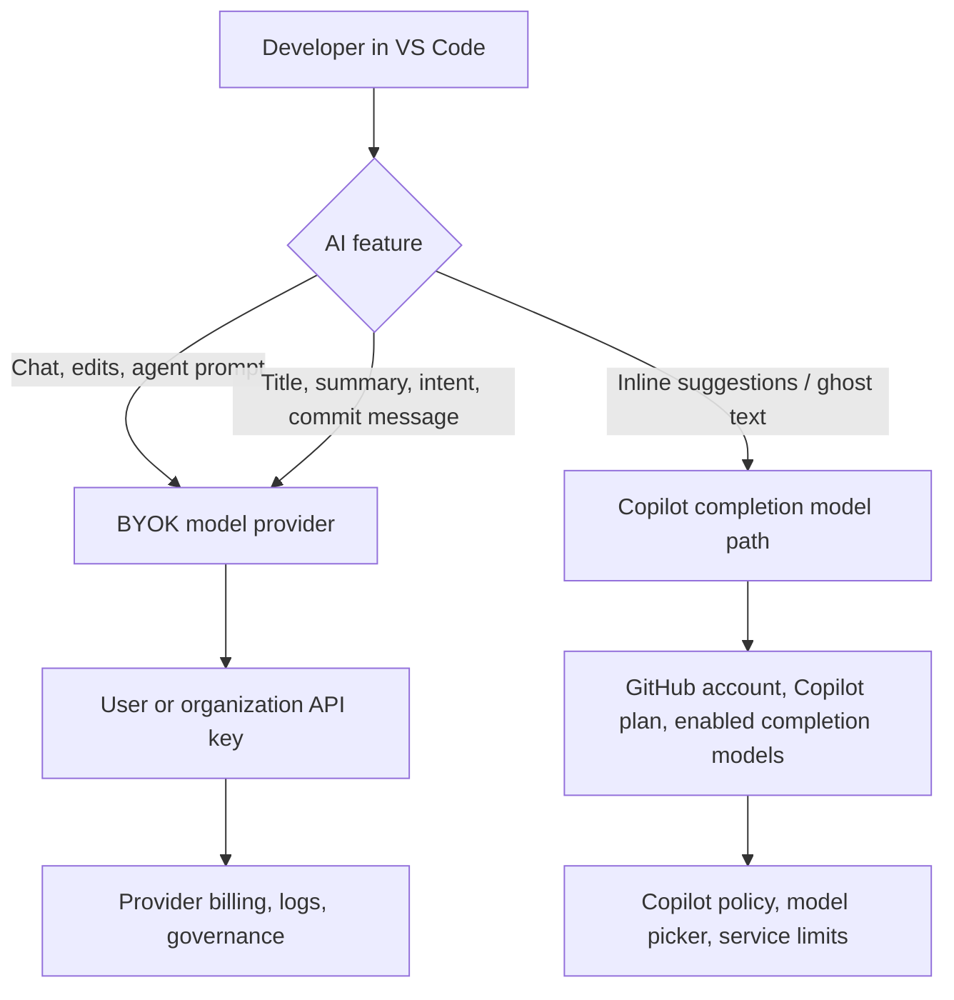

GitHub Copilot BYOK와 inline completion 논쟁은 모델 선택 UI의 불편만이 아니다. 개발자가 자기 API 키와 모델을 연결했는데 가장 자주 보는 ghost text 자동완성에는 그 모델을 쓰지 못한다면, BYOK는 채팅에만 열린 우회 경로에 가까워진다.

Reddit LocalLLaMA에 올라온 문제 제기는 이 지점을 짚는다. Copilot은 BYOK를 통해 Chat 창에서는 커스텀 모델을 허용하지만, 같은 모델을 inline code auto-completion에는 쓰지 못하게 한다는 주장이다. 글감 요약에 따르면 VS Code 쪽 설명은 성숙한 FIM(Fill-in-the-Middle) 모델이 부족하다는 쪽이었다. 게시자는 그 책임을 플랫폼이 대신 막을 일이 아니라 사용자 설정 오류와 명확한 fallback으로 처리할 일이라고 본다.

이 반응이 붙은 이유는 단순하다.

개발자는 채팅보다 자동완성을 더 자주 본다. Chat은 요청할 때만 열리지만, inline completion은 커서가 움직일 때마다 개발 흐름에 끼어든다. BYOK 범위에서 이 기능이 빠지면 사용자가 체감하는 코딩 보조의 핵심은 여전히 플랫폼이 고른 모델과 계정 정책에 묶인다.

## 2026년 7월 VS Code 문서는 BYOK의 선을 분명히 그었다

확인된 사실부터 분리해야 한다. 2026년 7월 1일자로 표시된 VS Code 공식 문서는 BYOK를 채팅 경험과 유틸리티 작업에 적용한다고 설명한다. 같은 문서는 semantic search, inline suggestions, embeddings 같은 기능은 여전히 GitHub 계정이 필요하다고 적는다. 로컬 모델도 chat에서는 쓸 수 있지만 inline suggestions에는 연결할 수 없다고 선을 긋는다.

GitHub 문서도 비슷한 그림을 만든다. 조직 관리자는 Anthropic, AWS Bedrock, Google AI Studio, Microsoft Foundry, OpenAI, OpenAI-compatible providers, xAI 같은 제공자의 API 키를 Copilot에 붙일 수 있다. 이 기능은 public preview이고 바뀔 수 있다. 문서가 밝힌 목적은 governance, data security, compliance, cost management, visibility, flexibility다.

문제는 문서의 언어가 사용자 경험과 다르게 읽힌다는 점이다. 조직 BYOK 문서는 Copilot Chat, Copilot CLI, VS Code에서 선호 모델을 쓰게 한다고 말한다. VS Code 문서는 그중에서도 BYOK가 채팅과 유틸리티에 한정되고, inline suggestions는 제외된다고 말한다. 둘 다 사실일 수 있지만, 개발자가 알고 싶은 답은 더 좁다.

내 키를 넣었으면 ghost text도 내 모델에서 나와야 하는가.

현재 공식 문서 기준 답은 아니다. Chat과 utility tasks는 BYOK 경로를 탈 수 있다. Inline suggestions는 별도 경로다. Copilot completion model picker에서 대체 모델을 고를 수 있는 경우가 있지만, 그 목록은 시점과 제품 정책에 따라 달라지고 BYOK 모델 전체를 뜻하지 않는다.

이 구조를 모르고 BYOK를 도입하면 비용 계산도, 데이터 경로 설명도 틀어진다. 채팅 비용은 자체 provider 청구서에 잡히는데 자동완성은 Copilot 쪽 사용량과 정책에 묶인다. 로컬 모델을 붙여도 chat은 오프라인에 가까워질 수 있지만, inline suggestions는 오프라인 대체물이 아니다.

## FIM 모델 부족은 이유가 되지만, 차단 방식까지 정당화하지는 못한다

FIM은 코드 자동완성에서 까다로운 요구다. 채팅 모델은 보통 프롬프트 뒤에 답을 이어 쓰면 된다. Inline completion은 커서 앞 코드와 커서 뒤 코드를 동시에 보고 중간에 들어갈 토큰을 낮은 지연 시간으로 만들어야 한다. 잘못된 모델을 붙이면 문맥을 무시한 긴 답변, Markdown 섞인 코드, 닫히지 않는 괄호, 보안상 애매한 보일러플레이트가 ghost text로 흘러나온다.

플랫폼이 조심하는 이유는 있다. 자동완성은 사용자가 빠르게 Tab으로 받아들이는 경로다. Chat 답변보다 검토 시간이 짧다. 모델 품질이 낮으면 개발자는 생산성이 떨어졌다고 느끼고, 조직은 잘못된 코드가 조용히 들어갈 위험을 떠안는다.

그렇다고 전면 차단이 유일한 답은 아니다.

커뮤니티가 불편해한 지점은 모델 성능 논쟁이 아니다. 사용자가 가져온 키와 모델을 플랫폼이 이미 Chat에서 받아들였다면, inline completion에서는 capability check, 경고, fallback, provider별 opt-in으로 풀 수 없느냐는 문제다. 특히 LocalLLaMA 쪽 사용자는 모델 선택 실패를 플랫폼 보호가 아니라 실험 권한 제한으로 읽는다. 로컬 모델을 돌리는 사람에게 실패는 제품 결함이 아니라 조정 대상이다.

VS Code에는 확장 API로 inline completion provider를 등록하는 길도 있다. 공식 API 문서는 확장이 ghost text 형태의 inline completions를 제공할 수 있다고 설명한다. 플랫폼 수준에서 불가능한 기능은 아니라는 뜻이다. 다만 Copilot BYOK가 그 경로를 열어주지 않는다.

여기서 정책 판단이 갈린다. GitHub와 VS Code는 Copilot completion 품질과 지원 비용을 통제하고 싶다. LocalLLaMA 쪽 사용자는 모델과 실패 비용을 자신이 통제하고 싶다. 전자는 제품 신뢰를, 후자는 선택권을 중시한다.

## BYOK 도입 검토는 모델명이 아니라 기능별 데이터 경로부터 봐야 한다

팀에서 Copilot BYOK를 검토한다면 첫 질문은 어떤 모델이 좋은가가 아니다. 어떤 기능이 어떤 경로로 나가는지부터 확인해야 한다.

확인 항목은 짧게 잡아도 된다.

- Chat, inline chat, agent 작업, utility tasks, inline suggestions를 나눠서 모델 경로를 적는다.
- BYOK provider의 로그 보관, 학습 사용 여부, 지역, Zero Data Retention 설정을 확인한다.
- Copilot 쪽에 남는 기능은 GitHub 계정, Copilot plan, 조직 policy, editor preview feature 의존성을 따로 적는다.
- `GitHub Copilot: Change Completions Model` 명령에서 실제로 선택 가능한 completion model 목록을 확인한다.
- 로컬 모델을 쓰는 경우 chat과 utility tasks만 기대하고, inline suggestions는 별도 확장이나 Copilot 기본 경로로 분리한다.
- fallback 정책을 정한다. BYOK 모델 장애 시 기본 Copilot 모델로 갈지, 기능을 꺼둘지, 사용자에게 오류를 띄울지 정해야 한다.

이 체크를 안 하면 보안 검토 문서에 빈칸이 생긴다. BYOK로 모든 모델 요청이 조직이 선택한 provider로 간다고 적으면 틀린 설명이 된다. 특히 inline suggestions는 편집 중인 코드 주변 문맥을 자주 다루는 기능이라 데이터 경로 설명이 더 민감하다.

제품팀 입장에서도 풀 수 있는 최소 해법은 거창하지 않다. BYOK 모델에 `supportsFim`, `maxLatency`, `streaming`, `contextWindow`, `stopSequences` 같은 capability metadata를 두고, inline completion opt-in을 별도 표시하면 된다. 응답이 FIM 형식을 만족하지 않으면 명확한 오류를 내고 기본 completion model로 돌아가게 만들 수 있다. 이 방식은 모든 모델을 무조건 허용하지 않는다. 대신 막는 이유를 기능 요구사항으로 바꾼다.

지금의 불만은 기능 부족보다 설명 부족에 가깝다. BYOK라고 부르면서 실제 범위가 chat과 utility tasks에 더 가깝다면, UI와 문서는 그 사실을 첫 화면에서 보여줘야 한다. 사용자가 문제 삼는 것은 Copilot이 기본 모델을 제공한다는 사실이 아니다. 내가 고른 모델이 어디까지 쓰이는지 한눈에 보이지 않는다는 사실이다.

## Copilot BYOK 논쟁이 남긴 기준

이 사안의 판단 기준은 하나다. BYOK는 마케팅 단어가 아니라 운영 계약이어야 한다. 어느 기능이 사용자 키를 쓰고, 어느 기능이 GitHub 서비스를 쓰며, 어느 기능이 오프라인에서 동작하지 않는지 명시해야 한다.

Reddit 게시자가 제안한 방향은 과격하지 않다. 잘못된 모델을 막기보다 검증하고, 실패하면 오류를 내고, 필요하면 fallback을 제공하라는 쪽이다. 이 접근은 개발자 도구의 기본 문법에 가깝다. lint가 실패한다고 파일 저장을 금지하지 않는다. 타입이 틀렸다고 편집기를 닫지 않는다. 대신 어디가 틀렸는지 보여주고 선택권을 둔다.

반대쪽 논리도 무시하기 어렵다. Inline completion은 품질이 낮으면 바로 개발 흐름을 망친다. 조직 환경에서는 한 사용자의 실험이 지원 티켓과 보안 검토 비용으로 바뀐다. GitHub가 completion model 경로를 보수적으로 관리하는 판단에는 제품 책임이 있다.

그래서 이 논쟁의 답은 BYOK 모델을 전부 열라는 구호가 아니다. 기능별 계약을 숨기지 말라는 것이다. Chat BYOK, utility BYOK, completion BYOK는 같은 말이 아니다. 세 항목을 나눠 팔고, 나눠 표시하고, 나눠 검증해야 한다.

처음의 질문으로 돌아가면, 내 키를 넣었는데 ghost text가 내 모델에서 나오지 않는 상황은 버그가 아니라 현재 제품 경계다. 그 경계를 알고 쓰면 운영 판단이다. 그 경계를 BYOK라는 한 단어 뒤에 숨기면 신뢰 문제가 된다.

## 참고 자료

- [선정 글감] [GH Copilot’s BYOK Blocking for Inline Completion Makes No Sense. [THE FIX]](https://www.reddit.com/r/LocalLLaMA/comments/1unxezp/gh_copilots_byok_blocking_for_inline_completion/) — Reddit LocalLLaMA
- [관련] [AI language models in VS Code](https://code.visualstudio.com/docs/agent-customization/language-models) — Visual Studio Code Docs
- [관련] [Using your LLM provider API keys with Copilot](https://docs.github.com/en/copilot/how-tos/administer-copilot/manage-for-organization/use-your-own-api-keys) — GitHub Docs
- [관련] [Changing the AI model for GitHub Copilot inline suggestions](https://docs.github.com/en/copilot/how-tos/use-ai-models/change-the-completion-model) — GitHub Docs
- [관련] [Programmatic Language Features: Show Inline Completions](https://code.visualstudio.com/api/language-extensions/programmatic-language-features#show-inline-completions) — Visual Studio Code API