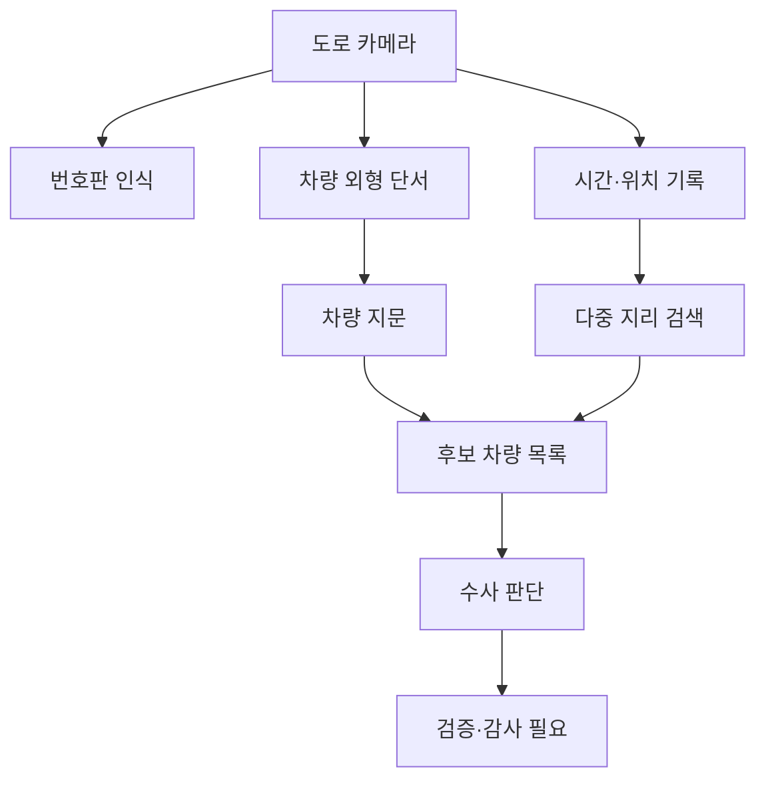

Flock 카메라 논쟁의 핵심은 번호판 인식 실패가 아니다. 번호판이 없어도 차를 찾는 차량 지문, 여러 장소를 묶는 지리 검색, AI 영상 감시가 합쳐지면 추적의 기준이 신원에서 행동으로 옮겨간다. 번호판은 감시의 출발점이 아니라 여러 단서 중 하나가 된다.

## 번호판이 사라져도 차량 지문은 남는다

2026년 7월 3일 Schneier on Security가 소개한 내용은 Flock의 2024년 회사 발표 자료에서 나온다. 발표 자료에 따르면 경찰은 차량의 데칼, 범퍼 스티커, 후면·상단 랙, 임시 태그, 주별 고유 태그 같은 데이터를 볼 수 있다. Flock은 이를 Vehicle Fingerprint라고 부른다.

이 표현이 불편한 이유는 분명하다. 번호판 인식 기술은 적어도 겉으로는 특정 식별자 하나를 읽는 시스템처럼 설명돼 왔다. 차량 지문은 식별자가 불완전해도 추적을 이어가게 만든다. 번호판 일부가 가려졌거나 없거나 잘못 읽혀도, 차의 외형과 부착물과 이동 패턴을 묶어 후보를 좁힌다.

Flock이 경찰에 제공한다는 기능도 같은 방향을 가리킨다. 발표 자료에는 경찰이 적은 정보로 더 강한 사건을 만들 수 있다는 취지의 설명이 있고, 함께 움직인다고 보는 여러 차량을 찾거나 여러 지리적 위치를 묶어 검색하는 기능도 언급된다.

확인된 사실은 여기까지다. 2024년 발표 자료에 차량 지문, 부착물 기반 검색, 복수 지점 검색, 동행 차량 추정 기능이 소개됐다. 아직 추정으로 남는 부분은 이 기능이 실제 현장에서 어떤 빈도와 절차로 쓰이는지, 오탐이 어떻게 검증되는지, 수색영장이나 내부 승인 같은 통제가 어느 수준으로 붙는지다.

제품 설명만으로도 리스크의 모양은 보인다. 검색 가능한 단서가 많아질수록 경찰은 더 적은 확신으로 더 넓은 후보군을 만들 수 있다. 수사 효율은 올라가고, 잘못 걸려드는 사람의 방어 비용도 함께 올라간다.

## AI 영상 감시는 물체가 아니라 행동을 검색한다

이 논쟁은 Flock 하나로 끝나지 않는다. 2026년 6월 30일 Schneier on Security가 다룬 AI 영상 감시 글은 더 큰 변화를 짚는다. 과거 영상 분석 도구는 미리 정해진 몇십 개 조건으로 검색하는 방식에 가까웠다. 새 도구들은 자연어 질문으로 방대한 영상에서 행동을 찾는다.

예시는 노골적이다. 가방을 주고받는 두 사람, 하루에 여러 번 옷을 갈아입은 사람, 최근 도색된 차량, 짧은 시간에 같은 지점을 반복해서 지난 차량 같은 질의가 가능해진다. 감시는 번호판, 얼굴, 휴대전화 번호 같은 고정 식별자만 찾지 않는다. 반복, 동행, 우회, 정차, 변경 같은 행동을 검색한다.

Flock의 차량 지문은 이 흐름의 도로 버전이다. 번호판이 식별자라면 차량 지문은 맥락이다. 차의 생김새, 붙어 있는 물건, 이동한 장소, 다른 차량과의 관계가 하나의 검색 가능한 프로필로 묶인다.

이 구조에서 가장 약한 고리는 모델이 아니라 권한이다. 검색창이 쉬워질수록 질문은 늘어난다. 질문이 늘어나면 한 번도 수사 대상이 아니던 이동 기록도 후보군에 들어간다.

AI 영상 감시가 바꾸는 것은 정확도만이 아니다. 검색 비용 자체가 낮아진다. 사람이 밤새 영상을 돌려보던 작업이 자연어 질의로 바뀌면, 조직은 더 자주, 더 넓게, 더 낮은 문턱으로 검색한다.

## 커뮤니티가 불편해한 지점은 오탐보다 통제 부재다

개발자와 보안 커뮤니티가 이런 이슈에 민감하게 반응하는 이유는 기술 자체를 몰라서가 아니다. 이들은 시스템이 어떻게 확장되는지 잘 안다. 데이터 모델에 필드가 추가되고, 검색 API가 붙고, 대시보드가 만들어지고, 나중에는 다른 데이터셋과 연결된다.

차량 지문은 그런 확장에 잘 맞는 데이터다. 번호판은 바뀔 수 있고, 가려질 수 있고, 잘못 읽힐 수 있다. 외형 단서와 위치 패턴은 여러 번 관측될수록 더 강한 추정값이 된다. 이 강함이 수사에는 매력이고, 시민에게는 부담이다.

반대 논리도 있다. 납치, 강도, 뺑소니처럼 시간이 중요한 사건에서 불완전한 번호판만으로 차량을 찾을 수 있다면 피해를 줄일 수 있다. 여러 차량이 함께 이동하는 패턴을 찾는 기능도 조직 범죄 수사에서는 실질적인 단서가 될 수 있다. 그래서 쟁점은 사용 가능 여부가 아니라 사용 조건이다.

어떤 범죄 범주에서만 허용되는가. 소급 검색 기간은 얼마인가. 검색어와 결과 열람자는 기록되는가. 오탐으로 생성된 후보는 언제 폐기되는가. 민간 업체가 보관한 데이터가 다른 기관 요청으로 확장되는가. 이런 질문이 제품 기능만큼 앞에 와야 한다.

비슷한 불안은 Meta의 경찰·군사용 얼굴 인식 안경 테스트 보도에서도 보인다. 2026년 6월 26일 Schneier on Security가 소개한 글에서 커뮤니티 반응은 Facebook 사진, 태그 데이터, ICE, 실시간 식별 가능성으로 번졌다. 사람들은 모델 성능보다 데이터가 어디서 왔고 누가 착용하며 누구를 향하는지를 먼저 물었다.

WIRED가 다룬 Apple Hide My Email 취약점도 같은 축을 건드린다. Apple은 무작위 이메일 주소로 실제 이메일을 숨기는 기능을 제공했지만, 404 Media 보도에 따르면 취약점 때문에 적어도 1년 동안 실제 이메일이 드러날 수 있었다. 프라이버시 기능은 약속보다 구현과 운영으로 평가된다. 감시 기술도 마찬가지다.

## 실무자가 봐야 할 것은 카메라 수가 아니라 질의 권한이다

이런 시스템을 도입하거나 연동하거나 감사해야 하는 조직이라면 카메라 해상도와 인식률만 보면 안 된다. 먼저 볼 것은 질의 권한이다. 누가 검색할 수 있고, 어떤 단어로 검색할 수 있고, 어떤 기간을 한 번에 조회할 수 있는지가 실제 위험을 결정한다.

검토 포인트는 구체적이어야 한다.

- 차량 지문에 포함되는 속성: 데칼, 스티커, 랙, 색상, 손상 흔적, 임시 태그처럼 개인을 간접 식별할 수 있는 단서의 범위
- 검색 범위: 단일 지점 조회인지, 여러 도시와 기간을 묶는 다중 지리 검색인지
- 관계 추정: 함께 이동한 차량을 어떤 기준으로 묶고, 그 기준을 사용자가 볼 수 있는지
- 보관 기간: 원본 영상, 인식 결과, 검색 로그, 추정 후보 목록이 각각 얼마나 남는지
- 사후 감사: 사건 번호 없이 검색했을 때 차단되는지, 감사 로그가 외부 검토에 제공되는지
- 오류 처리: 잘못된 후보가 사건 기록에 남았을 때 정정과 삭제 절차가 있는지

아키텍처 관점에서는 식별자와 행동 단서를 분리해야 한다. 번호판처럼 명시적 식별자는 강한 통제 아래 두고, 차량 외형과 이동 패턴 같은 약한 단서는 더 짧게 보관해야 한다. 약한 단서가 많이 모이면 강한 식별자가 된다. 이 원칙을 놓치면 익명 데이터라는 이름으로 사실상 추적 가능한 데이터베이스를 만든다.

도입 명분이 수사 효율이라면 통제 장치도 같은 수준으로 제품화돼야 한다. 검색 UI만 편하고 감사 UI가 허술한 시스템은 균형이 깨진 시스템이다. 권한 승인, 목적 제한, 자동 만료, 독립 감사 로그가 기능 목록의 뒤쪽에 있으면 운영에서는 거의 항상 뒤로 밀린다.

번호판이 없는 차를 찾을 수 있다는 말은 기술적으로는 진전이다. 사회적으로는 기준선의 이동이다. 예전에는 특정 번호판을 알아야 검색이 시작됐다. 이제는 이상해 보이는 이동, 눈에 띄는 스티커, 같이 지나간 차량만으로도 검색이 시작된다.

첫 문장의 긴장은 여기서 회수된다. 번호판 없는 차량을 찾는 기술이 문제가 되는 이유는 범죄자를 숨겨주기 위해서가 아니다. 식별자가 없어도 추적이 가능한 사회에서는, 수사의 예외 기능이 일상의 조회 기능으로 바뀌기 쉽기 때문이다. 다음 논쟁은 카메라를 설치할지 말지가 아니라 검색창에 무엇을 입력할 수 없게 할지에서 갈린다.

## 참고 자료

- [선정 글감] [Flock Cameras Can Surveil Cars Without License Plates](https://www.schneier.com/blog/archives/2026/07/flock-cameras-can-surveil-cars-without-license-plates.html) - Schneier on Security
- [관련] [The Realities of AI Video Surveillance](https://www.schneier.com/blog/archives/2026/06/the-realities-of-ai-video-surveillance.html) - Schneier on Security
- [관련] [Meta Is Testing Facial Recognition for Police and Military](https://www.schneier.com/blog/archives/2026/06/meta-is-testing-facial-recognition-for-police-and-military.html) - Schneier on Security
- [관련] [Security Roundup: Apple’s Hide My Email Service Fails to Hide Your Email](https://www.wired.com/story/security-roundup-apples-hide-my-email-service-fails-to-hide-your-email/) - WIRED Security