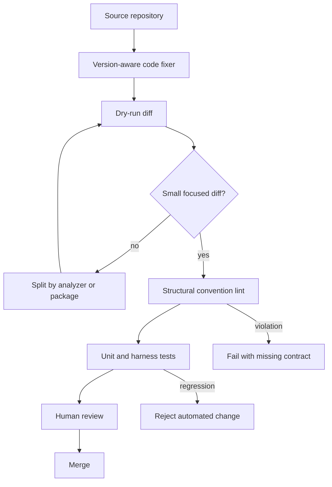

> 코딩 에이전트가 코드를 더 많이 고칠수록, 팀에는 더 많은 규칙이 아니라 실행 가능한 규칙이 필요해진다.

코드 자동화의 핵심은 빠른 수정이 아니다. Go 코드 현대화, 구조적 린팅, 테스트 하네스 자동화는 같은 방향을 가리킨다. 사람이 반복해서 남기던 리뷰 코멘트를 도구로 옮기되, 도구가 바꿀 수 있는 범위는 작게 고정해야 한다.

## 코드 현대화는 리팩터링 문제가 아니라 변경 권한 문제다

오래된 Go 코드를 새 문법과 표준 라이브러리 API로 옮기는 일은 겉으로 단순해 보인다. deprecated API를 새 API로 바꾸고, 반복되는 패턴을 최신 idiom으로 정리하면 된다. 실제 문제는 그 변경을 어디까지 허용하느냐다.

사람이 직접 고치면 빠진 곳이 생긴다. 리뷰어가 잡으면 같은 코멘트가 반복된다. LLM 에이전트가 고치면 속도는 빠르지만, 변경 이유와 범위가 흐려질 수 있다. 자동화는 개발자를 대체하기 위해서가 아니라, 변경 권한을 좁고 검증 가능한 단위로 만들기 위해 필요하다.

선정 글감의 Go 사례는 이 지점을 잘 보여준다. `go fix`는 Go 분석 프레임워크 위에서 오래된 패턴을 찾아 최신 언어 기능이나 표준 라이브러리 API로 바꾼다. 핵심은 버전 인식이다. `go.mod`에 선언된 Go 버전을 기준으로 호환 가능한 변경만 제안해야 빌드 실패와 롤백 비용을 줄일 수 있다.

```bash
go fix -diff ./...
go fix ./...
```

첫 번째 명령은 실제 파일을 바꾸지 않고 diff를 보여준다. 두 번째 명령은 변경을 적용한다. 이 순서가 사소해 보일 수 있지만, 자동 리팩터링을 CI에 넣을 때는 사실상 안전장치다. 자동화는 실행 전에 diff를 만들고, 사람은 결과가 아니라 변경 범위를 검토한다.

## AI 에이전트 시대의 린터는 문법보다 폴더 구조를 본다

기존 린터는 대체로 코드 한 줄 안쪽에 강하다. 타입 오류, 사용하지 않는 변수, 위험한 패턴, 포맷 불일치를 잡는다. 에이전트와 사람이 함께 코드를 고치는 저장소에서는 다른 종류의 불일치가 더 자주 문제가 된다.

예를 들어 어떤 패키지는 특정 factory 함수를 반드시 export해야 한다. 특정 폴더에 `index.ts`가 있으면 짝이 되는 설정 파일도 있어야 한다. bridge를 가진 파일은 protocol type과 schema를 함께 선언해야 한다. TypeScript와 ESLint만으로는 이런 구조적 계약을 자연스럽게 표현하기 어렵다.

Vercel이 공개한 `konsistent`가 겨냥하는 지점이 여기다. `konsistent.json`에 프로젝트 규칙을 적고, 파일 패턴과 export, import, required file, class 구현 여부 같은 구조적 관례를 검사한다. 발췌에 나온 오류는 단순 포맷 문제가 아니다. harness 패키지가 반드시 내보내야 하는 settings type, creator function, auth file, bridge contract가 빠졌다는 신호다.

이 방식은 Go의 `go fix`와 결이 같다. 둘 다 스타일 취향을 자동화하는 도구가 아니다. 저장소가 이미 암묵적으로 요구하던 변경 규칙을 실행 가능한 계약으로 바꾼다.

차이는 수정 권한이다. `go fix`는 안전하다고 정의된 일부 변경을 직접 적용한다. `konsistent`는 구조 위반을 빠르게 실패시킨다. 하나는 고치고, 하나는 막는다. 좋은 자동화 파이프라인에는 둘 다 필요하다.

## 자동 수정 파이프라인은 이렇게 작게 묶어야 한다

자동화가 실패하는 지점은 도구가 약해서가 아니다. 너무 많은 의미를 한 PR에 담을 때 실패한다. deprecated API 교체, 폴더 구조 정리, 테스트 하네스 계약 추가, 포맷 변경이 한 번에 들어가면 리뷰어는 실제 위험을 분리할 수 없다.

실무 파이프라인은 변경 종류별로 쪼개야 한다.



이 구조에서 자동화의 첫 관문은 `go fix -diff ./...` 같은 dry-run이다. 두 번째 관문은 구조적 린터이고, 세 번째 관문은 테스트다. 사람 리뷰는 마지막에 남는다. 사람이 모든 변경을 발견하는 단계가 아니라, 이미 좁혀진 diff가 의도한 계약 안에 있는지 판단하는 단계다.

Go 현대화라면 analyzer 단위로 PR을 나누는 편이 낫다. 예를 들어 `newexpr`, `mapsloop`, `forvar` 같은 내장 analyzer를 각각 적용하면 리뷰 범위가 줄어든다. 커스텀 analyzer는 그 다음이다. 팀 규칙을 분석기로 옮기는 일은 효과가 크지만, 오탐이 곧 코드 churn으로 이어진다. 처음부터 조직 전용 analyzer를 크게 만들면 자동화가 아니라 또 하나의 운영 대상이 된다.

TypeScript 저장소라면 `konsistent` 같은 구조 규칙을 CI에서 먼저 실패시키는 편이 실용적이다. 에이전트가 새 파일을 만들 때 가장 자주 놓치는 것은 타입 문법보다 주변 파일과 export 계약이다. 구조 린터는 에이전트에게도 사람에게도 같은 피드백을 준다. 빠르고, 결정적이고, 재현 가능하다.

## happy path 스크립트는 자동화될수록 더 위험해진다

Lobsters에 공유된 Rye 글은 반대편 압력을 보여준다. 작은 스크립트는 아름답다. 인자를 받고, 설정 파일에서 토큰을 읽고, HTTP 요청을 보내고, 응답 헤더에서 파일명을 뽑아 저장한다. happy path만 보면 몇 줄이면 끝난다.

실제 자동화 파이프라인에서는 그 몇 줄이 곧 장애 표면이 된다. 인자가 숫자가 아닐 수 있다. 설정 파일이 없을 수 있다. 토큰 키가 빠질 수 있다. 서버가 200이 아닌 응답을 줄 수 있다. `Content-Disposition` 헤더가 없거나 파일명이 위험한 문자열일 수 있다.

가정이 줄어들면 코드는 길어진다. 이건 퇴보가 아니다. 자동화가 운영 경계에 들어가는 순간, 짧은 코드는 종종 검증되지 않은 코드다.

이 관점은 Go 자동 수정과 구조 린팅에도 그대로 적용된다. 자동 fixer가 deprecated 함수를 새 함수로 바꿨다고 해서 의미가 완전히 같다는 보장은 없다. 새 API가 edge case를 다르게 처리하면 컴파일은 통과하고 런타임에서 깨진다. 구조 린터가 파일과 export를 강제해도, 그 타입이 올바른 의미를 담는지는 테스트가 확인해야 한다.

자동화는 검증을 줄이지 않는다. 검증 위치를 앞당긴다.

## 도입 조건은 도구 이름보다 실패 모드로 정해야 한다

이런 자동화를 도입할 조건은 명확하다. 코드베이스가 작고 변경자가 적으며 현대화가 가끔 있는 정도라면 큰 파이프라인은 과하다. 한 번의 `go fix -diff`와 수동 리뷰면 충분하다.

다음 조건 중 둘 이상에 걸리면 자동화의 값이 올라간다.

- 같은 리뷰 코멘트가 반복된다.
- 패키지나 폴더마다 반드시 맞춰야 하는 구조 계약이 있다.
- AI 에이전트가 파일 생성이나 리팩터링에 참여한다.
- 언어 버전, 표준 라이브러리, 프레임워크 API 변경을 주기적으로 따라가야 한다.
- 테스트 하네스나 bridge protocol처럼 주변 파일 세트가 함께 움직인다.

도입 순서는 보수적으로 잡아야 한다. 먼저 dry-run으로 diff를 남긴다. 그 다음 내장 fixer와 기존 테스트를 연결한다. 구조 규칙은 가장 자주 깨지는 계약 한두 개만 넣는다. 커스텀 analyzer는 오탐 비용을 측정한 뒤에 추가한다.

보안과 데이터 관점에서는 더 엄격해야 한다. 인증, 권한, 암호화, 파일 경로, 데이터 삭제 로직은 자동 수정 대상에서 제외하거나 별도 approval을 둬야 한다. 자동화가 위험한 코드를 더 잘 고치는 경우도 있지만, 위험한 변경을 더 빨리 퍼뜨리는 경우도 있다. 속도는 통제가 붙을 때만 장점이다.

## 사람 리뷰를 없애는 자동화는 틀렸고, 리뷰할 것을 줄이는 자동화가 맞다

첫 문장의 긴장은 여기서 풀린다. 코딩 에이전트가 코드를 많이 고칠수록 팀은 규칙을 더 많이 적어야 하는 게 아니다. 사람이 반복해서 말하던 규칙을 더 실행 가능한 형태로 옮겨야 한다.

Go의 `go fix`는 버전 인식 자동 수정을 맡는다. `konsistent` 같은 구조 린터는 저장소의 모양을 지킨다. happy path 스크립트에 대한 비판은 자동화가 운영 경계에 닿는 순간 검증이 늘어야 한다는 사실을 상기시킨다.

좋은 파이프라인은 에이전트를 믿지 않는다. 사람의 기억도 믿지 않는다. 대신 작은 diff, 결정적 규칙, 실패하는 테스트를 믿는다. 그 셋이 갖춰진 저장소에서만 자동화는 기술 부채를 줄인다. 그렇지 않으면 자동화는 더 빠른 기술 부채 생성기다.

## 참고 자료

- [선정 글감] [Modernizing Go Code: Automating Updates to Enhance Consistency and Leverage New Language Features](https://dev.to/viklogix/modernizing-go-code-automating-updates-to-enhance-consistency-and-leverage-new-language-features-3i1n) — DEV Community
- [관련] [Enforce consistent code for agents and humans with konsistent](https://vercel.com/changelog/enforce-consistent-code-for-agents-and-humans-with-konsistent) — Vercel Blog
- [관련] [Reducing Assumptions, Exploding Your Code](https://ryelang.org/blog/posts/reducing_assumptions_but_exploding/) — Rye Language Blog