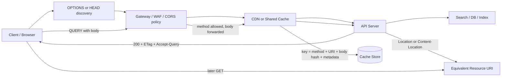

HTTP QUERY method(RFC 10008)는 GET과 POST 사이의 빈칸을 메운다. 그렇다고 지금 모든 검색 API를 QUERY로 바꿀 이유는 없다. 이 메서드가 건드리는 것은 라우터보다 캐시 키, 재시도, 로그, WAF, CORS, 관측성의 합의에 가깝다.

> 본문이 있는 안전한 조회는 작은 약속이다.  
> 그 약속을 중간 계층 전체가 같은 방식으로 지키게 만드는 일은 크다.

## HTTP QUERY method는 왜 GET body 논쟁을 끝내지 못하나

RFC 10008은 2026년 6월 IETF Proposed Standard로 발행됐다. 핵심은 단순하다. QUERY는 요청 본문(request content)을 받아 서버 쪽 조회를 실행하지만, 메서드 의미는 안전(safe)하고 멱등(idempotent)하다. 연결이 끊겨 클라이언트나 프록시가 같은 요청을 다시 보내도 상태 변경이 중복 실행되지 않아야 한다.

이 지점에서 GET body와 갈린다. RFC 9110은 GET 요청 본문에 일반적으로 정의된 의미가 없고, 일부 구현이 요청 스머글링(Request Smuggling) 위험 때문에 거부하거나 연결을 닫을 수 있다고 못박는다. 길고 복잡한 필터를 URL query string에 밀어 넣으면 다른 문제가 생긴다. RFC 10008은 URI가 여러 중간 시스템을 지나며 길이 제한을 만날 수 있고, URI가 요청 본문보다 로그·북마크·중간 처리에 더 쉽게 노출된다고 설명한다. HTTP 구현은 최소 8000 octets의 URI를 지원하도록 권고받지만, 실제 요청 경로의 모든 프록시와 게이트웨이가 같은 한계를 갖는다는 뜻은 아니다.

POST도 완전한 답은 아니다. 검색 조건을 JSON body로 보내기는 쉽지만, HTTP 의미론만 보면 POST는 안전한 조회라고 드러나지 않는다. RFC 9111은 캐시 키가 적어도 method와 target URI로 구성된다고 말하면서도, 널리 쓰이는 많은 캐시가 GET 응답만 저장해 URI만 키로 삼는다고 적는다. 실무에서 POST 검색 API가 CDN 캐시, 자동 재시도, 조건부 요청(Conditional Request)과 자연스럽게 맞물리지 않는 이유가 여기 있다.

| 선택지 | 얻는 것 | 잃는 것 |
|---|---|---|
| 긴 GET URL | 표준 조회 의미, 기본 캐시 친화성 | 길이 제한, 로그 노출, 복잡한 필터 인코딩 |
| GET body | 겉보기에는 조회와 본문을 모두 확보 | 표준 의미 부재, 중간 계층 거부 가능성 |
| POST 검색 | 본문 표현력, 프레임워크 호환성 | 안전한 조회 의미가 숨음, 캐시·재시도 계약이 약함 |
| QUERY | 본문 표현력, 안전·멱등 조회 의미 | 생태계 지원 확인 비용 |

QUERY는 GET body의 합법화가 아니다. 조회 본문을 HTTP 계약 안으로 끌어들이는 새 메서드다.

## POST 검색 API를 QUERY로 바꾸면 캐시가 저절로 생기지 않는다

선정 글감은 QUERY를 GET과 POST의 장점만 합친 새 도구처럼 소개한다. 방향은 맞지만, 운영 판단은 더 차갑게 해야 한다. QUERY의 캐시 가능성은 선언만으로 작동하지 않는다. RFC 10008은 QUERY 응답이 캐시 가능하다고 하면서도, QUERY 캐시 키가 request target뿐 아니라 요청 본문과 관련 메타데이터를 반드시 포함해야 한다고 요구한다.

캐시가 body를 끝까지 읽어야 키를 계산한다는 뜻이다. JSON body라면 `{"a":1,"b":2}`와 `{"b":2,"a":1}`을 같은 질의로 볼지 다른 질의로 볼지 정해야 한다. RFC는 캐시 효율을 위해 의미 없는 차이를 정규화할 수 있다고 말하지만, 그 변환은 캐시 키 생성에만 적용되어야 하고 실제 요청 자체를 바꾸면 안 된다. 정규화 규칙이 어설프면 hit rate가 낮아진다. 더 나쁘게는 서로 다른 질의를 같은 키로 묶는다.

보안도 단순하지 않다. QUERY는 민감한 조건을 URL에 드러내지 않는 데 유리하다. 그렇다고 본문이 안전해지는 것은 아니다. 캐시가 body hash만 저장하더라도, 원본 body를 로그·트레이스·샘플링에 남기면 이점이 사라진다. 서버가 `Location`이나 `Content-Location`으로 저장된 질의 또는 결과 URI를 발급할 때도 같은 문제가 생긴다. RFC 10008은 민감한 요청 내용이 URI에 섞이지 않도록 선택해야 한다고 경고한다.

캐시를 켜기 전에는 적어도 다음을 확인해야 한다.

- 캐시 키에 method, target URI, body hash, `Content-Type`, `Accept`, 인증·테넌트 경계가 들어가는가
- JSON, SQL, JSONPath 같은 query media type별 정규화 규칙이 명시됐는가
- 인증 요청을 shared cache에 저장하지 않도록 `Cache-Control`이 닫혀 있는가
- `no-store`가 필요한 질의와 `public, max-age`가 가능한 질의가 분리됐는가
- `Location`과 `Content-Location` URI가 원본 조건을 새지 않게 생성되는가

QUERY의 장점은 “캐시가 된다”가 아니다. 캐시 가능한 조회임을 프로토콜 수준에서 표현할 수 있다는 점이다.

## 새 HTTP 메서드는 서버보다 중간 계층에서 먼저 깨진다

웹 플랫폼 쪽 사정도 갈린다. WHATWG Fetch 표준은 `CONNECT`, `TRACE`, `TRACK` 같은 forbidden method를 제외하면 임의의 HTTP method token 자체를 원천 금지하지 않는다. `QUERY`라는 문자열을 fetch에 넣는 것은 표준 모델과 충돌하지 않는다. 그러나 CORS safelisted method는 `GET`, `HEAD`, `POST`뿐이다. 브라우저에서 cross-origin QUERY를 보내면 preflight가 붙는다. 이 한 줄 차이가 지연 시간, 장애 지점, 방화벽 정책, SDK 지원 범위를 바꾼다.

개발자 커뮤니티에서 말이 붙는 지점은 새 문법이 아니라 배포 경로다. 애플리케이션 서버가 `QUERY /search`를 처리해도 앞단 로드밸런서가 method allowlist에서 막을 수 있다. WAF가 낯선 method를 공격으로 분류할 수도 있다. APM이 method 차원을 `OTHER`로 묶으면 검색 API의 캐시 적중률, 오류율, 재시도율을 GET/POST와 나란히 비교하기 어렵다.

Cloudflare의 hyper HTTP 라이브러리 버그 사례는 QUERY 사례가 아니다. 그래도 이 논쟁과 직접 연결된다. Cloudflare는 Workers runtime과 Images service 사이를 더 직접적인 local connection으로 재설계한 뒤, 큰 이미지 변환에서만 간헐적으로 body가 잘리는 문제를 만났다. 내부 파이프라인은 HTTP `200`을 반환했고 오류 로그도 없었지만, `Content-Length`가 약속한 3.3MB 중 약 200KB만 도착한 요청이 있었다. 재현과 추적에 6주가 걸렸고, 수정은 네 줄이었다.

이 사례가 말하는 바는 선명하다. HTTP 경로의 의미를 바꾸면 성공 신호도 다시 정의해야 한다. `200 OK`는 충분하지 않다. QUERY 도입에서는 method parsing, body buffering, cache key 계산, retry, conditional request, redirect, streaming 응답까지 같은 경로에서 검증해야 한다.

이 흐름에서 가장 약한 곳은 새 라우트가 아니다. body를 읽지 않고 캐시 키를 만들던 계층, method를 고정 enum으로 분류하던 계층, 성공 여부를 status code 하나로만 판단하던 계층이 먼저 흔들린다.

## HTTP QUERY vs GET/POST: 먼저 바꿀 곳과 남길 곳

QUERY가 이기는 문제는 정해져 있다. 조건이 깊고, URL에 담기엔 길며, 조회가 안전하고, 같은 질의가 반복되고, 캐시나 조건부 요청으로 비용을 줄일 수 있는 API다. 상품 검색, 로그 탐색, 분석 쿼리, 문서 검색, 복잡한 권한 필터가 붙은 내부 조회 API가 후보가 된다.

반대로 public API의 기본값으로 바로 밀어 넣기엔 이르다. 모바일 SDK, 브라우저, 기업 프록시, API gateway, WAF, OpenAPI tooling, mock server, synthetic monitoring이 모두 QUERY를 같은 의미로 처리해야 한다. 이 범위를 통제할 수 없다면 POST 검색 API를 유지하고, QUERY를 opt-in 경로로 붙이는 편이 낫다.

도입 순서는 과감할 필요가 없다. 먼저 내부 client와 edge를 통제할 수 있는 경로에서 `Accept-Query`를 노출한다. `HEAD /search` 또는 `OPTIONS /search`가 지원 media type을 돌려주게 만든다. 그다음 `QUERY /search`를 추가하되 기존 `POST /search`를 바로 없애지 않는다. 캐시 가능한 질의만 `Cache-Control`과 `ETag`를 붙이고, 인증·개인화·민감 필터가 섞인 질의는 `no-store`로 닫는다. 마지막으로 `Location`을 발급해 반복 질의를 GET 가능한 equivalent resource로 넘긴다.

QUERY를 붙일 때 최소 테스트는 실제 요청 경로를 지나야 한다. 로컬 라우터 테스트만으로는 부족하다. 브라우저 fetch, CORS preflight, gateway, CDN, origin, tracing, log pipeline을 모두 통과시키고 다음을 확인해야 한다.

- 같은 body의 QUERY가 같은 cache key로 묶이는가
- 다른 body의 QUERY가 절대 같은 응답을 받지 않는가
- 연결 실패 뒤 자동 재시도해도 side effect가 없는가
- `415`, `406`, `422`가 query media type 문제와 query 내용 문제를 구분하는가
- `Location`으로 전환한 GET이 ETag와 `304 Not Modified`를 제대로 받는가
- 관측성에서 `QUERY` method, body size, body hash, cache status를 분리해 볼 수 있는가

이 조건을 맞추지 못하면 새 메서드는 API를 깨끗하게 만들지 않는다. 의미론은 좋아지고 운영은 흐려진다.

## QUERY의 실전 결론은 도입이 아니라 경계 설정이다

첫 질문으로 돌아가면 답은 단순하다. QUERY는 복잡한 조회 API의 좋은 표준화 방향이다. 성공 조건은 서버 코드 한 줄보다 바깥에 있다. 캐시가 body를 키로 삼고, 프록시가 method를 통과시키고, 브라우저가 preflight를 받아들이고, 로그가 민감한 조건을 남기지 않고, 테스트가 실제 경로에서 body 손실과 재시도를 잡아야 한다.

GET은 주소가 짧고 공개 가능한 조회에 남긴다. POST는 상태 변경과 호환성 우선 조회에 남긴다. QUERY는 안전한 복잡 조회를 캐시·재시도·조건부 요청의 계약 안으로 넣을 준비가 된 경로에 둔다.

새 HTTP 메서드를 쓰는 결정은 유행을 따르는 일이 아니다. 조직의 HTTP 중간 계층이 요청 본문까지 의미 있게 다룰 수 있는지 확인하는 일이다. 그 대답이 예라면 QUERY는 API 표면을 줄인다. 아니라면 이름만 새롭고 장애 위치만 깊어진다.

## 참고 자료

- [선정 글감] [How to Pass a Request Body in a GET Request? Meet the New HTTP QUERY Method (RFC 10008)](https://dev.to/rohanshukla/how-to-pass-a-request-body-in-a-get-request-meet-the-new-http-query-method-rfc-10008-32fk) - DEV Community
- [관련] [RFC 10008: The HTTP QUERY Method](https://www.rfc-editor.org/rfc/rfc10008.html) - RFC Editor
- [관련] [RFC 9110: HTTP Semantics](https://www.rfc-editor.org/rfc/rfc9110.html) - RFC Editor
- [관련] [RFC 9111: HTTP Caching](https://www.rfc-editor.org/rfc/rfc9111.html) - RFC Editor
- [관련] [Fetch Standard](https://fetch.spec.whatwg.org/) - WHATWG
- [관련] [How we found a bug in the hyper HTTP library](https://blog.cloudflare.com/hyper-bug/) - Cloudflare Blog