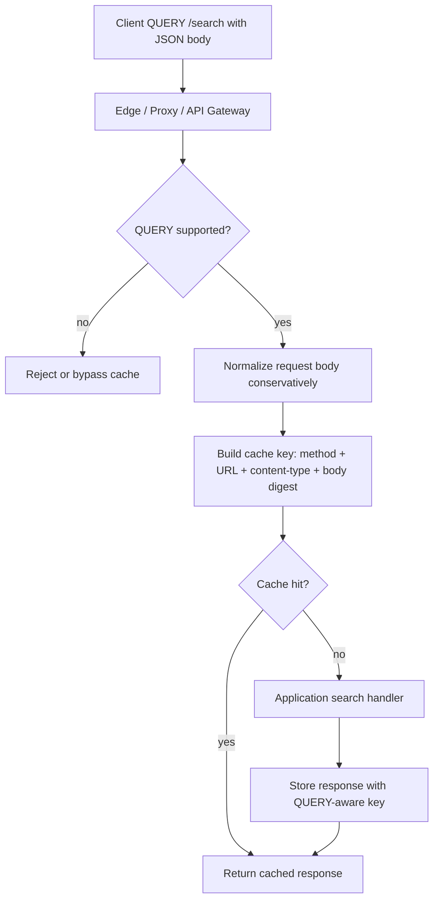

> HTTP QUERY는 GET과 POST 사이의 빈칸을 메운다.  
> 문제는 메서드가 아니라 캐시 키다.

HTTP QUERY를 이야기할 때 RFC 10008, API 캐싱, 보안 사고를 떼어 놓기 어렵다. QUERY는 본문을 가진 안전한 읽기 요청이다. 검색, 필터, GraphQL류 조회처럼 URL에 다 넣기 어려운 입력을 POST로 우회하던 관행을 정리한다.

개발자 커뮤니티에서 말이 붙는 이유도 분명하다. “GET with body가 드디어 표준화됐다”는 기대와 “공유 캐시가 이걸 제대로 처리하겠느냐”는 불신이 부딪힌다. QUERY는 읽기 API 설계를 깔끔하게 만든다. 동시에 캐시 구현이 틀리면 사용자 A의 응답이 사용자 B에게 갈 수 있다.

## HTTP QUERY는 POST 남용을 줄이지만, 캐시 버그를 표준 밖으로 밀어내지 않는다

기존 HTTP 설계에서 복잡한 조회는 늘 어색했다. GET은 안전하고 멱등적이며 캐시하기 좋지만 본문을 실을 수 없다는 전제가 강했다. 긴 검색 조건, 다중 필터, 중첩된 쿼리를 URL 쿼리 문자열에 밀어 넣으면 길이 제한과 로깅 노출 문제가 따라왔다.

POST는 본문을 담기 쉽다. 대신 의미가 다르다. POST는 기본적으로 안전한 읽기 요청이 아니며, 중간 캐시와 프록시는 이를 조회로 취급하지 않는다. 그 결과 재시도, 캐싱, 관측성에서 조회 API의 장점을 잃는다.

QUERY는 이 빈틈을 겨냥한다. 본문을 가진 요청이지만 의미는 읽기다. 안전하고, 멱등적이며, 캐시 가능하다. 여기까지만 보면 API 설계자에게 좋은 소식이다.

RFC 10008의 진짜 쟁점은 캐시다. QUERY 요청의 캐시 키에는 요청 본문이 포함돼야 한다. 기존 공유 HTTP 캐시는 보통 메서드와 URL 중심으로 키를 잡아왔다. QUERY에서는 같은 `QUERY /search`라도 본문이 다르면 완전히 다른 요청이다.

```http
QUERY /search HTTP/1.1
Content-Type: application/json

{ "q": "cats" }
```

```http
QUERY /search HTTP/1.1
Content-Type: application/json

{ "q": "dogs" }
```

두 요청을 같은 캐시 엔트리로 보면 성능 최적화가 아니라 데이터 오염이다. cats 결과가 dogs 사용자에게 가는 순간, 문제는 캐시 미스율이 아니라 보안 사고가 된다.

## 개발자들이 갈리는 지점은 “메서드 추가”가 아니라 “중간 계층을 믿을 수 있나”다

QUERY 자체에 대한 기대는 실용적이다. 검색 API, 리포트 API, 분석 쿼리, 복잡한 필터 조회는 POST를 읽기처럼 써왔다. 이 관행은 문서와 구현 사이에 거짓말을 만든다. API 문서에는 조회라고 쓰고, HTTP 계층에는 변경 요청처럼 보낸다.

우려도 가볍지 않다. HTTP 메서드 하나가 추가된다고 CDN, 프록시, WAF, API 게이트웨이, 로드밸런서, 애플리케이션 프레임워크가 동시에 올바르게 행동하지 않는다. 어떤 계층은 QUERY를 모르는 메서드로 차단할 수 있다. 어떤 계층은 본문을 보존하지만 캐시 키에는 넣지 않을 수 있다. 어떤 계층은 로그와 메트릭에서 메서드를 분류하지 못할 수 있다.

Cloudflare가 hyper HTTP 라이브러리의 버그를 찾은 사례는 이 지점을 잘 보여준다. Cloudflare Images binding 재설계 뒤 큰 이미지 변환 요청이 간헐적으로 잘리는 문제가 발생했다. 응답 상태는 200이었다. 에러 로그도 없었다. 특정 조건에서만 나타나는 레이스 컨디션이었고, 원인은 오픈소스 HTTP 라이브러리 hyper의 동작에 있었다. 수정은 네 줄이었지만, 원인 추적에는 여섯 주가 걸렸다.

이 사례는 QUERY의 직접 사례가 아니다. 그래도 같은 원칙을 보여준다. HTTP 계층의 작은 불일치는 애플리케이션 계층에서 정상 응답처럼 보일 수 있다. 200 OK는 데이터가 맞다는 보장이 아니다.

QUERY 도입 논쟁은 새 문법 논쟁이 아니다.

중간 계층 전체가 요청 의미를 끝까지 보존하는지 확인하는 운영 문제다.

## HTTP QUERY 캐시 키는 URL이 아니라 의미를 담아야 한다

QUERY를 캐시하려면 키 설계가 핵심이다. 메서드와 URL만으로는 부족하다. 요청 본문, 콘텐츠 타입, 필요한 협상 헤더까지 포함해야 한다. RFC가 요청 내용을 캐시 키에 반영하라고 요구하는 이유가 여기에 있다.

문제는 본문을 그대로 해시할지, 의미가 같은 JSON을 정규화할지다. 예를 들어 아래 두 JSON은 보통 같은 의미다.

```json
{"a":1,"b":2}
```

```json
{
  "b": 2,
  "a": 1
}
```

공백과 객체 키 순서만 다르다면 같은 캐시 키를 쓰는 편이 효율적이다. 다만 정규화는 보수적으로 해야 한다. 잘못된 캐시 미스는 비용이다. 잘못된 캐시 히트는 버그다.

숫자 리터럴 정규화는 위험하다. JavaScript에서 `9007199254740993` 같은 값은 안전 정수 범위를 벗어나며 파싱 과정에서 다른 값으로 바뀔 수 있다. 중복 키가 있는 JSON도 구현마다 해석이 갈릴 수 있다. “비슷해 보이는 본문”을 같은 키로 합치면 캐시가 데이터 경계를 무너뜨린다.



이 흐름에서 가장 위험한 구간은 `B`와 `E` 사이다. 애플리케이션은 QUERY를 이해해도, 앞단 프록시가 본문 없는 캐시 키를 만들면 끝이다. 프레임워크 미들웨어 하나만 맞아서는 부족하다. 캐시를 만드는 모든 계층이 같은 의미 모델을 가져야 한다.

## QUERY를 도입할 API와 그대로 둘 API를 나눠야 한다

QUERY는 모든 POST 조회를 바꾸라는 신호가 아니다. 먼저 바꿀 대상은 조건이 뚜렷한 읽기 API다.

- 요청이 안전하고 서버 상태를 바꾸지 않는다.
- 같은 입력에 같은 응답을 기대할 수 있다.
- URL에 담기 어려운 큰 필터나 중첩 조건이 있다.
- 캐시가 실제 성능이나 비용에 영향을 준다.
- 프록시, CDN, API 게이트웨이에서 QUERY 통과와 캐시 키 구성을 검증할 수 있다.

반대로 인증 사용자별 데이터가 섞이고, 응답이 권한과 세션에 강하게 묶이며, 중간 캐시를 통제하기 어렵다면 서두를 이유가 없다. 이 경우 POST를 유지하고 애플리케이션 내부 캐시를 명시적으로 설계하는 편이 더 안전하다.

브라우저와 서버 런타임 지원도 확인해야 한다. 선정 글감은 Node 22에서 `http.METHODS`에 QUERY가 들어오는 전제를 언급한다. 그러나 실제 서비스 경로는 Node 하나로 끝나지 않는다. CORS, 사내 프록시, 보안 장비, 로깅 파이프라인, APM, CDN 설정이 모두 경로에 있다. QUERY를 모르는 계층 하나가 있으면 장애는 애플리케이션 밖에서 난다.

도입 전 테스트는 단순해야 한다. 같은 URL에 서로 다른 본문을 보내고, 캐시 히트 여부와 응답 본문을 확인한다. 공백과 키 순서만 다른 JSON은 같은 키로 묶을지 정책을 정한다. 숫자, 중복 키, 콘텐츠 타입이 다른 요청은 같은 키로 합치지 않는다. 이 정도 확인 없이 QUERY 캐시를 켜는 것은 기능 출시가 아니라 데이터 혼선을 예약하는 일이다.

## HTTP 메서드 하나를 추가하는 일은 운영 계약을 하나 늘리는 일이다

QUERY의 가치는 분명하다. 복잡한 읽기 요청을 POST 뒤에 숨기지 않아도 된다. API 의미, 재시도, 캐싱, 문서화가 더 정직해진다. 검색과 분석 쿼리처럼 입력은 크지만 동작은 읽기인 엔드포인트에는 좋은 도구다.

그 가치는 캐시 키가 맞을 때만 살아난다. QUERY를 지원한다는 말은 라우터가 새 메서드를 받는다는 뜻이 아니다. 요청 본문을 의미 있게 다루고, 공유 캐시가 본문을 키에 반영하며, 관측성 도구가 메서드와 캐시 결과를 분리해서 보여준다는 뜻이다.

처음의 질문으로 돌아가면 답은 짧다. QUERY는 GET과 POST 사이의 빈칸을 메운다. 하지만 그 빈칸에는 프록시, CDN, 라이브러리, 런타임, 캐시 정책이 같이 들어간다.

도입할 팀은 새 메서드를 고르는 데서 멈추면 안 된다. 데이터가 섞이지 않는다는 증거를 먼저 만들어야 한다.

## 참고 자료

- [선정 글감] [The HTTP QUERY method (RFC 10008) is here — and caching it correctly is harder than it looks](https://dev.to/hardikgoel/the-http-query-method-rfc-10008-is-here-and-caching-it-correctly-is-harder-than-it-looks-2he6) — DEV Community
- [관련] [How we found a bug in the hyper HTTP library](https://blog.cloudflare.com/hyper-bug/) — Cloudflare Blog
- [관련] [RFC 10008: The HTTP QUERY Method](https://www.rfc-editor.org/rfc/rfc10008.html) — RFC Editor