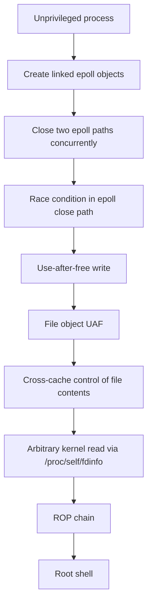

> Linux kernel epoll 취약점 CVE-2026-46242의 핵심은 낯선 API가 아니다. 끌 수 없는 커널 기본 기능에서 6개 명령어 폭의 레이스가 99% 신뢰도의 권한 상승으로 이어졌다는 점이다.

Bad Epoll은 `epoll` 서브시스템의 레이스 컨디션(Race Condition) 기반 사용 후 해제(Use-After-Free, UAF) 취약점이다. 비권한 프로세스가 root 권한을 얻을 수 있으며, 대상은 일반 Linux 서버와 데스크톱에 그치지 않는다. Android 기기와 Chrome 렌더러 샌드박스 이후 단계까지 위험 범위에 들어간다.

이 사건은 “AI가 커널 취약점을 찾을 수 있는가”보다 “AI가 찾은 버그 옆에 무엇이 남아 있었는가”에 가깝다. Anthropic의 Mythos는 같은 `epoll` 코드 경로에서 다른 레이스 버그를 찾았다. 그러나 Bad Epoll은 놓쳤다. 사람 연구자는 그 틈에서 실제 exploit과 root shell까지 도달했다.

## Linux kernel epoll 취약점이 위험한 이유는 비활성화할 수 없어서다

운영자가 가장 먼저 확인할 것은 단순하다. 이 기능을 끌 수 있는지다.

Bad Epoll의 답은 아니다. `epoll`은 Linux 이벤트 대기 모델의 핵심이다. 네트워크 서버, 브라우저, 런타임, 시스템 서비스가 모두 기대는 기능이다. 취약 모듈을 내리거나 특정 기능 플래그를 끄는 식의 완화책이 없다. 원문이 Copy Fail 계열과 비교한 이유도 여기에 있다. 일부 커널 취약점은 Android에 로드되지 않는 모듈에 기대거나, 취약 모듈을 제거해 피해면을 줄일 수 있다. Bad Epoll은 그런 방식으로 다룰 수 없다.

패치가 완화책이다.

운영 관점에서 이 문장은 무겁다. 커널 패치는 재부팅, 호환성 검증, 배포 윈도우, 노드 드레이닝(Draining), 모바일 기기 업데이트 체인까지 끌고 온다. Kubernetes 클러스터라면 컨트롤 플레인보다 워커 노드가 먼저 문제다. 컨테이너 내부에서 kernel boundary는 공유된다. 컨테이너 격리는 프로세스와 네임스페이스를 나누지만, 취약한 커널을 여러 워크로드가 같이 쓴다는 사실은 바뀌지 않는다.

Android도 별개가 아니다. 원문은 Google kernelCTF에서 약 130개 취약점 중 Android root 후보가 대략 10개뿐이라고 설명한다. Bad Epoll은 그 소수에 들어간다. Pixel 8처럼 v6.1 기반 커널은 도입 커밋 이전이라 영향이 없지만, Pixel 10의 v6.6+ 계열에서는 PoC가 UAF를 트리거했고 full root exploit은 진행 중이라고 적었다.

서버 운영자는 커널 버전만 보면 안 된다. 배포판 백포트 여부를 봐야 한다. 원문 기준 취약점은 2023년 4월 8일 `58c9b016e128`에서 들어갔고, 2026년 4월 24일 `a6dc643c6931`에서 수정됐다. v6.4 이상 기반 커널은 배포판 보안 업데이트가 해당 수정 또는 동등한 백포트를 포함하는지 확인해야 한다.

## AI가 찾은 race bug 옆에 사람이 찾은 exploit이 있었다

Bad Epoll에서 개발자 커뮤니티의 논점은 모델 성능 자랑으로 끝나지 않는다. 더 불편한 지점은 같은 작은 코드 경로 안에 두 개의 치명적 레이스가 있었고, 하나는 frontier AI 모델이 찾았지만 다른 하나는 놓쳤다는 사실이다.

원문에 따르면 2023년의 한 커밋이 약 2,500줄짜리 `epoll` 코드 경로에 두 개의 레이스 조건을 만들었다. Mythos가 찾은 쪽은 CVE-2026-43074로 처리됐다. Bad Epoll은 CVE-2026-46242가 됐다. 같은 영역을 의미 있게 들여다본 모델도 exploit 가능한 두 번째 버그를 보고하지 못했다.

여기서 AI 보안 도구의 한계가 드러난다. 모델이 취약한 패턴을 설명할 수 있어도, 실제 공격 가능성을 끝까지 증명하지 못하면 보안팀은 우선순위를 낮춘다. Bad Epoll은 레이스 윈도가 약 6개 명령어 폭이라고 설명된다. 평범한 실행에서는 거의 맞지 않는다. 더 까다로운 점은 CVE-2026-43074가 고쳐진 뒤 Bad Epoll의 UAF가 KASAN(Kernel Address Sanitizer)의 강한 신호로 잘 드러나지 않았다는 점이다.

정적 추론은 의심을 만든다. exploit은 확신을 만든다.

이 차이는 kernelCTF 같은 프로그램에서 크게 작동한다. Bad Epoll exploit은 Google kernelCTF에서 Linux kernel exploit 보상으로 71,337달러 이상을 받는 0-day 제출이었다. 단순히 “버그가 있다”가 아니라 “비권한 프로세스가 root가 된다”를 증명했기 때문이다. 보안 자동화 도입에서도 같은 기준이 필요하다. 모델 리포트는 triage 입력이다. exploitability 검증, 재현 로그, 패치 회귀 테스트가 빠지면 운영 판단으로 이어지지 않는다.

## 6개 명령어 race window를 exploit이 99%로 바꾼 방식

원문의 공격 개요는 세부 exploit 코드를 모두 설명하지 않아도 운영자가 봐야 할 구조를 보여준다. 출발점은 연결된 두 `epoll` 객체다. 두 객체를 동시에 닫는 과정에서 close path가 겹치고, 한 경로가 객체를 free하는 동안 다른 경로가 그 객체에 계속 write한다. 그 결과가 UAF다.

공격은 작은 우연에 기대지 않는다. exploit은 네 개의 `epoll` 객체를 두 쌍으로 나눈다. 한 쌍은 레이스를 트리거하고, 다른 쌍은 victim이 된다. 이후 8바이트 UAF write를 file object UAF로 바꾸고, cross-cache attack으로 file contents를 제어한다. 그 다음 `/proc/self/fdinfo`를 통해 임의 커널 메모리 읽기를 얻고, 마지막에는 ROP(Return-Oriented Programming) chain으로 control flow를 장악해 root shell에 도달한다.

이 흐름에서 눈여겨볼 지점은 reliability다. 레이스 윈도 자체는 작다. 그러나 exploit은 그 윈도를 넓히고, 커널을 크래시하지 않는 retry loop를 사용한다. 원문은 lts-6.12.67 대상에서 99%, COS 121-18867.294.100 대상에서 98% 신뢰도를 제시한다. 커널 취약점 대응에서 “레이스라서 재현이 어렵다”는 말은 방어 근거가 되지 않는다. 공격자가 재현성을 엔지니어링할 수 있기 때문이다.

Chrome 렌더러 샌드박스와의 연결도 이 지점에서 위험해진다. 원문은 Bad Epoll이 Chrome renderer sandbox 내부에서도 트리거 가능하다고 설명한다. 브라우저 renderer code execution이 먼저 발생하면, Bad Epoll을 다음 단계로 연결해 kernel code execution까지 이어질 수 있다. Project Zero가 MSG_OOB 사례에서 보인 유형의 체인과 같은 종류의 충격이다. 브라우저 취약점 하나와 커널 LPE(Local Privilege Escalation) 하나가 만나면, 샌드박스는 완충재가 아니라 경유지가 된다.

## Kubernetes와 Android에서 확인할 것은 CVE 이름이 아니라 커널 계보

서버 팀이 CVE 데이터베이스에서 “패치됨” 표시만 보고 넘어가면 부족하다. Bad Epoll은 커널 계보와 백포트 상태가 핵심이다.

Kubernetes 환경에서는 노드 이미지가 어디서 왔는지부터 봐야 한다. 클라우드 관리형 노드, COS(Container-Optimized OS), 자체 빌드 AMI, 온프레미스 배포판 커널은 업데이트 경로가 다르다. 원문이 COS 특정 타깃에서 98% exploit reliability를 제시한 점은 컨테이너 운영자에게 직접적인 신호다. 컨테이너 런타임, seccomp, AppArmor, SELinux가 피해를 줄일 수는 있지만, 취약한 kernel object lifetime bug를 없애지는 않는다.

점검 순서는 짧아야 한다.

- 커널이 v6.4 이상 계열인지 확인한다.
- `a6dc643c6931` 또는 배포판 동등 백포트가 포함됐는지 확인한다.
- v6.1 기반이라고 해서 무조건 안전하다고 일반화하지 말고, 실제 벤더 커널 패치 이력을 본다.
- 멀티테넌트 워크로드, 브라우저 기반 워크로드, untrusted job runner를 우선순위에 둔다.
- 패치 전까지 새 untrusted workload 수용을 줄이고, 노드 교체 계획을 먼저 잡는다.

Android에서는 더 복잡하다. 커널 버전, 기기 세대, OEM 패치, 통신사 배포, 사용자의 업데이트 적용 여부가 모두 사이에 낀다. 원문은 Pixel 8 등 v6.1 기반 기기는 영향을 받지 않는다고 했고, Pixel 10 v6.6+에서는 UAF 트리거가 됐다고 적었다. 이 차이는 “Android도 위험하다”보다 정확한 문장이다. Android 전체가 같은 위험에 놓인 것이 아니라, 커널 계보와 패치 공급망이 위험을 나눈다.

보안팀은 이 취약점을 애플리케이션 취약점처럼 처리하면 안 된다. 서비스 재배포로 끝나지 않는다. 커널 업데이트가 들어간 노드 이미지를 만들고, drain과 cordon 순서를 잡고, stateful workload의 장애 허용 범위를 확인해야 한다. 운영 리스크는 exploit 자체보다 패치 배포 과정에서 터질 수 있다.

## AI 에이전트 보안 자동화는 finding보다 patch verification이 약하다

Bad Epoll의 타임라인은 조용히 불편하다. 2026년 2월 17일 보고됐고, 같은 날 maintainer가 패치 prototype을 제안했지만 올바른 수정이 아니었다. 논의는 멈췄다. 4월 22일 남은 문제를 다시 보고했고, 4월 24일 수정 커밋이 mainline에 들어갔다. 최초 보고부터 올바른 수정까지 약 두 달이 걸렸다.

이 대목은 AI 에이전트 기반 보안 자동화가 어디에 투자해야 하는지를 보여준다. 취약점 발견만 자동화하면 부족하다. 잘못된 패치가 취약 상태를 남기는 순간, 조직은 “고쳤다고 믿는 취약점”을 운영하게 된다. 이 상태가 가장 위험하다. 모니터링 알림도 줄고, 우선순위도 내려가고, 실제 공격 가능성은 그대로 남는다.

커널 레이스 버그에서 좋은 자동화는 세 가지를 같이 해야 한다.

- 취약 interleaving을 설명한다.
- 패치 후 같은 interleaving이 사라졌는지 검증한다.
- exploit primitive가 다른 객체 경로로 이동하지 않았는지 회귀 테스트한다.

Mythos가 같은 코드 주변의 다른 레이스를 찾았다는 사실은 AI가 쓸모없다는 증거가 아니다. AI는 좁은 코드 경로에서 사람이 놓칠 수 있는 후보를 올릴 수 있다. 다만 Bad Epoll은 모델 리포트가 끝이 아니라 시작이라는 점을 보여준다. runtime evidence가 약하고 레이스 윈도가 작을수록, 사람의 exploit 설계와 패치 검증이 더 비싸진다.

실무 도입 조건도 여기서 나온다. AI 보안 에이전트를 커널, 런타임, 데이터베이스 엔진 같은 low-level 코드에 붙일 때는 “몇 개 찾았나”보다 “틀린 확신을 어떻게 줄이나”를 먼저 봐야 한다. KASAN, syzkaller, kernelCTF류 재현 환경, 패치 전후 regression harness가 없으면 finding volume은 운영 소음이 된다. 반대로 이런 하네스가 있으면 AI가 낸 의심은 테스트 자동화의 입력으로 쓸 수 있다.

## Bad Epoll이 남긴 운영 판단: 작은 레이스는 작은 리스크가 아니다

Bad Epoll의 긴장은 처음 문장으로 돌아간다. 6개 명령어 폭의 레이스가 운영자의 패치 일정을 흔드는 이유는 exploit engineering이 시간의 문제를 구조의 문제로 바꾸기 때문이다. 공격자는 윈도를 넓히고, 반복하고, 크래시를 피하고, 커널 primitive를 쌓는다. 운영자는 그 사이에서 “재현 어렵다”는 위안을 잃는다.

이 취약점은 AI 대 인간의 승패 이야기가 아니다. AI는 한 버그를 찾았고, 사람은 옆 버그를 root exploit로 만들었다. maintainer는 첫 패치를 바로 맞히지 못했고, 운영자는 끌 수 없는 기능을 패치해야 한다. 모두가 어려운 문제를 각자의 위치에서 조금씩 놓쳤다.

실무 판단은 선명하다. `epoll`처럼 비활성화할 수 없는 kernel core path에서 나온 UAF는 CVSS 숫자보다 배포 가능성을 먼저 계산해야 한다. v6.4 이상 계열이면 백포트 확인을 미루지 말고, 멀티테넌트 노드와 브라우저 샌드박스 체인을 먼저 닫아야 한다. AI 보안 도구를 쓰는 팀은 finding 수가 아니라 패치 검증 하네스에 예산을 둬야 한다.

작은 레이스는 작은 위험이 아니다. 운영자가 볼 것은 레이스 윈도의 폭이 아니라, 공격자가 그 폭을 반복 가능한 절차로 바꿨는지다. Bad Epoll에서는 이미 바뀌었다.

## 참고 자료

- [선정 글감] [Bad Epoll (CVE-2026-46242)](https://github.com/J-jaeyoung/bad-epoll) - Lobsters