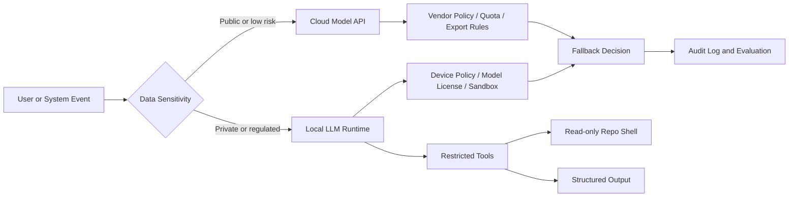

로컬 AI(Local AI) 실행권 논쟁은 자유 구호처럼 보이지만, 실제 쟁점은 더 건조하다. 내 장비에서 돌리는 모델까지 허가, 서명, 구독, 원격 정책의 대상이 되면 AI는 도구가 아니라 임대된 실행 권한이 된다.

Hacker News에서 `Protect your right to run local AI`가 수백 포인트와 186개 댓글을 모은 이유도 여기에 있다. 사람들은 모델 성능보다 스위치의 위치를 따졌다. 스위치가 내 기계에 있는지, 플랫폼과 정부와 공급자의 합의문 어딘가에 있는지를 본 것이다.

## 로컬 AI 권리는 아직 법안보다 먼저 온 방어선이다

확인된 사실부터 좁혀야 한다. `Right to Intelligence`는 로컬 AI 실행권을 보호하자는 캠페인성 페이지로 공유됐다. Hacker News 토론에서는 이 캠페인이 특정 법안 하나를 겨냥한다기보다, 합법적인 로컬 AI 소유, 연구, 모델 수정, 오픈소스 공개, 로컬 실행에 대한 세이프 하버(Safe Harbor)를 요구하는 흐름으로 읽혔다.

아직 특정 국가의 단일 금지 법안이 로컬 LLM 전체를 막고 있다고 단정할 근거는 약하다. HN 댓글에도 같은 지적이 있었다. 무엇을 막자는 것인지, 어떤 조항을 고치자는 것인지 불분명하다는 반응이다.

그래서 이 이슈의 초점은 지금 당장 금지됐느냐가 아니다.

금지할 수 있는 구조를 미리 정상으로 만들 것인가다.

댓글은 크게 갈렸다. 한쪽은 로컬 AI 규제가 현실성이 낮다고 봤다. PC 제조사, GPU 업체, 운영체제 벤더가 온디바이스 AI와 로컬 추론을 팔아야 하므로, 로컬 AI 전체를 막는 정책에는 산업적 저항이 생긴다는 논리다. 다른 쪽은 더 냉소적이었다. 대기업은 완전한 금지 대신 승인된 모델, 서명된 가중치, 공식 런타임, 구독으로 잠금장치를 만들 수 있다는 반응이었다.

이 차이는 낙관과 비관의 차이가 아니다. 규제 리스크를 어디에서 보느냐의 차이다. 낙관론은 하드웨어 판매 동기를 본다. 비관론은 실행 권한의 중앙집중을 본다.

## 왜 로컬 AI를 써야 할까: 닫힌 모델은 외부 의존성이다

2026년 6월 30일 WIRED는 미국 상무부가 Anthropic의 Mythos와 Fable 모델에 대한 수출, 재수출, 국내 이전 라이선스 요구를 해제하는 서한을 보냈다고 보도했다. 보도에 따르면 이 조치는 Anthropic이 보안 위험을 사전에 탐지하고, 미국 정부와 프로토콜 및 표준에 협력하겠다는 조건과 연결됐다. 앞서 외국 국적자 접근 중단 문제가 있었고, 이후 협상을 거쳐 제한이 완화된 흐름이다.

이 사례는 로컬 AI 금지 사례가 아니다. 클라우드 기반 첨단 모델 접근권이 정부 정책과 공급자 협상에 따라 바뀔 수 있다는 사례다. 그 차이를 흐리면 글이 과장된다. 그러나 이 차이를 인정해도 운영 리스크는 남는다. 닫힌 모델은 품질 좋은 API인 동시에 외부 의존성이다.

Hugging Face의 2026년 6월 22일 글은 이 점을 실무 사례로 끌고 온다. OpenClaw 저장소의 이슈와 PR을 분류하기 위해 Gemma와 Qwen 같은 로컬 모델을 에이전트 하네스(Agent Harness)에 넣고, 구조화된 출력으로 라벨을 붙였다. 배경은 단순했다. 오픈소스 저장소에 매일 많은 이슈와 PR이 들어오고, 담당자는 P0에 빨리 반응해야 한다. 클라우드 최고급 모델로 주기 배치를 돌리면 쉽지만, 비용과 쿼터 때문에 실시간성이 떨어진다.

테스트도 숫자로 제시됐다. 330개 GitHub 이슈와 PR 평가셋에서 `gemma-4-26b-a4b`는 높은 재현율과 빠른 행당 처리 시간을 보였고, `qwen3.6-35b-a3b`는 더 높은 정밀도와 적은 거짓 양성을 보였다. Gemma는 행당 약 1.41초, Qwen은 약 13.51초, DeepSeek-V4-Flash 기준 실행은 약 144.14초로 보고됐다. 이 숫자는 보편 성능표가 아니라 해당 하드웨어와 설정의 측정값이다. 그래도 메시지는 선명하다. 모든 작업에 최고 모델이 필요한 것은 아니다.

Computerphile의 토큰 비용 설명도 같은 방향을 가리킨다. 에이전트형 AI는 사람이 보기엔 간단한 작업에서도 파일을 읽고, 맥락을 붙이고, 중간 판단을 반복하면서 토큰을 태운다. 비용은 질문 길이가 아니라 실행 방식에서 터진다. 로컬 모델은 무료가 아니다. 전기, 하드웨어, 운영 시간이 든다. 다만 비용 상한과 장애 범위를 조직이 직접 설계할 수 있다.

## 개발자 커뮤니티가 불편해한 것은 안전 규제가 아니라 운영권한이다

로컬 AI 옹호는 안전 문제를 무시해서 생긴 반응이 아니다. 안전 논쟁이 너무 쉽게 실행권 회수로 번역되는 것을 경계하는 쪽에 가깝다.

HN 댓글에는 아동 보호, 무기 제작, 사이버 악용 같은 우려도 등장했다. 이 우려는 가볍지 않다. 로컬 모델이 위험한 지식을 생성하거나, 악성 자동화를 돕거나, 감사 로그 밖에서 돌아갈 수 있다는 문제는 실제 리스크다. 기업 환경에서는 더 복잡하다. 로컬 모델이 회의 녹취, 법무 문서, 고객 정보, 소스 코드를 처리한다면 클라우드 유출 리스크는 줄어도 단말 저장소, 백업, 로그, 화면 캡처, 모델 출력 보존 문제가 생긴다.

Meetily가 GitHub Trending에서 반응을 얻은 이유도 이 축과 맞닿아 있다. 이 프로젝트는 회의 녹음, 실시간 전사, 요약을 로컬 인프라에서 처리한다고 내세운다. 저장소 설명은 클라우드 전송 없이 macOS와 Windows에서 동작하는 개인정보 우선 AI 회의 도우미라는 점을 전면에 둔다. 별 수가 만 단위를 넘고 하루 수백 스타가 붙은 것은 회의 데이터가 민감해서다. 회의 AI는 편하지만, 회의록은 회사의 미공개 의사결정 그 자체다.

그렇다고 로컬이면 자동으로 안전해지는 것도 아니다. Hugging Face 사례에서 더 흥미로운 부분은 모델 선택보다 권한 제한이다. 작성자들은 PR이나 이슈 본문이 프롬프트 인젝션(Prompt Injection)을 일으킬 수 있으므로, 로컬 모델에 일반 `bash`를 주지 않고 읽기 전용 명령만 허용하는 `reposhell`을 붙였다. 모델은 저장소를 더 읽을 수 있지만, `curl` 같은 외부 호출이나 쓰기 작업은 거부된다.

이게 로컬 AI 논쟁의 핵심에 가깝다. 로컬 실행은 통제의 끝이 아니라 시작이다. 클라우드 업체를 믿지 않는 대신, 이제 런타임, 파일 권한, 네트워크, 모델 공급망, 평가 체계를 직접 책임져야 한다.

## 로컬 LLM 아키텍처는 모델보다 경계가 먼저다

로컬 LLM(Local LLM)을 도입할 때 첫 질문은 어떤 모델이 가장 똑똑한가가 아니다. 어떤 데이터가 어디까지 나가도 되는가다. 그 다음이 지연 시간, 비용, 품질, 장애 대응이다.

이 구조에서 로컬 모델은 클라우드 모델의 완전한 대체재가 아니다. 장애 도메인을 나누는 장치다. 공개 데이터 요약이나 범용 검색 보강은 클라우드가 나을 수 있다. 민감한 회의, 내부 코드, 규제 대상 문서는 로컬이 더 맞을 수 있다. 대량 분류처럼 품질 한계가 허용되고 반복 비용이 큰 작업도 로컬 후보가 된다.

실무 판단은 네 가지로 압축된다.

- 데이터 등급: 원문, 프롬프트, 출력, 로그가 각각 어떤 규정의 대상인지 분리한다.
- 실행 권한: 모델에 파일 읽기, 명령 실행, 네트워크 접근, 쓰기 권한을 어디까지 줄지 정한다.
- 공급망: 모델 가중치 출처, 라이선스, 업데이트 경로, 서명 여부를 기록한다.
- 검증 루프: 작은 평가셋을 두고 거짓 양성, 거짓 음성, 지연 시간, 비용을 계속 본다.

여기서 과한 플랫폼을 만들 필요는 없다. 처음에는 읽기 전용 샌드박스, 구조화된 출력, 작은 평가셋이면 충분하다. Hugging Face 사례도 라벨링은 에이전트적으로 처리했지만, 알림 정책은 결정적 규칙으로 분리했다. 추론이 필요한 곳에만 모델을 쓰고, 나머지는 코드로 잠근 것이다. 이 설계가 더 싸고 더 안전하다.

## 로컬 실행권은 장애 예산이다

처음 질문으로 돌아가면 답은 간단하다. 로컬 AI 실행권은 모든 모델을 내 컴퓨터에서 돌리자는 주장이 아니다. AI를 쓰는 시스템에서 단일 스위치를 만들지 말자는 주장이다.

정부가 모델 접근을 조정할 수 있다. 플랫폼이 요금제와 쿼터를 바꿀 수 있다. 공급자가 모델을 내리거나 정책을 바꿀 수 있다. 운영체제 벤더가 공식 런타임만 우대할 수 있다. 이 중 어느 하나도 음모론이 아니고, 각각은 이미 소프트웨어 산업에서 익숙한 통제 방식이다.

반대편 주장도 남는다. 로컬 모델이 악용될 수 있고, 완전한 무규제 공간으로 둘 수 없다는 말은 맞다. 다만 라이선스 없는 실행 자체를 의심 대상으로 만들면, 연구자와 개발자와 작은 회사가 먼저 막힌다. 대형 사업자는 예외 조항과 인증 프로그램을 살 수 있고, 개인과 작은 조직은 실행권을 잃는다.

좋은 정책은 행위를 다뤄야지, 소유와 실행을 먼저 봉쇄하면 안 된다. 좋은 아키텍처도 같다. 위험한 출력, 외부 전송, 권한 상승, 자동 실행을 제한해야지, 모델이 로컬에 있다는 사실 하나로 금지선을 긋는 것은 너무 넓다.

로컬 AI는 자유의 상징이기 전에 운영상의 보험이다. 클라우드 모델은 속도를 샀고, 로컬 모델은 선택권을 남긴다. AI 시스템을 설계하는 팀은 성능표만 보지 말고 스위치의 위치를 봐야 한다. 그 스위치가 하나뿐이면, 그 시스템은 이미 남의 일정표 위에서 돌아가고 있다.

## 참고 자료

- [선정 글감] [Protect your right to run local AI](https://righttointelligence.org/) - Hacker News Best
- [관련] [Hacker News: Protect your right to run local AI](https://news.ycombinator.com/item?id=48768951) - Hacker News
- [관련] [We got local models to triage the OpenClaw repo for FREE!*](https://huggingface.co/blog/local-models-pr-triage) - Hugging Face Blog
- [관련] [Zackriya-Solutions/meetily](https://github.com/Zackriya-Solutions/meetily) - GitHub
- [관련] [Why AI Tokens are so Expensive - Computerphile](https://www.youtube.com/watch?v=-0HRzXk8vlk) - YouTube Computerphile
- [관련] [The Trump Administration Is Lifting Its Export Controls on Anthropic’s Mythos and Fable AI Models](https://www.wired.com/story/trump-administration-lifts-export-controls-on-anthropics-mythos-and-fable-ai-models/) - WIRED