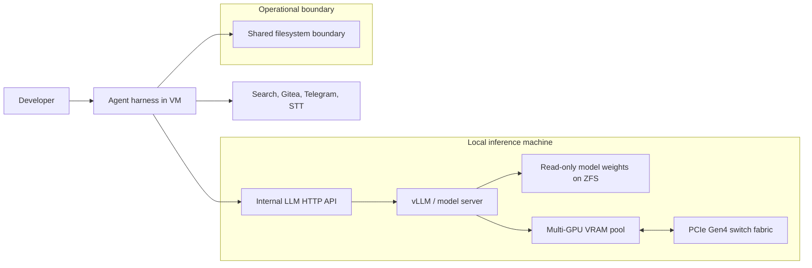

로컬 LLM 추론은 더 이상 취미용 서버 조립 이야기에 머물지 않는다. GPU, VRAM, PCIe 토폴로지, 샌드박스, 모델 선택이 한 덩어리로 묶이면서 에이전트를 어디서 실행할지 정하는 인프라 문제가 됐다.

> 로컬 추론의 핵심 질문은 클라우드보다 싸냐가 아니다.  
> 데이터를 밖으로 보낼 수 없는 작업을, 운영 가능한 속도와 장애 범위 안에 가둘 수 있느냐다.

## 로컬 LLM은 클라우드 절감책이 아니라 통제권 설계다

James O'Beirne의 로컬 LLM 가이드는 Hacker News에서 395포인트와 176개 댓글을 끌어냈다. 관심을 받은 이유는 단순한 하드웨어 자랑이어서가 아니다. 이 글은 로컬 추론을 개인용 장난감이 아니라 독립된 컴퓨팅 스택으로 다룬다.

가이드의 선택지는 크게 갈린다. 약 2천 달러로 RTX 3090 두 장, 총 48GB VRAM을 맞춰 Qwen 계열 모델과 whisper-large-v3 기반 음성 인식(STT)을 돌리는 구성이 있다. 반대편에는 RTX PRO 6000 Blackwell 네 장, 총 384GB VRAM을 쓰는 약 4만 달러급 구성이 있다. 이 구성은 GLM-5.2-594B를 vLLM과 Docker Compose로 서빙하고, 46만 토큰 컨텍스트에서 약 80 tokens/s를 목표로 한다.

이 숫자는 구매 가이드라기보다 경계선에 가깝다. 작은 모델은 개인 워크플로와 로컬 STT에 맞고, 큰 모델은 에이전트 작업자와 코드 작업 자동화에 붙는다. 둘의 공통점은 입력 데이터, 모델 가중치, 도구 호출, 작업 로그가 외부 API 사업자의 정책 변경에 덜 흔들린다는 점이다.

클라우드는 확장성을 샀고, 로컬은 통제권을 산다.

그 통제권은 공짜가 아니다. Jamesob 구성에는 구형 EPYC, 중고 DDR4 ECC RDIMM, PCIe Gen4 스위치, 두 개의 1700W PSU, 직접 만든 GPU 마운트, ZFS에 저장한 모델 가중치까지 들어간다. 모델을 실행하는 문제는 곧 전원, 발열, 버스 대역폭, 커널 파라미터, 컨테이너 격리의 문제가 된다.

## 왜 GPU 한 장이 아니라 PCIe 토폴로지가 논쟁의 중심인가

큰 모델을 여러 GPU에 나눠 올리면 병목은 연산에만 생기지 않는다. 텐서 병렬화(Tensor Parallelism)의 all-reduce 단계에서 GPU 사이 데이터 이동이 계속 발생한다. 이때 트래픽이 CPU 루트 콤플렉스를 왕복하면 비싼 GPU가 기다리는 시간이 늘어난다.

Jamesob의 구성에서 눈에 띄는 부분은 4개의 RTX PRO 6000보다 PCIe Gen4 스위치다. c-payne의 Microchip Switchtec PM40100 기반 스위치를 써서 GPU 간 피어 투 피어(P2P) 트래픽을 스위치 패브릭 안에 머물게 한다. 측정값은 Gen4 라인 레이트 기준 27.5/50.4 GB/s와 서브 마이크로초 지연으로 제시됐다.

이 선택은 실무적으로 선명하다. 비싼 PCIe5와 DDR5 베이스 시스템보다 VRAM과 GPU 간 연결에 돈을 쓴다. 모델 추론에서 부족한 것은 CPU 코어 수가 아니라 VRAM 용량과 GPU 사이 통신인 경우가 많기 때문이다.

대신 운영 난도는 높다. BIOS에서 링크 폭을 x16으로 고정하고, PCIe Link Speed를 Gen4로 지정하고, ASPM을 끄고, Re-Size BAR를 켜야 한다. `iommu=off amd_iommu=off nomodeset` 같은 GRUB 설정도 등장한다. ACS(Access Control Services)가 켜져 있으면 P2P 트래픽이 CPU 루트 포트를 거쳐 스위치의 의미가 사라지므로, 부팅 때 `setpci`로 ACS를 비활성화하는 스크립트까지 둔다.

이 지점에서 커뮤니티 반응이 갈린다. 외부 API 의존을 줄이는 현실적인 독립성으로 보는 쪽이 있고, 커널 패치, ACS 비활성화, 수동 전원 관리가 들어가는 순간 운영 가능한 제품 인프라와 멀어진다고 보는 쪽도 있다. 개인 연구실이나 내부 자동화 박스에는 설득력이 있지만, 규제 산업의 운영 플랫폼으로 넣으려면 하드웨어 표준화와 장애 대응 절차가 먼저 필요하다.

## 로컬 AI 에이전트 아키텍처는 모델보다 샌드박스가 먼저다

로컬 LLM을 코드 작업자나 자동화 에이전트에 붙일 때 가장 위험한 착각은 모델만 내부에 두면 안전하다고 보는 것이다. 모델이 로컬이어도 에이전트가 파일 시스템을 마음대로 읽고, 패키지를 설치하고, 네트워크로 나가고, 내부 저장소에 PR을 만들면 위험면은 그대로 남는다.

Jamesob의 구성은 이 점을 구체적으로 보여준다. 추론 서버는 HTTP API로 노출되고, 별도 VM에서 opencode 인스턴스가 디렉터리별 tmux 세션을 띄운다. 에이전트는 내부 Gitea 이슈를 받아 작업하고, Telegram 알림과 검색 도구를 사용한다. 호스트와의 통신은 공유 파일 시스템 마운트로 제한한다.

아래 구조가 이 방식의 최소 단위다.

이 설계에서 지켜야 할 선은 두 개다. 모델 가중치는 읽기 전용으로 마운트한다. 에이전트 작업자는 호스트가 아니라 VM 안에서 실행한다. 이 두 가지가 있으면 실수로 모델 파일을 덮어쓰거나, 에이전트가 호스트 패키지 상태를 망가뜨리는 사고를 줄일 수 있다.

네트워크도 같은 방식으로 봐야 한다. 내부 DNS로 `clank.j.co:5000` 같은 이름을 붙이는 것은 편하지만, 인증 없는 HTTP 추론 API가 내부망에 열리면 다른 워크로드가 마음대로 비용 높은 추론을 호출할 수 있다. 로컬이라는 말은 안전하다는 뜻이 아니다. 접근 제어가 없으면 사설망 안의 공용 자원일 뿐이다.

## DiffusionGemma와 Gemma 4가 보여주는 다른 길: 하드웨어를 키우지 않고 병목을 바꾼다

Jamesob의 가이드는 VRAM과 PCIe 토폴로지에 투자하는 방향이다. Google의 DiffusionGemma와 Gemma 4 12B 개발자 가이드는 다른 축을 보여준다. 하드웨어를 크게 만드는 대신 모델 구조와 생성 방식을 바꿔 로컬 실행의 문턱을 낮춘다.

DiffusionGemma는 자동회귀(Autoregressive) 방식처럼 토큰을 하나씩 생성하지 않는다. 256토큰 캔버스를 병렬로 만들고 반복적인 디노이징으로 다듬는다. Google은 이 방식이 메모리 대역폭 병목을 계산 병목으로 옮기며, NVIDIA GeForce RTX 5090에서 700 tokens/s 이상, 단일 H100에서 1000 tokens/s 이상까지 가능하다고 설명한다. 26B Mixture of Experts(MoE) 모델이지만 추론 중 활성화되는 파라미터는 3.8B 수준이고, 양자화 배포는 18GB VRAM 한도 안을 겨냥한다.

이 접근은 로컬 추론의 병목을 다르게 읽는다. 기존 LLM은 매 토큰마다 가중치를 반복적으로 읽어야 하므로 메모리 대역폭에 묶인다. DiffusionGemma는 병렬 작업을 크게 만들어 GPU의 텐서 코어를 더 적극적으로 쓴다. 특히 제약 조건이 강한 작업, 예를 들어 Sudoku 같은 문제에서 양방향 컨텍스트와 자기 수정이 장점으로 제시된다.

Gemma 4 12B는 멀티모달 로컬 실행 쪽에서 같은 문제를 건드린다. 별도 비전 인코더와 오디오 인코더를 거쳐 LLM에 넣는 전통적 구조를 줄이고, 멀티모달 데이터를 LLM 백본에 직접 넣는 encoder-free 구조를 내세운다. 목표는 시각·음성 입력을 로컬에서 처리할 때 지연 시간과 메모리 풋프린트를 줄이는 것이다. Google은 16GB VRAM 또는 통합 메모리를 가진 전용 GPU 노트북에서의 로컬 실행을 개발자 친화적 크기로 잡았다.

로컬 LLM 도입 판단은 둘 중 하나를 고르는 문제가 아니다. 큰 VRAM 박스는 더 큰 모델과 긴 컨텍스트를 산다. 구조가 바뀐 중형 모델은 낮은 지연 시간과 배포 범위를 산다. 내부 코드 에이전트에는 전자가 맞을 수 있고, 데스크톱 음성·시각 인터랙션에는 후자가 맞을 수 있다.

## 도입 전에 숫자보다 먼저 확인할 것

로컬 LLM을 들일 때 첫 질문을 GPU 예산으로 잡으면 실패하기 쉽다. 먼저 워크로드를 나눠야 한다.

대화형 코딩 보조, 로컬 STT, 문서 요약처럼 짧고 반복적인 작업은 48GB VRAM급 구성과 중형 모델로도 충분한 구간이 있다. 긴 컨텍스트, 여러 에이전트 동시 실행, 큰 코드베이스 분석, 내부 저장소 기반 PR 자동화는 VRAM과 I/O 격리 요구가 빠르게 커진다. 같은 로컬 LLM이라는 이름 아래 완전히 다른 시스템이 된다.

운영 체크리스트는 하드웨어 견적보다 건조해야 한다.

- 모델 가중치를 어디에 저장하고, 손상 시 어떻게 복구할지 정한다.
- 추론 API에 인증, 네트워크 ACL, 호출량 제한을 둔다.
- 에이전트는 VM 또는 컨테이너 안에서 실행하고, 호스트 접근 경로를 줄인다.
- GPU P2P가 실제로 동작하는지 `nvidia-smi topo -m`과 대역폭 측정으로 확인한다.
- 전원 회로, 발열, 팬 소음, 재부팅 후 systemd 작업까지 운영 항목으로 넣는다.
- `iommu=off`나 ACS 비활성화처럼 보안과 격리에 영향을 줄 수 있는 설정은 별도 머신에서만 허용한다.

특히 ACS 비활성화는 성능을 위해 격리 장치를 내려놓는 선택이다. 멀티 테넌트 서버, 민감 워크로드가 섞인 호스트, 일반 업무용 머신에서는 받아들이기 어렵다. 로컬 추론 박스를 전용 어플라이언스처럼 다루면 위험이 줄고, 일반 서버처럼 여러 책임을 얹으면 위험이 커진다.

비용도 단순 비교가 어렵다. 클라우드 API는 토큰 단위로 비용이 드러난다. 로컬은 GPU 감가상각, 전기, 냉각, 장애 대응 시간, 부품 수급, 모델 업데이트 관리가 뒤늦게 비용으로 나온다. 데이터 반출 제한, 오프라인 작업, 대량 반복 호출, 내부 도구 호출이 많은 조직에서는 로컬이 단순 절감보다 강한 의미를 가진다.

## 로컬 LLM을 선택해야 하는 팀과 기다려야 하는 팀

로컬 LLM은 모두에게 빠른 답이 아니다. 내부 데이터가 외부 API로 나가면 안 되고, 모델 품질이 특정 워크로드에서 충분히 검증됐고, GPU 서버를 돌릴 운영 역량이 있는 팀에는 지금도 실용적이다. 특히 코드 작업 에이전트, 로컬 STT, 민감 문서 처리처럼 데이터 경계가 명확한 작업은 클라우드보다 로컬의 장점이 분명하다.

반대로 모델 교체 주기가 빠르고, 워크로드가 들쭉날쭉하며, 인프라 담당자가 GPU 토폴로지와 커널 설정을 다룰 여유가 없다면 기다리는 편이 낫다. DiffusionGemma나 Gemma 4 12B 같은 모델 구조 변화는 로컬 실행의 문턱을 낮추고 있다. 오늘 4만 달러짜리 박스로만 가능한 일이 내일 16GB VRAM 노트북이나 단일 워크스테이션에 내려올 수 있다.

판단 기준은 하나다.

로컬 LLM은 더 싼 챗봇을 사는 일이 아니다. 조직 안에 작은 런타임을 들이는 일이다. 런타임에는 모델만 있지 않다. 저장소, 네트워크, 권한, 샌드박스, 관측, 복구 절차가 함께 들어온다. 이 묶음을 운영할 수 있으면 로컬은 통제권을 준다. 운영할 수 없으면 GPU는 빠른 부채가 된다.

## 참고 자료

- [선정 글감] [Jamesob's guide to running SOTA LLMs locally](https://github.com/jamesob/local-llm), Hacker News Best
- [관련] [DiffusionGemma: The Developer Guide](https://developers.googleblog.com/diffusiongemma-the-developer-guide/), Google Developers
- [관련] [Gemma 4 12B: The Developer Guide](https://developers.googleblog.com/gemma-4-12b-the-developer-guide/), Google Developers