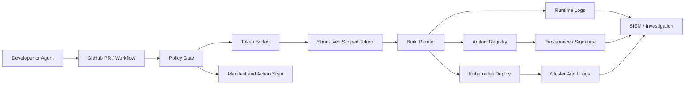

> 공급망 공격은 침투 지점에서 끝나지 않는다. 중요한 것은 토큰 하나가 새어 나온 뒤, 그 토큰이 어디까지 갈 수 있느냐다.

npm 공급망 공격, GitHub 앱 권한, AI 에이전트 도구, 주거용 프록시 봇넷은 서로 다른 사건처럼 보인다. 하지만 같은 질문으로 묶인다. 신뢰한 실행 주체가 악성 입력을 받았을 때, 시스템은 어디에서 멈추는가.

## 공급망 보안의 핵심은 탐지가 아니라 폭발 반경이다

Grafana의 TanStack npm 공급망 랜섬 사건은 이 질문을 선명하게 보여준다. 사건은 2026년 5월 11일 Mini Shai-Hulud 캠페인을 통해 self-hosted runner에서 악성 코드가 실행되며 시작됐다. Grafana는 관련 자격 증명을 회전했다고 판단했지만 하나를 놓쳤고, 공격자는 그 자격 증명으로 전체 저장소 컬렉션을 복제했다. 5월 16일 랜섬 요구가 왔다.

핵심은 고객 프로덕션 시스템 침해가 아니었다. Grafana는 Grafana Cloud 플랫폼이 영향을 받지 않았고, 고객 프로덕션 시스템에 대한 무단 접근도 없었다고 밝혔다. Mandiant 조사도 공개 조직이나 최종 사용자에게 전달되는 프로덕션 저장소에서 코드 변조나 저장소 오염 증거를 찾지 못했다고 확인했다.

그렇다고 가벼운 사건은 아니다. 생산 데이터를 가져가지 않았더라도, 개발 환경 자체가 이미 충분히 큰 공격면이 되었기 때문이다. 저장소에는 코드만 있지 않다. 내부 도구, 운영 정보, 과거 협업 흔적, 배포 파이프라인, GitHub 앱 권한, CI 토큰의 사용 방식이 함께 들어 있다.

공급망 보안은 악성 패키지를 찾는 게임이 아니다. 토큰, 워크플로, 저장소, 배포 권한의 이동 거리를 줄이는 설계 문제다.

## 왜 GitHub 앱과 CI 토큰이 Kubernetes 보안 문제까지 번지는가

Grafana의 대응 범위는 사건의 성격을 보여준다. 단순히 GitHub 토큰만 바꾼 것이 아니다. Vault, GitHub, Okta, Kubernetes, AWS, GCP, 호스트 로그를 함께 감사했다. 280개 GitHub 애플리케이션 권한을 점검하고 일부를 제거했으며, 1,200개 저장소에서 변조 흔적을 스캔했다. 특정 중요 저장소 하나에서는 2,300개 PR 리뷰를 돌려 무단 변경을 찾았다.

이 숫자가 말하는 바는 분명하다. CI/CD는 더 이상 개발 보조 도구가 아니다. 클라우드 계정, 컨테이너 레지스트리, Kubernetes 클러스터, 배포 정책을 잇는 제어 평면이다.

많은 조직은 이 제어 평면을 편의 중심으로 키웠다. self-hosted runner는 내부망과 가까워지고, GitHub 앱은 여러 저장소에 걸친 권한을 얻고, 장기 토큰은 배포 실패를 줄이기 위해 넓은 권한을 가진다. 평상시에는 속도지만, 사고가 나면 횡이동 경로가 된다.

Grafana가 이후 GitHub Actions 일부에서 벗어나 더 좁은 권한의 액션과 단기 토큰을 쓰고, GitHub 애플리케이션 토큰 브로커(token broker)를 조건으로 저장소 thawing을 진행한 이유가 여기에 있다. 저장소가 다시 배포를 시작하려면 먼저 짧고 좁은 권한을 받아야 한다. 복구의 기준을 빌드 성공이 아니라 권한 축소로 잡은 셈이다.

## AI 에이전트 시대의 공급망은 코드 밖에서 터진다

MCP 도구 오염(tool poisoning) 논의는 같은 문제를 다른 방향에서 보여준다. DEV Community에 소개된 사례는 MCP 매니페스트의 도구 설명에 보이지 않는 유니코드 문자를 심는 공격을 다룬다. 사람의 코드 리뷰에는 “Search docs.”처럼 보이지만, 모델은 숨은 텍스트까지 읽고 지시로 처리할 수 있다. 페이로드는 실행 코드가 아니라 메타데이터에 있다.

여기서 기존 공급망 보안의 시야가 흔들린다. npm 패키지, GitHub Actions, MCP 서버는 모두 신뢰된 확장 지점이다. 차이는 에이전트가 그 설명문을 단순 문서가 아니라 행동 지시로 읽는다는 데 있다.

Anthropic의 Claude 격리 글도 같은 축을 짚는다. 에이전트의 위험은 실패 확률과 실패 시 피해 규모로 나뉜다. 모델이 더 좋아져 실패 확률이 내려가도, 접근 권한이 커지면 피해 규모는 커진다. Claude Code의 사용자 승인 프롬프트도 만능이 아니었다. 텔레메트리상 사용자가 권한 요청의 약 93%를 승인했다는 대목은 사람 검토가 반복될수록 통제 장치가 아니라 습관이 된다는 사실을 보여준다.

사람은 피곤해지고, 에이전트는 지시를 따른다.

그래서 AI 에이전트 보안은 “허가를 물어봤는가”보다 “허가된 뒤에도 어디까지 못 가는가”를 먼저 설계해야 한다. 도구 설명, 프롬프트, 매니페스트, 패키지 메타데이터는 모두 입력 데이터로 보고 검증해야 한다.

## 토큰 브로커와 격리된 실행 환경은 선택지가 아니라 기본값이다

공급망 사고에 강한 아키텍처는 단순하다. 장기 비밀을 줄이고, 권한 발급을 중앙화하고, 실행 환경을 격리하고, 로그를 교차 검증한다. 이 네 가지가 없으면 사고 대응은 검색 작업으로 변한다.

이 구조에서 GitHub Actions는 직접 클라우드 장기 키를 들고 있지 않다. 워크플로는 정책 게이트를 통과한 뒤 토큰 브로커에서 짧은 수명의 권한을 받는다. 토큰은 저장소, 브랜치, 작업, 배포 대상 단위로 좁혀진다. 빌드 결과물은 레지스트리에 올라가고, Kubernetes 배포는 별도 감사 로그로 남는다.

MCP 서버나 AI 에이전트 도구를 붙일 때도 같은 원칙을 쓴다. 도구 설명은 신뢰하지 않는다. 매니페스트는 정적 분석 대상이다. zero-width 문자, bidi override, 유니코드 태그 문자처럼 리뷰 화면에서 사라질 수 있는 입력은 차단하거나 정규화한다. 에이전트는 전체 저장소와 전체 홈 디렉터리를 보지 않는다. 필요한 파일, 필요한 네트워크, 필요한 명령만 허용한다.

토큰 브로커는 보안팀 장식품이 아니다. 운영 복잡도를 줄이는 장치다. 사고가 났을 때 “어느 토큰을 회전해야 하는가”가 아니라 “이 발급 정책을 막으면 어디가 멈추는가”로 대응 범위가 좁아진다.

## 주거용 프록시 봇넷이 보여주는 외부 공격면

KrebsOnSecurity의 NetNut·Popa 봇넷 보도는 공급망 바깥쪽의 현실을 붙인다. FBI는 NetNut과 관련된 수백 개 도메인을 압수했다고 밝혔고, 보도에 따르면 Popa 봇넷은 최소 200만 대의 기기로 구성된 것으로 지목됐다. 스마트 TV나 스트리밍 장치 같은 가정용 기기가 항상 켜진 주거용 프록시 노드가 되고, 이 인프라는 스크래핑, 광고 사기, 계정 탈취 트래픽을 숨기는 데 쓰였다고 설명된다.

개발 조직이 이 사례에서 볼 부분은 명확하다. 공격자는 깨끗한 데이터센터 IP에서 오지 않는다. GitHub, npm, MCP 서버, 로그인 엔드포인트, 패키지 레지스트리 접근은 주거용 프록시를 통해 정상 사용자처럼 보일 수 있다.

공급망 방어를 내부 권한만으로 끝내면 빈틈이 생긴다. 저장소 클론, 토큰 사용, 패키지 게시, GitHub 앱 호출, 레지스트리 푸시 같은 이벤트에는 위치 기반 허용보다 행위 기반 탐지가 필요하다. 평소와 다른 저장소 대량 복제, 낯선 앱 계정의 커밋, 짧은 시간 안의 다중 워크플로 실행, 사용자 에이전트와 ASN 변화는 별도 신호로 보아야 한다.

IP 평판은 참고 자료다. 결정권자는 권한, 행위, 산출물 검증이어야 한다.

## 도입 전에 확인할 Kubernetes·CI/CD 보안 체크포인트

실무에서 바로 확인할 항목은 거창하지 않다. 먼저 GitHub 앱과 CI 토큰의 권한 목록을 뽑아야 한다. 몇 개가 있는지 모르는 조직은 이미 늦게 보는 중이다. Grafana가 280개 GitHub 앱을 감사했다는 숫자는 큰 회사만의 이야기가 아니다. 오래된 자동화는 대부분 권한을 먹고 남는다.

다음은 저장소와 배포 대상의 결합도를 끊는 일이다. 모든 저장소가 같은 레지스트리 푸시 권한을 갖고, 모든 runner가 같은 Kubernetes 클러스터에 접근하면 한 번의 누출이 전체 배포면으로 번진다. 최소 단위는 저장소가 아니라 서비스와 환경이다. dev, staging, production 권한은 분리되어야 하고, archived repo에는 Actions가 꺼져 있어야 한다.

AI 에이전트를 붙였다면 별도 점검이 필요하다.

- MCP 서버 매니페스트와 도구 설명을 코드처럼 스캔한다.
- 에이전트 실행 환경에서 `.env`, SSH 키, 클라우드 자격 증명 경로를 기본 차단한다.
- 도구 호출 로그는 프롬프트 원문, 도구 설명, 인자, 결과를 함께 남긴다.
- 사람 승인 프롬프트는 고위험 작업에만 남기고, 저위험 반복 승인으로 사용자를 무디게 만들지 않는다.
- 외부 네트워크 호출은 기본 거부로 두고, 필요한 도메인만 허용한다.

토큰 브로커, 매니페스트 스캔, runner 격리는 배포 속도를 약간 늦춘다. 초기에는 실패한 워크플로가 늘고, 팀마다 예외 요청이 생긴다. 그래도 예외를 문서화하고 만료 시간을 두면 운영 비용은 관리 가능하다. 장기 토큰과 넓은 GitHub 앱 권한을 유지한 채 빠른 배포를 택하면, 사고가 났을 때 모든 저장소와 모든 로그를 뒤지는 비용을 한 번에 낸다.

공급망 보안의 기준은 공격을 완전히 막는 것이 아니다. 공격자가 들어온 뒤에도 복제할 저장소, 사용할 토큰, 변조할 산출물, 호출할 클러스터가 줄어드는 상태를 만드는 것이다.

처음의 질문으로 돌아가면 답은 단순하다. 신뢰한 실행 주체가 악성 입력을 받았을 때 시스템은 리뷰어의 눈이 아니라 아키텍처에서 멈춰야 한다. 토큰은 짧아야 하고, 권한은 좁아야 하며, 에이전트와 CI는 자기 방 밖으로 나가지 못해야 한다.

공급망 사고는 계속 난다. 차이는 그 사고가 저장소 하나의 감사로 끝나는지, 회사 전체의 권한 지도를 다시 그리는 일로 번지는지다.

## 참고 자료

- [선정 글감] [Post-incident review for TanStack npm supply chain ransom incident: No unauthorized access to customer production systems](https://grafana.com/blog/post-incident-review-for-tanstack-npm-supply-chain-ransom-incident/) — Grafana Blog
- [관련] [The MCP attack your code review cannot see](https://dev.to/kielltampubolon/the-mcp-attack-your-code-review-cannot-see-25b8) — DEV Community
- [관련] [How we contain Claude across products](https://www.anthropic.com/engineering/how-we-contain-claude) — Anthropic Engineering
- [관련] [FBI Seizes NetNut Proxy Platform, Popa Botnet](https://krebsonsecurity.com/2026/07/fbi-seizes-netnut-proxy-platform-popa-botnet/) — Krebs on Security