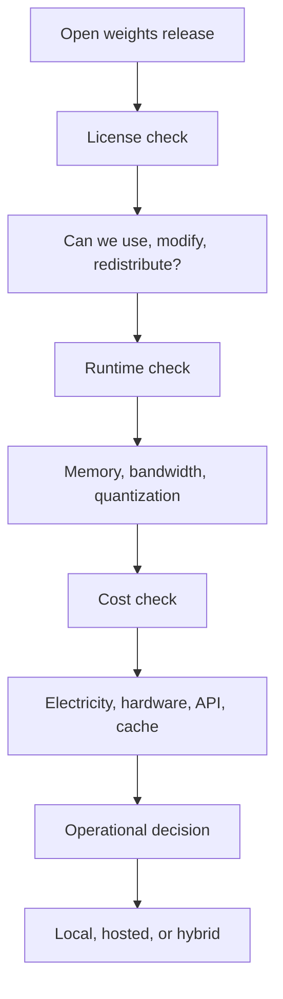

LongCat 2.0 오픈 웨이트 공개가 LocalLLaMA에서 바로 화제가 된 이유는 모델 크기 때문만이 아니다. 1.6T 파라미터와 MIT 라이선스가 함께 언급되자 개발자들은 같은 질문으로 모였다. 이 모델을 내 장비에서 굴릴 수 있는지, 굴린다면 API 비용 대신 어떤 운영 부담을 떠안게 되는지다.

## LongCat 2.0 MIT 라이선스가 푼 것은 사용 권한이다

확인된 사실부터 나눠보자. LongCat 2.0은 2026년 6월 30일 기술 블로그를 통해 소개됐고, 이후 ModelScope와 X, Reddit LocalLLaMA를 통해 가중치 공개 소식이 퍼졌다. Reddit에 공유된 제목 기준 핵심은 총 1.6T 파라미터, 약 48B 활성 파라미터(active parameters), MIT 라이선스 공개다.

MIT 라이선스는 분명한 신호다. 연구용 데모에 그치기보다 재배포와 수정, 상업적 활용까지 비교적 넓게 열어두는 쪽에 가깝다. 폐쇄형 API에 묶이지 않고 모델을 내려받아 검토하고, 내부 정책에 맞게 배포하고, 필요하면 파인튜닝(Fine-tuning) 경로도 검토할 수 있다.

다만 라이선스가 실행 환경까지 해결해주지는 않는다.

1.6T라는 숫자는 관심을 끌고, 48B active라는 숫자는 계산을 시작하게 만든다. 이 구조는 전체 파라미터를 매 토큰마다 모두 쓰는 방식이 아니라 일부 전문가 경로만 활성화하는 혼합 전문가(Mixture of Experts, MoE) 계열로 읽힌다. 확인된 것은 총 규모와 활성 규모다. 실제 추론 속도, 필요한 메모리, 양자화(Quantization)별 품질 저하, 로컬 런타임 호환성은 따로 검증해야 한다.

커뮤니티가 반긴 지점은 사용 자유였고, 곧바로 따진 지점은 비용이었다.

## 왜 1.6T 오픈 모델보다 실행 가능한 로컬 LLM이 더 큰 쟁점인가

LocalLLaMA의 반응을 보면 오픈 웨이트 공개만으로 대화가 끝나지 않는다. 같은 시기에 올라온 Gemma 4 12B MLX Kernel 글은 16GB MacBook Pro 같은 제한된 장비에서 작은 모델을 어떻게 최대한 굴릴지에 초점을 맞췄다. 작성자는 MLX와 CUDA 계열 런타임의 구현 차이를 언급하며, drafter 모델과 가중치가 16GB RAM 한계에 걸린다고 설명했다. 좋은 다중 토큰 예측(Multi-token Prediction, MTP) 워크로드에서 20~30 tok/s 정도를 이론적 상한으로 봤다는 점도 공유됐다.

이 숫자는 LongCat 2.0 논의와 바로 이어진다. 커뮤니티가 원하는 것은 단순한 다운로드 링크가 아니다. 로컬 장비에서 지연 시간이 견딜 만하고, 메모리 압박이 관리 가능하며, 런타임이 안정적으로 돌아가는 조합이다.

DeepSeek-V4-Flash 관련 글은 반대쪽 사례다. 한 사용자는 Xeon E5-2699v4와 512GB DDR4 2133 메모리, GTX 1060 6GB 환경에서 CPU 중심으로 DeepSeek-V4-Flash MXFP4 양자화를 실행했다. 기대는 5 tok/s 이상이었지만 실제 최대는 3.2 tok/s 수준이었다고 적었다. 비교 대상으로 든 GLM 5.2 40B active Q4_K_XL은 1.8 tok/s였고, 이 역시 느리다고 봤다.

쟁점은 모델 이름이 아니다. 같은 active parameter라도 포맷, 메모리 대역폭, 런타임 커널, 배치 처리, 캐시 전략에 따라 체감 성능은 크게 달라진다. MIT 라이선스 모델이 늘어날수록 개발자는 모델 선택보다 배포 조합을 먼저 평가해야 한다.

이 흐름에서 LongCat 2.0은 첫 칸을 크게 밀었다. 나머지 칸은 각자 계산해야 한다.

## 로컬 AI 비용 계산은 장비값보다 사용 패턴에서 갈린다

오픈 웨이트가 나오면 “장비만 사면 무료”라는 말이 반복된다. 같은 LocalLLaMA의 2만 달러 로컬 AI 리그 손익분기 글은 이 주장을 정면으로 다뤘다. 작성자는 2만 달러급 장비와 월 200달러 전기료를 가정하고, 월 200달러 호스팅 구독과 비교하면 손익분기점이 약 27개월 뒤라고 계산했다. 감가상각, 재판매 가치, 유지보수 시간, 기회비용까지 넣으면 더 밀릴 수 있다고 했다.

반박도 있었다. 단일 사용자 채팅만 놓고 보면 로컬 리그가 비싸 보이지만, 데이터 생성, 파인튜닝, 배치 처리, 자동화 작업이 들어오면 계산이 달라진다는 반응이다. 한 댓글은 2개의 RTX 3090으로 Qwen 계열 모델을 배치 처리할 때 약 450 tok/s, 단일 요청 약 80 tok/s, 시스템 전력 약 600W라는 계산을 제시했다. 전기료를 넣어도 출력 100만 토큰당 비용이 낮아질 수 있다는 주장이다.

캐시 비용도 중요하다. API 제공자는 입력 토큰과 캐시 히트에도 비용을 매긴다. 로컬 실행에서는 같은 프롬프트 캐시를 다시 쓰는 비용이 전기와 하드웨어 사용량으로 흡수된다. 에이전트형 워크로드처럼 긴 컨텍스트를 반복해서 넣는 구조에서는 출력 토큰 가격만 비교하면 결론이 틀어진다.

LongCat 2.0 같은 대형 오픈 모델의 의미는 가격표 하나로 판단하기 어렵다. 개인이 가끔 쓰는 챗봇이라면 호스팅이 낫다. 민감한 데이터, 오프라인 요구, 모델 고정성, 대량 배치, 반복 캐시가 있는 조직이라면 로컬 또는 사설 배포의 근거가 생긴다.

로컬은 무료가 아니다. 로컬은 통제권을 사는 방식이다.

## 오픈 웨이트를 도입하려면 모델보다 운영 기준을 먼저 정해야 한다

실무에서 LongCat 2.0 같은 오픈 웨이트 모델을 검토한다면 첫 질문은 성능 벤치마크가 아니다. 사용권과 운영 경계를 먼저 정해야 한다.

확인할 항목은 단순하다.

- MIT 라이선스 범위가 내부 배포, 고객 제공 기능, 파생 모델 배포에 맞는지 확인한다.
- 원본 가중치와 양자화 버전의 출처를 분리해서 기록한다.
- active parameter 숫자만 보지 말고 실제 메모리 사용량, 토큰 속도, 동시 요청 수를 같은 프롬프트로 측정한다.
- CPU, Apple MLX, CUDA, vLLM, llama.cpp 계열 중 어느 런타임을 운영 표준으로 삼을지 정한다.
- API 대비 비용 비교에는 입력 토큰, 출력 토큰, 캐시, 전기료, 장비 감가, 장애 대응 시간을 함께 넣는다.
- 민감 데이터가 있으면 로컬 실행의 장점을 보안 통제와 로그 정책으로 실제화한다.

커뮤니티 반응이 갈린 이유도 여기에 있다. 한쪽은 MIT 라이선스 공개를 모델 주권의 확대로 본다. 다른 한쪽은 1.6T 모델을 실제 업무에 넣을 때 생기는 하드웨어와 운영 난도를 본다. 같은 소식을 두고도 판단 기준이 다르다.

LongCat 2.0은 폐쇄형 모델을 바로 대체하는 사건이 아니다. 오픈 웨이트 모델을 운영 자산으로 볼지, 실험 재료로 둘지 선택하게 만든 사건이다. 이 차이를 놓치면 모델 공개 소식은 매번 같은 감탄으로 끝난다. 이 차이를 잡으면 라이선스, 런타임, 비용, 데이터 통제라는 기준으로 다음 모델을 고를 수 있다.

첫 문단의 질문으로 돌아가면 답은 분명하다. 이 모델을 내 장비에서 굴릴 수 있는지가 전부는 아니다. 더 정확한 질문은 이 모델을 내 책임 아래 둘 준비가 되어 있는지다.

## 참고 자료

- [선정 글감] [longcat 2.0 (1.6T, ~48B active) weights are now open under MIT license](https://www.reddit.com/r/LocalLLaMA/comments/1unyvnz/longcat_20_16t_48b_active_weights_are_now_open/) - Reddit LocalLLaMA
- [관련] [Introducing LongCat-2.0](https://longcat.chat/blog/longcat-2.0/) - LongCat
- [관련] [Gemma 4 12B - MLX Kernel](https://www.reddit.com/r/LocalLLaMA/comments/1uneztp/gemma_4_12b_mlx_kernel/) - Reddit LocalLLaMA
- [관련] [DeepSeek-V4-Flash in MXFP4 is too slow on CPU](https://www.reddit.com/r/LocalLLaMA/comments/1unvy5i/deepseekv4flash_in_mxfp4_is_too_slow_on_cpu/) - Reddit LocalLLaMA
- [관련] [Doing the actual math on a $20k local AI rig breakeven](https://www.reddit.com/r/LocalLLaMA/comments/1un6njn/doing_the_actual_math_on_a_20k_local_ai_rig/) - Reddit LocalLLaMA