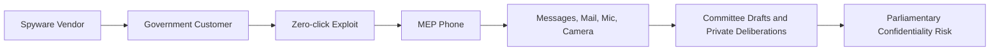

Pegasus 스파이웨어가 유럽의회 조사위원의 휴대전화에 들어갔다. 감시 도구 남용을 조사하던 사람이 조사 대상 도구에 감염된 사건이다. 보안 사고 하나로 끝낼 일이 아니라, 의회 감시와 취약점 거래, 정부 권한의 경계가 맞물린 사례다.

## 감시 대상이 된 것은 한 명의 정치인이 아니라 조사 절차였다

Citizen Lab은 2026년 5월 Stelios Kouloglou의 iPhone을 포렌식 분석했고, Pegasus 감염을 높은 신뢰도로 확인했다고 밝혔다. Kouloglou는 그리스 탐사보도 기자 출신 전 유럽의회 의원이다. 2022년 3월 24일부터 2023년 7월 18일까지 Pegasus와 동급 감시 스파이웨어 남용을 조사하는 PEGA Committee의 대체 위원으로 활동했다.

확인된 감염 시점은 세 번이다. 2022년 10월 21일, 2023년 3월 6일, 2023년 3월 7일이다. Citizen Lab은 2022년 10월 21일 오전 10시 16분 HomeKit 이메일 주소 조회가 있었고, 2분 뒤 Pegasus 프로세스가 모바일 데이터를 사용한 흔적을 확인했다. 이 감염은 PWNYOURHOME 제로클릭(Zero-click) 익스플로잇과 연결된 것으로 평가됐다.

제로클릭 공격에는 사용자가 링크를 누르는 행동이 필요 없다. 메시지를 열지 않아도 된다. 회의 자료를 검토하고, 가족에게 답장하고, 병원 침대 위에 휴대전화를 올려두는 평범한 상황도 공격 표면이 된다.

Citizen Lab은 Kouloglou의 기기가 당시 iOS 15.5를 실행 중이었다고 설명했다. Apple은 HomeKit 관련 문제를 iOS 16.3.1에서 완화했고, MessagesBlastDoorService 쪽 문제는 그보다 앞선 iOS 16.1 무렵 수정된 것으로 Citizen Lab은 평가했다. 이 대목은 기술적으로도 분명하다. 최신 패치가 늦어진 개인 기기는 고위험 표적에게 곧바로 정치적 리스크가 된다.

## Pegasus 사건이 다시 불붙은 이유: 감염 시점

이번 사건이 크게 반응을 끌어낸 이유는 감염 날짜에 있다. 첫 감염일인 2022년 10월 21일은 PEGA Committee가 Big Tech and Spyware, Spyware and e-privacy, spyware and fundamental rights 관련 청문회를 앞두고 있던 시기였다. 위원회 첫 보고서 초안도 2022년 11월 8일 제출될 예정이었다.

Kouloglou는 Citizen Lab에 당시 위원회 내부 논의와 초안 교환이 문자와 이메일을 중심으로 활발히 이뤄졌다고 설명했다. Pegasus가 감염된 휴대전화에서 메시지, 연락처, 사진, 웹 브라우징 정보, 마이크와 카메라 데이터까지 접근할 수 있다는 점을 고려하면, 이 감염은 개인 프라이버시 침해를 넘어 의회 절차의 비공개 정보를 노린 공격으로 읽힌다.

두 번째 감염 기간인 2023년 3월 6일부터 7일까지도 우연으로 넘기기 어렵다. Kouloglou는 그 시기 PEGA Committee가 최종 문안 작업을 두고 집중 논의를 하고 있었다고 말했다. 같은 기간 PEGA 보고관 Sophie in ‘t Veld는 LIBE Committee 임무로 그리스에 있었고, 그리스 스파이웨어 스캔들과 관련해 당국자를 질의했다.

확인된 사실은 Kouloglou의 기기가 Pegasus에 감염됐다는 점, 감염 시점이 PEGA Committee 활동의 민감한 구간과 겹친다는 점, Apple 위협 알림이 2023년 3월 2일, 2023년 8월 29일, 2024년 4월 10일 세 차례 기록됐다는 점이다. 공격 주체는 추정의 영역에 남아 있다. Citizen Lab은 특정 정부를 지목하지 않았고, 그리스 정부가 책임 있다는 징후도 발견하지 못했다고 밝혔다. 다만 첫 감염이 유럽 내 러시아어·벨라루스어권 망명 언론인과 활동가를 겨냥한 기존 Pegasus 캠페인과 겹친다고 설명했다.

이 구분이 중요하다. 공격자는 아직 확정되지 않았다. 그러나 공격이 겨냥한 권한과 정보의 성격은 충분히 선명하다.

## 커뮤니티가 불편해한 지점은 보안보다 권한이다

Hacker News에서 이 글은 404점과 119개 댓글을 모았다. 숫자만으로 여론을 단정할 수는 없지만, 개발자 커뮤니티가 이 사안을 단순 보안 뉴스로 소비하지 않았다는 신호로는 충분하다. 반응의 중심은 iPhone이 뚫렸다는 사실보다, 누가 이런 도구를 살 수 있고 어디까지 쓸 수 있느냐에 있었다.

WIRED는 Kouloglou가 이 상황을 너무 무모한 일로 표현했다고 전했다. TechCrunch는 이 감염이 정부가 중대 범죄 수사를 명분으로 산 스파이웨어를 언론인, 정치인, 비판자 감시에 쓰는 문제를 다시 열었다고 짚었다. 한 현직 유럽의회 의원은 이를 법치에 대한 직접 공격으로 불렀다.

개발자와 보안 실무자가 불편해하는 이유는 명확하다. 보안 모델은 보통 공격자를 외부 범죄자, 악성 해커, 랜섬웨어 조직으로 상정한다. Pegasus 같은 머서너리 스파이웨어(mercenary spyware)는 그 가정을 흐린다. 공격자는 돈을 내고 합법의 외피를 쓴 고객일 수 있다. 취약점은 범죄자가 몰래 찾은 구멍이 아니라, 시장에서 거래되는 기능이 된다.

사용자 입장에서도 방어가 어렵다. 클릭하지 말라, 출처를 확인하라, 2단계 인증을 켜라는 조언은 제로클릭 공격 앞에서 효력이 약하다. 남는 선택지는 패치, 격리, 고위험 사용자 보호 프로그램, 업무용·개인용 기기 분리, 위협 알림 대응 절차 같은 운영 문제다.

이 흐름에서 가장 약한 고리는 개인의 조심성이 아니다. 감시 도구 구매와 사용을 통제하는 제도, 고위험 표적을 보호하는 플랫폼 대응, 조직 내부의 민감 정보 취급 방식이 함께 약해질 때 한 사람의 휴대전화가 의회 전체의 정보 경로가 된다.

## 플랫폼 보안만으로는 의회 기밀을 지킬 수 없다

Apple의 위협 알림은 유용하지만 실시간 경보가 아니다. Citizen Lab은 이런 알림이 보통 표적화 이후 몇 달 또는 그 이상 지난 뒤 묶음으로 발송된다고 설명했다. Kouloglou 본인도 분석에서 확인된 Apple 알림을 기억하지 못한다고 했다. 알림이 도착했을 때 이미 회의 일정, 초안, 연락망, 취재원 정보는 빠져나갔을 수 있다.

이 사건이 실무에 주는 판단 기준은 세 가지다.

첫째, 고위험 직군은 일반 보안 수칙만으로 부족하다. 정치인, 기자, 인권 활동가, 내부고발자, 규제 조사 담당자에게는 패치 관리와 계정 보안뿐 아니라 기기 포렌식 접근권, 신속한 교체 절차, 별도 커뮤니케이션 채널이 필요하다.

둘째, 민감한 의사결정은 단일 개인 기기에 집중되면 안 된다. 보고서 초안, 증언자 정보, 방문 일정, 법적 전략이 개인 휴대전화 메시지와 이메일에 몰리면 Pegasus 감염 하나가 조직 침해로 번진다. 편리함은 정보를 모으고, 공격자는 그 모인 지점을 친다.

셋째, 규제는 도구 금지와 수사 예외 사이에서 흐려지면 실패한다. 스파이웨어는 납치, 테러, 중대 범죄 수사를 명분으로 판매된다. 그 명분을 완전히 무시할 수는 없다. 하지만 의회 조사위원, 기자, 야당 정치인, 시민단체가 반복적으로 표적이 되는 순간 예외는 제도가 아니라 우회로가 된다.

이번 사건에서 공격 주체를 단정하지 않는 태도는 필요하다. 동시에 그 신중함이 사건의 무게를 낮추지는 않는다. 누가 했는지 아직 모른다는 말과, 이런 공격을 가능하게 한 시장과 권한 구조가 위험하다는 말은 충돌하지 않는다.

Kouloglou의 휴대전화가 감염된 날, 그는 병원에 있었고 그리스 탐사보도 기자 Thanasis Koukakis의 방문을 받았다. Koukakis 역시 과거 Predator 스파이웨어 표적이었던 인물이다. Citizen Lab은 이 감염이 병실 대화나 건강 관련 정보까지 노출했을 가능성을 제기했다. 여기서 사건은 더 좁고 더 차갑게 변한다. 의회 기밀, 취재원 보호, 의료정보 보호가 한 기기 안에서 동시에 깨질 수 있다.

Pegasus 논쟁의 초점은 이제 iPhone도 뚫리느냐가 아니다. 이미 뚫렸다. 남은 문제는 민주주의 기관이 제로클릭 스파이웨어를 행정 권한의 연장선으로 허용할 것인지다. 범죄 수사를 위해 예외를 남길 수는 있다. 그러나 예외를 감시하는 사람까지 감시당한다면, 그 제도는 더 이상 예외를 관리하지 못한다.

## 참고 자료

- [선정 글감] [Espionage Against the European Parliament](https://citizenlab.ca/research/member-of-committee-investigating-spyware-hacked-with-pegasus/) - Hacker News Best
- [관련] [EU Politicians Investigated Pegasus Spyware. Then It Ended Up on One of Their Phones](https://www.wired.com/story/eu-politicians-investigated-pegasus-spyware-then-it-ended-up-on-one-of-their-phones/) - WIRED Security
- [관련] [Politician who investigated spyware abuses had his phone hacked with Pegasus spyware](https://techcrunch.com/2026/07/02/politician-who-investigated-spyware-abuses-had-his-phone-hacked-with-pegasus-spyware/) - TechCrunch