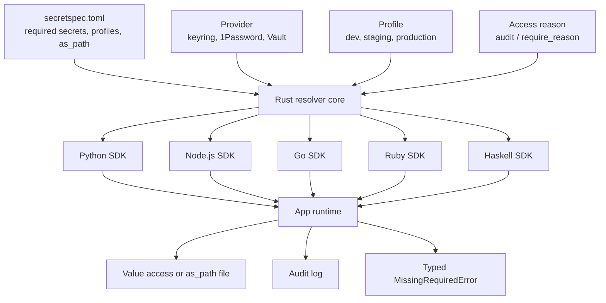

> 비밀 관리는 `.env`를 어디에 둘지의 문제가 아니다. Python 에이전트, Go 검증기, Node.js API가 같은 정책으로 같은 비밀을 읽는지의 문제다.

SecretSpec 0.13은 비밀 관리(secrets management)를 SDK 편의 기능처럼 발표했지만, 실무에서 다뤄야 할 쟁점은 더 크다. 하나의 `secretspec.toml` 선언을 Python, Node.js/TypeScript, Go, Ruby, Haskell 런타임에서 같은 방식으로 해석하게 만들었기 때문이다. 이 변화는 멀티 에이전트와 폴리글랏 인프라에서 자주 반복되는 문제를 건드린다. 서비스마다 비밀을 읽는 코드가 달라지고, 감사 로그가 빠지고, 장애 시 fallback 동작이 언어별로 어긋나는 문제다.

위험도 함께 커졌다. CLI 한 곳에서 끝나던 비밀 해석이 애플리케이션 런타임 안으로 들어온다. SDK가 늘어나면 도입 장벽은 낮아지지만, 비밀 접근 지점도 늘어난다. 좋은 비밀 관리 도구는 값을 숨기는 데서 끝나지 않는다. 접근의 이유, 범위, 실패 방식을 통제해야 한다.

## Kubernetes Secret보다 먼저 봐야 할 것은 런타임별 정책 드리프트다

Kubernetes Secret, Vault, 1Password, 시스템 keyring은 값을 보관하는 쪽의 답이다. 문제는 값을 읽는 쪽에서 다시 생긴다. Python 서비스는 `subprocess`로 CLI를 부르고, Go 서비스는 별도 래퍼를 만들고, Node.js 워커는 환경변수 주입만 믿는 식이면 정책은 저장소가 아니라 호출 코드에 흩어진다.

SecretSpec 0.13의 핵심은 SDK가 다섯 개라는 사실이 아니다. 모든 SDK가 같은 Rust resolver의 얇은 클라이언트라는 점이다. provider logic, profile resolution, fallback chain, `as_path` materialization, secret generation을 언어별 바인딩에 넣지 않는다. Python은 pyo3 확장, Node.js는 napi-rs addon, Ruby는 native C extension, Go는 purego로 C ABI를 로드하고, Haskell은 FFI로 붙는다. 껍질은 다르고 판단은 하나다.

이 설계는 Kubernetes 운영에서도 의미가 있다. Secret을 Pod에 주입하는 순간부터 플랫폼 정책은 애플리케이션 동작으로 번역된다. 같은 manifest를 보고 같은 resolver가 처리하면, staging과 production profile 차이, required secret 누락, 파일 경로로 넘겨야 하는 인증서 처리, 감사 사유 기록이 한 규칙으로 묶인다. 각 언어가 제각각 Vault client를 직접 다루면 장애 대응은 더 어려워진다. 값이 없는지, 권한이 없는지, profile이 틀렸는지, fallback이 다르게 탄 것인지부터 다시 추적해야 한다.

## AI 에이전트가 늘수록 `.env`는 더 빨리 무너진다

Google Developers의 A2A 예시는 다른 축에서 같은 문제를 보여준다. Python 에이전트가 Gemini로 계약 조건을 추출하고, Go 에이전트가 deterministic logic으로 컴플라이언스를 검증한다. 두 서비스는 Agent2Agent(A2A) protocol과 ADK의 `RemoteA2aAgent`로 이어진다. 언어를 통일하지 않고 역할을 분리하는 구조다.

이런 구조에서 비밀 관리는 부팅 스크립트의 부록으로 남기 어렵다. Python 추출기는 모델 API 키와 문서 접근 권한을 가진다. Go 검증기는 정책 저장소나 내부 승인 시스템에 접근할 수 있다. 오케스트레이터는 두 에이전트의 주소, 인증 토큰, 실행 profile을 알아야 한다. 한 프로세스에 모든 권한을 몰아넣으면 편하지만, 실패도 한 번에 커진다.

멀티 에이전트 시스템에서는 프롬프트보다 권한 경계가 먼저 정해져야 한다.

SecretSpec 방식의 장점은 에이전트별 secret 요구사항을 선언으로 분리할 수 있다는 점이다. `secretspec.toml`은 애플리케이션이 무엇을 필요로 하는지 적고, 실제 값은 keyring, 1Password, Vault 같은 provider에 둔다. 0.13 SDK는 각 언어가 같은 provider, profile, access reason을 넘겨 `load()`하고, 누락된 required secret은 typed `MissingRequiredError`로 실패하게 한다. 실패가 조용히 빈 문자열로 변하지 않는다는 점이 운영상 더 값지다.

이 방식이 자동으로 안전해지는 것은 아니다. `resolved.set_as_env()`처럼 환경변수로 내보내는 편의 기능은 기존 라이브러리와 연결할 때 유용하지만, 프로세스 전체에 값이 퍼지는 순간 최소 권한 원칙은 약해진다. 에이전트별로 필요한 값만 읽게 만들고, `as_path`로 파일이 필요한 값은 임시 파일 cleanup까지 확인해야 한다. SDK 도입의 기준은 코드 줄 수가 아니라 비밀의 이동 범위를 줄이는지다.

## SecretSpec SDK 아키텍처는 얇아서 강하고, 얇아서 조심해야 한다

SecretSpec 0.13의 선택은 언어별 SDK를 풍성하게 만들지 않는 쪽이다. 하나의 Rust core가 판단하고, 각 SDK는 builder, `load()`, secrets map, env export 같은 공통 어휘만 제공한다. 새 provider가 core에 추가되면 모든 언어가 같은 날 같은 동작을 얻는 구조다.

이 구조는 공급망 관점에서 두 가지 얼굴을 가진다. 한쪽은 검증 표면을 줄인다. provider resolution과 fallback을 언어별로 다시 구현하지 않으니 버그가 퍼질 여지가 작다. 다른 한쪽은 native binding 배포와 ABI 호환성이라는 새 운영 지점을 만든다. Python wheel, Node prebuilt package, Ruby platform gem, Go의 runtime-loaded C ABI, Haskell FFI는 모두 빌드와 배포 체인의 일부다.

도입 전 확인할 질문은 단순하다.

- 배포 환경이 해당 native artifact를 안정적으로 설치할 수 있는가
- CI에서 각 언어 SDK의 `load()` 실패를 실제로 검증하는가
- production profile에서 required secret 누락이 배포 전에 잡히는가
- `set_as_env()` 사용 범위를 제한할 수 있는가
- access reason이 감사 로그에 남고, 이유 없는 접근을 차단하는 정책을 켤 수 있는가
- `as_path` 임시 파일이 컨테이너 파일시스템과 권한 모델에 맞게 정리되는가

여기서 하나라도 답이 없으면 SDK 도입은 문제를 해결하지 않는다. CLI 호출을 SDK 호출로 바꾼 것뿐이다.

## 포스트 양자 전환 일정은 비밀 관리의 시간표를 바꾼다

Cloudflare가 다룬 미국 행정명령 EO 14412는 다른 영역처럼 보이지만, 비밀 관리 논의와 붙어 있다. 2026년 6월 22일 서명된 이 명령은 연방기관의 민감 시스템을 2030년 12월 31일까지 post-quantum encryption으로 전환하고, post-quantum authentication은 2031년 12월 31일까지 전환하도록 잡았다. 연방 계약자도 2030년 말까지 post-quantum FIPS 기준을 따라야 한다.

이 날짜는 암호 알고리즘만의 일정이 아니다. 인증서, 키 교체, 라이브러리, provider, 감사 정책, 배포 자동화의 일정이다. Cloudflare는 2026년 4월 자체 full post-quantum security 목표를 2029년으로 앞당겼다고 설명한다. NIST의 기존 방향도 classical public key cryptography를 2030년에 deprecated, 2035년에 disallowed로 밀고 있었다.

비밀 관리 시스템이 값의 저장소만 바라보면 이 전환을 놓친다. 어떤 서비스가 어떤 키를 왜 쓰는지, 어떤 profile에서 어떤 provider를 통해 읽는지, 어떤 인증 방식이 교체 대상인지 알아야 한다. SecretSpec의 manifest와 schema 접근은 이 지점에서 실용성이 있다. `secretspec schema`가 JSON Schema를 내보내고 quicktype으로 언어별 typed class를 만들 수 있다면, 비밀 목록은 문서가 아니라 검사 가능한 계약이 된다.

물론 SecretSpec이 포스트 양자 암호 전환을 대신해주지는 않는다. provider가 PQ-safe인지, TLS stack이 어떤 알고리즘을 쓰는지, 인증 토큰의 수명이 어떻게 관리되는지는 별도 문제다. 그래도 선언된 secret inventory가 있으면 전환 범위를 세는 일이 쉬워진다. 목록이 없으면 교체도 없다.

## 언제 SecretSpec 같은 도구를 쓰고, 언제 쓰지 말아야 하나

SecretSpec류 도구가 맞는 조직은 폴리글랏 런타임을 이미 갖고 있다. Python 배치, Go API, Node.js 프론트 서버, Ruby 관리 도구가 같은 제품 경계 안에서 움직이는 팀이다. 여기에 에이전트나 자동화 워커가 붙으면 효과는 더 커진다. 언어별 secret client를 늘리는 대신 manifest와 resolver를 공유하는 편이 낫다.

작은 단일 서비스에는 과할 수 있다. 하나의 Go 바이너리가 Kubernetes Secret을 환경변수로 읽고, secret 개수가 적고, 회전 주기도 단순하다면 표준 플랫폼 기능으로 충분하다. 그 상태에서 FFI 기반 SDK와 schema generation을 들이는 것은 운영 표면을 늘릴 뿐이다.

갈림길은 코드가 아니라 책임이다.

비밀 접근 사유를 남겨야 한다면 SDK가 유리하다. required secret 누락을 typed error로 잡아야 한다면 SDK가 유리하다. profile과 fallback이 여러 언어에서 같아야 한다면 SDK가 유리하다. 플랫폼이 이미 secret injection, rotation, audit을 한 곳에서 강하게 제공하고 애플리케이션은 읽기만 하면 된다면, 앱 런타임으로 resolver를 끌어올 이유가 약하다.

도입한다면 순서는 작아야 한다. 모든 서비스를 한 번에 바꾸지 말고, secret drift가 실제로 문제인 경계 하나를 고른다. 예를 들어 Python 에이전트와 Go 검증기가 같은 계약 처리 pipeline에서 서로 다른 provider 설정을 들고 있는 지점이다. 그 둘에만 manifest를 적용하고, CI에서 `secretspec schema`와 production profile의 required secret 검사를 붙인다. 성공 기준은 SDK 사용 여부가 아니라 장애 때 질문이 줄었는지다.

처음의 긴장은 여기로 돌아온다. SDK가 다섯 개로 늘어난 사실은 뉴스다. 그러나 실무 판단은 더 좁다. 같은 비밀을 여러 언어가 읽어야 한다면, 정책을 언어 밖으로 빼야 한다. 그 정책을 감사 가능한 선언으로 만들 자신이 없다면, SDK는 편의가 아니라 새로운 유출 경로가 된다.

## 참고 자료

- [선정 글감] [SecretSpec 0.13: SDKs for Python, Node.js, Go, Ruby, and Haskell](https://secretspec.dev/blog/secretspec-0-13-sdks/) - Lobsters
- [관련] [Build Cross-Language Multi-Agent Team with Google’s Agent Development Kit and A2A](https://developers.googleblog.com/build-cross-language-multi-agent-team-with-google-agent-development-kit-and-a2a/) - Google Developers
- [관련] [The White House's post-quantum executive order is an important milestone. It’s time to get to work](https://blog.cloudflare.com/post-quantum-eo-2026/) - Cloudflare Blog