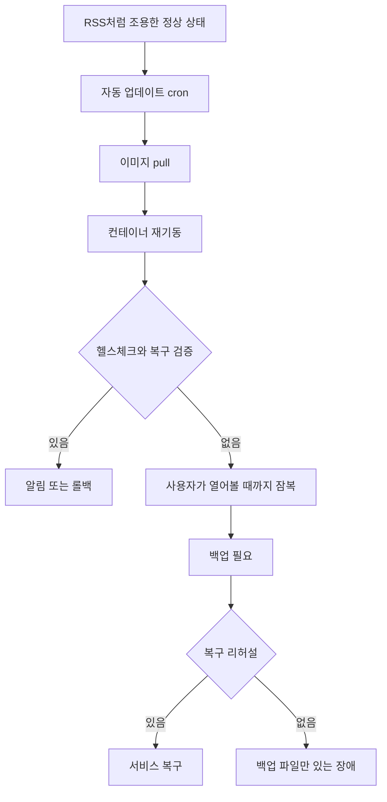

홈랩, 셀프호스팅, 인프라 자동화, 관측성 논쟁의 핵심은 장비 숫자가 아니다. 운영 책임을 어디에 둘 것인가다. 서버를 네 대에서 한 대로 줄인 사람은 자유를 얻었고, LLM 게이트웨이를 직접 띄우려는 팀은 비용과 데이터 경로를 되찾으려 한다. 둘 다 같은 질문으로 모인다.

> 직접 운영한다는 말은 통제권을 갖는다는 뜻이다.  
> 동시에, 장애의 마지막 담당자가 자신이라는 뜻이다.

## 셀프호스팅은 취미가 아니라 책임 경계 설계다

원문 속 홈랩은 일부러 작다. 여러 서버, 클러스터, 하이퍼바이저, 하이브리드 클라우드 조합을 버리고 단일 물리 서버 하나로 서비스를 모았다. 작성자는 네 대에서 한 대로 줄였기 때문에 유지보수가 75% 줄었다고 말한다. 이 수치는 멋진 자동화 도구보다 더 강한 메시지를 가진다.

운영 부담을 줄이는 가장 확실한 방법은 잘 짜인 오케스트레이션이 아니라 관리할 대상 자체를 줄이는 것이다.

개발자 커뮤니티에서 이런 글에 말이 붙는 이유도 여기에 있다. 한쪽은 Kubernetes, Nomad, Proxmox, GitOps, 서비스 메시로 개인 인프라를 작은 데이터센터처럼 만든다. 다른 쪽은 단일 박스와 Docker Compose, cron, 백업으로 끝낸다. 전자는 이식성과 복구 절차를 얻고, 후자는 인지 부하를 줄인다.

더 성숙한 선택은 규모에 따라 갈린다. 트래픽이 낮고 운영자가 한 명이며 장애 허용 시간이 길다면 단일 서버가 더 낫다. 여러 사람이 배포하고, 무중단이 계약 조건이고, 장애가 매출로 바로 연결된다면 단일 서버는 단순함이 아니라 단일 장애점(Single Point of Failure)이다.

홈랩 논쟁은 회사 인프라 논쟁의 축소판이다. 자가 호스팅은 비용 절감 전략이 아니라 책임 경계 전략이다. 누가 패치하는가. 누가 백업을 검증하는가. 누가 알림을 받고, 누가 새벽에 복구하는가. 이 질문에 답하지 못하면 셀프호스팅은 독립이 아니라 방치다.

## 자동 업데이트가 해결한 것과 숨긴 것

원문 속 소프트웨어 운영은 짧다. 매주 Docker Compose 서비스를 pull하고 다시 올리는 루프가 있고, root cron에는 데이터베이스 덤프와 파일 백업이 있다. OS 업데이트는 `apt update && apt upgrade -y && apt autoremove -y` 정도다. 작성자는 월 15분 유지보수라고 평가한다.

이 구조는 실용적이다. 서비스 수가 제한되어 있고, 장애가 개인 생활에만 영향을 주며, 직접 SSH로 확인할 수 있는 환경에서는 충분히 강하다. 자동 업데이트는 보안 패치 지연을 줄인다. Docker Compose는 Kubernetes보다 확인할 상태가 적다. cron은 GitOps보다 초라하지만 실패 지점이 눈에 보인다.

문제는 자동화가 성공 경로만 처리할 때 생긴다. 이미지는 pull된다. 컨테이너는 재시작된다. 그런데 새 버전의 마이그레이션이 실패했는지, 볼륨 권한이 바뀌었는지, 백업 파일이 실제 복구 가능한지, reverse proxy 설정이 깨졌는지는 별개의 문제다.

운영 자동화의 기준은 명령이 짧은지가 아니다. 실패를 드러내는지가 기준이다. 단일 서버 홈랩에도 최소 조건은 있다. 컨테이너 헬스체크, 실패 알림, 디스크 사용량 알림, 백업 성공 여부, 복구 리허설이다. 화려한 플랫폼은 필요 없다. 작은 cron과 작은 알림이면 된다.

## FreeBSD 메모리 논쟁이 말하는 관측성의 함정

FreeBSD 메모리 글은 홈랩 자동화 논쟁에 다른 각도를 더한다. 작성자는 fastfetch와 btop이 보여주는 RAM 사용량 차이를 따라가다 운영체제의 가상 메모리(Virtual Memory)와 페이지 캐시(Page Cache)를 설명한다. 핵심은 간단하다. 현대 운영체제에서 사용 중인 RAM은 단순한 낭비가 아니다. 디스크 데이터를 RAM에 캐시해서 전체 성능을 높이고, 필요하면 그 캐시는 회수된다.

이 사례는 관측성(Observability)의 흔한 실패를 보여준다. 숫자를 수집했다고 시스템을 이해한 것은 아니다. 메모리 사용률 90%라는 그래프가 장애 신호인지, 정상적인 파일 캐시인지 구분하지 못하면 알림은 소음이 된다. 운영자는 알림을 끄고, 진짜 장애도 같이 놓친다.

홈랩이든 회사 인프라든 같은 문제가 반복된다. CPU 사용률, 컨테이너 재시작 횟수, 디스크 I/O, 네트워크 오류율은 맥락 없이는 반쪽짜리 지표다. Kubernetes 환경에서는 이 문제가 더 커진다. 노드 메모리와 컨테이너 메모리 제한, 파일 캐시와 RSS(Resident Set Size), OOMKilled 이벤트가 서로 다른 층위에서 움직인다. 단일 서버에서는 한 화면에서 끝나던 해석이 클러스터에서는 노드, 파드, 컨테이너, 애플리케이션 런타임으로 찢어진다.

작은 인프라의 장점은 비용보다 해석 가능성에 있다. 장애가 났을 때 볼 곳이 적다. 운영자가 지표의 의미를 직접 배울 수 있다. FreeBSD의 RAM 사례는 단순한 운영체제 잡학이 아니다. 관측성은 대시보드 개수가 아니라 의미 있는 해석 능력이라는 경고다.

## LLM 게이트웨이 셀프호스팅은 홈랩 논쟁의 기업판이다

LLM 라우터 글은 같은 논쟁을 코딩 에이전트 인프라로 가져온다. hosted LLM gateway는 하나의 API 키, 여러 모델, 장애 시 failover, 통합 과금, 새 모델 접근성을 판다. 글은 OpenRouter 크레딧 5.5%, Requesty 5% 같은 라우팅 비용을 언급하고, OpenRouter가 주당 25조 토큰을 처리한다고 말한다. 수치의 정확한 해석과 별개로 논점은 분명하다. 비용보다 더 큰 문제는 프롬프트, 파일 내용, 코딩 에이전트가 읽은 컨텍스트, 실수로 들어간 비밀 값이 제3자 인프라를 지난다는 점이다.

커뮤니티 반응은 갈린다. hosted gateway는 편하다. 모델별 API 차이를 감추고, 새 모델을 빨리 붙이고, 장애 시 다른 provider로 넘긴다. 작은 팀이나 취미 프로젝트에서는 이 편의가 비용을 이긴다.

기업의 코딩 에이전트 워크로드에서는 판단이 달라진다. 한 엔지니어당 월 500~2,000달러 수준의 LLM 비용이 발생하는 환경이라면 5%는 무시할 숫자가 아니다. 더 큰 비용은 감사와 데이터 통제다. 어떤 파일이 프롬프트에 들어갔는지, 어느 provider로 흘렀는지, 로컬 모델로 처리 가능한 요청을 왜 외부로 보냈는지 설명해야 한다.

자가 호스팅 LLM 게이트웨이가 유리한 조건은 명확하다.

- 사용하는 모델이 몇 개로 제한되어 있다.
- 프롬프트와 코드 컨텍스트가 민감하다.
- 로컬 모델을 저위험 요청의 1차 계층으로 쓰고 싶다.
- 라우팅 로그, 비용 한도, 차단 정책을 내부 정책과 묶어야 한다.
- 새 모델 day-one 접근성보다 통제와 감사가 더 중요하다.

반대로 400개 모델 시장, 통합 과금, provider 계정 관리, 장애 provider 우회까지 모두 직접 만들겠다는 계획은 과하다. 그건 게이트웨이가 아니라 작은 플랫폼 사업이다. 셀프호스팅의 이점은 모든 기능을 복제할 때가 아니라 필요한 경로만 내부화할 때 나온다.

## Kubernetes보다 먼저 물어야 할 질문

인프라 글에서 Kubernetes가 자주 등장하는 이유는 이해된다. 선언적 배포, 오토힐링, 롤링 업데이트, 스케줄링, 시크릿 관리, 네트워크 정책은 실제 문제를 푼다. 그러나 홈랩 사례와 LLM 게이트웨이 사례는 같은 반론을 던진다. 플랫폼이 문제를 풀기 전에, 문제의 크기가 플랫폼을 정당화해야 한다.

단일 서버 Docker Compose는 노드 장애에 약하다. 대신 운영자가 읽을 수 있다. Kubernetes는 노드 장애를 흡수할 수 있다. 대신 control plane, CNI, ingress, storage class, RBAC, Helm chart, admission policy를 운영해야 한다. 하나는 장애 범위가 작고, 하나는 운영 표면이 넓다.

도입 기준은 취향이 아니라 조건이어야 한다. 서비스가 몇 개 없고, 배포자가 한 명이고, 장애 복구를 수동으로 해도 되는 환경이면 Compose와 cron이 맞다. 여러 팀이 동시에 배포하고, 리소스 격리와 롤백 정책이 필요하고, 장애가 고객 SLA로 이어지면 Kubernetes가 맞다. 에이전트 게이트웨이도 같다. 개인 자동화라면 hosted router가 맞고, 코드와 비밀이 프롬프트에 섞이는 조직 워크로드라면 내부 라우터와 정책 엔진이 필요하다.

보안 관점에서는 작은 구성이 무조건 안전하지 않다. 단일 서버에 SSH 키, 데이터베이스, 미디어, 웹 서버, 백업 경로가 몰리면 침해 범위가 넓어진다. 자동 업데이트가 공급망 위험을 줄이는 동시에 깨진 이미지를 바로 반영할 수도 있다. 백업에 `.ssh`가 포함되면 복구 편의는 올라가지만 백업 저장소 침해 시 피해도 커진다.

운영 관점의 답은 균형이 아니라 우선순위다. 개인 홈랩은 해석 가능한 단순함을 우선해야 한다. 회사 플랫폼은 복구 가능한 복잡성을 우선해야 한다. 에이전트 인프라는 데이터 경로의 통제 가능성을 우선해야 한다.

처음의 질문으로 돌아가면, 직접 운영한다는 말은 통제권을 갖는다는 뜻이었다. 여기에 한 문장을 더 붙여야 한다. 통제권은 자동화가 아니라 검증에서 생긴다. 업데이트가 돈다. 지표가 뜬다. 백업이 쌓인다. 그다음 질문에 답할 수 있어야 한다.

깨졌을 때 언제 알 수 있는가.  
어디까지 번지는가.  
무엇으로 되돌리는가.

이 세 문장에 답하지 못한다면 홈랩은 관리되지 않는다. 단지 조용할 뿐이다.

## 참고 자료

- [선정 글감] [I Don't Maintain My Homelab](https://cleberg.net/blog/homelab-maintenance.html) - Lobsters
- [관련] [FreeBSD ate my ram](https://crocidb.com/post/freebsd-ate-my-ram/) - Lobsters
- [관련] [The 5% Router Tax: What Hosted LLM Gateways Charge For (and How to Self-Host It)](https://dev.to/lynkr/the-5-router-tax-what-hosted-llm-gateways-charge-for-and-how-to-self-host-it-513) - DEV Community