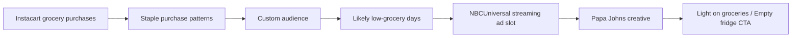

냉장고를 열어본 적 없는 피자 회사가 냉장고가 비는 날을 맞히려 한다. Papa Johns 감시 기반 광고 논란의 핵심은 피자 할인 문구가 아니다. Instacart 장보기 데이터와 NBCUniversal 스트리밍 광고가 연결되면, 소비자는 음식 취향이 아니라 생활 리듬으로 타깃팅된다.

## 냉장고를 본 것이 아니라 장보기 주기를 샀다

확인된 범위부터 보자. 2026년 7월 1일 Schneier on Security가 다룬 내용에 따르면, Papa Johns는 NBCUniversal, Instacart, dentsu 산하 미디어 에이전시 Carat과 함께 광고 타깃팅을 진행했다. 목표는 소비자가 식료품이 떨어질 가능성이 높은 시점에 피자 광고를 보여주는 것이었다.

방식은 직접적인 냉장고 감시가 아니다. Instacart에서 달걀, 우유, 고기, 농산물 같은 기본 식료품을 정기적으로 사는 쇼핑객 데이터를 바탕으로 커스텀 오디언스(Custom Audience)를 만들었다. 그 데이터로 특정 소비자가 어느 요일에 식료품이 부족해질 가능성이 높은지 추정하고, NBCUniversal 스트리밍 콘텐츠를 볼 때 광고를 내보냈다.

광고 문구도 이 추정을 숨기지 않았다. 예시는 Light on groceries?, Empty fridge? 같은 식이다. 고기를 자주 사는지 같은 선호 정보에 맞춘 크리에이티브도 사용됐다.

여기까지는 보도와 인용에서 확인된 범위다. 이 캠페인이 개인별 냉장고 상태를 정확히 알고 있었다는 뜻은 아니다. 더 정확히 말하면, 플랫폼은 구매 이력으로 생활 주기를 모델링했고 브랜드는 그 모델의 특정 순간을 광고 구매 대상으로 삼았다.

소비자가 체감하는 문제는 그 차이가 거의 보이지 않는다는 데 있다.

## 너무 소름 끼치지 않게라는 말이 이미 선을 넘었다

Carat의 최고투자책임자 Carrie Drinkwater는 이 접근을 설명하며 냉장고 안을 아는 것과 너무 소름 끼치지 않는 것 사이의 표현을 썼다. 이 문장이 논란의 중심에 있다. 기술적으로는 합법적 세그먼트 광고일 수 있다. 감정적으로는 누군가 내 식탁 사정을 보고 있다는 신호처럼 읽힌다.

광고 업계는 이 지점을 성과의 문제로 본다. 배고픈 순간, 식료품이 떨어지는 순간, 주문 전환 가능성이 높은 순간을 찾으면 광고 낭비가 줄어든다. Papa Johns는 피자를 팔고 싶었고, Instacart는 장보기 데이터의 광고 가치를 보여줬으며, NBCUniversal은 스트리밍 광고 지면을 더 비싸게 팔 수 있다.

프라이버시 관점에서는 이야기가 달라진다. 이 캠페인은 민감정보 하나를 노출하지 않아도 충분히 민감해질 수 있음을 보여준다. 달걀과 우유 구매 기록은 그 자체로는 평범하다. 하지만 반복 주기, 품목 조합, 시청 시간, 광고 노출 위치가 합쳐지면 생활 패턴이 된다.

개인이 불편해하는 지점은 단순하다. 내가 동의한 것은 장보기였지, 배고플 때 피자를 주문할 가능성의 예측 대상이 되는 것은 아니었다.

이 불편함은 오해에서만 나오지 않는다. 광고 시스템은 보통 데이터 제공자, 미디어 네트워크, 브랜드, 에이전시로 쪼개져 있다. 각자는 개인정보를 직접 보지 않았다고 말할 수 있다. 하지만 사용자가 마주하는 결과는 하나다. 내 행동이 다른 맥락으로 이동했고, 내가 모르는 타이밍에 다시 돌아왔다.

## Target 임신 예측 사례가 다시 소환된 이유

Schneier는 2012년에 알려진 Target의 임신 예측 캠페인을 떠올린다. 그 사례의 핵심은 예측 정확도만이 아니었다. 소비자가 알아차리면 불쾌해하므로, 너무 정확해 보이지 않게 다른 정보와 섞어 숨기는 방식이 문제였다.

Papa Johns 사례도 같은 원리를 건드린다. 정말 소름 끼치지 않게 하려면 일부러 틀린 것처럼 보여야 한다는 역설이다. 광고가 정확하면 감시처럼 느껴지고, 감시처럼 느껴지지 않으려면 정확성을 감춰야 한다.

이것은 UX 문제가 아니라 신뢰 문제다.

광고 문구를 부드럽게 바꾸면 해결된다는 판단은 얕다. Empty fridge?가 부담스럽다면 Today’s dinner?로 바꾸는 식의 카피 수정은 증상만 가린다. 데이터 흐름은 그대로 남는다. 소비자가 문제 삼는 것은 문장의 온도가 아니라, 그 문장이 내 구매 이력에서 나왔다는 사실이다.

개발자와 플랫폼 운영자가 봐야 할 지점도 여기에 있다. 개인식별정보(PII)를 직접 넘기지 않았으니 괜찮다는 사고방식은 부족하다. 익명화된 세그먼트라도 충분히 좁고, 충분히 행동 기반이며, 충분히 특정 시점에 반응하면 개인화된 감시처럼 작동한다.

실무에서 이 차이는 정책 문구보다 시스템 설계에서 더 선명하게 드러난다. 데이터가 어디서 수집됐는지, 어떤 목적의 동의였는지, 어떤 파트너에게 어떤 집계 단위로 전달됐는지, 광고 크리에이티브가 사용자의 추정 상태를 얼마나 직접적으로 드러내는지 확인해야 한다. 특히 건강, 임신, 식습관, 경제 상황처럼 생활 취약성과 연결될 수 있는 추론은 식별자 제거만으로 리스크가 끝나지 않는다.

## 성과가 좋아질수록 설명 책임도 커진다

이 캠페인을 옹호하는 논리도 있다. 소비자는 관련 없는 광고보다 관련 있는 광고를 덜 싫어할 수 있다. 브랜드는 무작위 노출보다 효율적인 타깃팅을 원한다. Instacart 같은 플랫폼은 장보기 데이터를 광고 상품으로 만들 유인이 있다. NBCUniversal 같은 미디어 사업자는 스트리밍 광고 시장에서 TV 광고보다 정교한 구매 근거를 제시해야 한다.

이 주장은 틀리지 않다. 다만 충분하지 않다. 관련성은 면죄부가 아니다.

감시 기반 광고가 위험해지는 순간은 데이터가 많아질 때가 아니다. 예측이 소비자의 취약한 순간에 붙을 때다. 식료품이 떨어진 시점은 편의의 순간이면서 결핍의 순간이다. 배고픔, 피로, 시간 부족, 가족 식사 준비 같은 맥락이 겹친다. 이 맥락을 광고 기회로만 보면, 플랫폼은 사용자를 고객이 아니라 반응 확률로 다룬다.

운영 측면에서도 비용이 있다. 이런 캠페인은 단기 전환율을 올릴 수 있지만, 브랜드 신뢰를 깎을 수 있다. 보안 커뮤니티와 프라이버시 독자는 기술적 합법성보다 경계선의 이동을 본다. 오늘은 피자 광고다. 내일은 보험, 대출, 건강보조식품, 정치 광고가 같은 방식으로 생활 패턴의 빈틈을 노릴 수 있다.

판단 기준은 간단해야 한다.

사용자에게 그대로 설명했을 때 납득될 수 없는 타깃팅은, 내부 대시보드에서 성과가 좋아도 위험한 타깃팅이다.

## 팀이 바로 물어야 할 질문

이런 광고 상품을 검토하는 팀이라면 법무 검토만으로 끝내면 안 된다. 최소한 다음 질문이 필요하다.

- 구매 데이터의 원래 수집 목적과 광고 타깃팅 목적이 사용자 기대 안에 있는가
- 세그먼트가 너무 좁아 개인의 생활 리듬을 사실상 드러내지 않는가
- 광고 문구가 사용자의 추정 상태를 직접 언급해 감시감을 만들지 않는가
- 민감한 생활 상태를 추론할 수 있는 품목 조합을 제외했는가
- 사용자가 거부하거나 삭제하거나 설명을 요구할 수 있는 경로가 있는가
- 파트너 간 데이터 결합 범위와 보관 기간이 문서로 남아 있는가

핵심은 완벽한 금지가 아니다. 모든 추천과 광고 개인화를 없애자는 말도 아니다. 기준은 맥락의 이동이다. 장보기 서비스에서 발생한 데이터가 영상 스트리밍 광고로 이동하고, 다시 피자 주문 유도로 돌아올 때 사용자가 이해할 수 있는 연결인지 따져야 한다.

Papa Johns 사례가 찜찜한 이유는 피자가 특별히 위험해서가 아니다. 너무 평범한 소비재라서 더 선명하다. 달걀, 우유, 고기, 채소를 산 기록만으로도 생활의 빈틈을 겨냥할 수 있다면, 더 민감한 데이터에서는 같은 구조가 훨씬 거칠게 작동한다.

첫 문장의 질문으로 돌아가면 답은 분명하다. 피자 회사는 냉장고를 열지 않았다. 그러나 광고 시스템은 냉장고가 비는 리듬을 팔 수 있는 상품으로 만들었다.

그 차이를 대수롭지 않게 넘기는 순간, 사용자는 맞춤 광고가 아니라 맞춰진 감시를 보게 된다.

## 참고 자료

- [선정 글감] [Papa Johns Surveillance-Based Advertising](https://www.schneier.com/blog/archives/2026/07/papa-johns-surveillance-based-advertising.html) — Schneier on Security