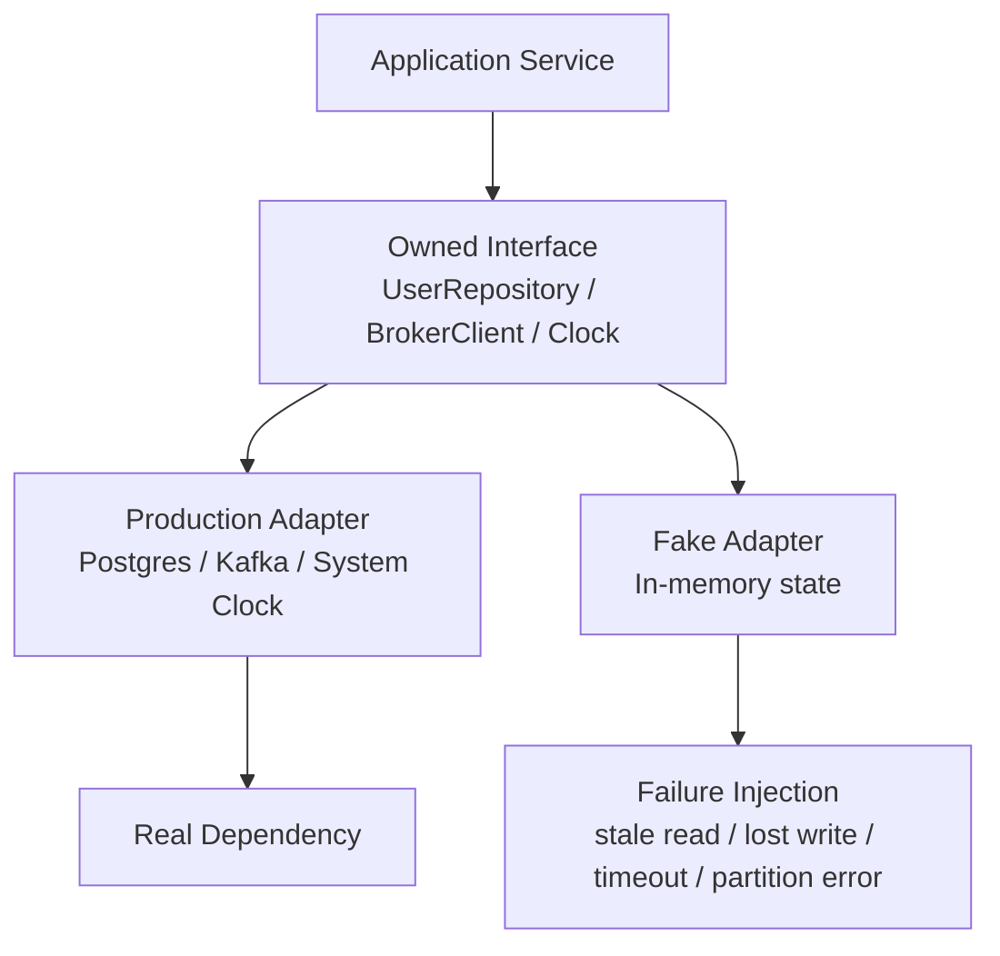

> Testcontainers는 실제 의존성을 띄운다. 그래서 믿음직해 보인다.  
> 문제는 운영 장애가 실제 의존성의 정상 동작에서만 나오지 않는다는 점이다.

테스트 자동화에서 mocks, Testcontainers, fakes 논쟁이 다시 붙는 이유는 단순하다. 코드 생성 에이전트가 더 많은 코드를 만들수록, 팀의 병목은 작성 속도가 아니라 깨진 것을 얼마나 빨리 잡느냐로 옮겨간다. 빠른 테스트도 필요하고 실제 서비스에 가까운 테스트도 필요하다. 다만 둘 다 운영 장애의 핵심인 부분 실패(partial failure)를 놓치면 하네스는 안심 장치가 아니라 장식이 된다.

## Testcontainers가 잡는 버그와 끝내 놓치는 버그

Testcontainers의 장점은 분명하다. PostgreSQL, Kafka, Redis 같은 실제 의존성을 Docker 컨테이너로 띄우면 SQL 문법, 마이그레이션, 드라이버 설정, 기본 연결 흐름을 검증할 수 있다. 이 층의 버그는 mock으로 잡기 어렵다.

원문이 찌르는 지점은 다른 데 있다. 컨테이너 기반 테스트는 대개 의존성이 켜져 있거나 꺼져 있는 상태를 만든다. 운영 장애는 그렇게 친절하지 않다. Kafka 브로커 전체가 죽는 대신 특정 파티션만 실패한다. PostgreSQL 주 서버는 멀쩡한데 읽기 복제본이 30초 밀린다. Redis 클러스터에서 하나의 shard만 OOM이 난다.

이 실패는 binary가 아니다. 부분적이고, 조용하고, 재현하기 어렵다.

Testcontainers만으로 위험 분석이 끝나지 않는 이유가 여기에 있다. 실제 의존성을 썼다는 사실은 테스트의 신뢰도를 올리지만, 실패 표면을 넓히지는 않는다. 운영에서 터지는 버그가 상태 불일치, 지연, 부분 장애, 침묵하는 실패라면 테스트 하네스는 그 조건을 직접 만들 수 있어야 한다.

## Mock은 너무 얇고, 컨테이너는 너무 무겁다

mock의 약점은 속도가 아니다. mock은 빠르다. 문제는 테스트가 계약(contract)이 아니라 호출 순서에 붙는다는 데 있다. 내부 구현이 바뀌면 외부 동작이 같아도 mock expectation이 깨진다. 테스트가 제품의 행위를 지키는 대신 현재 구현을 붙잡는다.

Testcontainers는 반대 방향으로 간다. 실제 시스템을 띄우기 때문에 표면적으로는 더 현실적이다. 대신 시작 비용이 커지고 결정성이 낮아지며, 원하는 실패를 원하는 지점에 주입하기 어렵다. 원문은 CI에서 Kafka, Postgres, Redis를 모두 띄우는 데 4분이 걸리지만, 그 테스트가 정작 새벽 장애를 만든 실패 모드를 재현하지 못한다고 비판한다.

fakes는 이 두 극단 사이의 어중간한 타협이 아니다. 제대로 만든 fake는 다른 축의 도구다. 외부 의존성의 인터페이스를 구현하되, in-memory 상태를 갖고, 테스트가 필요한 실패를 세밀하게 주입한다.

예를 들어 데이터베이스를 JDBC 레벨에서 흉내 내면 PostgreSQL을 다시 구현하는 꼴이 된다. 이건 실패한다. 반대로 `UserRepository` 같은 도메인 경계에서 fake를 만들면 팀이 소유한 계약만 구현하면 된다. `save`, `findById`, `listByStatus` 정도의 동작과 오류 조건을 명시하고, 내부는 `HashMap`이나 `BTreeMap`으로 충분하다.

경계가 높을수록 fake는 작아진다. 경계가 낮을수록 fake는 거짓말쟁이가 된다.

## AI 에이전트 시대의 테스트 기준은 신뢰 축적이다

Kent Beck이 TDD와 Agile을 다시 이야기하는 맥락도 여기와 닿아 있다. 코드 생성 도구가 쓰이는 시대의 핵심은 더 많은 코드를 뽑는 능력이 아니라, 변경이 신뢰를 축적하는 방식이다. 테스트는 그 신뢰의 회계 장부다. 작성된 코드가 많아질수록, 테스트 하네스는 더 엄격하게 실패를 설명해야 한다.

Stack Overflow Blog의 Traversal 인터뷰도 같은 방향을 가리킨다. 운영 장애는 코드 한 줄에서만 나오지 않는다. 시스템 사이의 상호작용에서 나온다. 전통적인 observability가 로그, 메트릭, 트레이스로 사후 원인을 좇는다면, 좋은 테스트 하네스는 그 상호작용 실패를 배포 전에 강제로 만든다.

이 지점에서 fake의 가치가 커진다. 코드 생성 에이전트가 만든 코드는 happy path를 빠르게 채운다. 하지만 replica lag, timeout, stale read, lost write, hung future 같은 조건을 자연스럽게 방어하지 않는다. 생성되는 코드가 많아질수록, 하네스는 더 적대적이어야 한다.

코드를 많이 만드는 팀은 테스트를 많이 돌리는 팀이 아니다. 실패를 정확히 만드는 팀이다.

## Fake 테스트 하네스는 어디에 꽂아야 하나

fake는 아무 데나 만들면 비용이 폭발한다. 원칙은 좁다. 내 코드가 소유하지 않은 시스템과 만나는 가장 높은 경계에 꽂는다.

운영에서는 `Production Adapter`가 실제 PostgreSQL이나 Kafka를 호출한다. 테스트에서는 같은 인터페이스 뒤에 `Fake Adapter`를 넣는다. 애플리케이션 서비스는 둘을 구분하지 못해야 한다. 구분할 수 있다면 추상화가 새고 있는 것이다.

데이터베이스는 repository나 store trait에서 fake한다. 메시지 브로커는 producer와 consumer 계약에서 fake한다. 캐시는 command 단위 인터페이스에서 fake한다. 객체 저장소는 `put`, `get`, `list` 수준이면 충분하다. 시간은 `now()`를 감싼 clock 인터페이스로 빼야 한다. 실제 시스템 clock으로는 시간이 되감기는 버그나 TTL 경계 조건을 안정적으로 만들 수 없다.

분산 시스템에서는 더 낮은 층이 필요할 때도 있다. 원문은 FoundationDB가 TCP packet이 아니라 stream 수준의 `INetwork` 인터페이스에서 시뮬레이션한다고 설명한다. packet fragmentation까지 모델링하지 않고도 애플리케이션이 실제로 만나는 연결 끊김, 느린 읽기, 부분 쓰기 같은 실패를 만들 수 있기 때문이다.

좋은 fake는 production보다 충실한 복제품이 아니다. 좋은 fake는 production보다 나쁜 환경이다.

## 침묵하는 실패를 테스트하지 않으면 장애는 성공처럼 보인다

대부분의 코드는 큰 소리로 실패하는 오류에는 반응한다. connection refused, timeout, 500 response, exception은 처리하기 쉽다. 위험한 것은 성공처럼 보이는 실패다.

원문은 MariaDB Galera Cluster에 대한 Jepsen 테스트 사례를 끌어온다. 문서상 격리 수준이 Serializable과 Repeatable Read 사이에 가깝다고 설명됐지만, Jepsen은 fault injection이 없는 healthy cluster에서도 committed transaction 손실, lost update, stale read를 발견했다. 애플리케이션 입장에서는 가장 까다로운 부류다. 쓰기는 성공했다고 돌아왔는데 사라진다. 읽기는 정상 응답인데 과거 상태를 준다.

이 조건을 Testcontainers로 안정적으로 만들기는 어렵다. 컨테이너를 죽이면 너무 큰 실패가 된다. 네트워크를 끊으면 모든 요청이 실패한다. 실제로 필요한 것은 특정 user id의 저장만 조용히 버리거나, 특정 read path에서만 오래된 값을 돌려주는 장치다.

fake는 이 조건을 작게 만든다. `save()`가 10% 확률로 `Ok`를 반환하지만 저장하지 않게 할 수 있다. `findById()`가 직전 값이 아니라 이전 snapshot을 돌려주게 할 수 있다. 특정 partition key만 `PartitionUnavailable`을 내게 할 수 있다. 테스트는 이때 idempotency key, retry 정책, read-your-writes 보장, timeout budget, circuit breaker가 실제로 작동하는지 확인한다.

서킷 브레이커(Circuit Breaker)와 재시도(retry)는 코드에 있다고 안전한 게 아니다. fake가 나쁜 응답을 줄 때 상태가 망가지지 않아야 안전하다.

## 도입 조건: fake를 늘리기 전에 계약부터 줄여라

fake가 좋은 도구라는 말은 모든 의존성을 fake하라는 뜻이 아니다. fake는 유지보수 대상이다. 계약이 불명확하면 fake도 실제 시스템도 서로 다른 방향으로 썩는다.

먼저 인터페이스를 줄여야 한다. 애플리케이션 코드가 PostgreSQL의 모든 기능을 직접 쓰고 있다면 fake는 불가능하거나 위험하다. 이때 필요한 작업은 fake 작성이 아니라 경계 정리다. query builder 전체를 감싸려 하지 말고, 유스케이스가 필요한 저장소 동작만 좁힌다.

integration test의 역할도 남겨야 한다. fake는 PostgreSQL의 transaction isolation, Kafka의 consumer group rebalance, Redis eviction policy를 정확히 검증하지 않는다. 그 검증은 실제 의존성을 띄우는 적은 수의 integration test가 맡아야 한다. fake는 많은 테스트에서 애플리케이션의 실패 대응을 검증하고, Testcontainers는 적은 테스트에서 adapter와 실제 의존성의 연결을 검증한다.

실패 모드는 명시해야 한다. random chaos를 먼저 넣으면 디버깅만 어려워진다. 처음에는 deterministic fake로 시작한다. 특정 호출에서 timeout, 특정 key에서 stale read, 특정 partition에서 write failure처럼 재현 가능한 실패를 만든다. 난수 기반 chaos는 seed 고정과 실패 로그가 준비된 뒤에 넣어도 늦지 않다.

운영 관측성과의 연결도 필요하다. Stack Overflow Blog의 지적처럼 production failure는 시스템 상호작용에서 나온다. 테스트에서 만든 실패가 운영 metric, alert, trace에서 어떤 신호로 보여야 하는지도 함께 검증해야 한다. timeout을 처리했지만 아무 로그도 남지 않는다면, 장애 대응은 여전히 어둡다.

## 테스트 자동화의 목표는 현실 복제가 아니라 위험 선택이다

도입부의 질문으로 돌아가면 답은 이렇다. Testcontainers는 버릴 도구가 아니다. 하지만 Testcontainers만으로 운영 리스크를 덮었다고 말하면 안 된다. 실제 의존성을 띄운 테스트는 adapter 검증에 강하고, fake 기반 테스트는 실패 조건 검증에 강하다. 둘의 역할은 겹치지 않는다.

실무 판단은 이렇게 잡는 편이 낫다. 빠른 단위 테스트에서 mock을 남발하지 말고, 소유한 경계에 stateful fake를 둔다. CI에는 fake 기반 failure test를 많이 둔다. 실제 DB, broker, cache를 띄우는 테스트는 적게 유지하되 배포 전 신호로 삼는다. 코드 생성 에이전트가 만들든 사람이 만들든, 이 구조가 깨지는 순간 테스트는 다시 구현 세부사항이나 happy path 확인으로 후퇴한다.

운영 장애는 전체 시스템이 꺼졌을 때만 오지 않는다. 일부만 늦고, 일부만 낡고, 일부만 성공처럼 실패할 때 온다. 테스트 하네스도 그 정도로 비열해야 한다.

## 참고 자료

- [선정 글감] [Why Fakes Beat Mocks and Testcontainers](https://pierrezemb.fr/posts/why-fakes-beat-mocks-and-testcontainers/) (Lobsters)
- [관련] [How Kent Beck shapes the software engineering industry](https://newsletter.pragmaticengineer.com/p/how-kent-beck-shapes-the-software) (The Pragmatic Engineer)
- [관련] [Code isn’t the only thing causing your production failures](https://stackoverflow.blog/2026/06/25/code-isnt-causing-your-production-failures/) (Stack Overflow Blog)