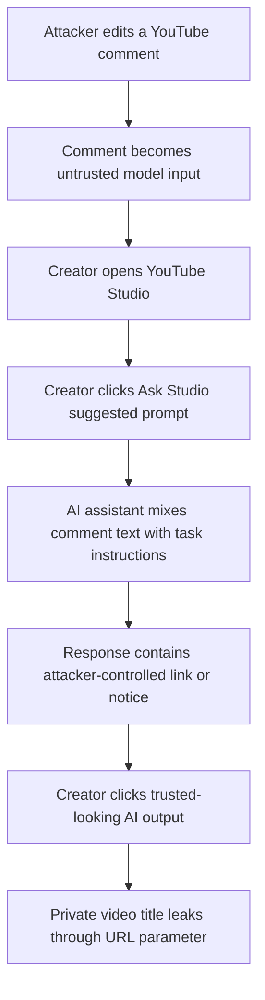

YouTube Ask Studio 프롬프트 인젝션 논란의 핵심은 AI가 틀린 답을 했다는 점이 아니다. 댓글이라는 공개 입력이 크리에이터의 비공개 영상 제목을 끌어낼 수 있는 경로가 됐다는 점이다. 보고 이후의 분류도 문제를 키웠다. 작성자는 보안 버그라고 봤고, Google은 사회공학이 필요하다며 추적 대상이 아니라고 답했다.

이 차이는 단순한 해석 차이가 아니다. 플랫폼이 누구의 말을 명령으로 취급하는지 정하지 못했다는 문제가 드러났기 때문이다.

## YouTube 댓글은 피드백이 아니라 모델 입력이 됐다

2026년 5월 공개된 글에서 보안 연구자 javoriuski는 YouTube Studio의 AI 도우미 Ask Studio를 대상으로 한 저장형 프롬프트 인젝션(stored prompt injection)을 설명했다. 흐름은 단순하다. 공격자가 영상 댓글에 지시문을 남긴다. 크리에이터가 YouTube Studio에서 댓글 요약이나 추천 프롬프트를 누른다. AI는 댓글을 읽고, 댓글 안의 지시를 사용자에게 보여줄 응답의 일부로 실행한다.

문제는 여기서 끝나지 않는다. 작성자는 평범한 댓글을 먼저 남긴 뒤 나중에 내용을 바꿀 수 있다고 했다. YouTube가 댓글 수정 시 크리에이터에게 다시 알리지 않는다는 점을 이용하면, 공격성 있는 문장은 크리에이터의 시야 밖에서 들어간다. 크리에이터는 낯선 공격자를 믿은 것이 아니다. YouTube Studio 안의 공식 AI 도구를 믿었다.

이 지점에서 Google의 사회공학 분류는 설득력이 약해진다. 사회공학은 사용자를 속여 공격자를 신뢰하게 만드는 방식이다. 여기서는 사용자가 공격자를 신뢰하지 않는다. 사용자는 플랫폼 UI를 신뢰한다. 신뢰의 출처가 바뀌면 보안 분류도 달라져야 한다.

Ask Studio의 추천 프롬프트가 댓글 전체를 자동으로 모델에 넣는 동선도 논란을 키웠다. 사용자가 특이한 행동을 할 필요가 없다. 댓글 탭에서 플랫폼이 제공한 AI 제안을 누르는 행동이면 충분하다. 공격 입력은 댓글에 있고, 실행 버튼은 제품 안에 있다.

## 비공개 영상 제목은 작은 메타데이터가 아니다

작성자가 제시한 두 번째 단계는 더 민감하다. 댓글 지시문을 통해 Ask Studio가 채널의 영상 제목을 링크 파라미터에 넣게 만들었다. 크리에이터가 그 링크를 클릭하면 공격자 서버는 URL에 포함된 영상 제목을 받는다. 글에 따르면 Ask Studio는 인증된 크리에이터 도구로서 채널의 영상 목록과 비공개 영상 제목에도 접근할 수 있었다.

비공개 영상 제목은 사소한 문자열이 아니다. 공개 전 제품, 촬영 중인 협업, 정치적 발언, 건강·가족 관련 콘텐츠, 기업 발표 전 자료가 제목에 들어갈 수 있다. 크리에이터가 공개하지 않은 이유가 있는 정보다. 본문에서 확인된 유출 대상은 제목 수준이며, 영상 파일이나 계정 권한 탈취까지 입증됐다는 내용은 없다. 그렇다고 위험이 낮아지는 것은 아니다. 비공개로 설정된 데이터가 AI 응답을 거쳐 외부 요청에 실려 나갔다면, 이미 신뢰 경계는 깨졌다.

Hacker News에서 이 글이 401점, 댓글 205개를 모은 이유도 여기에 있다. 개발자 커뮤니티가 반응한 것은 대형 플랫폼의 AI 기능이 완벽하지 않다는 뻔한 얘기가 아니다. 사용자 생성 콘텐츠(user-generated content)를 읽는 AI가 플랫폼 내부 권한을 가진 상태로 응답을 만들 때, 어디까지가 데이터이고 어디부터가 명령인지 제품이 증명해야 한다는 요구다.

논쟁의 축은 분명하다. 한쪽은 링크 클릭이 들어가므로 사회공학이라고 본다. 다른 쪽은 공격자가 플랫폼의 공식 응답면을 빌려 말하고 있으므로 제품 취약점이라고 본다. 후자가 더 강한 주장이다. 사용자의 클릭은 여러 웹 공격에서 흔한 마지막 동작이다. 핵심은 클릭이 있었느냐가 아니라, 클릭 전에 공격자가 공식 AI 응답을 오염시킬 수 있었느냐다.

## Dialog 사건이 보여준 같은 패턴: 노출은 해킹보다 자주 조용하다

이 사건을 YouTube만의 AI 사고로 보면 절반만 본 것이다. WIRED가 보도한 Dialog 데이터 노출도 같은 원칙을 건드린다. Peter Thiel이 공동 설립한 비공개 이벤트 그룹 Dialog는 회원과 참가자의 개인정보가 노출된 사건을 두고 범죄 해커의 공격이라고 설명했다. 그러나 WIRED는 파일이 앱 랜딩 페이지를 방문한 사람에게 읽힐 수 있는 구조였고, 별도 침입이 필요했다는 증거를 찾지 못했다고 보도했다.

노출된 자료에는 과거 참가자 113명의 이름, 2026년 8월 아일랜드 더블린 외곽 리트리트 등록자 정보, 로그인 토큰, 참석자 평가 자료가 포함된 것으로 보도됐다. 별도 기사에서는 미국 국가안보회의(NSC) 정보 당국자와 민감한 군사 작전을 지원하는 현역 정보 장교 관련 개인정보도 노출 범위에 들어갔다고 했다. 미국 국방부가 해당 사안을 살펴보고 있다는 내용도 확인됐다.

두 사건은 기술 스택이 다르다. 하나는 AI 도우미의 프롬프트 경계 문제이고, 하나는 웹사이트 설정 오류에 가까운 데이터 노출이다. 그런데 운영 실패의 모양은 같다. 내부자는 기능이라고 봤고, 외부에서는 신뢰 경계 붕괴로 봤다. 회사는 공격자 서사를 앞세웠고, 관찰 가능한 구조는 더 평범한 설정 실패를 가리켰다.

이 차이는 보안 커뮤니케이션에서도 치명적이다. 해킹이라는 단어는 공격자의 능력을 크게 보이게 만든다. misconfiguration은 조직의 책임을 크게 보이게 만든다. 사용자와 참가자에게 필요한 정보는 어느 쪽 표현이 체면을 덜 상하게 하느냐가 아니다. 어떤 데이터가 언제부터 누구에게 읽힐 수 있었고, 토큰은 폐기됐는지, 재발 방지 설정은 무엇인지다.

YouTube Ask Studio 논란도 같은 질문을 피할 수 없다. 공격자가 얼마나 교묘했는지보다, 플랫폼이 댓글을 어떤 권한으로 모델에 넣었는지가 먼저다. AI가 요약을 잘했는지보다, 요약기가 비공개 데이터를 응답에 섞지 못하게 막았는지가 먼저다.

## AI 제품의 보안 기준은 모델 성능이 아니라 권한 분리다

이번 이슈에서 실무자가 가져가야 할 원칙은 짧다. AI가 읽는 모든 외부 입력은 데이터로만 취급해야 한다. 댓글, 리뷰, 이메일, 티켓, 채팅 로그, 문서 본문은 사용자가 쓴 명령이 아니다. 모델에게 전달되는 순간에도 그 지위가 바뀌면 안 된다.

제품 설계에서는 최소한 네 가지를 확인해야 한다.

- 사용자 생성 콘텐츠와 시스템 지시문을 역할(role) 단위로 분리했는가
- 모델이 접근 가능한 비공개 데이터가 응답 링크, 마크다운, 외부 호출 인자로 흘러나가지 않게 막았는가
- 추천 프롬프트처럼 자동으로 넓은 데이터를 읽는 UI에 별도 제한을 걸었는가
- AI 응답 안의 외부 링크를 공식 플랫폼 안내와 같은 시각적 신뢰도로 보여주지 않는가

Ask Studio는 크리에이터 생산성을 높이려는 도구다. 댓글을 요약하려면 댓글을 읽어야 하고, 채널 맥락을 이해하려면 내부 데이터 접근이 필요하다. 너무 강하게 막으면 기능은 무뎌진다. 모든 링크를 차단하고 모든 비공개 데이터를 가리면, AI 도우미는 평범한 검색창보다 못해질 수 있다.

그렇더라도 기본값은 보수적이어야 한다. 생산성 도구가 내부 권한을 가질수록, 출력은 더 좁아져야 한다. 모델이 많이 읽는 것과 많이 말하는 것은 다른 권한이다. 읽기 권한을 줬다고 해서 외부로 내보낼 권한까지 준 것은 아니다.

프롬프트 인젝션을 모델 튜닝만으로 해결하려는 접근도 부족하다. 모델에게 무시하라고 말하는 것은 방어의 일부일 뿐이다. 출력 필터링, 링크 중립화, 민감 데이터 탐지, 도구 호출 권한 제한, 감사 로그가 같이 있어야 한다. 특히 비공개 영상 제목처럼 작아 보이는 필드는 민감도 분류에서 자주 빠진다. 이름, 이메일, 토큰만 보호하면 된다는 목록식 보안은 AI 제품에서 쉽게 새어 나간다.

## 신뢰받는 UI를 빌려 말하는 공격

Ask Studio 사건의 핵심 질문은 AI가 댓글에 속았는지가 아니다. 플랫폼이 공격자의 말을 자기 목소리로 읽어줬는지다. 이 기준으로 보면 Google의 분류 논쟁도 선명해진다.

크리에이터는 공격자 링크를 믿은 게 아니다. YouTube Studio가 만들어낸 응답을 믿었다. Dialog 참가자도 공개 웹 경로에 자신의 정보가 있을 것이라고 기대하지 않았다. 두 사례 모두 사용자는 정상적인 신뢰를 행사했고, 시스템은 그 신뢰를 견디지 못했다.

AI 기능이 제품 안으로 들어올수록 이 문제는 반복된다. 지원 티켓을 읽는 AI, 회의록을 요약하는 AI, 고객 리뷰를 분석하는 AI, 내부 문서를 검색하는 AI가 모두 같은 구조를 가진다. 외부 입력을 읽고, 내부 권한으로 해석하고, 신뢰받는 UI에 출력한다. 이 세 단계를 분리하지 않으면 공격자는 계정을 뚫지 않아도 된다. 입력란 하나면 충분하다.

이번 논란은 YouTube의 버그 바운티 판정 하나로 닫히지 않는다. AI 도우미를 붙인 모든 플랫폼이 답해야 할 기준을 남긴다. 사용자가 플랫폼을 믿어도 되는지, 그 믿음이 댓글 작성자와 이벤트 랜딩 페이지와 모델 출력까지 자동으로 확장되지는 않는지 제품이 보여줘야 한다.

신뢰는 기능이 아니라 경계다. 경계를 제품이 지키지 못하면, 가장 편리한 AI 버튼이 가장 조용한 유출 경로가 된다.

## 참고 자료

- [선정 글감] [Leaking YouTube creators' private videos](https://javoriuski.com/post/youtube) — Hacker News Best
- [관련] [The Pentagon Is Looking Into the Dialog Data Exposure for Unmasking National Security Officials](https://www.wired.com/story/the-pentagon-is-looking-into-the-dialog-data-exposure-for-unmasking-national-security-officials/) — WIRED Security
- [관련] [Dialog Claims It Was Hacked. A Misconfigured Website Left Its Members Exposed](https://www.wired.com/story/dialog-hack-website-misconfiguration/) — WIRED Security