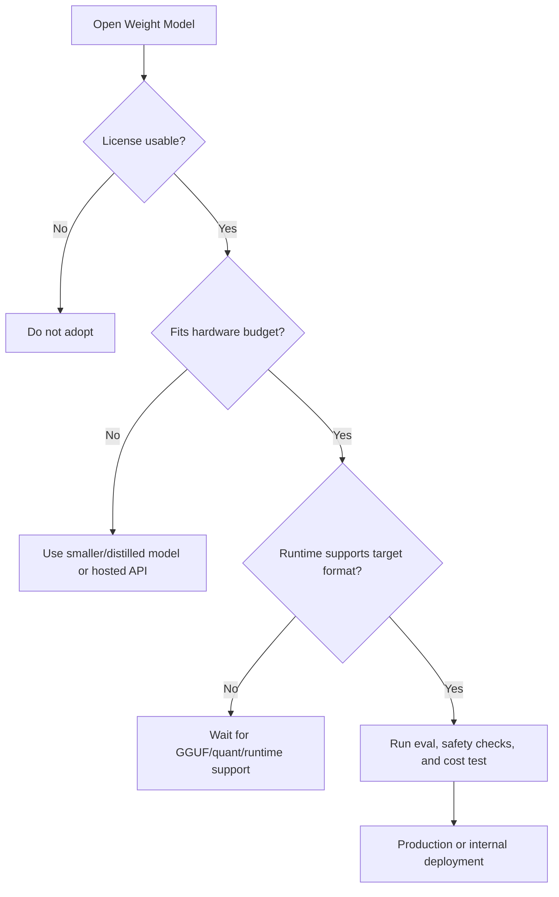

Tencent Hy3가 295B total, 21B active 혼합 전문가(Mixture of Experts, MoE) 모델을 Apache 2.0으로 공개했다는 r/LocalLLaMA 글에서 커뮤니티가 먼저 본 것은 벤치마크가 아니었다. 성능표보다 라이선스 문구, 양자화(Quantization) 후 메모리, Qwen 대체 가능성이 먼저 논의됐다.

그 반응은 자연스럽다. 오픈 웨이트(Open Weight) LLM은 이제 더 좋은 모델을 내려받는 문제에 그치지 않는다. 어느 나라에서 쓸 수 있는지, 어느 장비에서 버틸 수 있는지, 다음 버전도 계속 열릴지 판단해야 하는 공급망 문제가 됐다.

## 왜 Hy3 Apache 2.0이 성능보다 먼저 읽혔나

확인된 사실부터 나누자. 한국 시간 2026년 7월 6일 기준 r/LocalLLaMA에 올라온 글은 Tencent Hy3의 Hugging Face 컬렉션을 가리키며, 모델 크기를 295B total, 21B active로 소개했다. 같은 글의 수정 내용은 이 버전이 Hy3 preview가 아니라 non-preview이며, 이전 커뮤니티 라이선스에서 Apache 2.0으로 바뀌었다고 설명한다. 이전 라이선스는 원문 표기상 SK, UK, EU에서 허용되지 않는 제한이 있었다고 적혀 있다.

커뮤니티가 환영한 지점은 21B active보다 Apache 2.0이었다. 대형 모델의 성능은 며칠 안에 새 벤치마크로 밀릴 수 있지만, 라이선스 제한은 제품 출시, 사내 배포, 리서치 재현 가능성을 바로 막는다.

Apache 2.0으로 바뀌면 실무자가 검토할 수 있는 범위가 넓어진다. 상업적 사용, 수정, 재배포가 가능한 라이선스인지 검토하는 출발선에 설 수 있다. 반대로 지역 제한이 걸린 커뮤니티 라이선스는 모델이 좋아도 도입 검토를 흐리게 만든다. 글로벌 서비스, 다국적 팀, 고객 데이터가 여러 리전에 걸친 조직에는 지역 제한 자체가 기술 부채가 된다.

이 글만으로 확인할 수 없는 것도 분명하다. Hy3의 실제 품질, 안전성 평가, 학습 데이터 구성, 장기 릴리스 정책은 Reddit 글만으로 확정할 수 없다. Apache 2.0은 도입 검토의 문턱을 낮추지만, 운영 품질까지 보증하지는 않는다.

| 구분 | 현재 확인된 내용 | 아직 추정인 내용 |
|---|---|---|
| 모델 | Tencent Hy3, 295B total, 21B active MoE로 소개됨 | 실제 작업별 성능과 안정성 |
| 라이선스 | non-preview 버전이 Apache 2.0으로 바뀌었다는 게시글 설명 | 향후 버전도 같은 정책을 유지할지 |
| 정책 범위 | 이전 커뮤니티 라이선스에 SK, UK, EU 제한이 있었다는 설명 | 제한 변경의 내부 이유 |
| 커뮤니티 반응 | GGUF, 양자화, Qwen/MiniMax 대체 가능성 언급 | 대체재로 자리 잡을지 |

## 오픈 웨이트 LLM의 새 병목은 다운로드가 아니라 메모리다

Hy3는 active parameter만 보면 21B다. 가볍게 보일 수 있다. 하지만 MoE 모델은 매 토큰마다 일부 전문가만 활성화하더라도, 실행 환경에서는 전체 가중치 저장과 로딩 전략을 신경 써야 한다.

r/LocalLLaMA 댓글에서 한 사용자는 4-bit 양자화 기준으로 Hy3가 약 150GB가 될 것이라고 계산했다. 295B 파라미터에 4비트를 곱하면 대략 그 크기가 나온다. 여기에 KV 캐시(KV Cache), 컨텍스트 길이, OS 메모리, 런타임 오버헤드가 붙는다. 21B active라는 숫자는 추론 연산량을 설명하는 데 유용하지만, 로컬 배포 가능성을 단독으로 설명하지 못한다.

LongCat 2.0 반응도 같은 방향이었다. 해당 글은 1.6T total, 약 48B active 모델의 weight가 MIT 라이선스로 열렸다고 소개했다. 댓글에서는 BF16 전체 크기를 3.55TB, FP8을 2.05TB로 계산하며 농담과 탄식이 섞였다. 어떤 사용자는 48B active는 인상적이지만 1.6T total은 낭비라고 봤고, 다른 사용자는 Qwen이나 DeepSeek와 비교해 바로 테스트하겠다고 했다.

이 차이가 오픈 웨이트 커뮤니티의 현실이다.

열린 모델은 자유를 준다. 큰 모델은 그 자유를 하드웨어 청구서로 바꾼다.

실무 판단은 단순해진다. Hy3나 LongCat 2.0 같은 대형 MoE를 검토할 때는 벤치마크 순위보다 먼저 세 가지를 봐야 한다.

- 전체 weight 크기와 양자화 후 저장 용량
- 목표 컨텍스트 길이에서 KV 캐시가 차지하는 메모리
- vLLM, llama.cpp, MLX, TensorRT-LLM 같은 런타임에서 실제 지원되는 포맷

아키텍처로 보면 선택지는 이렇게 갈린다.

이 흐름에서 Hy3의 Apache 2.0 변경은 첫 번째 관문을 통과시키는 사건이다. 나머지 관문은 사용자가 직접 확인해야 한다.

## Qwen 불안이 Hy3 환영을 키웠다

Hy3 반응은 Tencent만의 이야기가 아니다. 같은 날 LocalLLaMA에는 오픈 웨이트 LLM의 장기 지속성을 묻는 글도 올라왔다. 작성자는 Qwen 팀이 122B, 35B, 27B, 9B급 모델을 바로 open weight로 내지 않는 것처럼 보인다고 문제를 제기했다. 오픈 모델이 최상위 폐쇄형 모델보다 2~4개월 뒤처지고, 여기에 1~2개월 이상의 공개 지연이 더해지면 격차가 커질 수 있다는 걱정도 붙었다.

이 주장은 공식 발표가 아니라 커뮤니티의 해석이다. 그래도 반응이 붙은 이유는 분명하다. LocalLLaMA 사용자에게 Qwen은 단순한 브랜드가 아니라 소비자급 하드웨어에서 돌아가는 고성능 모델군의 기준점에 가깝다. 그 기준점이 API-only 방향으로 움직인다고 느끼는 순간, 사람들은 대체재를 찾는다.

Qwen 3.7 9B를 기다리는 글도 같은 불안을 보여 준다. 작성자는 Alibaba가 5월 Qwen 3.7 Max와 Plus를 proprietary/API-only로 냈다는 전제에서, 로컬 9B open weight 로드맵이 있는지 물었다. 댓글에서는 공개 로드맵이 뚜렷하지 않고, 한 팀원의 짧은 답변만으로는 확정적 약속으로 볼 수 없다는 반응이 나왔다. 다른 댓글은 Qwen이 open weight에서 pay-to-play inference로 이동하는 것 아니냐는 더 강한 해석까지 내놓았다.

반대 의견도 있었다. Qwen만이 오픈 웨이트 생태계의 전부는 아니며, Google Gemma, IBM Granite, AllenAI, 유럽권 모델들이 계속 나온다는 반박이다. 하드웨어 제조사와 클라우드 사업자는 좋은 오픈 모델이 많아질수록 GPU, 서버, 클라우드 수요가 늘기 때문에 생태계를 유지할 유인이 있다는 주장도 제시됐다.

이 논쟁의 중심은 성능이 아니라 신뢰다.

기업이 모델을 열 때 커뮤니티는 반긴다. 기업이 다음 모델을 닫을 수 있다고 느끼면 바로 불안해한다. 오픈 웨이트는 선물이 아니라 의존성이고, 의존성은 로드맵이 없을 때 리스크가 된다.

## 로컬 LLM 도입자는 모델 카드보다 정책 변화를 먼저 기록해야 한다

Hy3 같은 모델을 실무에서 보려면 최고 점수 모델을 고르는 방식으로 접근하면 안 된다. 모델 선택은 기술 평가이면서 공급망 평가다. 라이선스가 바뀌고, 공개 범위가 바뀌고, API-only 제품이 늘어나는 흐름까지 같이 기록해야 한다.

작게 시작하는 팀이라면 첫 검토표는 이렇게 잡는 편이 낫다.

- 라이선스: Apache 2.0, MIT, custom license 여부와 지역 제한
- 배포 범위: 연구용, 내부용, 상업용, 고객 제공 서비스 가능 여부
- 하드웨어: 전체 weight, 양자화 크기, KV 캐시 포함 메모리
- 운영: 추론 속도, 배치 처리, 장애 시 대체 모델
- 보안: 체크포인트 출처, 해시 검증, 모델 파일 보관 정책
- 데이터: 프롬프트와 출력 로그가 외부 API로 나가지 않는 이점과 내부 저장 책임
- 지속성: 다음 버전이 계속 open weight로 나올 가능성, 로드맵 부재 리스크

로컬 모델의 장점은 분명하다. 민감한 프롬프트를 외부 API로 보내지 않을 수 있고, 비용 구조를 직접 통제할 수 있으며, 특정 워크로드에 맞춰 양자화와 런타임을 조정할 수 있다. 대가도 뚜렷하다. 모델 파일이 커질수록 배포는 느려지고, 컨텍스트가 길어질수록 메모리는 먼저 터지고, 라이선스가 바뀌면 제품 정책도 같이 흔들린다.

Hy3의 의미는 새 모델 하나가 더 나왔다는 데서 끝나지 않는다. Apache 2.0으로 풀린 대형 MoE가 Qwen 불안, LongCat 반응, 소비자 하드웨어 한계를 같은 논의 안에 올려놓았다. 커뮤니티가 뜨겁게 반응한 이유는 성능 경쟁 때문만이 아니다.

이 모델을 오늘 써도 되는가. 내일도 계속 쓸 수 있는가.

현재 답은 조건부다. Hy3는 라이선스 관문을 크게 낮췄다. 운영 관문은 아직 사용자가 통과해야 한다. 대형 오픈 웨이트 LLM을 고르는 기준은 더 이상 최고 점수 하나가 아니다. 라이선스, 메모리, 로드맵, 대체 가능성까지 버틸 때 도입할 모델이 된다.

## 참고 자료

- [선정 글감] [New open model from Tencent Hy: Hy3 (295B total 21B active - apache 2.0)](https://www.reddit.com/r/LocalLLaMA/comments/1uoozt4/new_open_model_from_tencent_hy_hy3_295b_total_21b/) — Reddit LocalLLaMA
- [관련] [Tencent Hy3 collection](https://huggingface.co/collections/tencent/hy3) — Hugging Face
- [관련] [longcat 2.0 (1.6T, ~48B active) weights are now open under MIT license](https://www.reddit.com/r/LocalLLaMA/comments/1unyvnz/longcat_20_16t_48b_active_weights_are_now_open/) — Reddit LocalLLaMA
- [관련] [Introducing LongCat-2.0](https://longcat.chat/blog/longcat-2.0/) — LongCat
- [관련] [Is the current Open Weight LLM model viable in the long term?](https://www.reddit.com/r/LocalLLaMA/comments/1uo9m72/is_the_current_open_weight_llm_model_viable_in/) — Reddit LocalLLaMA
- [관련] [Any word on Qwen 3.7 9B?](https://www.reddit.com/r/LocalLLaMA/comments/1uny822/any_word_on_qwen_37_9b_also_looking_for_9bclass/) — Reddit LocalLLaMA