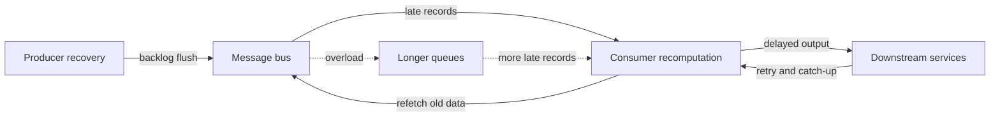

> 장애는 꺼진 서비스를 다시 켜는 순간 끝나지 않는다. Kubernetes, Vault, Kafka 같은 인프라에서 더 위험한 시간은 복구가 시작된 뒤다.

복구는 선의의 부하다. 밀린 메시지를 다시 흘리고, 늦게 도착한 데이터를 재계산하고, DR 클러스터로 트래픽을 넘기고, 캐시가 식은 경로를 다시 데운다. 문제는 이 부하가 평상시 부하와 같은 모양으로 들어오지 않는다는 점이다.

Aleksey Charapko가 쓴 metastability in recovery 글은 이 지점을 정확히 짚는다. 장애 전파를 막아도 복구 전파는 남는다. 시스템 A의 장애가 시스템 B로 직접 번지지 않았더라도, A가 회복하면서 밀린 일을 한꺼번에 B로 밀어 넣으면 B는 뒤늦게 복구 모드에 들어간다. B가 다시 원본 데이터를 재조회하면 메시지 버스나 저장소가 흔들린다. 복구가 또 다른 복구를 부른다.

## Kubernetes 장애 복구가 실패하는 이유는 재시작이 아니라 재유입이다

Kubernetes 운영에서 흔한 착각은 파드(Pod)가 다시 뜨면 복구가 끝났다고 보는 것이다. 실제로는 그때부터 큐, 캐시, 데이터베이스, 시크릿 관리 시스템, 외부 API가 동시에 밀린 일을 받는다. 컨트롤 플레인은 워크로드를 되살리고, 워커 노드는 이미지를 당기고, 애플리케이션은 재연결하고, 소비자는 백로그(backlog)를 읽기 시작한다.

이때 부하의 성질이 바뀐다. 평상시에는 초당 1,000건을 처리하던 소비자가 장애 동안 쌓인 30분 분량을 따라잡으려 한다. 단순히 초당 처리량만 늘어나는 게 아니다. 늦게 도착한 데이터가 과거 윈도우를 건드리면 전체 배치를 다시 계산할 수 있다. Charapko의 예시는 시계열 데이터 처리에서 누락된 항목 몇 개가 뒤늦게 도착했을 때, 소비자가 이미 끝낸 시간 구간 전체를 다시 가져오고 비싼 계산을 반복하는 구조를 보여준다.

작은 결손이 큰 복구 단위로 확대된다. 이것이 입도 불일치(Granularity Mismatch)다.

메시지 하나가 빠졌는데 한 시간짜리 배치가 다시 돈다. 레코드 하나가 늦었는데 콜드 스토리지(cold storage)를 다시 읽는다. 장애는 작았지만 복구 단위가 크면 시스템은 큰 장애처럼 반응한다.

Kubernetes에서는 이 패턴이 더 쉽게 숨어든다. 재시작, 오토스케일링, 리더 재선출, 잡 재시도, 큐 소비 재개가 각각 정상 동작으로 보이기 때문이다. 하지만 정상 동작 여러 개가 같은 방향으로 겹치면 회복 중인 시스템에 새로운 피크가 생긴다.

## Disaster Recovery 훈련은 전환 성공보다 복구 예산을 봐야 한다

HashiCorp가 HCP Vault Dedicated에 클러스터 재해 복구(Cluster Disaster Recovery) 공개 프리뷰를 추가한 배경도 이 문제와 닿아 있다. 기존 지역 DR은 클라우드 리전 장애나 대규모 네트워크 장애를 겨냥한다. 클러스터 DR은 Vault 클러스터 자체의 장애와 전환, 런북, 서비스 연속성을 통제된 조건에서 연습하게 한다.

여기서 핵심은 DR 기능의 존재가 아니다. 복구 경로를 실제로 밟아볼 수 있어야 한다는 점이다.

Vault는 인증, 동적 시크릿(dynamic secrets), 암호화 워크플로에 걸리는 인프라다. Vault가 잠깐 느려지면 애플리케이션은 토큰 갱신, 데이터베이스 크리덴셜 발급, 키 조회에서 대기한다. 클러스터 전환이 성공해도, 전환 직후 모든 클라이언트가 동시에 재인증하고 시크릿을 다시 요청하면 Vault의 복구는 애플리케이션 계층의 복구 폭주로 이어진다.

DR 훈련에서 확인해야 할 질문은 “페일오버가 되는가” 하나가 아니다.

- 클라이언트 재시도 간격에 지터(jitter)가 있는가
- 토큰과 시크릿 TTL이 동시에 만료되지 않는가
- 복구 중 요청을 제한할 예산이 있는가
- Vault 의존 서비스가 실패를 캐시하거나 완화할 수 있는가
- DR 전환 뒤 콜드 캐시, DNS 전파, 연결 풀 재생성이 한 번에 몰리지 않는가

전환 자체는 스위치다. 복구는 파도다.

HashiCorp의 클러스터 DR 프리뷰는 조직이 클러스터 수준 장애를 시뮬레이션하고 런북을 검증할 수 있게 한다. 다만 훈련이 “보조 클러스터로 넘어갔다”에서 끝나면 반쪽이다. 진짜 검증 대상은 전환 뒤 5분, 30분, 2시간 동안 의존 시스템이 받는 부하다.

## 복구 메타안정성은 피드백 루프에서 생긴다

메타안정성(metastability)은 시스템이 나쁜 상태에 들어간 뒤 정상 입력만으로 빠져나오지 못하는 상태를 말한다. 복구 메타안정성은 더 까다롭다. 운영자가 복구를 시도할수록 시스템이 더 깊이 빠질 수 있다.

아래 흐름이 전형적이다.

생산자가 복구되면서 백로그를 메시지 버스로 밀어 넣는다. 소비자는 늦게 온 레코드를 보고 과거 배치를 다시 계산한다. 이미 버린 데이터를 다시 가져오려 메시지 버스를 재조회한다. 메시지 버스는 새 데이터와 재조회 요청을 함께 받는다. 지연이 늘고, 더 많은 레코드가 늦어진다. 늦어진 레코드는 다시 재계산을 만든다.

이 루프에서는 어느 컴포넌트도 버그를 내지 않았다. 각 컴포넌트는 자기 계약을 지켰다. 생산자는 누락 데이터를 보냈고, 버스는 전달했고, 소비자는 정확성을 위해 재계산했다. 시스템 전체만 실패한다.

그래서 복구 설계에는 정확성뿐 아니라 정확성을 유지하는 비용도 포함돼야 한다.

Charapko는 복구 방식을 세 가지로 나눈다. 결손을 버리는 방식, 평상시와 같은 비용으로 밀린 일을 처리하는 additive recovery, 평상시보다 더 비싼 비용이 드는 amplified recovery다. 운영 리스크는 세 번째에서 커진다. 한 단위의 결손을 복구하는 데 한 단위 이상의 자원이 든다면, 백로그는 단순한 밀림이 아니라 부하 증폭기가 된다.

## AI 에이전트와 테스트 자동화도 같은 함정에 빠진다

이 문제는 Kafka나 Kubernetes에만 갇히지 않는다. AI 에이전트, 테스트 자동화 하네스, 관측성 파이프라인도 같은 모양을 가진다.

AI 에이전트가 실패한 작업을 재시도할 때 단일 API 호출만 반복하면 비용은 비교적 예측 가능하다. 하지만 재시도마다 전체 컨텍스트를 다시 읽고, 도구 호출을 다시 계획하고, 이전 산출물을 검증하고, 실패 로그를 새로 요약하면 비용은 커진다. 작은 실패 하나가 토큰, 도구 호출, 저장소 읽기, 외부 API 호출을 함께 늘린다.

테스트 자동화도 비슷하다. 불안정한 테스트 하나를 다시 돌리는 정도는 additive recovery에 가깝다. 그러나 실패한 테스트가 전체 환경 재생성, 데이터베이스 리셋, 브라우저 세션 재기동, 스냅샷 재생성을 요구하면 amplified recovery가 된다. CI가 밀릴수록 더 많은 브랜치가 재실행되고, 재실행이 큐를 더 밀어낸다.

관측성 시스템은 특히 조심해야 한다. 장애 중 로그와 메트릭이 폭증하고, 복구 중에는 누락분 전송과 재처리가 겹친다. “모든 데이터를 잃지 않는다”는 목표가 무제한 재전송으로 구현되면, 모니터링 시스템이 서비스 복구를 방해한다. 관측성은 장애를 보는 장치지만, 복구 중에는 장애의 일부가 될 수 있다.

## 도입 조건은 자동 복구보다 부하 성형이다

복구를 자동화하려면 먼저 자동화가 밀어 넣을 부하를 제한해야 한다. 오토스케일링만으로는 부족하다. 한 계층만 키우면 다음 계층이 병목이 된다. 소비자 수를 늘리면 메시지 버스와 데이터베이스가 흔들리고, API 게이트웨이를 늘리면 인증 시스템이 맞는다.

실무에서 먼저 볼 조건은 네 가지다.

첫째, 복구 단위를 작게 유지해야 한다. 레코드 하나 때문에 배치 전체를 재계산하는 구조라면, 늦은 데이터 처리 정책을 따로 둬야 한다. 재계산 범위를 좁히거나, 보정 이벤트를 만들거나, 정확성 등급을 나눠야 한다. 모든 지연 데이터를 같은 방식으로 처리하면 가장 비싼 경로가 기본값이 된다.

둘째, 복구 예산(recovery budget)을 둬야 한다. 백로그를 가능한 빨리 비우는 정책은 위험하다. 초당 처리량, 동시 재시도 수, 재조회량, 외부 API 호출량을 별도 버킷으로 제한해야 한다. 평상시 트래픽과 복구 트래픽을 같은 큐에 넣으면 운영자는 어느 쪽이 시스템을 죽이는지 늦게 안다.

셋째, 콜드 경로를 복구 전에 확인해야 한다. 캐시가 살아 있을 때 빠른 코드는 복구 중에 느린 코드가 된다. 오래된 데이터를 다시 읽을 때 객체 스토리지, 압축 해제, 인덱스 스캔, 권한 조회가 붙는다면 평상시 벤치마크는 의미가 줄어든다.

넷째, 런북은 순서를 가져야 한다. “서비스 재시작”, “큐 소비 재개”, “DR 전환” 같은 명령은 각각 맞지만 동시에 실행하면 틀릴 수 있다. 먼저 의존 시스템의 여유 용량을 만들고, 그다음 생산자를 열고, 마지막으로 소비 속도를 올리는 식의 순서가 필요하다.

복구를 너무 조심스럽게 제한하면 RTO(Recovery Time Objective)를 맞추지 못할 수 있다. 금융 거래, 보안 이벤트, 결제 처리처럼 지연 자체가 손실인 시스템은 백로그를 천천히 비울 수 없다. 이 경우에도 답은 제한을 없애는 것이 아니라 복구 용량을 평상시와 별도로 산정하는 것이다. 빠른 복구가 필요할수록 더 강한 예산과 더 많은 사전 증설이 필요하다.

복구는 속도의 문제가 아니라 모양의 문제다.

## 복구 성공의 기준을 다시 써야 한다

Kubernetes에서 파드가 다시 뜨고, Vault가 DR 클러스터로 넘어가고, Kafka 소비자가 다시 읽기 시작하는 시점은 장애 종료가 아니라 복구 부하가 시스템에 들어오는 시작점이다.

좋은 복구 설계는 많이 재시도하는 설계가 아니다. 작게 재시도하고, 천천히 증폭하며, 어느 계층이 먼저 뜨거워지는지 관측할 수 있는 설계다. DR 훈련은 버튼이 작동하는지 확인하는 행사가 아니라, 복구 중 생기는 백로그와 재계산과 재인증의 파형을 측정하는 실험이어야 한다.

운영자가 제일 먼저 바꿔야 할 문장은 이것이다. “얼마나 빨리 복구할 수 있는가”가 아니라 “복구가 다른 시스템에 어떤 일을 새로 만들고 있는가”를 물어야 한다.

그 질문을 하지 않는 자동 복구는 자동 장애 전파와 다르지 않다.

## 참고 자료

- [선정 글감] [Metastability in Recovery: Cascading Recovery with a Loop](https://charap.co/metastability-in-recovery-cascading-recovery-with-a-loop/) — Lobsters
- [관련] [HCP Vault Dedicated introduces cluster disaster recovery (public preview)](https://www.hashicorp.com/blog/hcp-vault-dedicated-introduces-cluster-disaster-recovery-public-preview) — HashiCorp Blog