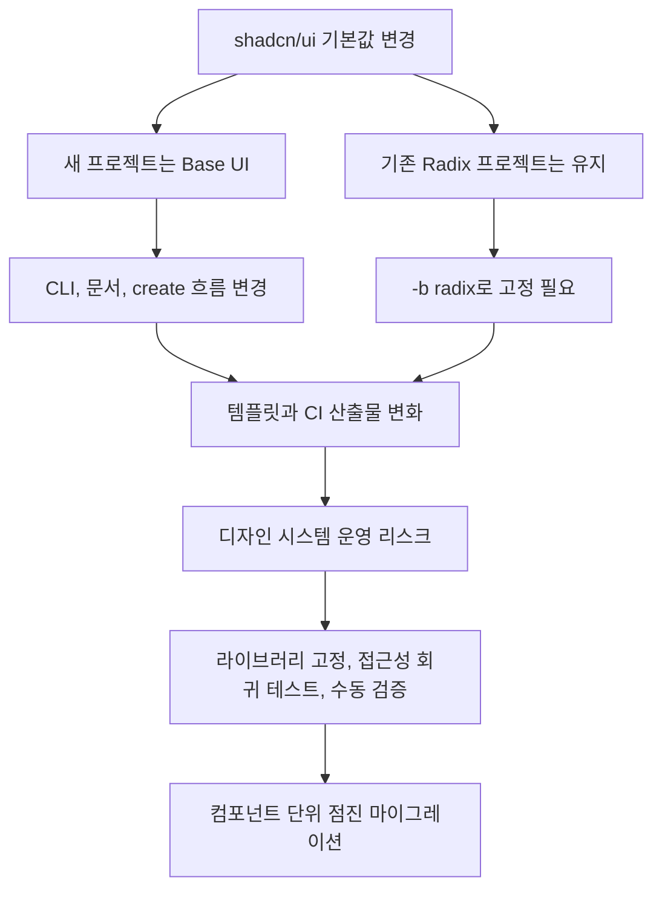

CLI 기본값 하나가 바뀌었을 뿐인데, 프론트엔드 개발자들이 반응한 이유는 분명하다. shadcn/ui가 2026년 7월부터 새 프로젝트의 기본 컴포넌트 라이브러리를 Radix에서 Base UI로 바꿨다. 문제는 버튼 색이 아니다. 조직의 디자인 시스템, 접근성 검증, CI 스크립트, 에이전트 기반 마이그레이션까지 함께 흔들 수 있는 기본값의 힘이다.

## 기본값은 추천이 아니라 배포 경로다

shadcn/ui는 2023년 1월 출시 당시 Radix 위에 만들어졌다. Radix는 언스타일드 헤드리스 컴포넌트, 접근성, 안정적인 API를 앞세워 많은 앱에서 사실상 기본 선택지처럼 쓰였다. 이번 변경은 Radix를 제거한다는 뜻이 아니다. shadcn/ui는 Base UI를 기본값으로 올리되, Radix 지원은 계속 유지한다고 밝혔다.

범위는 명확하다. 새 프로젝트에서 `npx shadcn init`을 실행하면 Base UI가 기본으로 선택된다. `shadcn/create`는 Base UI를 먼저 보여준다. 문서의 컴포넌트 페이지도 Base UI 탭을 기본으로 연다. Radix 문서는 한 번 클릭하면 볼 수 있고, Radix를 계속 쓰려면 `-b radix` 플래그를 붙이면 된다.

확인된 사실은 여기까지다.

해석은 따로 봐야 한다. 이것은 Radix 폐기가 아니다. 다만 새 프로젝트의 관성은 Base UI로 이동한다. 팀 내부 템플릿, 온보딩 문서, 자동 생성 스크립트, 튜토리얼은 기본값을 그대로 따라가는 경우가 많다. 기본값 변경은 생태계의 투표 결과이면서 다음 투표의 투표용지를 바꾸는 일이기도 하다.

shadcn/ui는 근거도 제시했다. Base UI는 1.6.0 안정 버전이고, 주간 다운로드가 600만 회 이상이라고 밝혔다. `shadcn/create`로 만든 프로젝트에서는 Base UI 선택이 Radix보다 2 대 1로 많았다고 했다. “커뮤니티가 이미 결정했다”는 표현은 마케팅 문장에 가깝지만, 숫자 자체는 제품 방향을 바꿀 만한 신호다.

## 개발자가 불편해한 지점은 Base UI가 아니라 전환 비용이다

Hacker News에서 이 이슈가 212점, 댓글 94개를 기록한 이유도 여기에 있다. 개발자 커뮤니티는 새 라이브러리라서 반응한 것이 아니다. 이미 작동하는 프로덕션 앱에 라이브러리 전환이라는 단어가 붙는 순간 비용 계산이 시작된다.

가장 큰 불편은 신뢰의 위치가 바뀐다는 점이다. Radix는 이미 많은 팀에서 검증된 선택지였다. 접근성, 포커스 처리, 팝오버, 다이얼로그 같은 영역은 눈에 보이는 UI보다 실패 비용이 크다. Base UI가 같은 제작진의 후속 선택지이고 안정 버전에 도달했더라도, 각 서비스의 조합 안에서는 다시 검증해야 한다.

두 번째는 비대화형 자동화다. shadcn/ui는 CI나 스크립트에서 `shadcn init`을 Radix 전제로 호출하던 경우 `-b radix`를 추가하라고 안내했다. 이 한 줄은 작아 보이지만 운영 관점에서는 꽤 날카롭다. 자동 생성 도구는 기본값 변화에 약하다. 새 프로젝트 생성, 사내 템플릿, 예제 코드 검증, 문서 빌드가 같은 명령어를 공유하면 어느 날부터 산출물이 달라진다.

세 번째는 레지스트리(registry) 운영이다. shadcn/ui는 레지스트리를 만드는 쪽에 `registry:base` 설정을 넣어 특정 라이브러리를 고정하라고 했다. 설정이 없으면 이제 Base UI로 초기화된다. 공개 컴포넌트 레지스트리나 사내 디자인 시스템을 운영하는 팀이라면 이 변화가 더 직접적이다. 작성자는 같은 컴포넌트라고 생각해도 소비자는 다른 기반 라이브러리를 받게 될 수 있다.

새 프로젝트라면 Base UI를 택하는 쪽이 더 자연스럽다. shadcn/ui가 실제 새 프로젝트에서 Base UI를 쓰고 있고, 새 컴포넌트가 계속 추가되며, 사용자 선택도 이미 Base UI 쪽으로 기울었다면 기본값을 계속 Radix에 묶어두는 편이 더 어색하다. 기본값은 보수적이어야 하지만, 과거의 승자를 영원히 붙잡는 장치가 될 수는 없다.

## 마이그레이션 도구보다 에이전트 스킬을 택한 판단

이번 발표에서 기본값만큼 눈에 띄는 부분은 마이그레이션 방식이다. shadcn/ui는 codemod 대신 에이전트용 skill을 제공한다. 사용자가 컴포넌트를 복사해 자기 코드로 소유하고, variants를 추가하고, class를 바꾸고, prop을 이어 붙였기 때문이다.

codemod는 규칙이 일정한 코드에 강하다. 그러나 shadcn/ui의 장점은 복사해서 고치는 구조다. 이 장점은 마이그레이션 시점에 자동 변환의 약점이 된다. 원본 그대로 남은 컴포넌트는 바꿀 수 있지만, 팀이 손댄 컴포넌트는 기계적 변환이 틀릴 가능성이 높다.

shadcn/ui가 제시한 방식은 이렇다. 컴포넌트를 하나씩 Base UI로 옮기고, 프로젝트는 그 사이에도 빌드 가능한 상태를 유지한다. Radix와 Base UI는 동시에 존재할 수 있다. 에이전트는 rename, prop change, behavior difference를 읽고, 수정한 부분을 보존하면서 옮긴다. `asChild`가 `render`로 바뀌는 식의 기계적 변화는 처리하고, 컴파일은 되지만 행동이 달라지는 부분은 자동 패치하지 않고 표시한다.

이 설계는 UI 컴포넌트 마이그레이션의 실제 위험을 잘 짚는다. 핵심 위험은 타입 에러가 아니다. 타입은 잡히는데 키보드 탐색이 달라지는 것, 포커스 트랩이 느슨해지는 것, 닫힘 이벤트 순서가 바뀌는 것이다. shadcn/ui가 보고서에 “Behavior changes”와 “Verify by hand”를 남기겠다고 한 이유가 여기에 있다.

발표에는 실제 테스트 범위도 들어 있다. shadcn/ui는 60개 이상 컴포넌트가 있고 그중 36개가 Radix 기반인 실제 프로젝트에서 전체 마이그레이션을 약 25분, 컴포넌트당 약 1만 토큰 규모로 실행했다고 밝혔다. 빌드는 깨지지 않았고 커스터마이징은 유지됐다고 했다. 이 수치는 모든 프로젝트에 그대로 적용할 수 있는 벤치마크가 아니다. 그래도 에이전트 기반 마이그레이션이 어떤 단위로 비용을 발생시키는지는 보여준다. 비용의 중심은 컴포넌트 수, 커스터마이징 정도, 수동 검증 범위다.

## 지금 팀이 확인할 것은 선호가 아니라 고정점이다

이번 변경을 “Radix냐 Base UI냐”로만 판단하면 실무 리스크를 놓친다. 먼저 확인할 것은 우리 프로젝트가 어떤 기본값에 기대고 있는가다.

새 프로젝트를 만드는 스크립트가 있다면 `shadcn init` 호출부를 확인해야 한다. Radix를 계속 쓸 팀은 `-b radix`를 명시해야 한다. Base UI를 받아들이는 팀도 그냥 넘어가면 안 된다. 사내 문서와 예제, Storybook, 테스트 스냅샷, 접근성 체크리스트가 어느 기반 라이브러리를 전제로 쓰였는지 맞춰야 한다.

레지스트리를 운영한다면 설정 누락이 더 위험하다. `registry:base`를 넣어 의도한 기반을 고정하지 않으면 소비자가 받는 결과가 바뀔 수 있다. 이는 버그라기보다 계약이 흐려지는 문제다. 컴포넌트 레지스트리는 코드 배포 채널이고, 배포 채널에는 기본값보다 명시적 계약이 필요하다.

마이그레이션은 새 기능 개발처럼 취급하면 안 된다. 컴포넌트 하나, 사용처 하나, 검증 하나로 끊어야 한다. shadcn/ui가 제안한 “한 컴포넌트씩, 빌드 가능한 상태로, 보고서를 남기는 방식”은 이 문제에 잘 맞는다. 특히 다이얼로그, 드롭다운, 툴팁, 팝오버처럼 포커스와 이벤트 순서가 중요한 컴포넌트는 타입체크 통과 후에도 직접 열고, 닫고, 탭으로 이동해봐야 한다.

이미 Radix로 안정적으로 운영 중인 앱은 마이그레이션하지 않는 편이 맞다. shadcn/ui도 같은 말을 했다. “프로덕션 앱에서 할 수 있는 최악은 컴포넌트 라이브러리를 바꾸는 것”이라는 과거 입장을 유지한다고 밝혔다. 새 기본값은 새 프로젝트를 위한 선택이지, 기존 앱에 붙은 작업 티켓이 아니다.

이번 판단은 간단하다.

새로 시작하면 Base UI를 검토한다. 이미 잘 돌아가면 Radix를 고정한다. 자동화가 있다면 기본값을 믿지 말고 플래그와 레지스트리 설정으로 의도를 적는다.

처음의 질문으로 돌아오면, CLI 기본값 하나가 커뮤니티 반응을 만든 이유는 명확하다. 프론트엔드 생태계에서 기본값은 문서의 첫 화면이 아니라 운영 경로의 첫 분기다. shadcn/ui는 Base UI를 밀어 올렸고, Radix를 끊지는 않았다. 팀이 해야 할 일은 어느 쪽이 더 멋진지 말하는 것이 아니다. 다음 `init`이 무엇을 만들지, 그 결과를 누가 검증할지 정하는 일이다.

## 참고 자료

- [선정 글감] [Shadcn/UI now defaults to Base UI instead of Radix](https://ui.shadcn.com/docs/changelog) — Hacker News Best