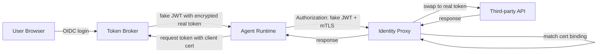

> AI 에이전트 보안의 핵심은 더 똑똑한 프롬프트가 아니다. 에이전트에게 넘긴 토큰이 어디까지 도망갈 수 있는지 줄이는 일이다.

AI 에이전트가 캘린더, 메일, GitHub, 관측성 도구, 배포 시스템을 대신 만지기 시작하면 문제는 모델 성능에서 신원(identity)으로 옮겨간다. 사람은 요청을 해석하지만, 에이전트는 권한을 실행한다. 그 사이에 OAuth 토큰, OIDC 클레임, mTLS, 세션 기록, 리소스 발견 규격이 끼어든다.

가장 위험한 설계는 단순하다. 사용자가 한 번 로그인하고, 에이전트 런타임 안에 실제 액세스 토큰을 넣어 두는 방식이다. 그 토큰은 파일로 남고, 로그에 찍히고, 저장소에 커밋되고, 프롬프트 인젝션에 속은 에이전트가 외부로 보내버릴 수 있다. 이 구조에서는 에이전트가 뚫린 것이 아니라 토큰이 사람이 된 것이다.

## AI 에이전트 권한은 API 키처럼 다루면 깨진다

기존 자동화는 대체로 결정적이었다. 스크립트는 정해진 API를 부르고, 실패하면 멈추고, 권한 범위도 비교적 좁았다. 에이전트는 다르다. 메일을 읽고, 문서를 검색하고, 티켓을 열고, 다른 에이전트에게 작업을 넘긴다. Google의 Agent-to-Agent(A2A) 설명이 REST API와 에이전트를 구분하는 이유도 여기에 있다. API는 고정된 호출 계약이고, 에이전트는 대화형 위임 단위다.

이 차이는 보안 모델을 바꾼다. 단순한 API 키 보관 정책으로는 부족하다. 에이전트가 외부 도구를 발견하고, 어떤 기능을 쓸지 고르고, 안전한 연결인지 검증해야 한다. Google이 Agentic Resource Discovery(ARD)를 공개하며 던진 세 질문도 같은 방향이다. 기능은 어디에 있는가. 무엇을 써야 하는가. 연결해도 안전한가.

커뮤니티에서 말이 붙는 지점은 에이전트가 쓸모 있느냐가 아니다. 쓸모 있어질수록 기존 신원 체계가 버티지 못한다는 점이다.

## 디바이스 코드 플로우의 약점은 사용자 경험이 아니라 검증 부재다

많은 에이전트 환경은 디바이스 코드 플로우(Device Code Flow)에 기대어 토큰을 얻는다. 사용자가 브라우저에서 인증하면, 토큰은 에이전트 환경으로 돌아온다. 원격 터미널이나 CLI에서는 편하다. 보안 관점에서는 불편한 질문이 남는다.

인증 제공자는 토큰을 요청한 실행 환경의 보안 상태를 충분히 보지 못한다. 로컬 브라우저 리다이렉트 방식은 로컬 개발에는 맞지만 원격 에이전트 환경에는 어색하다. 결국 토큰은 에이전트가 실행되는 디스크 근처에 떨어진다.

Matthew Garrett의 제안은 이 지점을 정확히 찌른다. 실제 토큰을 에이전트에게 주지 말고, 쓸모없는 대체 JWT를 준다. 에이전트는 프록시를 통해서만 API를 호출한다. 프록시는 대체 JWT를 검증하고, 그 안에 암호화된 실제 토큰을 꺼내 원격 API에 붙인다.

차이는 작아 보여도 경계는 완전히 달라진다. 에이전트는 권한을 가진 척할 수 있지만, 혼자서는 권한을 쓸 수 없다. 토큰 탈취의 피해 반경이 프록시 접근 가능성으로 줄어든다.

이 설계의 장점은 상태를 줄인다는 데 있다. 브로커와 프록시가 placeholder와 실제 토큰의 매핑을 영속 저장소에 보관하지 않는다. 새 JWT 안에 실제 토큰을 암호화해 넣고, 서명과 복호화 키만 런타임에 주입한다. 확장은 데이터베이스 샤딩 문제가 아니라 동일 프로세스를 더 띄우는 문제가 된다.

물론 이 방식은 마법이 아니다. 프록시가 무너지면 토큰 교환 지점이 무너진다. 그래서 Garrett은 mTLS와 클라이언트 인증서 바인딩을 붙인다. 에이전트 환경이 SPIFFE 같은 방식으로 인증서를 받고, 프록시는 JWT 안에 기록된 인증서 표현과 실제 mTLS 인증서를 대조한다. 토큰을 훔쳐도 해당 private key가 없으면 사용할 수 없다.

RFC 8705의 OAuth 2.0 mTLS 바인딩을 모든 신원 제공자가 지원하지 않아도, 내부 프록시 계층에서 비슷한 구속력을 만들 수 있다는 판단이다. 이 판단은 실용적이다. 표준의 이상형을 기다리는 대신, 현재의 JWT와 opaque token 위에 손상 반경을 줄이는 층을 올린다.

## 에이전트 발견 규격은 권한 브로커 없이는 위험한 전화번호부가 된다

ARD 같은 리소스 발견 규격은 에이전트 생태계에 필요한 조각이다. 조직마다 도구 레지스트리, 스킬 저장소, 내부 에이전트 목록이 흩어져 있으면 자동화는 플랫폼 안에 갇힌다. 운영 에이전트가 장애를 조사하려면 관측성 시스템, 문서, 배포 이력, 티켓, 전문 에이전트를 넘나들어야 한다.

문제는 발견이 곧 신뢰가 아니라는 점이다. 기능을 찾았다는 사실과 안전하게 연결해도 된다는 사실은 다르다. 에이전트가 잘못된 MCP 서버, 위조된 도구 설명, 과도한 권한을 요구하는 내부 서비스를 발견하면 자동화 속도만큼 사고도 빨라진다.

따라서 ARD의 검증 축은 토큰 브로커와 붙어서 설계돼야 한다. 발견 계층은 무엇을 호출할 수 있는지 알려준다. 신원 계층은 누가, 어느 환경에서, 어떤 인증 강도로 호출하는지 제한한다. 감사 계층은 그 호출이 실제로 무엇을 했는지 남긴다.

A2A의 secure boundary 설명도 같은 원칙으로 읽어야 한다. 전문 에이전트에게 작업을 넘기면 내부 데이터와 구현 방식을 숨길 수 있다. 하지만 호출자가 들고 있는 권한이 넓고 검증이 약하면 black box는 보안 경계가 아니라 책임 회피 경계가 된다. 캡슐화는 권한 축소와 함께 있을 때만 보안 기능이 된다.

## OIDC 세션 메타데이터는 사람 로그인과 에이전트 실행을 분리한다

Google이 Sign in with Google에 추가한 OIDC 표준 클레임 auth_time과 amr은 에이전트 권한 설계에도 바로 연결된다. auth_time은 사용자가 언제 인증했는지 알려준다. amr(Authentication Methods Reference)은 어떤 인증 방법이 쓰였는지 알려준다. MFA, 하드웨어 키 같은 신호를 백엔드 정책에 반영할 수 있다.

이 신호는 에이전트에게 토큰을 줄지 말지 결정하는 최소 조건이 된다. 예를 들어 메일 읽기와 캘린더 조회는 기존 세션으로 허용하더라도, 메일 발송, 권한 변경, 프로덕션 배포 승인에는 최근 인증과 강한 인증 방법을 요구할 수 있다. 사람의 인증 신선도와 에이전트의 실행 권한을 같은 값으로 취급하면 안 된다.

여기서 브로커가 의미를 갖는다. 에이전트 런타임은 사용자의 원본 세션을 소유하지 않는다. 브로커는 사용자의 인증 시점, 인증 방법, 요청한 capability, 에이전트 환경 인증서를 함께 보고 가짜 JWT를 발급한다. 권한 판단이 에이전트 내부 코드에서 빠져나와 중앙 정책 지점으로 이동한다.

이 구조에서는 취소와 회수도 명확해진다. 토큰 파일을 찾아 지우는 방식이 아니다. 프록시 정책에서 특정 capability, 특정 인증서, 특정 사용자 세션 조건을 막는다. 실제 토큰이 에이전트 디스크에 없기 때문에 회수의 의미가 선명해진다.

## 세션 기록은 마지막 방어선이 아니라 설계 입력값이다

HashiCorp Boundary 1.0의 RDP 세션 기록은 사람 중심 PAM(Privileged Access Management) 기능처럼 보이지만, 에이전트 접근 제어에도 같은 질문을 던진다. 누가 접속했는가. 어떤 대상에 접근했는가. 세션 안에서 무슨 행동을 했는가. 나중에 재생 가능한가.

에이전트 시대의 감사는 API 호출 로그만으로 부족하다. 에이전트가 다른 에이전트에게 작업을 넘기고, 도구를 발견하고, 문서를 읽고, 티켓을 수정하면 행위의 단위가 분산된다. 단일 HTTP 로그는 전체 의사결정 흐름을 설명하지 못한다.

Boundary가 Kubernetes, 데이터베이스, HTTP/HTTPS 같은 프로토콜로 세션 기록 확장을 바라보는 흐름은 현실적인 방향이다. 모든 접근을 사람용 Bastion으로 몰아넣는 방식은 에이전트 자동화와 맞지 않는다. 대신 에이전트가 거치는 프록시, 브로커, 세션 게이트웨이에서 실행 단위를 기록해야 한다.

운영팀이 확인해야 할 로그는 단순하다.

- 어떤 사용자 인증 이벤트가 에이전트 권한 발급으로 이어졌는가
- 어떤 에이전트 환경 인증서에 토큰이 바인딩됐는가
- 어떤 capability discovery 결과가 호출로 이어졌는가
- 프록시가 어떤 원격 API로 토큰을 교환했는가
- 민감 작업 전에 step-up authentication이 있었는가

이 다섯 가지가 이어지지 않으면 사고 후 분석은 추측이 된다. 에이전트 보안에서 관측성은 대시보드가 아니라 증거 체인이다.

## 도입 조건은 멋진 프로토콜보다 조직의 권한 지도가 먼저다

에이전트 신원 브로커를 도입할 조건은 분명하다. 에이전트가 민감 데이터나 변경 권한을 다룬다면 필요하다. 메일 읽기, 캘린더 접근, GitHub 이슈 수정, 배포 이력 조회, 관측성 쿼리, 데이터베이스 접근이 들어가면 실제 토큰을 런타임에 넣는 설계는 버려야 한다.

반대로 단일 내부 도구를 읽기 전용으로 호출하는 작은 자동화라면 과한 설계가 될 수 있다. 이때는 짧은 만료 시간, 좁은 스코프, 실행 환경 격리, 로그 마스킹만으로 충분할 수 있다. 프록시와 브로커는 운영할 대상이 하나 더 생긴다는 뜻이다. 키 주입, 인증서 발급, 장애 시 우회 정책, 지역별 가용성, 공급자별 토큰 차이를 감당해야 한다.

가장 실패하기 쉬운 지점은 표준 이름만 붙이고 토큰 흐름을 그대로 두는 것이다. ARD를 붙였지만 검증이 약하면 도구 목록만 넓어진다. A2A를 붙였지만 권한 위임 정책이 없으면 에이전트 간 전파 경로만 생긴다. OIDC 클레임을 받았지만 auth_time과 amr을 정책에 쓰지 않으면 토큰 안의 장식이다. 세션 기록을 켰지만 브로커와 프록시 로그가 연결되지 않으면 화면 녹화 조각만 남는다.

실무 판단은 이렇게 내려야 한다. 에이전트가 실제 권한을 가진다면 원본 토큰을 주지 않는다. 에이전트가 다른 도구를 발견한다면 발견 결과를 신뢰 검증과 분리하지 않는다. 에이전트가 민감 작업을 한다면 사람 인증의 신선도와 실행 환경의 인증서를 함께 본다.

처음의 질문으로 돌아가자. 에이전트에게 권한을 줘도 되는가. 답은 조건부다.

실제 토큰을 주지 않는 구조에서만 가능하다. 발견, 위임, 실행, 감사가 같은 신원 체계에 묶일 때만 가능하다. 그 조건을 만족하지 못하면 에이전트는 자동화 도구가 아니라 돌아다니는 세션 쿠키다.

## 참고 자료

- [선정 글감] [Securing agentic identity](https://codon.org.uk/~mjg59/blog/p/securing-agentic-identity/) - Lobsters
- [관련] [Announcing the Agentic Resource Discovery specification](https://developers.googleblog.com/announcing-the-agentic-resource-discovery-specification/) - Google Developers
- [관련] [How A2A is Building a World of Collaborative Agents](https://developers.googleblog.com/how-a2a-is-building-a-world-of-collaborative-agents/) - Google Developers
- [관련] [Enhance Security and Trust: New Session Metadata in Sign in with Google](https://developers.googleblog.com/enhance-security-and-trust-new-session-metadata-in-sign-in-with-google/) - Google Developers
- [관련] [Boundary 1.0 releases RDP session recording and improved management](https://www.hashicorp.com/blog/boundary-1-releases-with-rdp-session-recording-and-improved-management) - HashiCorp Blog