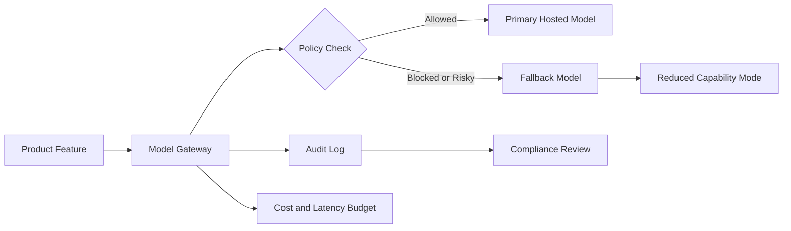

같은 모델을 어제는 API로 부르고, 오늘은 중국 AI 모델 접근 제한 때문에 못 부른다면 성능 문제가 아니다. 운영 리스크다. 2026년 7월 7일 Reuters는 베이징이 중국 최상위 AI 모델의 해외 접근을 제한하는 방안을 검토하고 있다고 보도했다. 아직 시행된 금지는 아니다. 그래도 개발자들이 불편해할 지점은 이미 충분하다.

모델은 라이브러리처럼 보이지만 실제로는 국경, 계약, 보안 심사의 영향을 받는 인프라가 됐다. OpenAI, Anthropic, 중국계 오픈 모델을 비용과 성능만으로 고르던 시기는 끝났다. 이제는 이 모델을 계속 쓸 수 있는지부터 물어야 한다.

## 중국 AI 모델 접근 제한은 수출통제의 반대편이다

확인된 사실부터 좁혀야 한다. Reuters 보도에 따르면 중국 당국은 지난 한 달 동안 일부 대형 중국 기술기업과 해외 접근 제한 방안을 논의했다. 범위는 중국의 가장 앞선 AI 모델이며, 아직 공개되지 않은 모델까지 포함될 수 있다고 전해졌다. 보도 근거는 익명 소식통이다. 2026년 7월 7일 현재 공식 세부 규칙이 공표된 상태로 확인되지는 않는다.

핵심은 여기에 있다. 확정된 정책은 아니지만 방향은 선명하다. 미국이 칩, 모델, 클라우드 접근을 국가안보 자산으로 다뤄 왔다면 중국도 모델 자체를 전략 자산으로 묶기 시작했다. GPU가 막히는 시대에서 모델 호출권이 막히는 시대로 넘어간다.

미국 쪽 사례도 같은 선 위에 있다. WIRED는 2026년 6월 30일 미국 상무부가 Anthropic의 Fable 5와 Mythos 5에 대한 수출통제를 해제한다고 보도했다. 해당 모델들은 그 전까지 일부 기업과 정부기관에만 허용됐고, 이후 Anthropic이 보안 위험을 선제적으로 탐지하고 미국 정부와 프로토콜 및 표준을 협력하기로 하면서 제한이 풀렸다고 전했다.

중국은 해외 접근을 줄이는 쪽을 검토하고, 미국은 보안 약속을 조건으로 접근을 다시 여는 쪽으로 움직였다. 방향은 다르지만 원리는 같다. AI 모델 접근권은 제품 기능이 아니라 정책으로 켜지고 꺼지는 권한이 됐다.

## LocalLLaMA가 반응하는 이유는 오픈 모델의 약속이 흔들리기 때문이다

LocalLLaMA 같은 커뮤니티가 이런 뉴스에 민감한 이유는 단순한 미중 갈등 때문이 아니다. 이 커뮤니티는 모델을 직접 돌리고, 양자화하고, 로컬 추론 비용을 따지고, 폐쇄형 API 의존을 줄이는 사람들로 구성된다. 이들에게 중국 AI 모델은 정치 뉴스가 아니라 실험 가능한 대안이었다.

같은 묶음의 보조 글감은 중국 AI 모델이 OpenAI와 Anthropic의 비용 상승 속에서 미국 기업에도 선택지로 들어오고 있다는 제목을 달고 있다. 제공된 자료만으로는 실제 도입 규모나 기업명을 확인할 수 없다. 다만 제목 수준에서 드러나는 시장의 긴장은 분명하다. 중국 모델은 더 이상 낮은 성능의 주변부가 아니라, 비용 압박을 받는 팀이 비교표에 올리는 후보가 됐다.

그래서 접근 제한 논의가 불편하다. 커뮤니티가 기대한 것은 모델 선택권이었다. 더 싼 API, 더 열린 가중치, 더 빠른 추론, 더 낮은 벤더 종속을 기대했다. 정책 리스크가 붙으면 그 선택지는 순식간에 조건부 자산이 된다. 중국 모델이 미국 빅랩의 가격 압박을 낮추고 개발자가 더 많은 모델을 비교하게 만들 수는 있지만, 해외 접근 제한이 시작되면 모델 품질과 무관하게 서비스 연속성이 깨진다. 오픈 웨이트(open-weight) 모델은 API 차단보다 회복력이 높지만 라이선스, 배포 채널, 새 버전 접근, 파인튜닝 데이터 경로는 여전히 정책 영향을 받는다. 국가별 규제가 위험 모델의 악용을 줄일 수 있다는 주장도 있지만, 경계가 불명확하면 정상적인 연구, 벤치마크, 제품 테스트까지 위축된다.

반대 관점도 빼면 안 된다. 정부가 아무 이유 없이 접근권을 만지는 것은 아니다. WIRED 보도에서 Anthropic은 강력한 모델의 사이버 보안 관련 오용과 jailbreak 우회를 둘러싸고 미국 정부와 충돌했다. Anthropic은 원래 zero jailbreak 보장이 불가능하다는 입장이었고, 이후 더 강한 안전장치와 정부 협력을 약속하는 쪽으로 움직였다.

이 주장은 설득력이 있다. 최상위 모델은 코드 작성, 취약점 분석, 자동화된 에이전트 실행에 직접 쓰인다. 국가가 위험을 따지는 것은 이상하지 않다. 문제는 통제가 필요하다는 사실이 아니라, 통제 방식이 예측 가능하지 않을 때 운영자가 감당해야 하는 비용이다.

## Anthropic 수출통제와 중국 모델 제한은 같은 운영 질문을 만든다

AI 제품팀은 모델을 성능 순위표로만 보면 안 된다. 이제 모델 선택지는 세 층으로 나눠야 한다.

첫째, 법적 접근권이다. 어느 국가, 어느 법인, 어느 클라우드 리전, 어느 최종 사용자에게 호출이 허용되는지 확인해야 한다. Anthropic 사례에서 보듯 수출, 재수출, 국내 이전, deemed export 같은 표현은 제품 약관 바깥에서 실제 배포 가능성을 바꾼다.

둘째, 데이터 경로다. 사용자의 프롬프트, 파일, 코드, 로그가 어느 국가의 서버를 통과하는지 봐야 한다. 중국 당국의 논의가 실제 규칙으로 바뀐다면 해외 고객은 단순히 API 엔드포인트만 보는 것으로 부족하다. 학습 제외 옵션, 로그 보관 기간, 리전 고정, 하위 처리업체까지 검토해야 한다.

셋째, 대체 가능성이다. 모델이 막혔을 때 품질이 조금 떨어지는 것이 문제인지, 제품 기능이 멈추는 것이 문제인지 구분해야 한다. 검색 요약은 대체 모델로 버틸 수 있다. 보안 분석, 코드 생성, 법무 검토처럼 품질 편차가 사고로 이어지는 영역은 fallback을 더 엄격하게 설계해야 한다.

아키텍처는 이렇게 단순하게 잡는 편이 낫다.

복잡한 멀티에이전트 구조가 먼저가 아니다. 모델 게이트웨이(Model Gateway), 정책 체크, 감사 로그, 축소 기능 모드면 출발점은 충분하다. 특정 국가 모델을 쓰지 말자는 이야기가 아니다. 특정 모델을 직접 제품 로직에 박아 넣지 말자는 이야기다.

## 실무자가 중국 AI 모델을 보는 법

중국 AI 모델을 배제하는 판단은 성급하다. 비용과 성능에서 매력적인 모델이 나오고 있고, 오픈 웨이트 생태계는 폐쇄형 API의 가격을 견제한다. 미국 기업이 중국 모델을 검토한다는 흐름 자체도 이상하지 않다. OpenAI와 Anthropic 비용이 부담되는 팀이라면 더 싼 대안을 찾는 것이 정상이다.

다만 리스크를 가격표 아래에 숨기면 안 된다. 모델 단가는 토큰당 비용으로 보이지만, 접근 제한 리스크는 장애 시간과 재검증 비용으로 청구된다. 오늘 싼 모델이 내일도 호출 가능하다는 보장은 약관, 정책, 외교 관계 위에 있다.

실무 체크리스트는 짧아야 쓸모가 있다.

- 모델 제공사가 어느 관할권의 정책 영향을 받는지 확인한다.
- API와 오픈 웨이트를 같은 등급의 대안으로 취급하지 않는다.
- 프롬프트와 출력 로그가 어느 리전에 저장되는지 문서로 남긴다.
- primary model이 막혔을 때 fallback model의 품질 하한선을 정한다.
- 보안, 개인정보, 저작권 검토가 필요한 입력은 모델별로 허용 범위를 나눈다.
- 벤치마크 점수보다 계약상 접근권과 운영 중단 조건을 먼저 읽는다.

모든 것을 자체 호스팅으로 해결하겠다는 접근도 답은 아니다. 자체 호스팅은 접근권 리스크를 낮추지만 GPU 비용, 패치, 모델 업데이트, 보안 모니터링을 직접 떠안는다. hosted API는 편하지만 정책 변경과 계정 차단에 취약하다. 어느 쪽이든 공짜 회복력은 없다.

이번 이슈의 답은 중국 모델을 쓰지 말자가 아니다. 중국 모델도, 미국 모델도, 오픈 모델도 정책면을 가진 인프라로 다루자는 것이다. 모델을 바꾸는 일은 버튼 클릭이 아니라 제품 신뢰성을 바꾸는 일이다.

처음 질문으로 돌아가자. 같은 모델을 어제는 쓰고 오늘은 못 쓰는 상황에서 문제는 성능이 아니다. 선택권을 운영 설계로 바꾸지 않은 것이 문제다. 좋은 AI 아키텍처는 가장 똑똑한 모델 하나를 고르는 구조가 아니라, 접근권이 흔들려도 제품의 약속을 지키는 구조가 된다.

## 참고 자료

- [선정 글감] [Beijing is looking at curbing overseas access to China's top AI models (Reuters)](https://www.reddit.com/r/LocalLLaMA/comments/1uprmso/beijing_is_looking_at_curbing_overseas_access_to/) — Reddit LocalLLaMA
- [관련] [Chinese AI models are gaining ground with U.S. companies as OpenAI, Anthropic costs surge](https://www.reddit.com/r/LocalLLaMA/comments/1upsezw/chinese_ai_models_are_gaining_ground_with_us/) — Reddit LocalLLaMA
- [관련] [The Trump Administration Is Lifting Its Export Controls on Anthropic’s Mythos and Fable AI Models](https://www.wired.com/story/trump-administration-lifts-export-controls-on-anthropics-mythos-and-fable-ai-models/) — WIRED