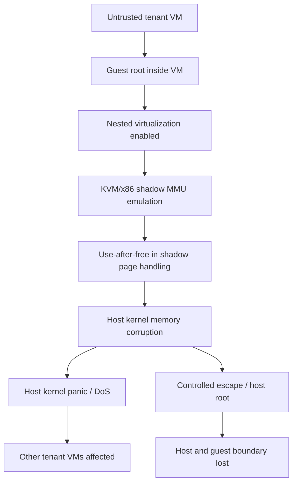

> KVM 보안의 핵심 약속은 단순하다. 게스트는 게스트에 갇힌다. Januscape는 그 약속이 하이퍼바이저 바깥 코드가 아니라 리눅스 커널 안의 KVM/x86 MMU 경로에서 깨질 수 있음을 보여준다.

Kubernetes와 클라우드 인프라에서 가상머신은 낡은 기술이 아니다. 컨테이너 워커 노드, CI 하네스, 보안 샌드박스, 멀티테넌트 빌드 환경, AI 에이전트 실행 격리까지 VM 위에 다시 VM을 얹는 구조가 흔해졌다. Januscape(CVE-2026-53359)가 불편한 이유는 여기에 있다. 이 취약점은 QEMU 장치 에뮬레이션 문제가 아니라 KVM/x86의 커널 내부 경로 문제다. 격리의 가장 낮은 층이 흔들리면 그 위에 쌓은 정책은 한꺼번에 방어선을 잃는다.

## KVM escape가 Kubernetes 보안 이슈가 되는 순간

Januscape는 KVM/x86의 shadow MMU emulation에서 발생한 use-after-free 취약점으로 설명된다. 게스트 내부 동작만으로 호스트 커널의 shadow page를 손상시키고, 조건이 맞으면 게스트에서 호스트로 탈출한다. 공개 문서 기준으로 Intel과 AMD 양쪽에서 트리거되는 guest-to-host exploit 연구라는 점도 범위를 넓힌다.

중요한 지점은 새 취약점이 하나 더 나왔다는 사실이 아니다. 이 버그가 영향을 주는 전제가 현실적인 운영 모델과 맞닿아 있다는 점이다.

멀티테넌트 x86 KVM 호스트가 있다. 사용자는 자기 VM 안에서 root를 가진다. 플랫폼은 nested virtualization을 열어 둔다. 이 조합은 퍼블릭 클라우드, CI 실행기, 테스트 자동화 하네스, 보안 연구용 샌드박스에서 낯설지 않다. Januscape 문서는 이런 환경에서 단일 게스트가 호스트 커널 패닉을 유발해 같은 물리 머신의 다른 테넌트 VM까지 중단시킬 수 있고, 통제된 환경에서는 호스트 root 권한 실행까지 가능하다고 설명한다.

Kubernetes 관점에서는 VM 기반 격리를 선택한 워크로드가 다시 질문대에 오른다. Kata Containers, KubeVirt, Firecracker류 접근의 공통 목표는 컨테이너보다 강한 격리다. 그런데 KVM escape가 성립하는 조건에서는 강한 격리의 근거가 커널 패치 수준과 nested virtualization 노출 정책으로 좁혀진다.

컨테이너가 위험해서 VM을 선택했는데, 플랫폼 설정이 VM을 다시 위험하게 만드는 구조가 된다.

## Januscape의 쟁점은 QEMU가 아니라 in-kernel KVM이다

가상화 escape 이슈를 볼 때 흔한 반응은 장치 에뮬레이션을 줄이면 된다는 것이다. 과거의 많은 VM escape는 QEMU 장치 모델, virtio 처리, emulated device 경로에서 나왔다. Januscape에는 그 판단을 그대로 적용하기 어렵다. 취약점 위치가 in-kernel KVM이기 때문이다.

QEMU를 바꾸거나 사용자 공간 에뮬레이션을 줄이는 설계만으로는 충분하지 않다. 자체 가상화 스택을 쓰는 대형 클라우드도 KVM 커널 경로를 공유한다면 영향을 검토해야 한다. 문서가 AWS, GCP 같은 멀티테넌트 x86 public cloud를 언급하는 이유도 여기에 있다. 브랜드가 핵심이 아니라 공통 기반이 핵심이다.

취약 버전 범위도 운영팀 입장에서는 넓다. Januscape 문서는 2010-08-01의 커밋 `2032a93d66fa`부터 2026-06-16의 `81ccda30b4e8` 패치 전까지를 영향 범위로 제시한다. 약 16년에 걸친 코드 경로가 문제였다는 말은 두 가지를 뜻한다.

첫째, 오래된 코드라고 안전한 것은 아니다. 둘째, 하이퍼바이저 취약점 대응은 배포판 버전 문자열만 보는 일로 끝나지 않는다. 실제 호스트 커널에 해당 패치가 들어갔는지 확인해야 한다.

Januscape가 Google kvmCTF에서 0-day exploit로 사용됐다는 점도 가볍지 않다. kvmCTF는 KVM 취약점 연구를 대상으로 하는 환경이고, 이 취약점은 그 안에서 실전 exploit 가능성을 보였다. 공개된 PoC는 호스트 커널 패닉 유발까지이며, full escape exploit은 공개되지 않았다. 이 제한은 방어 측에 시간을 주지만, 위험을 낮추지는 않는다. DoS만으로도 멀티테넌트 호스트에서는 장애 범위가 물리 머신 전체로 번진다.

## nested virtualization은 기능이 아니라 공격면이다

Januscape 조건에서 자주 놓치는 단어가 nested virtualization이다. 개발자에게는 편리한 기능이다. VM 안에서 다시 KVM을 쓰면 로컬과 비슷한 테스트 환경을 만들 수 있고, CI 안에서 하이퍼바이저 관련 테스트도 돌릴 수 있다. 보안 샌드박스나 에이전트 실행 환경에서도 격리 계층을 더 쌓는 선택지가 된다.

운영자에게는 다른 의미다. nested virtualization은 게스트가 KVM의 더 깊은 상태를 건드릴 수 있게 만드는 공격면이다. Januscape 문서는 KVM이 raw VMX/SVM state를 들고 있다는 점을 전제로 PoC를 설명한다. Intel VMX와 AMD SVM 양쪽에서 동작한다는 설명은 이 문제가 단일 벤더 특수 사례로 좁혀지지 않음을 뜻한다.

아키텍처로 보면 위험은 이렇게 흐른다.

이 그림에서 방어 지점은 애플리케이션 레이어가 아니다. admission controller, 네트워크 정책, 서비스 메시, 이미지 스캐너는 이 경로의 앞을 막지 못한다. 방어는 호스트 커널 패치, nested virtualization 정책, 테넌트 신뢰 등급 분리, 노드 풀 격리에서 시작한다.

Kubernetes 위에서 VM 워크로드를 운영한다면 더 직접적이다. KubeVirt처럼 VM을 파드처럼 다루는 플랫폼은 스케줄링과 운영 경험을 Kubernetes에 붙인다. 하지만 실제 격리 책임은 여전히 노드의 KVM에 남는다. VM CRD가 깔끔해도 `/dev/kvm`을 제공하는 순간 워크로드는 커널 가상화 경로와 연결된다.

테스트 자동화 하네스도 같은 문제를 가진다. 브라우저 테스트, 커널 테스트, Android 에뮬레이터, 보안 분석, AI 에이전트 샌드박스가 nested virtualization을 요구할 수 있다. 편의상 모든 러너에 nested virtualization을 켜는 설계는 이제 기본값으로 두기 어렵다. 신뢰할 수 없는 코드가 올라오는 러너와 내부 전용 러너를 같은 KVM 정책으로 묶으면 장애 격리가 사라진다.

## 패치 확인보다 먼저 노출 범위를 줄여야 한다

Januscape 대응의 1순위는 호스트 커널에 `81ccda30b4e8` 패치가 들어갔는지 확인하는 것이다. 하지만 실무에서는 패치 여부 확인만으로 대응이 끝나지 않는다. 패치를 배포하는 동안에도 공격면은 열려 있고, 모든 호스트가 같은 속도로 교체되지 않는다.

먼저 분리해야 한다.

- untrusted tenant VM을 받는 x86 KVM 호스트
- nested virtualization을 허용하는 호스트
- CI나 테스트 자동화에서 외부 코드를 실행하는 러너
- `/dev/kvm`이 컨테이너나 사용자에게 노출되는 노드
- RHEL처럼 `/dev/kvm` 권한이 0666인 배포판 계열 호스트

마지막 항목은 별도 의미가 있다. Januscape 문서는 RHEL 같은 배포판에서 `/dev/kvm`이 world-writable인 경우, 비특권 사용자가 로컬 권한 상승(Local Privilege Escalation, LPE)으로 root를 얻는 경로도 가능하다고 설명한다. VM escape와 LPE는 공격자가 서 있는 위치가 다르다. 하지만 둘 다 `/dev/kvm` 접근과 커널 KVM 경로를 신뢰한다는 공통점을 가진다.

운영 정책은 세 줄로 바뀐다.

nested virtualization은 기본 허용이 아니라 예외 허용이어야 한다. `/dev/kvm` 노출은 워크로드 요구사항이 확인된 노드 풀로 제한해야 한다. 멀티테넌트와 내부 전용 실행기는 같은 호스트 클래스를 공유하면 안 된다.

클라우드 사용자 입장에서도 할 일이 있다. 퍼블릭 클라우드의 호스트 커널 패치는 사용자가 직접 확인하기 어렵다. 사용자는 제공자의 보안 공지와 인스턴스 타입 조건을 확인해야 한다. nested virtualization을 쓰는 인스턴스, 베어메탈에 가까운 인스턴스, 자체 하이퍼바이저 테스트를 돌리는 환경은 더 좁게 추적해야 한다. 관리형 Kubernetes를 쓰더라도 노드가 VM인지, 워크로드가 `/dev/kvm`을 요구하는지, privileged 컨테이너가 있는지 확인해야 한다.

보안팀의 질문도 달라져야 한다. VM을 쓰는가가 아니라, 누가 KVM을 호출할 수 있는가를 물어야 한다.

## arm64로 피하는 선택은 대안이지 면책이 아니다

Januscape 자체는 Intel과 AMD 아키텍처에서 트리거되는 취약점으로 설명된다. arm64 기반 KVM 호스트는 이 취약점의 직접 영향 대상이 아니다. 워크로드를 arm64로 옮기면 특정 위험을 줄일 수 있다. 특히 신뢰할 수 없는 코드를 실행하는 CI 러너나 샌드박스 워크로드는 아키텍처 분리가 실질적인 완화책이 된다.

그렇다고 arm64가 하이퍼바이저 보안의 최종 답은 아니다. Januscape 문서도 이전에 공개된 ITScape(CVE-2026-46316)를 패치하지 않은 arm64 호스트는 여전히 취약하다고 짚는다. 아키텍처 전환은 특정 CVE를 피하는 방법이지, 가상화 계층을 패치하지 않아도 되는 권한을 주지 않는다.

대안은 세 갈래로 나뉜다.

첫째, nested virtualization을 끄고 필요한 테스트만 별도 격리된 호스트에서 돌린다. 운영 복잡도는 낮지만 일부 개발 워크플로가 깨진다. 커널, 하이퍼바이저, Android 에뮬레이터, 인프라 테스트를 많이 돌리는 조직에는 비용이 생긴다.

둘째, 신뢰 등급별 노드 풀을 나눈다. 외부 PR, 플러그인, AI 에이전트 코드, 고객 워크로드는 untrusted 풀에 넣고 내부 빌드와 운영 시스템은 다른 풀에서 실행한다. 비용은 더 들지만 장애와 침해 범위를 줄인다.

셋째, 일부 워크로드를 arm64나 다른 격리 기술로 옮긴다. 성능, 이미지 호환성, 라이브러리 지원, 관측성 도구 호환성을 다시 검증해야 한다. 보안 위험을 낮추는 대신 운영 마찰을 감수하는 선택이다.

핵심은 같다. 하이퍼바이저를 단일 방어선으로 취급하지 말아야 한다. KVM은 강한 격리 계층이지만, 패치되지 않은 KVM은 공용 커널 공격면이다.

## 도입 조건은 성능이 아니라 실패 범위로 정해야 한다

Januscape를 보고 VM 기반 격리를 버리자는 결론은 성급하다. 컨테이너보다 VM이 나은 워크로드는 여전히 있다. 고객 코드 실행, 브라우저 자동화, 커널 테스트, 보안 분석, AI 에이전트 샌드박스처럼 프로세스 격리만으로 부족한 영역에서는 VM이 현실적인 선택이다.

다만 도입 기준은 바뀌어야 한다. 예전 질문은 VM을 쓰면 충분히 안전한가였다. 지금 질문은 VM이 깨졌을 때 어디까지 같이 깨지는가다.

실무 체크리스트는 길 필요가 없다. 아래 항목에 답하지 못하면 nested virtualization을 기본 기능으로 열면 안 된다.

- 호스트 커널에 CVE-2026-53359 패치가 적용됐는가
- untrusted guest와 trusted guest가 같은 물리 호스트를 공유하는가
- nested virtualization이 필요한 워크로드와 아닌 워크로드가 분리됐는가
- `/dev/kvm` 접근 권한을 누가 갖는지 감사할 수 있는가
- 호스트 커널 패닉 시 같은 머신의 다른 테넌트 영향 범위를 추적할 수 있는가
- CI 러너와 AI 에이전트 샌드박스가 외부 입력 코드를 어떤 권한으로 실행하는가
- 취약점 대응 중 노드 드레인, 재부팅, 커널 교체를 수행할 운영 창구가 있는가

관측성도 커널 경로를 포함해야 한다. 애플리케이션 로그만으로는 KVM escape의 전조를 보기 어렵다. 호스트 커널 oops, KVM 관련 trace, qemu-kvm 프로세스 상태, 노드 재부팅 이벤트, 동일 물리 호스트의 다중 VM 장애 상관관계를 봐야 한다. Kubernetes 이벤트와 클라우드 인스턴스 장애 로그를 따로 보면 원인을 놓친다. 둘을 같은 타임라인에 올려야 한다.

Januscape가 던진 질문은 취약점 하나의 위험도를 넘는다. 격리를 제품 기능으로 팔거나 내부 플랫폼 기능으로 제공한다면, 그 격리의 패치 책임과 실패 범위를 함께 설계해야 한다. VM은 보안 경계가 맞다. 하지만 보안 경계는 선언으로 유지되지 않는다. 커널 패치, 권한 모델, 노드 분리, 운영 절차가 같이 있어야 경계가 된다.

첫 문장의 약속으로 돌아가자. 게스트는 게스트에 갇혀야 한다. Januscape 이후의 실무 판단은 이 문장을 믿을지 말지가 아니다. 이 문장이 깨졌을 때도 플랫폼 전체가 같이 무너지지 않게 설계했는지를 확인하는 일이다.

## 참고 자료

- [선정 글감] [Januscape: Guest-to-Host Escape in KVM/x86](https://github.com/V4bel/Januscape) - Lobsters