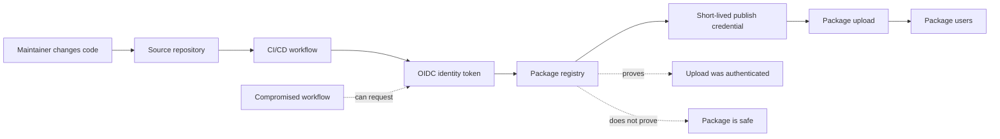

Trusted Publishing과 OIDC를 둘러싼 공급망 보안 논쟁의 핵심은 이 기능을 믿어도 되는지가 아니다. 이 기능이 무엇을 증명하고, 무엇을 증명하지 않는지 구분하는 일이다.

패키지 페이지에 초록 체크가 하나 더 생기면 사람은 안전 신호로 받아들인다. PyPI가 Trusted Publishing 상태를 눈에 띄게 보여주지 않는 이유도 여기에 있다. 기계가 검증해야 할 인증 결과를 사람에게 품질 보증처럼 보여주는 순간, 공급망 보안은 오히려 나빠진다.

## Trusted Publishing은 안전한 패키지를 고르는 기능이 아니다

Trusted Publishing은 PyPI가 2023년에 도입한 OIDC(OpenID Connect) 기반 게시 인증 방식이다. npm, RubyGems, crates.io, NuGet 같은 다른 패키지 생태계도 비슷한 방향을 받아들였다. 출발점은 단순하다. 레지스트리 API 토큰 같은 장기 자격 증명은 유출되기 쉽고, 실제 필요한 범위보다 넓게 발급되기 쉽다.

새 방식은 CI/CD 플랫폼의 기계 신원(machine identity)을 패키지 레지스트리에 미리 등록해 둔다. 배포 시점에 GitHub Actions 같은 CI가 OIDC ID 토큰을 제시하면, 레지스트리는 그 토큰의 클레임을 검증한 뒤 짧게 살아 있는 게시용 자격 증명을 발급한다. 사람이 토큰을 복사해 시크릿 저장소에 넣는 과정이 빠진다.

이건 분명한 개선이다. 토큰 수명이 짧고, 권한 범위가 업로드 대상에 맞춰지며, 배포 권한이 개인 관리자의 노트북보다 소스 저장소와 워크플로에 묶인다.

다만 의미는 여기까지다.

Trusted Publishing이 증명하는 것은 이 업로드가 등록된 기계 신원을 통해 인증됐다는 사실뿐이다. 그 패키지가 악성 코드가 아니라는 뜻도 아니고, 유지보수가 잘 된다는 뜻도 아니고, 취약점이 없다는 뜻도 아니다. PyPI는 누구나 패키지를 올릴 수 있는 공개 인덱스다. 누구나 Trusted Publisher를 등록할 수 있다면, 악성 패키지도 Trusted Publisher를 통해 올라갈 수 있다.

신뢰라는 단어가 사람을 속인다. 여기서 trust는 사용자 신뢰가 아니라, 레지스트리와 CI 워크플로 사이의 인증 관계다.

## OIDC가 해결하는 문제와 남기는 문제

OIDC 연동의 장점은 명확하다. 배포 파이프라인에서 장기 토큰을 줄인다. GitHub Actions 워크플로, 저장소, 환경 이름, 대상 audience 같은 클레임을 검증해 이 실행이 등록된 게시 주체인지 판단한다. PyPI의 예시에서는 GitHub 저장소와 워크플로 파일, 환경 이름이 기계 신원의 일부가 된다.

대신 복잡도는 다른 곳으로 이동한다. OIDC 제공자마다 클레임 모양이 다르다. 표준 클레임은 일부만 공통이고, 나머지는 IdP(Identity Provider)가 자기 방식으로 채운다. 그래서 레지스트리는 GitHub Actions, GitLab CI, Google Cloud 같은 제공자를 같은 함수 하나로 처리하기 어렵다. PyPI가 새 Trusted Publishing 제공자를 천천히 추가하는 이유도 여기에 있다.

더 큰 운영 리스크는 CI/CD 탈취다. 공격자가 워크플로 실행 권한을 얻으면 OIDC ID 토큰이나 교환된 짧은 수명의 게시 자격 증명을 빼낼 수 있다. 장기 토큰 유출보다 피해 범위와 시간이 줄어드는 것은 맞다. 그래도 업로드 시점의 인증 흐름 자체는 공격면이다.

특히 pull_request_target 같은 트리거는 위험하다. 외부 기여자의 코드와 높은 권한의 워크플로 컨텍스트가 만나는 지점이기 때문이다. PyPI가 쉽게 악용되는 트리거에 대해 토큰 교환을 거부하는 식으로 완화책을 둔 것도, Trusted Publishing이 만능 방패가 아니라는 증거다.

이 다이어그램에서 봐야 할 선은 두 개다. 레지스트리는 업로드 인증을 증명한다. 사용자가 원하는 패키지 안전성은 증명하지 않는다.

## Sign in with Google의 auth_time과 amr이 같은 교훈을 준다

Google이 Sign in with Google에 auth_time과 amr(Authentication Methods Reference) 클레임을 추가한 것도 같은 흐름 위에 있다. 둘 다 OIDC 표준 클레임이다. auth_time은 사용자가 Google 계정에 언제 인증했는지 알려주고, amr은 어떤 인증 방식이 쓰였는지 알려준다. 예를 들어 MFA나 하드웨어 키 같은 신호를 백엔드가 확인할 수 있다.

실무 가치는 분명하다. 민감한 작업 전에 최근 로그인인지 확인하고, 충분한 인증 강도가 없으면 스텝업 인증(step-up authentication)을 요구할 수 있다. 계정 탈취와 사기 방어에 쓸 수 있는 신호가 늘어난다.

이것도 사용자 신뢰 점수는 아니다. auth_time이 최근이라고 해서 사용자가 선량하다는 뜻은 아니다. amr에 강한 인증 방식이 찍혔다고 해서 요청의 비즈니스 의도가 안전하다는 뜻도 아니다. 이 클레임은 의사결정 입력값이다. 최종 판단은 애플리케이션의 정책, 세션 상태, 행위 패턴, 권한 모델과 함께 내려야 한다.

Trusted Publishing과 Sign in with Google은 기계가 읽을 수 있는 신뢰 신호를 늘린다는 점에서 닮았다. 적용 경계는 다르다. 하나는 패키지 업로드 경계에서 CI의 신원을 검증한다. 다른 하나는 사용자 로그인 경계에서 인증 시점과 방식을 전달한다. 둘 다 경계를 넘어서 품질, 선의, 안전을 보장하지 않는다.

## 보안 대시보드는 초록 체크를 늘리는 도구가 아니어야 한다

Vercel Security Dashboard가 겨냥하는 문제도 같은 계열이다. 팀과 프로젝트가 늘고, 코딩 에이전트가 새 프로젝트를 쉽게 만들수록 작은 오설정이 쌓인다. 2FA를 쓰지 않는 팀원, 공개된 프리뷰 환경, 짧은 수명 자격 증명으로 대체할 수 있는데 남아 있는 장기 credential이 대표적이다.

이런 대시보드는 필요하다. 사람이 모든 프로젝트의 보안 상태를 수동으로 훑는 방식은 곧 무너진다. 특히 에이전트가 저장소와 배포 환경을 빠르게 만들기 시작하면, 중앙에서 계정과 프로젝트의 보안 자세를 모아 보는 화면이 없을 때 누락이 기본값이 된다.

다만 대시보드도 신뢰 배지가 되면 실패한다. 안전함을 선언하는 화면이 아니라, 고쳐야 할 경계를 찾는 화면이어야 한다. 2FA 미설정은 계정 경계의 결함이다. 공개 프리뷰는 접근 제어 경계의 결함이다. 장기 credential은 비밀 관리 경계의 결함이다. 각 항목은 위험의 종류와 조치가 달라야 한다.

실무에서 필요한 것은 보안 점수 93점이 아니다. 어느 경계가 열려 있고, 그 경계가 어떤 자산에 닿아 있으며, 오늘 닫을 수 있는 조치가 무엇인지다.

## 도입 전에 봐야 할 Kubernetes·인프라식 체크리스트

Trusted Publishing을 도입할 때는 패키지 레지스트리 설정만 보면 부족하다. CI/CD는 이미 작은 인프라 플랫폼이다. Kubernetes 클러스터에서 서비스 어카운트, RBAC, admission policy를 함께 보듯이, 게시 파이프라인도 신원, 권한, 트리거, 감사 로그를 함께 봐야 한다.

먼저 워크플로 트리거를 줄여야 한다. 릴리스 업로드 권한이 있는 작업은 push, tag, protected environment처럼 통제 가능한 이벤트에 묶어야 한다. 외부 PR 코드가 높은 권한의 토큰 교환 경로에 닿으면 설계가 잘못된 것이다.

둘째, OIDC 클레임을 좁게 매칭해야 한다. 저장소만 확인하는 규칙은 약하다. 워크플로 파일, 브랜치 또는 태그 패턴, environment, audience를 함께 제한해야 한다. 가능한 경우 게시 전용 environment에 승인 규칙을 둔다.

셋째, 장기 토큰 제거가 완료 조건이어야 한다. Trusted Publishing을 추가하고 기존 API 토큰을 그대로 남기면 공격면이 줄지 않는다. 새 인증 경로가 생겼을 뿐이다. 레지스트리 토큰, CI 시크릿, 조직 단위 배포 키를 실제로 폐기해야 이점이 생긴다.

넷째, attestations와 혼동하지 않아야 한다. PyPI 글감은 이 점을 분명히 나눈다. Attestation은 기계 신원 위에 얹힌 서명에 가깝지만, 그 존재만으로 최종 사용자 신뢰를 만들지 않는다. 어떤 신원을 신뢰할지 별도로 정하지 않으면 서명도 그냥 데이터다.

다섯째, 실패 로그를 남겨야 한다. 토큰 교환 거부, 클레임 불일치, 릴리스 업로드 실패는 조용히 재시도만 할 일이 아니다. 보안 정책이 잘 작동하는지 확인할 수 있는 관측성(observability) 이벤트다. 대시보드와 알림은 성공한 배포보다 거부된 배포를 더 잘 설명해야 한다.

## 패키지 공급망 보안의 기준은 신뢰가 아니라 범위다

이 논쟁의 답은 Trusted Publishing을 믿자는 쪽도, 믿지 말자는 쪽도 아니다. 이 기능을 사용자 신뢰 신호로 쓰지 말자는 쪽이 맞다. 인증 기술은 인증 경계 안에서만 평가해야 한다.

도입 판단은 간단하다. CI/CD에서 패키지를 배포하고 있고, 장기 레지스트리 토큰을 시크릿으로 보관하고 있다면 Trusted Publishing은 기본 선택지다. 권한 범위와 수명을 줄이는 개선이기 때문이다. 반대로 이 기능을 붙인 뒤 패키지 목록에 신뢰 배지를 달거나, 내부 승인 절차를 생략하거나, 의존성 검토를 줄인다면 잘못 쓰는 것이다.

공급망 보안은 더 많은 초록 체크를 모으는 일이 아니다. 각 체크가 어느 경계에서 어떤 사실을 증명하는지 끝까지 좁히는 일이다. Trusted Publishing은 업로드 자격 증명을 짧고 좁게 만든다. 그 이상을 기대하면 보안 기능이 아니라 착시가 된다.

## 참고 자료

- [선정 글감] [You shouldn't trust Trusted Publishing](https://blog.yossarian.net/2026/07/07/You-shouldnt-trust-trusted-publishing) - Lobsters
- [관련] [Enhance Security and Trust: New Session Metadata in Sign in with Google](https://developers.googleblog.com/enhance-security-and-trust-new-session-metadata-in-sign-in-with-google/) - Google Developers
- [관련] [Vercel Security Dashboard is in private beta](https://vercel.com/changelog/vercel-security-dashboard-is-in-private-beta) - Vercel Blog