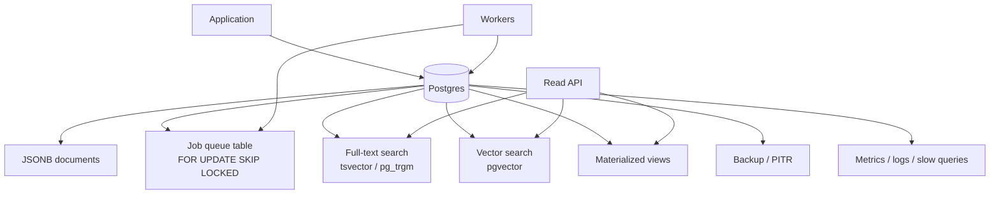

> Postgres 하나로 Redis, Elasticsearch, Kafka까지 대신할 수 있다는 말은 절반만 맞다.  
> 맞는 절반은 운영 복잡도를 줄이라는 경고다. 틀린 절반은 데이터베이스를 만능 런타임처럼 쓰면 된다는 착각이다.

Postgres, 데이터베이스 아키텍처, Redis 대체, 검색, 큐, 벡터 검색을 한 문장에 넣으면 논쟁이 바로 붙는다. 이미 Postgres에 JSONB, `SKIP LOCKED`, full-text search, `pgvector`, PostGIS가 있는데 왜 저장소를 일곱 개나 굴리냐는 쪽이 있다. 캐시와 검색 엔진과 메시지 브로커는 실패 방식부터 다르니 한 통에 넣으면 장애 반경만 커진다는 반박도 나온다.

실무에서의 답은 비교적 분명하다.

초기 시스템은 Postgres를 더 오래 써야 한다. 대신 Postgres 안에서 무엇을 맡길지, 무엇을 절대 맡기지 않을지 경계선을 먼저 그어야 한다.

## Postgres Is Enough가 맞는 지점: 데이터베이스가 아니라 운영 표면적 이야기다

Postgres Is Enough의 핵심은 Postgres 찬양이 아니다. 운영 표면적을 줄이라는 주장이다.

작은 제품이 캐시용 Redis, 검색용 Elasticsearch, 큐용 RabbitMQ나 Sidekiq, 문서 저장용 MongoDB, 이벤트용 Kafka를 붙이는 순간 시스템은 빨라지기 전에 먼저 깨지기 쉬워진다. 각 저장소는 배포, 백업, 권한, 모니터링, 장애 조치, 버전 업그레이드, 데이터 정합성 확인을 따로 요구한다.

Postgres 하나만 남긴다고 모든 문제가 사라지지는 않는다. 그래도 문제의 종류는 줄어든다. 백업은 하나의 체계로 묶이고, 장애 분석은 하나의 로그와 메트릭 축으로 모인다. 트랜잭션 경계도 명확해진다. 초기 SaaS, 내부 도구, B2B 워크플로, 콘텐츠 관리, 일반적인 CRUD 기반 서비스에서는 이 차이가 크다.

Postgres가 이미 제공하는 선택지는 넓다.

- 캐시성 데이터: UNLOGGED table, materialized view
- 작업 큐: `FOR UPDATE SKIP LOCKED`, pgmq, pgflow
- 검색: `tsvector`, `pg_trgm`, ParadeDB
- 문서 모델: JSONB, FerretDB
- 벡터 검색: pgvector, pgvectorscale
- 시계열: TimescaleDB, pg_partman
- 지리 정보: PostGIS
- 그래프 탐색: recursive CTE, Apache AGE

이 목록은 하나의 결론으로 이어진다. 새 저장소를 붙이기 전에 Postgres의 기본 기능과 검증된 확장을 먼저 확인해야 한다. 새 인프라는 기능 추가가 아니라 운영 계약 추가다.

## Redis와 Elasticsearch를 안 붙이는 선택이 항상 절약은 아니다

Postgres 중심 설계는 비용을 줄인다. 비용을 없애지는 않는다. Redis를 빼면 캐시 무효화 문제는 줄어들 수 있지만, 읽기 부하는 Postgres로 돌아온다. Elasticsearch를 빼면 색인 파이프라인은 단순해질 수 있지만, 랭킹 품질과 복잡한 검색 분석은 애플리케이션과 Postgres 확장 조합이 떠안는다.

큐도 같은 문제를 만난다. `SKIP LOCKED` 기반 작업 큐는 간단하고 강력하다. 작업 테이블을 만들고, 워커가 잠기지 않은 행을 가져가고, 완료 상태를 갱신하면 된다. 트랜잭션 안에서 업무 데이터와 작업 예약을 함께 처리할 수 있다는 장점도 있다.

하지만 이 방식은 범용 메시지 브로커가 아니다. 처리량, 팬아웃, 소비자 그룹, 재처리 정책, 장기 이벤트 로그가 중요해지면 Kafka나 전용 큐가 맞다. Postgres 큐는 작업 처리에 좋다. 이벤트 플랫폼에는 한계가 분명하다.

검색도 선을 그어야 한다. 관리 화면의 문자열 검색, 태그 검색, 간단한 유사도 검색은 Postgres로 충분하다. 반면 대규모 문서 검색, 복잡한 랭킹 실험, 형태소 분석 체계, 다국어 검색 품질, 검색 로그 기반 튜닝이 제품 경쟁력이라면 전용 검색 엔진을 검토해야 한다.

Postgres를 먼저 쓰라는 말은 전문 도구를 금지하라는 뜻이 아니다. 전문 도구가 필요한 순간을 더 늦게, 더 명확한 근거로 맞으라는 뜻이다.

## Linux 7.0 벤치마크 논란이 보여준 것: Postgres 성능은 헤드라인보다 조건을 탄다

Postgres를 오래 쓰려면 성능 논쟁을 읽는 법도 달라져야 한다. PREEMPT_NONE Is Dead; Your Postgres Probably Doesn’t Care는 그 지점을 잘 보여준다.

AWS 벤치마크에서 Linux 7.0의 PostgreSQL 처리량이 Linux 6.x 대비 0.51배로 떨어졌다는 결과가 나왔다. 숫자만 보면 커널 업그레이드를 멈춰야 할 것처럼 보인다. 글의 판단은 다르다. 회귀는 실제지만, 96 vCPU와 100GB 이상 shared memory를 쓰는 특정 벤치마크 구성에서 드러난 좁은 현상이라는 것이다.

핵심은 Linux 7.0이 PREEMPT_NONE을 제거하고 preemption 모델을 바꾼 데 있다. 예전의 PREEMPT_NONE은 서버 처리량에 유리한 방식으로 사용자 스레드를 덜 끊었다. 더 적극적인 preemption은 지연 시간을 낮추는 대신 context switch 비용을 늘릴 수 있다. PostgreSQL처럼 shared buffer, TLB, page fault, buffer manager의 spinlock이 얽히는 워크로드에서는 이 차이가 특정 조건에서 크게 보인다.

실무자가 여기서 가져갈 판단은 커널 버전을 무서워하라는 말이 아니다. Postgres 성능 문제는 대개 하나의 원인으로 설명되지 않는다는 점이다. shared buffers를 크게 잡고 huge pages를 제대로 쓰지 않으면 TLB 압박과 page fault 비용이 커질 수 있다. 그러면 커널 preemption 변화 같은 외부 요인이 증폭되어 보인다.

Postgres Is Enough는 운영 표면적을 줄이라는 이야기다. PREEMPT_NONE 논쟁은 줄인 표면적 안에서도 커널, 메모리, 락, 페이지 크기 같은 낮은 층을 봐야 한다는 경고다.

두 주장은 충돌하지 않는다. 하나는 저장소를 덜 늘리라는 말이고, 다른 하나는 남긴 저장소를 제대로 운영하라는 말이다.

## Postgres 중심 아키텍처는 어떻게 장애 반경을 줄이고 키우는가

Postgres 하나로 시작하면 데이터 흐름은 단순해진다. 애플리케이션은 하나의 영속 저장소에 쓰고, 같은 트랜잭션 안에서 검색 색인용 컬럼이나 작업 큐 행을 함께 만든다. 별도 브로커나 색인 저장소가 없으니 이중 쓰기 문제가 줄어든다.

이 구조의 강점은 장애 분석이다. 작업이 누락됐는지, 검색 대상 데이터가 언제 갱신됐는지, 특정 사용자 요청이 어떤 트랜잭션에서 실패했는지 한 저장소 안에서 추적할 수 있다. 운영팀이 작거나 제품이 자주 바뀌는 단계에서는 이 단순함이 성능 최적화보다 값지다.

약점도 같은 곳에서 나온다. 모든 것이 Postgres에 모이면 Postgres 장애가 곧 전체 기능 장애가 된다. 캐시, 큐, 검색, 벡터 조회가 모두 같은 CPU, 같은 I/O, 같은 connection pool을 두고 경쟁한다. 잘못 만든 리포트 쿼리 하나가 작업 큐 처리 지연을 만들 수 있고, 과한 벡터 검색이 일반 API 응답 시간을 흔들 수 있다.

그래서 Postgres 중심 설계의 핵심은 넣는 것이 아니라 격리하는 것이다.

읽기 전용 복제본을 둘 수 있는가. 작업 큐용 connection pool을 API와 분리할 수 있는가. 장기 실행 쿼리에 statement timeout을 걸었는가. autovacuum이 큐 테이블의 churn을 따라갈 수 있는가. 확장을 붙였을 때 백업, 복구, 업그레이드 절차가 그대로 유지되는가. 이 질문에 답하지 못하면 단순한 구조가 아니라 한 덩어리 장애를 만든다.

## 언제 Postgres를 떠나야 하는가: 감이 아니라 증거가 필요하다

전문 저장소를 붙일 때는 불편함이 아니라 증거가 기준이어야 한다. 감으로 Redis를 붙이고, 관성으로 Elasticsearch를 붙이고, 이력서에 좋아 보인다는 이유로 Kafka를 붙이면 시스템은 빨리 복잡해진다.

Postgres를 떠나야 하는 신호는 더 구체적이다.

- 캐시: Postgres read replica와 materialized view로도 p95 지연 시간 목표를 못 맞춘다.
- 큐: 작업 테이블 vacuum 비용, row lock 경합, 재시도 정책이 제품 요구를 막는다.
- 검색: 랭킹 품질, 형태소 분석, 색인 갱신 지연, 검색 실험이 핵심 제품 기능이 된다.
- 벡터: 인덱스 크기, recall, latency, 재색인 비용이 일반 DB 운영과 충돌한다.
- 분석: OLTP 쿼리와 OLAP 쿼리가 같은 디스크와 메모리를 두고 싸운다.
- 이벤트: 장기 보관, replay, consumer group, 순서 보장이 비즈니스 계약이 된다.

이 조건이 오면 전문 도구를 붙이는 것이 맞다. 다만 도입 순서는 작아야 한다. 먼저 병목을 계측하고, Postgres 안에서 가능한 완화책을 적용한 뒤 별도 시스템을 붙인다. 새 시스템은 문제를 해결하는 동시에 새 장애 모드를 만든다. 그 비용을 문서로 남길 수 있을 때 도입해야 한다.

보안 경계도 빼놓을 수 없다. 저장소가 하나면 접근 제어와 감사 로그가 단순해진다. 반대로 하나의 권한 실수가 더 많은 데이터를 노출할 수 있다. JSONB에 민감정보가 섞이고, 검색 인덱스에 원문이 들어가고, 큐 payload에 토큰이 남는 순간 Postgres 하나만 보호한다는 말은 충분하지 않다. row-level security, 최소 권한 계정, 암호화, 보존 기간, 삭제 정책을 기능별로 나눠야 한다.

## Postgres 하나로 시작하되, 빠져나갈 문은 설계에 남겨라

Postgres를 기본값으로 두는 판단은 보수적이다. 새 도구를 싫어해서가 아니라 운영 복잡도가 실제 비용이기 때문이다. 초기 시스템에서 Redis, Elasticsearch, Kafka, 벡터 데이터베이스를 한꺼번에 붙이는 선택은 성능 투자가 아니라 미래 장애 티켓을 미리 발행하는 일에 가깝다.

다만 Postgres Is Enough를 교리처럼 읽으면 안 된다. Postgres는 충분할 수 있다. 모든 기능에 영원히 충분하지는 않다.

좋은 설계는 처음부터 여러 저장소를 늘어놓는 설계가 아니다. Postgres 안에서 시작하되, 큐 테이블의 스키마, 검색 색인 갱신 흐름, 벡터 임베딩 저장 방식, 분석 쿼리 경계를 분리해 둔 설계다. 그래야 나중에 Kafka나 Elasticsearch나 전용 벡터 DB를 붙일 때 애플리케이션 전체를 찢지 않는다.

첫 문장의 긴장은 여기서 풀린다. Postgres 하나로 충분하냐는 질문은 틀렸다. 더 나은 질문은 이것이다.

Postgres로 충분한 동안, 얼마나 적은 운영 표면적으로 얼마나 명확한 경계선을 만들 수 있는가. 그 답을 가진 팀은 늦게 분리해도 늦지 않다. 답이 없는 팀은 처음부터 나눠도 안전하지 않다.

## 참고 자료

- [선정 글감] [Postgres Is Enough](https://postgresisenough.dev) — Lobsters
- [관련] [PREEMPT_NONE Is Dead; Your Postgres Probably Doesn’t Care](https://thebuild.com/blog/preempt_none-is-dead-your-postgres-probably-doesnt-care/) — Lobsters