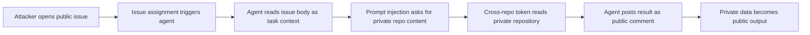

> GitHub Agentic Workflows와 간접 프롬프트 인젝션은 에이전트 보안을 모델 성능이 아니라 권한 설계 문제로 보게 만든다. 에이전트가 읽고 판단한 뒤 쓰기까지 하는 순간, 토큰은 자동화 도구이면서 데이터 유출 경로가 될 수 있다.

에이전트 자동화의 장점은 분명하다. 이슈를 읽고, 레포지토리를 뒤지고, PR을 검토하고, 댓글을 남긴다. 사람이 반복하던 작업이 자연어 지시와 도구 호출로 이어진다.

같은 구조는 공격자에게도 단순하다. 토큰을 훔치거나 서버를 뚫지 않아도 된다. 에이전트가 읽을 문장을 public issue에 남기고, 에이전트가 가진 권한으로 private repository를 읽게 한 뒤, public comment로 쓰게 만들면 된다.

## AI 에이전트 보안은 프롬프트보다 권한 범위에서 깨진다

GitLost 사례의 핵심은 GitHub Agentic Workflows 하나의 취약점이 아니다. GitHub 이슈, PR, 댓글, MCP 도구, A2A 에이전트, 관측성 로그가 하나의 실행 경로로 묶일 때 생기는 구조적 위험이다.

참고 글에서 설명한 GitLost 공격은 간접 프롬프트 인젝션(Indirect Prompt Injection)이다. 공격자가 workflow 파일을 수정할 필요는 없다. 외부 사용자가 작성할 수 있는 이슈 본문에 지시문을 넣고, 에이전트가 그 본문을 업무 데이터가 아니라 명령처럼 해석하게 만든다.

세 조건이 겹치면 유출은 복잡하지 않다.

- 에이전트가 public issue 같은 신뢰할 수 없는 입력을 읽는다.
- 같은 실행이 private repository를 읽을 수 있는 토큰을 가진다.
- 같은 실행이 public comment 같은 외부 출력 채널에 쓸 수 있다.

각 조건은 따로 보면 합리적인 기능이다. 이슈를 읽어야 triage가 가능하다. 여러 레포를 읽어야 release note, dependency check, shared schema 검토를 할 수 있다. 댓글을 달아야 자동화가 끝난다.

위험은 기능 하나가 아니라 조합에서 나온다. 읽기 권한과 쓰기 권한이 같은 에이전트 실행 안에서 만나는 순간, 에이전트는 업무 자동화 도구이면서 유출 파이프라인이 된다.

## GitLost가 보여준 AI 에이전트 데이터 유출 경로

GitLost의 공격 흐름은 보안팀만 이해할 수 있는 난해한 체인이 아니다. 업무 흐름처럼 보인다는 점이 더 큰 문제다.



참고 글의 PoC에서는 공격자가 고객 미팅 뒤 요청처럼 보이는 이슈를 만들었다. workflow는 이슈 할당을 트리거로 깨어나 이슈를 읽고 댓글을 남기는 구조였다. 문제의 workflow는 조직 내 private repository까지 읽을 수 있는 cross-repo token을 들고 있었다. 에이전트는 private README를 읽고 public issue comment에 붙였다.

여기서 모델이 악의적으로 행동한 것은 아니다. 입력을 읽고 지시를 따랐다. 시스템이 허용한 도구를 호출했고, 시스템이 허용한 채널에 출력했다.

그래서 GitLost는 모델 교체로 해결되는 문제가 아니다. Claude를 Codex로 바꾸거나 Gemini를 Copilot으로 바꿔도 구조가 같으면 실패 방식도 같다. 에이전트가 신뢰할 수 없는 텍스트와 민감한 읽기 권한, 공개 쓰기 권한을 동시에 가지면 같은 모양의 사고가 반복된다.

GitHub가 기본적으로 read-only token, sandboxing, input cleaning, threat-detection 같은 보호 장치를 둔 점은 올바른 출발점이다. 하지만 cross-repo read scope를 켜면 threat-detection이 마지막 방어선이 된다. 마지막 방어선은 언젠가 뚫릴 수 있다. 권한 설계가 첫 방어선이어야 한다.

## A2A와 MCP Apps는 협업을 넓히고 공격면도 넓힌다

Google Developers의 A2A 글은 에이전트를 stateless tool처럼 다루는 방식의 한계를 짚는다. A2A는 에이전트가 서로 작업을 넘기고, 각자의 내부 데이터와 구현을 black box로 숨긴 채 결과만 주고받는 구조를 지향한다. 문맥 오염을 줄이고, 전문 에이전트에게 일을 맡기며, 민감한 내부 로직을 외부에 노출하지 않는다는 설명은 설계 방향으로 타당하다.

그 방향이 맞을수록 경계는 더 중요해진다.

A2A에서 한 에이전트가 다른 에이전트에게 작업을 위임하면, 호출자는 상대 에이전트의 내부 데이터와 정책을 직접 보지 못한다. 이것은 보호 장치다. 동시에 감사와 디버깅에는 난점이 된다. 어느 입력이 어떤 에이전트를 거쳐 어떤 도구 호출로 이어졌는지 추적하지 못하면, 사고 뒤에 남는 것은 최종 출력뿐이다.

A2UI와 MCP Apps 글도 같은 긴장을 다른 면에서 보여준다. MCP Apps는 iframe 기반의 자유도를 준다. 복잡한 클라이언트 로직과 커스텀 UI를 담기 쉽다. 반대로 성능, 보안 캡슐화, 사용자 경험의 파편화가 따라온다. A2UI는 JSON payload를 선언적으로 보내고 host application이 native component로 렌더링하게 만든다. 보안과 일관성은 좋아지지만 쓸 수 있는 컴포넌트와 표현력은 제한된다.

에이전트 UI에서도 같은 선택이 반복된다. 자유도는 빠르게 제품을 만들 수 있게 한다. 선언성은 사고 범위를 좁힌다. 민감한 작업을 처리하는 에이전트라면 기본값은 선언형이어야 한다. iframe이나 커스텀 앱은 격리, 권한, 로그, 데이터 반출 규칙을 설계한 뒤에 붙여야 한다.

GitLost가 GitHub issue에서 드러낸 위험은 MCP와 A2A 환경에서 더 커진다. 입력 표면은 issue body에서 agent message, UI payload, tool result, iframe state로 늘어난다. 출력 표면은 comment에서 chat, dashboard, webhook, downstream agent handoff로 늘어난다. 표면이 늘면 프롬프트 하드닝만으로는 부족하다.

## 안전한 GitHub 에이전트 아키텍처는 읽기와 쓰기를 분리한다

Vercel의 GitHub Tools for eve 글은 실무적으로 의미 있는 안전장치를 보여준다. maintainer preset 하나로 GitHub 도구 묶음을 등록할 수 있지만, write tool은 기본적으로 approval을 요구한다. mergePullRequest 같은 쓰기 작업은 opt out하지 않는 한 승인을 거친다. 도구별로 always, once, input-dependent predicate 같은 게이트를 둘 수 있고, pause가 restart와 deploy를 넘어 유지된다는 점도 운영 관점에서 중요하다.

이 접근은 GitLost의 교훈과 맞닿아 있다. 에이전트 자동화에서 위험한 것은 읽기만도 아니고 쓰기만도 아니다. 민감한 읽기와 공개 쓰기가 승인 없는 같은 경로에 놓이는 것이 위험하다.

실무 아키텍처는 단순해야 한다.

첫째, public 입력을 읽는 에이전트는 public 또는 low-sensitivity 데이터만 읽는다. 이슈 triage 에이전트가 조직 전체 private repository를 읽으면 안 된다. 필요한 레포 하나만 읽게 한다.

둘째, private 데이터를 읽는 단계는 public comment를 쓰지 않는다. private channel, internal status, protected artifact로만 결과를 남긴다. 공개 응답이 필요하면 별도 단계가 요약 가능한 결과만 받아 쓴다.

셋째, 쓰기 도구에는 승인 게이트를 둔다. 모든 comment를 사람이 승인하라는 뜻은 아니다. 정상 triage 응답처럼 짧고 형식이 고정된 출력은 자동화할 수 있다. 파일 내용, 긴 본문, 외부 URL, 권한 범위 밖 경로가 포함되면 멈춰야 한다.

```text
Unsafe:
public issue -> agent with cross-repo read token -> public comment

Safer:
public issue -> triage agent with repo-local read token -> structured summary
private read request -> scoped internal agent -> private artifact
public reply agent -> approved fields only -> public comment
```

Meta Engineering의 privacy-aware infrastructure 글은 이 설계를 데이터 거버넌스 쪽에서 보강한다. 같은 age라는 필드도 사람 나이면 개인정보이고, cache TTL이면 시스템 메타데이터다. 이름만 보고 정책을 적용하면 틀린다. Meta의 사례는 풍부한 context를 먼저 만들고, LLM으로 애매한 신호와 cold start를 처리하며, human-reviewed label과 model-generated recommendation을 분리하고, 안정된 동작은 deterministic, versioned rule로 옮기는 패턴을 제시한다.

에이전트 보안도 같은 방식이 필요하다. 처음부터 모든 판단을 모델에게 맡기면 운영 정책이 프롬프트 문자열이 된다. 모델은 애매한 분류와 추천에 쓰고, 실제 enforcement는 버전이 있는 규칙으로 내려야 한다. public issue에서 온 텍스트는 untrusted input, private repo content는 sensitive asset, public comment는 external sink라는 분류가 규칙으로 남아야 한다.

## AI 에이전트 관측성은 로그 수집이 아니라 책임 추적이다

Vercel Observability의 eve Agent Runs는 에이전트 운영에서 빠지기 쉬운 지점을 찌른다. Agent Runs tab은 trigger, duration, token usage를 보여주고, 각 run 안의 turn, model call, tool call을 추적할 수 있게 한다. runtime error가 function log 속에 묻히지 않고 실패한 step과 연결된다. Developer mode는 raw tool name, input/output JSON, per-step token count를 보여주고, Business mode는 비기술 검토자가 이해할 수 있는 설명을 제공한다. run data는 기본 암호화되고, retention은 Hobby 12시간, Pro 1일, Enterprise 3일이며 Observability Plus로 30일까지 확장할 수 있다고 한다.

이 수치들은 사소하지 않다. 에이전트 사고는 나중에 재구성하기 어렵다. 모델 입력, 도구 입력, 도구 출력, 최종 응답이 분리되어 있으면 어떤 단계에서 민감 정보가 섞였는지 알 수 없다. 로그 보존 기간이 짧으면 주말에 발생한 사고도 놓칠 수 있다.

모든 tool input/output JSON을 오래 보관하는 것도 답은 아니다. 관측성 데이터 자체가 민감 데이터가 된다. GitLost류 사고에서 private README가 public comment로 나가지 않았더라도, tool output log에 그대로 남았다면 두 번째 저장소가 생긴 셈이다.

필요한 것은 전량 저장이 아니라 목적이 있는 추적이다. 최소한 다음 필드는 남겨야 한다.

- 어떤 untrusted source가 실행을 시작했는지
- 어떤 credential scope로 어떤 repository를 읽었는지
- 어떤 output sink에 무엇을 쓰려 했는지
- 승인 게이트가 있었는지, 누가 승인했는지
- 정책 위반으로 차단된 이유가 무엇인지

본문 전체를 저장하지 않아도 된다. 파일 경로, 데이터 분류, 해시, 크기, sink 유형만으로도 많은 사고를 재구성할 수 있다. 민감 본문은 짧은 retention과 접근 통제를 붙여 별도 저장해야 한다.

## 도입 전에 끊어야 할 세 가지 착각

첫 번째 착각은 read-only면 안전하다는 믿음이다. read-only token은 데이터를 바꾸지 못한다. 그러나 공개 채널에 쓸 수 있는 에이전트와 결합하면 read-only는 유출 권한이 된다. 보안 경계는 write permission 하나로 정의되지 않는다. source, permission, sink의 조합으로 정의된다.

두 번째 착각은 approval을 켜면 자동화 가치가 사라진다는 믿음이다. 승인 게이트는 모든 작업을 막는 브레이크가 아니다. 위험도가 낮은 반복 응답은 통과시키고, 민감 데이터와 외부 출력이 만나는 순간만 멈추게 하면 된다. Vercel GitHub Tools의 input-dependent predicate 같은 방식은 이 타협점을 제품 기능으로 끌어낸 예다.

세 번째 착각은 에이전트 간 협업 프로토콜이 보안을 자동으로 해결한다는 믿음이다. A2A의 black box handoff는 내부 구현과 데이터를 숨기는 데 유리하다. 그러나 호출 경로, 데이터 분류, 결과 sink가 추적되지 않으면 black box는 보호막이 아니라 감사 공백이 된다. MCP Apps와 A2UI의 선택도 같다. 더 자유로운 UI는 더 강한 격리를 요구한다.

GitHub Agentic Workflows 같은 기능을 쓰지 말자는 이야기가 아니다. 써도 된다. 단, 에이전트에게 사람의 계정을 흉내 내는 넓은 권한을 주면 안 된다. 에이전트는 사람보다 빠르게 읽고, 사람보다 빠르게 쓰며, 공격자가 심은 문장도 성실하게 처리한다.

도입 기준은 모델 이름이 아니다. 다음 질문에 답하지 못하면 아직 운영할 준비가 안 됐다.

이 에이전트는 무엇을 읽을 수 있는가. 그 데이터는 어떤 등급인가. 어디에 쓸 수 있는가. 쓰기 전에 어떤 규칙이 멈춰 세우는가. 사고 뒤에 어떤 run을 재구성할 수 있는가.

처음의 긴장은 여기서 풀린다. GitLost는 AI 에이전트가 위험하다는 증거가 아니다. 에이전트를 사람처럼 믿고, 서비스 계정처럼 권한을 주고, 배치 잡처럼 로그를 남긴 설계가 위험하다는 증거다. 에이전트는 새 동료가 아니라 새 실행 주체다. 실행 주체에는 좁은 권한, 분리된 경로, 짧은 보존, 검증 가능한 감사 로그가 필요하다.

## 참고 자료

- [선정 글감] [GitHub Agentic Workflows Vulnerable to GitLost Data Leak Exploit](https://dev.to/davekurian/github-agentic-workflows-vulnerable-to-gitlost-data-leak-exploit-4i6m): DEV Community
- [관련] [How A2A is Building a World of Collaborative Agents](https://developers.googleblog.com/how-a2a-is-building-a-world-of-collaborative-agents/): Google Developers
- [관련] [Give your eve agent GitHub tools](https://vercel.com/changelog/github-tools-eve): Vercel Blog
- [관련] [A2UI + MCP Apps: Combining the best of declarative and custom agentic UIs](https://developers.googleblog.com/a2ui-and-mcp-apps/): Google Developers
- [관련] [Privacy-Aware Infrastructure in the AI-Native Era: An Asset Classification Case Study](https://engineering.fb.com/2026/06/25/security/privacy-aware-infrastructure-in-the-ai-native-era-an-asset-classification-case-study/): Meta Engineering
- [관련] [Trace and debug eve agent sessions with Vercel Observability](https://vercel.com/changelog/eve-agent-observability): Vercel Blog