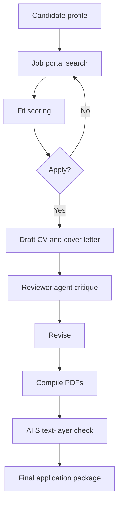

AI 채용 자동화가 GitHub Trending 1위까지 올라간 이유는 분명하다. `MadsLorentzen/ai-job-search`는 Claude Code를 이력서 작성 도구가 아니라 채용 지원 파이프라인으로 쓴다. 프로필을 채우고, 채용 공고를 긁고, 적합도를 매기고, CV와 커버레터를 LaTeX로 만들고, PDF와 ATS 파싱까지 확인한다.

반응은 편의성만으로 설명되지 않는다.

구직자가 반복 노동을 자동화하자 채용 시장의 기존 균형이 드러났다. 회사는 ATS로 지원자를 걸렀고, 구직자는 이제 에이전트로 지원서를 만든다. 한쪽만 자동화하던 시장이 양쪽 자동화 시장으로 바뀌고 있다.

## AI 채용 자동화는 이력서 생성기가 아니라 권한 이전이다

확인된 사실부터 좁혀야 한다. 선정된 저장소는 TypeScript 기반의 AI job application framework다. 설명에 따르면 Claude Code 위에서 동작하며, 사용자는 저장소를 포크한 뒤 자신의 프로필을 채운다. 핵심 명령은 `/setup`, `/scrape`, `/apply <url>`이다.

`/setup`은 문서 폴더, 붙여넣은 CV, 인터뷰 방식 중 하나로 후보자 정보를 만든다. `/scrape`는 채용 포털을 검색하고 중복을 제거한 뒤 적합도 순으로 보여준다. `/apply`는 채용 공고를 읽고 후보자 프로필과 비교한 뒤, 맞춤 CV와 커버레터를 작성한다. 이후 별도 reviewer agent가 비평하고 다시 수정한다.

범위도 분명하다. 핵심 워크플로는 언어와 국가에 덜 묶이도록 설계됐지만, 포함된 채용 포털 검색 스킬은 덴마크 시장 중심이다. Jobindex, Jobnet, Akademikernes Jobbank 같은 포털이 예시로 들어간다. LinkedIn public job listings는 국가에 덜 묶인 도구로 제시돼 있다. 다른 국가에서 그대로 쓰려면 `/add-portal`로 현지 채용 사이트용 검색 스킬을 만들어야 한다.

GitHub Trending 자료 기준으로 이 저장소는 별 9,195개, 당일 2,402개를 얻었다. 이 수치는 저장소가 단순 샘플을 넘어 개발자 커뮤니티의 즉각적인 관심을 받았다는 증거다. 다만 특정 시점의 스냅샷이므로 현재 별 개수나 순위가 그대로라고 단정할 수는 없다.

자료로 확인되는 것은 도구의 범위다. 이 프로젝트가 실제 채용 합격률을 높였다는 근거는 제공된 자료 안에 없다. 채용 시장 전체를 망친다는 주장도 같은 자료만으로는 증명되지 않는다. 중요한 지점은 이 도구가 채용 과정의 신뢰 구조를 건드렸다는 데 있다.

## 왜 개발자들은 이 저장소에 반응했나?

이 저장소가 건드린 감정은 먼저 통쾌함에 가깝다. 채용 프로세스는 이미 자동화돼 있었다. ATS(Applicant Tracking System)는 PDF의 텍스트 레이어를 읽고, 키워드를 보고, 사람이 읽기 전에 지원자를 걸러낸다. 회사의 자동화는 효율이고 구직자의 자동화는 불성실이라는 구분은 오래 버티기 어렵다.

동시에 불편함도 있다. 지원서가 모두 에이전트로 작성되면 커버레터의 의미는 줄어든다. 원래도 형식적인 문서였지만, 이제는 그 형식성이 코드로 드러난다. 회사가 확인해야 할 것은 글솜씨보다 근거 있는 역량, 실제 협업 방식, 검증 가능한 산출물에 가깝다.

실무적인 관심도 붙었다. 이 저장소는 프롬프트 하나로 이력서를 뽑는 방식이 아니다. PDF 컴파일을 필수 단계로 두고, CV는 `lualatex`, 커버레터는 `xelatex`로 만든다. `pdftotext`가 있으면 ATS가 실제로 읽는 텍스트 레이어를 추출해 연락처, 읽기 순서, 키워드 커버리지를 확인한다. 없으면 시각적 키워드 리뷰로 낮춰 동작한다.

사람들은 AI가 글을 얼마나 잘 쓰는지보다, 이 자동화가 채용 시스템의 약한 약속을 얼마나 정확히 찌르는지에 반응한다. 사람이 보는 PDF와 ATS가 읽는 PDF가 다를 수 있다는 사실은 구직자에게 운영 리스크다. 이 저장소는 그 리스크를 워크플로 안으로 끌어왔다.

## Claude Code 기반 지원서 자동화가 불편한 진짜 이유

이 프로젝트의 논쟁점은 AI가 문장을 대신 쓴다는 데 있지 않다. 더 큰 문제는 프로필, 포털 검색, 평가 기준, 문서 생성, 리뷰, 컴파일, ATS 검증이 하나의 로컬 작업 흐름으로 묶였다는 점이다.

구직자는 더 많은 지원을 더 짧은 시간에 보낼 수 있다. 회사는 더 많은 지원서를 더 강하게 필터링할 가능성이 크다. 자동화는 한쪽의 부담을 줄이고, 다른 쪽의 필터 강도를 올린다. 지원자의 반복 노동은 줄어들고, 채용자의 신호 검증 비용은 올라간다.

좋은 자동화와 나쁜 자동화의 경계는 분명하다. 좋은 자동화는 사실을 보존한다. 이 저장소는 프로필에 없는 키워드를 억지로 넣지 말고, 진짜 공백은 공백으로 남기라는 규칙을 둔다. CV가 2페이지를 넘으면 오래된 항목부터 기계적으로 자르지 않는다. 대상 공고와의 관련성, 문서 안의 고유성, 커버레터와의 의존성을 보고 낮은 점수의 줄을 줄이는 방향을 제시한다.

나쁜 자동화는 신호를 위조한다. 존재하지 않는 기술 스택을 넣고, 해보지 않은 업무를 문장으로 꾸미고, 공고의 키워드를 빈칸 채우기처럼 박아 넣는다. 그런 자동화는 지원자의 시간을 아끼는 대신 검증 단계의 비용을 키운다.

그래서 이 저장소는 채용 윤리 논쟁보다 운영 설계 논쟁에 가깝다. 자동화 자체를 막는 것은 현실적인 답이 아니다. 막아야 할 것은 출처 없는 주장, 파싱 불가능한 PDF, 검증 불가능한 역량, 포털 약관을 무시한 대량 스크래핑이다.

## 도입 전에 봐야 할 것은 프롬프트가 아니라 경계선이다

실무에서 이런 도구를 검토한다면 첫 질문은 품질이 아니라 경계선이어야 한다.

개인정보가 어디에 저장되는지 봐야 한다. 이 저장소 구조에는 `documents/` 폴더가 있고, 그 안에 CV, LinkedIn export, 학위 증명, 추천서, 과거 지원 기록을 넣는 방식이 설명돼 있다. 편하다는 말은 곧 민감 정보가 한곳에 모인다는 뜻이다. 로컬 실행이라도 백업, 동기화, 권한 설정, 저장소 포크 공개 여부를 확인해야 한다.

채용 포털 접근 방식도 따져야 한다. 제공된 도구는 일부 포털을 검색하고, URL을 가져오지 못하면 공고 본문을 직접 붙여넣는 대안을 둔다. 이 대안은 실용적이다. 동시에 포털이 자동 접근을 차단하는 이유도 인정해야 한다. 각 사이트의 이용 약관, robots 정책, 로그인 세션 사용 여부, 과도한 요청 간격은 기술 문제가 아니라 계정 리스크다.

출력물 검증은 이 프로젝트의 강점이다. LaTeX 템플릿은 `.tex` 파일만 보면 멀쩡해도 PDF에서 제목이 다음 페이지로 밀리거나, 아이콘 글리프 때문에 이메일이 텍스트로 추출되지 않을 수 있다. 이 저장소는 렌더링된 PDF를 확인하고, ATS가 읽는 텍스트를 확인하는 루프를 전면에 둔다. 실제 실패 지점을 겨냥한 설계다.

자동화가 모든 판단을 대신할 수는 없다. salary benchmarking은 선택 기능이고, 자료를 직접 준비해야 한다. `/upskill`은 채용 공고와 프로필의 기술 공백을 열지도와 학습 계획으로 만들 수 있지만, 그 계획이 실제 역량을 보장하지 않는다. `/expand`가 공개 소스에서 역량을 보강하더라도, 그 출처가 후보자의 실제 경험을 충분히 설명하는지는 사람이 확인해야 한다.

## 채용 시장은 더 시끄러워지고, 신뢰 기준은 더 좁아진다

이 저장소가 던진 질문은 하나다. 회사가 자동화된 필터로 지원자를 평가해 왔다면, 지원자가 자동화된 에이전트로 그 필터에 맞춰 지원서를 만드는 행위를 어디까지 허용할지 정해야 한다.

내 판단은 이렇다. AI 채용 자동화는 사라지지 않는다. 커버레터와 CV 맞춤화처럼 반복성이 높고 검증 가능한 작업은 에이전트에게 넘어간다. 대신 채용의 신뢰 기준은 문장 품질에서 증거 품질로 이동한다.

지원자는 자동화를 숨길 이유보다 검증 가능한 출처를 남길 이유가 커진다. 어떤 프로젝트를 했는지, 어떤 산출물이 있는지, 어떤 기술을 실제로 썼는지 문서와 링크로 연결해야 한다. 회사는 AI 작성 여부를 맞히는 게임에 시간을 쓰기보다, 지원서의 주장과 면접 과제와 레퍼런스가 같은 사람을 가리키는지 확인해야 한다.

처음의 긴장은 여기서 회수된다. 이 도구는 채용 시장을 갑자기 망가뜨린 예외가 아니다. 이미 자동화된 채용 시장에서 구직자 쪽 자동화가 공개 저장소 형태로 모습을 드러낸 사건이다.

불편한 변화일수록 기준을 빨리 세워야 한다. 자동화를 금지한다는 문장만으로는 부족하다. 허용되는 보조 범위, 금지되는 허위 주장, 개인정보 보관 방식, 포털 접근 규칙, ATS 검증 기준을 분리해 적어야 한다. 그래야 평가는 검증 가능한 근거에 가까워지고, 자동화는 반복 노동을 줄이는 역할에 머문다.

## 참고 자료

- [선정 글감] [#1 MadsLorentzen/ai-job-search](https://github.com/MadsLorentzen/ai-job-search) - GitHub Trending