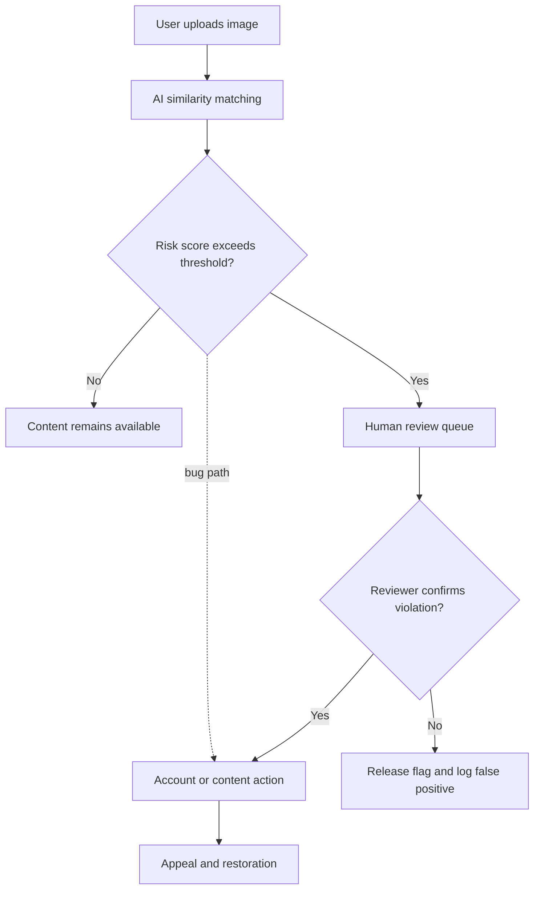

디스코드 AI 모더레이션 오탐은 단순한 버그로 끝낼 일이 아니다. 사용자는 스프레드시트, 체스판, 게임 텍스처, 투명 배경 이미지를 올렸고, 플랫폼은 일부 계정을 유해 이미지 업로드 계정처럼 취급했다. 탐지 모델의 실수보다 더 큰 문제는 그 뒤에 있었다. 오탐이 인간 검토를 거치지 않고 계정 정지로 이어졌다는 점이다.

## 디스코드 계정 정지는 왜 더 크게 터졌나

확인된 사실부터 보자. TechCrunch 보도에 따르면 디스코드는 2026년 7월 7일, AI 모더레이션 시스템 버그로 8,000명 넘는 사용자가 잘못 정지됐다고 인정했다. 영향은 2026년 5월부터 이어졌고, 문제를 찾아 고치기 직전 주말에만 200명이 추가로 정지됐다. 디스코드는 영향을 받은 계정 복구가 진행 중이라고 밝혔다.

디스코드 설명의 핵심은 이미지 유사도 매칭이다. 업로드된 이미지가 알려진 유해 콘텐츠 데이터베이스와 얼마나 닮았는지를 보는 방식이다. 대형 플랫폼에서는 이런 기술이 필요하다. 불법·악성 콘텐츠를 사람이 모두 먼저 볼 수 없기 때문이다.

디스코드가 의도한 흐름은 자동 탐지 뒤 인간 검토였다. 이번에는 버그가 그 완충 장치를 건너뛰었다. AI의 오판이 곧바로 계정 정지로 연결됐고, 계정 전체가 닫히지 않도록 막아야 할 운영 회로가 깨졌다.

사용자가 특히 분노한 이유도 여기에 있다. 디스코드 계정은 단순한 로그인 수단이 아니다. 게임 커뮤니티, 개발 협업, 원격 인간관계, 소규모 비즈니스 연락망이 붙어 있다. 한 게임 개발자는 게임 텍스처 때문에 아동 성착취물로 오인돼 계정이 정지됐다고 공개적으로 호소했다. 개별 사례의 사실 여부는 플랫폼 검토가 필요하지만, 이런 항의가 퍼진 배경은 분명하다. 사용자는 콘텐츠 하나가 아니라 자신의 사회적 주소록을 잃었다.

## 격자무늬 이미지가 유해 콘텐츠처럼 보인다는 추정

커뮤니티가 붙잡은 단서는 격자 패턴이었다. X와 Reddit 사용자들은 사각 격자, 체스판, 스프레드시트 같은 이미지가 정지와 연결됐다고 주장했다. 일부는 유해 콘텐츠를 자동 탐지에서 숨기려는 시도에 격자형 변형이 쓰였기 때문에 모더레이션 시스템이 비슷한 패턴에 민감해졌을 것이라고 추정했다.

여기서는 확인된 사실과 추정을 나눠야 한다.

확인된 것은 디스코드가 AI 모더레이션 버그와 오탐 정지를 인정했다는 점이다. 무해한 이미지가 유해 콘텐츠로 잘못 잡혔고, 인간 검토 전 계정 정지가 일어났다는 설명도 확인된 범위에 들어간다.

추정은 왜 격자형 이미지가 많이 언급됐는지에 관한 해석이다. 디스코드가 공개한 설명만으로 특정 패턴이 어떤 내부 임계값을 넘었는지는 알 수 없다. 커뮤니티의 추정은 그럴듯하지만, 검증된 기술 설명은 아니다.

이 구분이 중요하다. 플랫폼 사고에서 사용자는 원인을 알고 싶어 하고, 회사는 악용 방지를 이유로 탐지 세부 사항을 숨긴다. 그 틈에서 추정이 사실처럼 굳는다. 디스코드가 “더 나은 보호장치를 만들겠다”고 말한 것만으로는 부족했다. 사용자가 알고 싶은 것은 모델의 모든 규칙이 아니라, 정당한 항소와 복구가 얼마나 빨리 작동하는지다.

## AI 모더레이션 문제는 탐지보다 기본값의 문제다

이번 사건은 Meta의 Instagram AI 이미지 정책 변화와 닮아 있다. WIRED가 전한 Meta Muse Image 출시 사례에서, 공개 Instagram 계정은 다른 사람이 계정을 태그해 AI 이미지 생성에 활용할 수 있는 기본 상태로 들어갔다. 사용자가 막으려면 비공개 계정으로 바꾸거나 앱 설정에서 공유·재사용 관련 토글을 찾아 꺼야 한다.

디스코드 사건은 자동 처벌의 기본값 문제다. Meta 사례는 AI 재사용 동의의 기본값 문제다. 둘은 다른 사건이지만 같은 방향을 가리킨다.

플랫폼은 AI 기능을 기본 경로로 밀어 넣고, 사용자는 사후에 알아차린다.

이 구조에서는 기술 성능이 좋아져도 불신이 남는다. 사용자는 “AI가 맞았나”보다 “내 권한이 언제 바뀌었나”를 묻는다. Instagram 공개 계정 사진이 AI 생성의 재료가 되는 상황과 Discord 이미지 업로드가 즉시 계정 정지로 이어지는 상황은 사용자에게 비슷한 감각을 준다. 내 콘텐츠와 내 계정이 내가 이해하지 못한 자동 시스템의 입력값이 됐다는 감각이다.

대형 플랫폼은 불법 콘텐츠와 악성 행위를 빠르게 막아야 한다. 모든 신고와 업로드를 인간이 먼저 검토하는 방식은 속도와 규모에서 실패한다. 유사도 매칭과 안전 분류기는 사치가 아니라 운영 인프라다. 문제는 AI 사용 자체가 아니다.

되돌릴 수 없는 조치를 자동화하면서, 복구 절차를 느리고 불투명하게 남겨둔 설계가 문제다.

## 실무자는 AI 정책 변경을 기능 출시가 아니라 장애 시나리오로 봐야 한다

Anthropic의 Fable 5 재배포 사례는 또 다른 축을 보여준다. Anthropic은 2026년 6월 12일 미국 정부의 수출 통제가 최신 모델에 적용되자, 외국 국적자를 실시간으로 안정적으로 검증할 방법이 없다는 이유로 Fable 5와 Mythos 5 접근을 모든 사용자에게 중단했다고 설명했다. 이후 6월 30일 통제가 해제됐고, 7월 1일부터 Fable 5 접근을 복원한다고 밝혔다.

여기서도 중요한 것은 모델이 얼마나 똑똑한지가 아니다. 정책을 적용할 신원 확인 체계가 없을 때 플랫폼이 어떤 실패 모드를 택했는지다. Anthropic은 허용하면 안 되는 접근을 열어두는 대신 전체 접근을 닫았다. 디스코드는 검토 전에 닫으면 안 되는 계정을 닫았다. 하나는 규제 리스크를 줄이려다 가용성을 잃었고, 다른 하나는 안전 리스크를 줄이려다 정당한 사용자를 잃었다.

서비스를 운영하는 팀은 이 차이를 자기 시스템에 대입해야 한다. AI 모더레이션, 이미지 분류, 계정 위험 점수, 정책 기반 접근 제어를 넣을 때 모델 정확도 표 하나만 봐서는 부족하다. 다음 질문에 답해야 한다.

- 자동 판정이 계정 정지, 결제 차단, 데이터 삭제처럼 되돌리기 어려운 조치로 바로 이어지는가
- 인간 검토가 실제 차단 회로인지, 사고 뒤 설명 문구에만 남은 장식인지
- 오탐이 발생했을 때 사용자에게 어떤 사유 코드와 항소 경로가 보이는가
- 정책 변경이나 규제 지시가 들어왔을 때 전체 차단, 지역 차단, 기능 제한 중 어떤 실패 모드가 준비돼 있는가
- 복구 대상자를 어떻게 식별하고, 복구 뒤 신뢰를 어떻게 회복할 것인가

아래 흐름에서 가장 위험한 지점은 모델이 아니라 결정 단계다.

디스코드가 설명한 의도된 구조는 E를 지나야 한다. 이번 사고는 점선 경로가 열린 사건이다. 운영 관점에서 이 점선은 테스트 케이스여야 한다. “검토 전 계정 정지가 절대 발생하지 않는다”는 불변 조건이 자동화 테스트, 권한 분리, 배포 게이트 중 적어도 하나에 걸려 있어야 한다.

## 사용자가 원하는 것은 완벽한 AI가 아니라 멈춤 장치다

디스코드의 이번 사과가 남긴 질문은 단순하다. 안전을 위해 AI 모더레이션을 쓰는 플랫폼이, 안전하지 않은 자동 처벌을 어떻게 막을 것인가.

완벽한 탐지기는 없다. 유해 콘텐츠를 막는 시스템은 공격자를 상대하고, 공격자는 필터를 피하려고 이미지를 변형한다. 격자, 노이즈, 투명 배경 같은 평범한 시각 패턴이 어느 순간 위험 신호와 가까워질 수 있다. 오탐은 예외적인 사고가 아니라 시스템이 감당해야 할 비용이다.

그 비용을 누가 지는지가 플랫폼 신뢰를 가른다. 디스코드는 유해 콘텐츠를 막으려 했고, 사용자는 계정을 잃었다. Meta는 AI 이미지 기능을 확장했고, 공개 계정 사용자는 설정을 찾아 꺼야 했다. Anthropic은 규제를 지키려 했고, 일부 사용자는 모델 접근을 잃었다.

AI 플랫폼 정책의 다음 기준은 모델 성능 자랑이 아니다. 자동화가 틀렸을 때 얼마나 작게 실패하는지다. 콘텐츠 하나를 보류할 수는 있다. 계정 전체를 닫는다면 인간 검토가 먼저 와야 한다. 사용자 콘텐츠를 AI 기능에 재사용한다면 옵트아웃 위치가 아니라 기본값부터 설명해야 한다. 규제 때문에 접근을 제한한다면 누구에게, 언제, 어떤 근거로 풀리는지 공개해야 한다.

디스코드 사건의 답은 “AI 모더레이션을 쓰지 말자”가 아니다. 답은 더 좁고 더 실무적이다. AI가 판단하게 할 수는 있다. 그러나 계정을 끝내는 버튼은 AI 옆에 두면 안 된다.

## 참고 자료

- [선정 글감] [Discord admits AI moderation bug wrongfully banned users over harmless images](https://techcrunch.com/2026/07/07/discord-admits-ai-moderation-bug-wrongfully-banned-users-over-harmless-images/) (TechCrunch)
- [관련] [Meta Now Lets Anyone Use Your Instagram Photos in AI Images—Unless You Opt Out](https://www.wired.com/story/meta-now-lets-anyone-use-your-instagram-photos-in-ai-images-unless-you-opt-out/) (WIRED AI)
- [관련] [Redeploying Fable 5](https://www.anthropic.com/news/redeploying-fable-5) (Anthropic News)