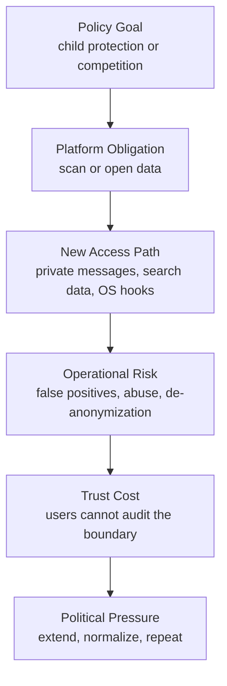

채팅 감시는 흔히 기술 논쟁으로 보인다. 그러나 2026년 7월 7일 유럽의회에서 벌어진 일은 암호화나 AI 스캔 성능보다 앞선 문제를 드러냈다. 한 번 거절된 Chat Control 연장안이 여름 휴회 직전 긴급 절차로 다시 본회의에 올라왔다. 개발자 커뮤니티가 반응한 지점은 나쁜 콘텐츠를 잡자는 목표가 아니라, 사적 메시지를 스캔하는 권한이 어떤 절차로 되살아났는지였다.

Chat Control 논쟁의 핵심 키워드는 아동 성착취물(CSAM) 대응, 사적 메시지 스캔, 플랫폼의 자발적 탐지, 유럽연합(EU) 규제다. 이 주제를 검색하는 사람은 대개 한 가지를 확인하려 한다. 내 메신저와 이메일이 법적으로 어떤 범위까지 들여다보일 수 있는가.

## Chat Control 1.0은 새 법이 아니라 만료된 예외의 부활이다

확인된 사실부터 보자. 유럽의회는 화요일 오후 이른바 Chat Control의 과도기 규정을 다시 연장할 수 있게 하는 긴급 절차를 331대 304, 기권 11표로 통과시켰다. 이 안건은 유럽의회 의장 로베르타 메촐라(Roberta Metsola)가 회원국들과 유럽국민당(EPP)의 요청에 따라 짧은 예고로 의제에 올렸다.

정책 범위는 좁지 않다. 만료된 과도기 규정은 Meta, Google, Microsoft 같은 대형 기술 기업이 구체적 혐의 없이도 사적 채팅, 이메일, 메신저 서비스에서 아동 성착취물 관련 자료를 자발적으로 탐지할 수 있게 했다. 이 규정은 2026년 4월 만료됐다. 유럽의회는 3월과 4월에 연장안을 명확한 다수로 거부했다.

이번 투표가 만든 변화는 기술적 기능 추가가 아니다. 절차의 위치가 바뀌었다. 목요일, 2026년 7월 9일로 예정된 재표결에서 반대하거나 수정하려면 전체 의원의 절대다수인 361표가 필요하다. 반면 연장 쪽은 출석 의원의 단순 과반으로 충분하다. 여름 휴회 직전 마지막 회의일에는 의원들이 이미 자리를 비우는 경우가 있어, 찬성 측이 구조적으로 유리해진다.

이 대목은 해석보다 제도 설계의 효과에 가깝다. 같은 법안이라도 어느 날, 어떤 절차, 어떤 표결 요건으로 올리느냐에 따라 결과가 달라진다.

## 개발자들이 불편해한 것은 스캔보다 권한의 기본값이다

Hacker News에서 이 기사가 빠르게 퍼진 이유는 Chat Control이 개발자에게 익숙한 위험 패턴을 닮았기 때문이다. 한 번 예외로 만든 권한이 사라지지 않는다. 만료되면 갱신되고, 갱신이 막히면 긴급 절차로 돌아온다.

찬성 측 논리는 분명하다. EU 집행위원 4명은 표결 직전 서한에서 규제 공백을 경고했다. 스캔이 없으면 가해자가 책임을 피하고, 거의 모든 학대 자료가 발견되지 않을 것이라는 주장이다. 아동 보호라는 목표는 강하다. 이 목표를 약하게 말할 필요는 없다.

반대 측도 아동 보호 자체를 거부하지 않는다. 독일 해적당 계열의 유럽의회 의원 마르케타 그레고로바(Markéta Gregorová)는 절차를 문제 삼았고, AfD 의원 메리 칸(Mary Khan)은 이미 거부된 법이 뒷문으로 되살아난다고 비판했다. 보고관인 비르기트 지펠(Birgit Sippel)도 EU 회원국들의 움직임을 불공정한 책략으로 보고 지지를 거부했다. 사회민주당 그룹은 긴급 절차 승인 쪽으로 물러섰고, 그 결과 필요한 다수가 만들어졌다.

커뮤니티의 불편함은 여기서 갈린다. 누군가는 플랫폼이 이미 신고를 해왔고, 피해자 보호를 위해 빈틈을 줄여야 한다고 본다. 다른 쪽은 모든 시민의 사적 통신을 일반 의심 상태로 두는 구조가 훨씬 큰 손실을 만든다고 본다. 둘 다 비용을 말하지만 초점은 다르다. 한쪽은 탐지 실패의 비용을 말하고, 다른 쪽은 감시 인프라가 정상 운영으로 굳어지는 비용을 말한다.

후자의 비용은 한번 발생하면 되돌리기 어렵다.

## Pegasus와 DMA 논쟁이 같은 질문으로 만난다

이 이슈를 Chat Control 하나로만 보면 단일 기사 요약에 갇힌다. 같은 주에 보인 다른 유럽발 보안 논쟁을 붙여 보면 더 선명하다.

WIRED가 다룬 Pegasus 사례에서 그리스 정치인 스텔리오스 쿨로글루(Stelios Kouloglou)는 유럽의회 PEGA 위원회 소속으로 스파이웨어 남용을 조사했다. 그런데 Citizen Lab의 포렌식 분석에 따르면 그의 아이폰도 Pegasus에 여러 차례 감염된 것으로 드러났다. Pegasus는 iOS와 Android 취약점을 이용해 마이크, 카메라, 메시지, 연락처, 웹 탐색 기록, 사진 같은 민감 정보에 접근할 수 있는 스파이웨어다.

감시 권한은 통제 대상을 정확히 가리지 않는다. 감시를 조사하던 의원도 감시의 대상이 됐다. 이 사건은 Chat Control 반대론의 정서적 근거가 아니라 운영상 근거다. 강한 접근 권한이 만들어지면 그 권한의 피해자는 원래 설계자가 예상한 범위에 머물지 않는다.

다른 WIRED 보도는 유럽 디지털시장법(Digital Markets Act, DMA) 아래 Google Search와 Android를 경쟁사에 더 열어야 한다는 논쟁을 다뤘다. Google의 보안 책임자들은 검색 데이터 공유와 Android 상호운용성 확대가 검색 질의의 재식별, 사기 증가, 사이버범죄 확대를 낳을 수 있다고 주장했다. 이 주장은 회사의 이해관계와 분리해서 읽어야 한다. Google은 규제 대상인 동시에, 위험을 과장할 유인이 있는 당사자다.

그래도 두 논쟁은 같은 구조를 공유한다. 규제자는 폐쇄된 플랫폼을 열어 공익을 얻으려 한다. 플랫폼은 열린 인터페이스가 공격면을 늘린다고 말한다. 시민사회는 권한 확대가 감시 체계를 정상화한다고 경고한다.

실무자가 여기서 볼 것은 찬반 구호가 아니다. 새로운 접근 경로가 생겼을 때 누가 호출할 수 있는지, 어떤 로그가 남는지, 오탐을 누가 책임지는지, 남용이 발생했을 때 중단 스위치가 있는지를 봐야 한다. 정책 목적이 선하다는 사실은 접근 경로의 보안 검토를 면제하지 않는다.

## AI 스캔의 오탐은 버그가 아니라 시민권 문제다

Heise 보도에 따르면 IT 보안 연구자들은 AI 스캔의 높은 오류율이 무고한 시민의 프라이버시를 위협한다고 반복해서 경고했다. 독일 정보학회(Society for Informatics) 이사회 구성원은 독일 연방헌법재판소에 긴급 신청까지 냈다. 여기서 확인된 사실은 연구자들이 경고했고, 법적 대응도 있었다는 점이다. 구체적 오류율 수치는 제공된 자료 안에 없다. 따라서 숫자를 만들어 말하면 안 된다.

수치가 없어도 판단은 가능하다. 사적 메시지 스캔에서 오탐은 일반적인 서비스 품질 문제가 아니다. 추천 시스템이 영상을 잘못 추천하면 불편하다. 결제 이상탐지가 정상 거래를 막으면 고객센터가 필요하다. 사적 대화에서 AI 스캔이 잘못 작동하면 사용자는 범죄 의심의 경로에 들어간다.

플랫폼 운영 관점에서도 부담은 작지 않다. 탐지 모델을 돌리려면 콘텐츠 접근, 해시 매칭, 신고 파이프라인, 검토 권한, 보관 정책이 필요하다. 암호화된 메신저라면 클라이언트 측 스캔(Client-side Scanning) 같은 우회 구조가 논의될 수밖에 없다. 그러면 보안 모델의 중심이 서버 방어에서 단말 내부 정책 강제로 이동한다.

이 변화는 사용자에게 거의 보이지 않는다. 보이지 않는 변경은 감사하기 어렵고, 감사하기 어려운 보안 기능은 신뢰를 갉아먹는다.

## 이번 표결이 남기는 실무적 판단 기준

Chat Control 1.0의 부활 논쟁은 유럽 정치 뉴스로 끝나지 않는다. 글로벌 플랫폼은 규제를 지역별로만 깨끗하게 분리하기 어렵다. 한 지역에서 스캔 파이프라인이 합법 운영되면, 다른 지역 정부도 비슷한 접근을 요구할 수 있다. 확정된 미래는 아니지만 현실적인 전파 경로다.

개발 조직이 확인해야 할 질문은 단순하다.

- 메시지, 파일, 검색 질의처럼 민감한 데이터에 새 접근 경로가 생기는가
- 자발적 스캔과 법적 의무 스캔의 경계가 제품 요구사항에 명시되어 있는가
- 오탐 신고, 이의 제기, 로그 보존, 삭제 요청을 운영 절차로 처리할 수 있는가
- 지역별 규제 대응이 암호화, 키 관리, 클라이언트 업데이트 정책을 흔드는가
- 내부 직원, 외부 협력사, 정부 요청이 같은 권한면을 공유하지 않는가

이 목록은 대기업만의 문제가 아니다. 중간 규모 서비스도 신고 의무, 콘텐츠 모더레이션, 메신저 기능, 파일 업로드 기능을 갖는 순간 같은 질문을 받는다. 직접 스캔 엔진을 만들지 않더라도, 외부 API나 클라우드 서비스의 정책 변경이 제품의 프라이버시 약속을 바꿀 수 있다.

이번 사건의 핵심은 아동 보호와 프라이버시 중 하나를 고르는 문제가 아니다. 강한 목적을 가진 정책일수록 권한은 더 좁아야 하고, 감사는 더 분명해야 하며, 연장 절차는 더 어려워야 한다. 이번 긴급 절차는 그 반대로 움직였다. 그래서 개발자 커뮤니티가 반응했다.

도입부의 질문으로 돌아가면 답은 분명하다. 사람들은 Chat Control이 다시 올라온 사실만 보고 놀란 게 아니다. 한 번 거절된 사적 통신 스캔 권한이 표결 요건과 일정의 틈을 타고 더 쉬운 길로 돌아온 것을 봤다. 신뢰는 기능이 아니라 절차에서 깨진다. 깨진 절차 위에 올라간 보안 기능은, 이름이 무엇이든 감시 인프라로 읽힌다.

## 참고 자료

- [선정 글감] [Chat Control passed first round in EU Parliament](https://www.heise.de/en/news/Showdown-in-Strasbourg-The-unexpected-return-of-Chat-Control-1-0-11356680.html) — Hacker News Best
- [관련] [EU Politicians Investigated Pegasus Spyware. Then It Ended Up on One of Their Phones](https://www.wired.com/story/eu-politicians-investigated-pegasus-spyware-then-it-ended-up-on-one-of-their-phones/) — WIRED Security
- [관련] [Top Google Security Staff Warn Search Data Could Be Hacked if EU Rules Change](https://www.wired.com/story/top-google-security-staff-warn-search-data-could-be-hacked-thanks-to-eu-plans/) — WIRED Security